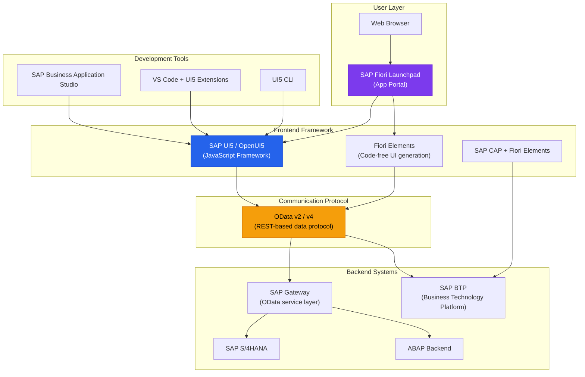
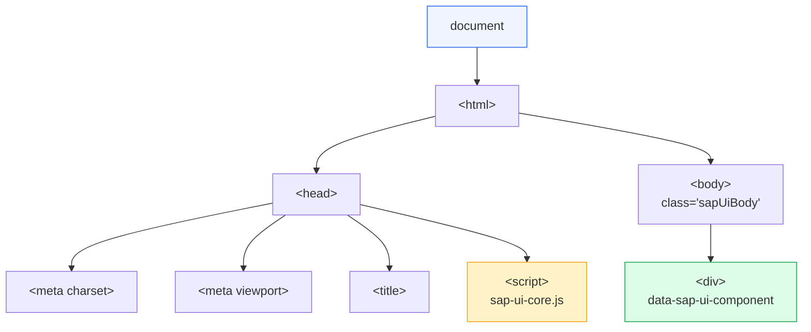
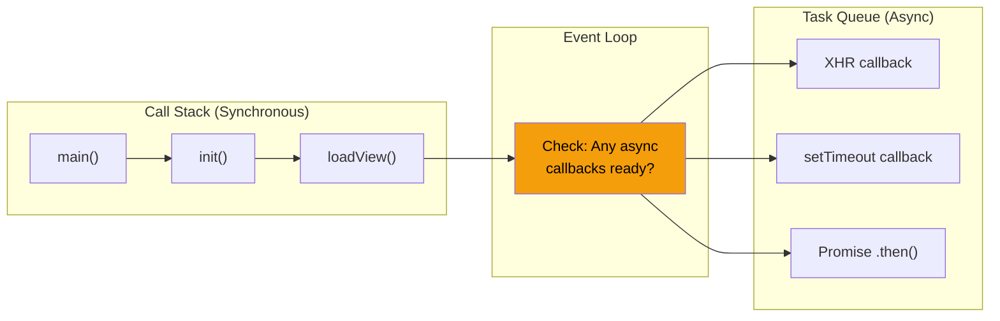
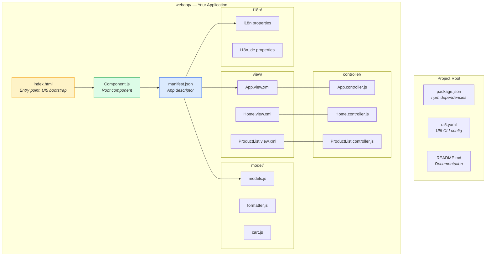

# Module 00: Prerequisites & Setup

> **Goal**: Understand what SAP UI5 is, refresh your web fundamentals, and set up a working development environment.

---

## Table of Contents

- [What is SAP UI5?](#what-is-sap-ui5)
- [Where UI5 Fits in the SAP Ecosystem](#where-ui5-fits-in-the-sap-ecosystem)
- [HTML Basics Recap](#html-basics-recap)
- [JavaScript Basics Recap](#javascript-basics-recap)
- [CSS Basics Recap](#css-basics-recap)
- [XML Basics](#xml-basics)
- [Installing Node.js & npm](#installing-nodejs--npm)
- [Installing UI5 CLI](#installing-ui5-cli)
- [Setting Up the Project](#setting-up-the-project)
- [Browser DevTools Overview](#browser-devtools-overview)
- [UI5 Diagnostics Tool](#ui5-diagnostics-tool)

---

## What is SAP UI5?

SAP UI5 is an **enterprise-grade JavaScript framework** for building responsive web applications. It comes in two flavors:

| | OpenUI5 | SAPUI5 |
|---|---------|--------|
| **License** | Open-source (Apache 2.0) | SAP proprietary |
| **Controls** | Core set (~500 controls) | Full set + Smart Controls, Fiori Elements |
| **CDN** | `openui5.hana.ondemand.com` | `sapui5.hana.ondemand.com` |
| **Use case** | Learning, non-SAP projects | SAP enterprise projects |

**Key characteristics:**
- **MVC architecture** — Clean separation of UI (Views), data (Models), and logic (Controllers)
- **Enterprise-ready** — Built-in i18n, accessibility (ARIA), theming, responsive design
- **Declarative UI** — UI defined in XML (not JavaScript), similar to HTML templates
- **Data binding** — Automatic UI updates when data changes (like React state, but different)
- **OData integration** — First-class support for SAP's REST-based data protocol
- **Rich control library** — Hundreds of pre-built UI components following SAP Fiori design guidelines

### If You Know React...

| Concept | React | SAP UI5 |
|---------|-------|---------|
| UI Definition | JSX | XML Views |
| State Management | useState / Redux | JSONModel / ODataModel |
| Routing | react-router | sap.m.routing.Router |
| Entry Point | index.js + App.jsx | index.html + Component.js |
| Config | package.json | manifest.json |
| Styling | CSS Modules / Tailwind | Theming + custom CSS |

---

## Where UI5 Fits in the SAP Ecosystem



### What This Diagram Tells You

1. **SAP UI5** is the frontend framework — it runs in the browser
2. **SAP Fiori Launchpad** is like an app store/portal that hosts UI5 apps
3. UI5 apps communicate with SAP backends via **OData** (a REST-based protocol)
4. **SAP Gateway** exposes backend data as OData services
5. You develop using **VS Code**, **BAS** (SAP's cloud IDE), or similar editors
6. The **UI5 CLI** handles local development, building, and testing

---

## HTML Basics Recap

UI5 generates most of its HTML dynamically, but you still need to understand HTML fundamentals because:
- `index.html` is the entry point of every UI5 app
- XML Views use HTML-like syntax (tags, attributes, nesting)
- DevTools show the generated HTML DOM

### Essential Concepts

```html
<!-- Tags & Attributes -->
<div id="content" class="sapUiBody">
  <h1>Hello World</h1>
  <input type="text" placeholder="Search..." />
</div>

<!-- Key points:
  - Tags have opening <div> and closing </div>
  - Self-closing tags: <input />, <br />, 
  - Attributes provide metadata: id, class, type, src, etc.
  - Nesting creates parent-child relationships
-->
```

### The DOM Tree

The DOM (Document Object Model) is the browser's in-memory representation of your HTML. UI5 manipulates the DOM to render controls.



In our project, `webapp/index.html` is minimal because UI5 generates the entire UI:

```html
<!-- From webapp/index.html — the body is almost empty! -->
<body class="sapUiBody" id="content">
    <div
        data-sap-ui-component
        data-name="com.shopeasy.app"
        data-id="container"
        data-settings='{"id":"shopeasy"}'
    ></div>
</body>
```

UI5 finds this `<div>`, loads `Component.js`, reads `manifest.json`, and renders the entire app inside it.

---

## JavaScript Basics Recap

UI5 is written entirely in JavaScript. Here are the core concepts you need:

### Variables

```javascript
// Modern (use these):
let count = 0;         // Mutable — value can change
const MAX = 100;       // Immutable — value cannot change

// Legacy (you'll see in older UI5 code):
var name = "ShopEasy"; // Function-scoped, avoid in new code
```

### Functions

```javascript
// Function declaration
function addToCart(product, quantity) {
    return product.price * quantity;
}

// Arrow function (ES6) — used in modern UI5
const formatPrice = (price) => "$" + price.toFixed(2);

// UI5 uses traditional functions in .extend() because of `this` binding:
// See webapp/Component.js for examples
init: function () {
    UIComponent.prototype.init.apply(this, arguments);
}
```

### Objects & Arrays

```javascript
// Objects — like a dictionary / map
const product = {
    productId: "PROD001",
    name: "Wireless Headphones",
    price: 249.99,
    stock: 45
};

// Access properties
product.name;           // "Wireless Headphones"
product["price"];       // 249.99

// Arrays — ordered lists
const items = [product1, product2, product3];

// Common array methods used in UI5:
items.forEach(item => console.log(item.name));          // Loop
items.filter(item => item.stock > 0);                   // Filter
items.map(item => item.price);                          // Transform
items.reduce((sum, item) => sum + item.price, 0);       // Aggregate
items.find(item => item.productId === "PROD001");       // Find one
```

### Callbacks & Promises

```javascript
// Callback — a function passed to another function
button.attachPress(function (oEvent) {
    // This runs when the button is pressed
    console.log("Button clicked!");
});

// Promise — represents a future value
fetch("/api/products")
    .then(response => response.json())
    .then(data => console.log(data))
    .catch(error => console.error(error));

// Async/Await — cleaner promise syntax
async function loadProducts() {
    try {
        const response = await fetch("/api/products");
        const data = await response.json();
        return data;
    } catch (error) {
        console.error("Failed:", error);
    }
}
```

### JavaScript Execution Model



**Why this matters for UI5:**
- UI5 loads modules **asynchronously** (via `sap.ui.define`)
- OData requests are **asynchronous** (data arrives later)
- Event handlers (button clicks, route changes) are **callbacks**
- Understanding the event loop helps debug timing issues

---

## CSS Basics Recap

UI5 controls come pre-styled via themes (like `sap_horizon`), but you'll write custom CSS for branding and layout adjustments.

### Selectors

```css
/* Element selector — rarely used with UI5 */
h1 { color: blue; }

/* Class selector — the MOST COMMON in UI5 */
.shopEasyProductCard { border-radius: 12px; }

/* ID selector — use sparingly */
#content { margin: 0; }

/* Descendant — style children of a parent */
.shopEasyProductCard .shopEasyProductName { font-weight: 600; }
```

### The Box Model

Every HTML element is a box:

```
┌──────────────────── margin ────────────────────┐
│  ┌────────────── border ──────────────┐        │
│  │  ┌──────── padding ──────────┐     │        │
│  │  │                           │     │        │
│  │  │       CONTENT             │     │        │
│  │  │   (text, images, etc.)    │     │        │
│  │  │                           │     │        │
│  │  └───────────────────────────┘     │        │
│  └────────────────────────────────────┘        │
└────────────────────────────────────────────────┘
```

### CSS Custom Properties (Variables)

Our project uses CSS variables extensively. See `webapp/css/style.css`:

```css
:root {
    --shopEasy-brand-primary: #2563eb;
    --shopEasy-space-md: 1rem;
    --shopEasy-radius-lg: 0.75rem;
}

.shopEasyProductCard {
    border-radius: var(--shopEasy-radius-lg);
}
```

> **Best Practice**: In UI5, prefer SAP theme parameters (`--sapTextColor`, `--sapBackgroundColor`) over hardcoded colors. They adapt automatically when users switch themes.

---

## XML Basics

XML is the primary language for defining UI5 views. If you know HTML, XML is very similar but stricter.

### Key Differences: HTML vs XML

| Feature | HTML | XML |
|---------|------|-----|
| Closing tags | Optional for some (`<br>`, ``) | **Always required** (`<br />`) |
| Case sensitivity | Case-insensitive | **Case-sensitive** |
| Attribute values | Optional quotes | **Quotes required** |
| Self-closing | `<br>` is valid | Must be `<br />` |

### XML Syntax

```xml
<?xml version="1.0" encoding="UTF-8"?>
<!-- This is a comment -->

<!-- Root element with namespace declarations -->
<mvc:View
    xmlns:mvc="sap.ui.core.mvc"
    xmlns="sap.m">

    <!-- Nested elements with attributes -->
    <Page title="Products">
        <content>
            <List items="{/Products}">
                <StandardListItem title="{Name}" description="{Description}" />
            </List>
        </content>
    </Page>

</mvc:View>
```

### Namespaces in XML (Critical for UI5!)

Namespaces prevent name collisions. In UI5, each control library has its own namespace:

```xml
<mvc:View
    xmlns:mvc="sap.ui.core.mvc"        <!-- View infrastructure -->
    xmlns="sap.m"                       <!-- Default: mobile controls -->
    xmlns:l="sap.ui.layout"            <!-- Layout controls -->
    xmlns:f="sap.f"                    <!-- Fiori controls -->
    xmlns:core="sap.ui.core">          <!-- Core controls -->

    <!-- No prefix = default namespace (sap.m) -->
    <Button text="Click me" />

    <!-- Prefixed = specific namespace -->
    <l:VerticalLayout>
        <f:Avatar src="photo.jpg" />
    </l:VerticalLayout>

</mvc:View>
```

The `xmlns` (XML Namespace) declaration maps a **prefix** to a **UI5 library**. When you write `<l:VerticalLayout>`, UI5 knows to look in `sap.ui.layout` for the `VerticalLayout` control.

---

## Installing Node.js & npm

Node.js is required for the UI5 CLI and local development server.

### Step 1: Download & Install

1. Go to [https://nodejs.org/](https://nodejs.org/)
2. Download the **LTS** (Long-Term Support) version (v18 or later recommended)
3. Run the installer (npm is included automatically)

### Step 2: Verify Installation

```bash
node --version    # Should show v18.x.x or higher
npm --version     # Should show 9.x.x or higher
```

### What is npm?

npm (Node Package Manager) is JavaScript's package manager — like pip for Python or Maven for Java. It:
- Installs libraries/dependencies from the [npm registry](https://www.npmjs.com/)
- Manages project scripts (`npm start`, `npm test`)
- Tracks dependencies in `package.json`

Our project's `package.json` lists all UI5 dependencies:

```json
{
  "devDependencies": {
    "@ui5/cli": "^3.0.0",
    "@openui5/sap.m": "^1.120.0",
    "@openui5/sap.ui.core": "^1.120.0"
  }
}
```

---

## Installing UI5 CLI

The UI5 CLI is your primary development tool. It serves, builds, and tests UI5 apps.

### Install Globally

```bash
npm install -g @ui5/cli
```

### Verify Installation

```bash
ui5 --version     # Should show 3.x.x
```

### What Can UI5 CLI Do?

| Command | What It Does |
|---------|-------------|
| `ui5 serve` | Starts a local development server |
| `ui5 build` | Creates a production build (minified, bundled) |
| `ui5 init` | Scaffolds a new UI5 project |
| `ui5 add <lib>` | Adds a UI5 library dependency |

### Configuration: ui5.yaml

The UI5 CLI reads its configuration from `ui5.yaml` in the project root:

```yaml
# From our project's ui5.yaml
specVersion: "3.0"
type: application
metadata:
  name: com.shopeasy.app
framework:
  name: OpenUI5
  version: "1.120.12"
  libraries:
    - name: sap.m           # Mobile-ready controls
    - name: sap.ui.core     # Core framework
    - name: sap.ui.layout   # Layout controls
    - name: sap.f           # Fiori controls
```

---

## Setting Up the Project

### Step 1: Clone the Repository

```bash
git clone <repository-url>
cd ui5-learning
```

### Step 2: Install Dependencies

```bash
npm install
```

This downloads all UI5 libraries listed in `package.json` into `node_modules/`.

### Step 3: Start the Development Server

```bash
npm start
```

This runs `ui5 serve --open index.html` (defined in `package.json` scripts), which:
1. Starts a local server (default: `http://localhost:8080`)
2. Serves files from the `webapp/` folder
3. Resolves UI5 library dependencies from `node_modules/`
4. Opens your browser automatically

### Project File Overview



---

## Browser DevTools Overview

The browser DevTools (press **F12**) are essential for UI5 development. Here's what each tab does:

### Elements Tab
- Inspect the rendered DOM (the HTML that UI5 generates)
- See which CSS rules apply to each element
- Edit styles live to test changes

### Console Tab
- View errors and warnings from UI5
- Run JavaScript commands interactively
- Access UI5 APIs: `sap.ui.getCore()`, `sap.ui.getCore().byId("controlId")`

### Network Tab
- See all HTTP requests (OData calls, resource loading)
- Inspect request/response payloads
- Diagnose slow loading or failed requests
- Filter by type: XHR (API calls), JS, CSS, Img

### Sources Tab
- Set breakpoints in your controller code
- Step through execution line by line
- Watch variable values
- Useful for debugging event handlers and data flow

### Application Tab
- View localStorage / sessionStorage
- Inspect service workers and cache

### Common DevTools Shortcuts

| Shortcut | Action |
|----------|--------|
| `F12` | Open DevTools |
| `Ctrl + Shift + C` | Inspect element mode |
| `Ctrl + Shift + J` | Open Console directly |
| `Ctrl + P` (in Sources) | Search for a file |

---

## UI5 Diagnostics Tool

UI5 has a built-in diagnostics tool that provides deep insight into your running application.

### Opening It

Press **Ctrl + Alt + Shift + S** (or **Ctrl + Option + Shift + S** on Mac) while your UI5 app is running.

### What It Shows

| Section | Information |
|---------|------------|
| **Control Tree** | Hierarchical view of all rendered controls (like React DevTools) |
| **Debugging** | Enable/disable debug sources, log levels |
| **Technical Info** | UI5 version, loaded libraries, active models |
| **Performance** | Loading times, module statistics |

### Using the Control Tree

The Control Tree is the most useful section. For any control, you can see:

1. **Properties** — Current values of all control properties
2. **Binding Info** — What model path each property is bound to
3. **Control Metadata** — The control's class, aggregations, events

This is invaluable for debugging data binding issues. If a `<Text>` control shows empty, check:
1. Is the binding path correct?
2. Does the model have data at that path?
3. Is the correct model name used?

### Alternative: UI5 Inspector Browser Extension

SAP also provides a [UI5 Inspector Chrome Extension](https://chrome.google.com/webstore/detail/ui5-inspector/bebecogbafbighhaildooiibipcnbngo) that integrates with Chrome DevTools, adding a dedicated "UI5" tab. It provides similar functionality to the built-in diagnostics tool but in a more developer-friendly interface.

---

## Summary & Next Steps

At this point, you should have:

- [x] An understanding of what SAP UI5 is and where it fits
- [x] Refreshed knowledge of HTML, JavaScript, CSS, and XML
- [x] Node.js, npm, and UI5 CLI installed
- [x] The project cloned and running locally
- [x] Familiarity with DevTools and UI5 diagnostics

**Next**: [Module 01: Architecture & MVC Pattern](./01-architecture.md) — Learn how UI5 structures applications using the MVC pattern, components, and the app descriptor.
