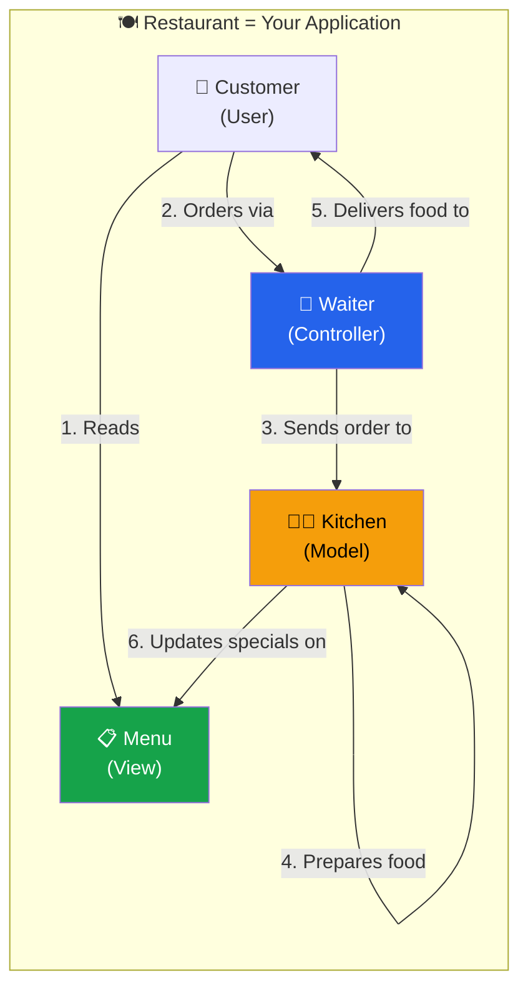
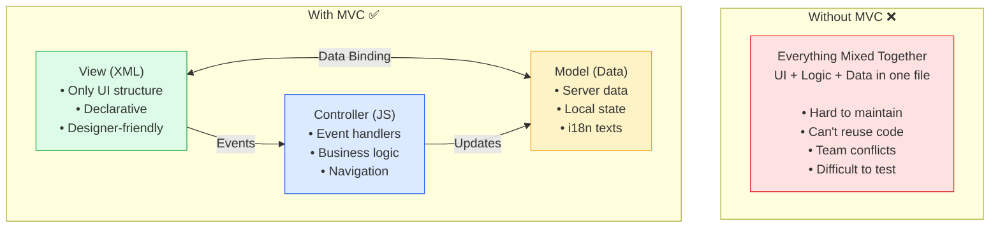
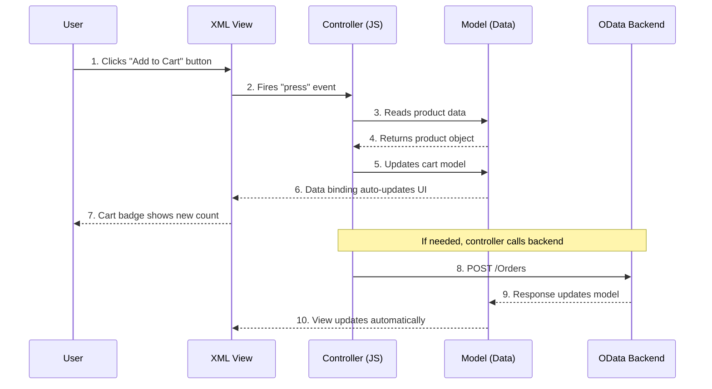
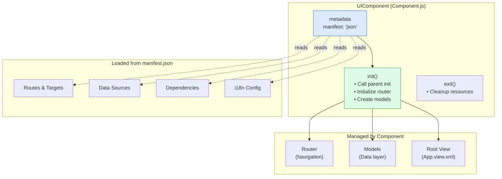
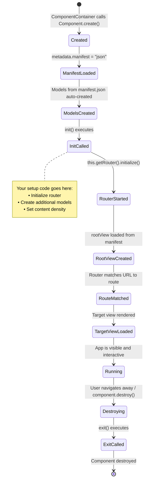
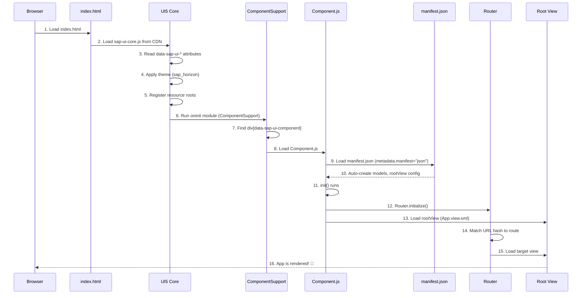
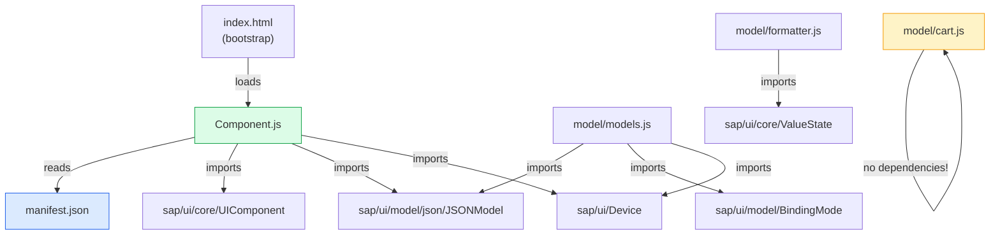

# Module 01: Architecture & MVC Pattern

> **Goal**: Understand how UI5 structures applications using the Model-View-Controller pattern, components, the app descriptor, and the module system.

---

## Table of Contents

- [What is MVC?](#what-is-mvc)
- [How UI5 Implements MVC](#how-ui5-implements-mvc)
- [Component-Based Architecture](#component-based-architecture)
- [The App Descriptor (manifest.json)](#the-app-descriptor-manifestjson)
- [The Bootstrap Process](#the-bootstrap-process)
- [Module System](#module-system)
- [UI5 Class System](#ui5-class-system)
- [Lifecycle Hooks](#lifecycle-hooks)

---

## What is MVC?

MVC (Model-View-Controller) is a design pattern that separates an application into three interconnected concerns. Let's use a **restaurant analogy**:

### The Restaurant Analogy



| Restaurant | MVC Role | Responsibility | UI5 Equivalent |
|-----------|----------|----------------|----------------|
| **Menu** | **View** | Shows what's available (the UI) | XML View files (`.view.xml`) |
| **Waiter** | **Controller** | Takes orders, delivers food (handles events, coordinates) | Controller files (`.controller.js`) |
| **Kitchen** | **Model** | Prepares the actual food (manages data) | Models (JSONModel, ODataModel) |
| **Customer** | **User** | Interacts with the menu and waiter | The person using your app |

### Why MVC Matters



---

## How UI5 Implements MVC

### MVC Data Flow in UI5



### MVC in Our Project

| Layer | Files | Purpose |
|-------|-------|---------|
| **Views** | `webapp/view/App.view.xml`, `Home.view.xml`, `ProductList.view.xml`, etc. | Define the UI structure using XML |
| **Controllers** | `webapp/controller/App.controller.js`, `Home.controller.js`, etc. | Handle user events and business logic |
| **Models** | `webapp/model/models.js`, `formatter.js`, `cart.js` | Create and manage data |

The connection between View and Controller is established by the `controllerName` attribute in the XML View:

```xml
<mvc:View
    controllerName="com.shopeasy.app.controller.Home"
    xmlns:mvc="sap.ui.core.mvc"
    xmlns="sap.m">
    <!-- This view is managed by Home.controller.js -->
</mvc:View>
```

---

## Component-Based Architecture

### What is a UIComponent?

A **UIComponent** is the root container for a UI5 application. Think of it as the "application shell" that holds everything together.



### Our Component.js

Looking at `webapp/Component.js`, here's the structure:

```javascript
sap.ui.define([
    "sap/ui/core/UIComponent",
    "sap/ui/model/json/JSONModel",
    "sap/ui/Device"
], function (UIComponent, JSONModel, Device) {
    "use strict";

    return UIComponent.extend("com.shopeasy.app.Component", {
        metadata: {
            manifest: "json"   // ← Load everything from manifest.json
        },

        init: function () {
            // MUST call parent init first
            UIComponent.prototype.init.apply(this, arguments);

            // Start the router
            this.getRouter().initialize();

            // Create and set models
            var oCartModel = new JSONModel({ items: [], totalPrice: 0 });
            this.setModel(oCartModel, "cart");

            var oDeviceModel = new JSONModel(Device);
            oDeviceModel.setDefaultBindingMode("OneWay");
            this.setModel(oDeviceModel, "device");
        },

        exit: function () {
            UIComponent.prototype.exit.apply(this, arguments);
        }
    });
});
```

### Component Lifecycle



---

## The App Descriptor (manifest.json)

The `manifest.json` file is the **single most important configuration file** in a UI5 app. It's divided into three major namespaces:

### Structure Overview

```mermaid
graph TD
    MANIFEST["manifest.json"]

    subgraph "sap.app — Identity"
        APP_ID["id: com.shopeasy.app"]
        APP_TYPE["type: application"]
        APP_TITLE["title: ShopEasy"]
        APP_DS["dataSources:<br/>mainService (OData v2)"]
    end

    subgraph "sap.ui — UI Technology"
        UI_TECH["technology: UI5"]
        UI_DEVICE["deviceTypes:<br/>desktop, tablet, phone"]
    end

    subgraph "sap.ui5 — Framework Config"
        ROOT["rootView:<br/>com.shopeasy.app.view.App"]
        DEPS["dependencies:<br/>sap.m, sap.f, sap.ui.layout"]
        MODS["models:<br/>default (OData), i18n, cart"]
        ROUTE["routing:<br/>routes + targets"]
        RES["resources:<br/>css/style.css"]
    end

    MANIFEST --> APP_ID
    MANIFEST --> APP_TYPE
    MANIFEST --> APP_TITLE
    MANIFEST --> APP_DS
    MANIFEST --> UI_TECH
    MANIFEST --> UI_DEVICE
    MANIFEST --> ROOT
    MANIFEST --> DEPS
    MANIFEST --> MODS
    MANIFEST --> ROUTE
    MANIFEST --> RES

    style MANIFEST fill:#2563eb,color:#fff
    style APP_DS fill:#fef3c7,stroke:#f59e0b
    style MODS fill:#fef3c7,stroke:#f59e0b
    style ROUTE fill:#dcfce7,stroke:#16a34a
```



### Section-by-Section Breakdown

#### 1. `sap.app` — Application Identity

```json
"sap.app": {
    "id": "com.shopeasy.app",
    "type": "application",
    "title": "ShopEasy - Online Shopping",
    "description": "A comprehensive online shopping application",
    "applicationVersion": { "version": "1.0.0" },
    "dataSources": {
        "mainService": {
            "uri": "/sap/opu/odata/sap/SHOP_SRV/",
            "type": "OData",
            "settings": {
                "odataVersion": "2.0",
                "localUri": "localService/metadata.xml"
            }
        }
    }
}
```

| Field | Purpose |
|-------|---------|
| `id` | Unique identifier. **Must match** namespace in `index.html`, `Component.js`, and all modules |
| `type` | `"application"` (standalone app), `"component"` (reusable), or `"library"` |
| `dataSources` | Backend services your app connects to. `mainService` points to an OData endpoint |
| `localUri` | Path to local metadata for MockServer development |

#### 2. `sap.ui` — UI Technology Metadata

```json
"sap.ui": {
    "technology": "UI5",
    "deviceTypes": {
        "desktop": true,
        "tablet": true,
        "phone": true
    }
}
```

This tells the SAP Fiori Launchpad which device types the app supports. If `phone: false`, the app tile won't appear on phones.

#### 3. `sap.ui5` — UI5-Specific Configuration

This is the largest and most important section. Key parts:

**rootView** — The first view to display:
```json
"rootView": {
    "viewName": "com.shopeasy.app.view.App",
    "type": "XML",
    "id": "app",
    "async": true
}
```

**dependencies** — UI5 libraries to preload:
```json
"dependencies": {
    "minUI5Version": "1.120.0",
    "libs": {
        "sap.m": {},
        "sap.ui.core": {},
        "sap.ui.layout": {},
        "sap.f": {}
    }
}
```

**models** — Data models auto-created by UI5:
```json
"models": {
    "": {
        "dataSource": "mainService",
        "preload": true,
        "settings": { "defaultBindingMode": "TwoWay" }
    },
    "i18n": {
        "type": "sap.ui.model.resource.ResourceModel",
        "settings": { "bundleName": "com.shopeasy.app.i18n.i18n" }
    },
    "cart": {
        "type": "sap.ui.model.json.JSONModel",
        "settings": { "data": { "items": [], "totalPrice": 0 } }
    }
}
```

| Model Key | Type | Purpose |
|-----------|------|---------|
| `""` (empty string) | ODataModel | Default model — bound as `{/PropertyName}` |
| `"i18n"` | ResourceModel | Translation texts — bound as `{i18n>key}` |
| `"cart"` | JSONModel | Shopping cart state — bound as `{cart>/items}` |

**routing** — Navigation configuration (covered in depth in [Module 05](./05-routing.md)).

---

## The Bootstrap Process

When a user opens your app, here's exactly what happens:



### Step-by-Step in Our Project

1. **Browser loads `webapp/index.html`**
2. **`<script>` tag loads UI5 core** from `https://openui5.hana.ondemand.com/resources/sap-ui-core.js`
3. **UI5 reads bootstrap attributes:**
   - `data-sap-ui-theme="sap_horizon"` → Apply modern theme
   - `data-sap-ui-resourceroots='{"com.shopeasy.app": "./"}'` → Map namespace to folder
   - `data-sap-ui-async="true"` → Load everything asynchronously
   - `data-sap-ui-oninit="module:sap/ui/core/ComponentSupport"` → Run ComponentSupport when ready
4. **ComponentSupport** finds `<div data-sap-ui-component data-name="com.shopeasy.app">`
5. **Component.js loads** → its `init()` method:
   - Calls parent's `init()` (which loads manifest.json and auto-creates models)
   - Initializes the router
   - Creates cart and device models
6. **App.view.xml renders** as the root view
7. **Router matches** the current URL hash and loads the corresponding target view

---

## Module System

UI5 uses the **AMD (Asynchronous Module Definition)** pattern for loading modules. This predates ES6 `import/export` but serves the same purpose.

### sap.ui.define — Creating Modules

```javascript
sap.ui.define([
    "dependency/path/ModuleA",    // Dependency 1
    "dependency/path/ModuleB"     // Dependency 2
], function (ModuleA, ModuleB) {  // Receive loaded dependencies
    "use strict";

    // Your module code here...

    return SomethingToExport;     // What other modules get when they import this
});
```

### sap.ui.require — Using Modules (Without Exporting)

```javascript
sap.ui.require([
    "sap/m/MessageToast"
], function (MessageToast) {
    MessageToast.show("Hello!");
    // No return — this doesn't create a reusable module
});
```

### Module Dependency Graph (Our Project)



### Common Gotchas

1. **Parameter order must match dependency order:**
   ```javascript
   // Dependencies:     ["A",  "B",  "C"]
   // Parameters:  (A,   B,   C)  ← Must be same order!
   ```

2. **Use forward slashes, not dots:**
   ```javascript
   // ✅ Correct:
   "sap/ui/model/json/JSONModel"

   // ❌ Wrong:
   "sap.ui.model.json.JSONModel"
   ```

3. **Never use synchronous loading:**
   ```javascript
   // ❌ Deprecated — DO NOT USE:
   jQuery.sap.require("sap.ui.model.json.JSONModel");

   // ✅ Use sap.ui.define or sap.ui.require instead
   ```

---

## UI5 Class System

UI5 has its own class system (predating ES6 classes) that provides inheritance, metadata, and automatic getter/setter generation.

### Creating a Class with .extend()

```javascript
// Base pattern:
var MyClass = ParentClass.extend("com.namespace.MyClass", {
    metadata: { /* class metadata */ },
    init: function () { /* constructor logic */ },
    myMethod: function () { /* custom method */ }
});
```

### Why Not ES6 Classes?

UI5's `.extend()` pattern is required because:

1. **Metadata system** — UI5 uses the metadata object to generate getters, setters, event handling, and aggregation management automatically
2. **Backward compatibility** — UI5 was created in 2013, before ES6 classes existed
3. **Framework integration** — The rendering engine, binding system, and lifecycle management depend on the `.extend()` pattern

```javascript
// You CANNOT do this for UI5 classes:
class MyComponent extends UIComponent {
    // ❌ UI5's metadata system won't work with ES6 class syntax
}

// You MUST do this:
return UIComponent.extend("com.shopeasy.app.Component", {
    metadata: { manifest: "json" },
    init: function () { /* ... */ }
});
```

### Calling Parent Methods

Since UI5 doesn't use ES6 `super`, you call parent methods explicitly:

```javascript
init: function () {
    // Equivalent of super.init() in ES6
    UIComponent.prototype.init.apply(this, arguments);

    // Your custom initialization...
}
```

---

## Lifecycle Hooks

UI5 components and controls have well-defined lifecycle methods that fire at specific moments.

### Component Lifecycle

```mermaid
stateDiagram-v2
    [*] --> constructor
    constructor --> init: Metadata processed,<br/>manifest loaded
    init --> onBeforeRendering: View about to render
    onBeforeRendering --> onAfterRendering: View rendered to DOM

    state Running {
        onAfterRendering --> onBeforeRendering: Re-render triggered<br/>(model change, invalidate)
    }

    Running --> exit: Component destroyed
    exit --> [*]

    note right of init
        YOUR MAIN SETUP CODE:
        • Initialize router
        • Create/configure models
        • Set up event listeners
    end note

    note right of exit
        YOUR CLEANUP CODE:
        • Remove global listeners
        • Clear timers
        • Release resources
    end note
```

### Controller Lifecycle Methods

Controllers have four lifecycle methods:

| Method | When It Fires | Common Use |
|--------|---------------|------------|
| `onInit` | Once, when the view is instantiated | Set up models, attach route handlers |
| `onBeforeRendering` | Before each render cycle | Adjust data/settings before display |
| `onAfterRendering` | After each render cycle | Access DOM elements, apply CSS classes |
| `onExit` | Once, when the view is destroyed | Clean up resources, detach listeners |

```javascript
return Controller.extend("com.shopeasy.app.controller.Home", {
    onInit: function () {
        // Runs ONCE — like React's useEffect(fn, [])
        // View is NOT in the DOM yet!
        this.getRouter().getRoute("home")
            .attachPatternMatched(this._onRouteMatched, this);
    },

    onBeforeRendering: function () {
        // Runs before EVERY render (including the first)
        // The view exists but isn't in the DOM yet
    },

    onAfterRendering: function () {
        // Runs after EVERY render
        // DOM is available — can do direct DOM manipulation (rare)
    },

    onExit: function () {
        // Runs ONCE — like React's useEffect cleanup
        // Clean up: detach events, clear timers, etc.
    }
});
```

### Lifecycle Comparison with React

| UI5 Lifecycle | React Equivalent |
|---------------|-----------------|
| `onInit` | `useEffect(fn, [])` (mount) |
| `onBeforeRendering` | No direct equivalent (closest: `getDerivedStateFromProps`) |
| `onAfterRendering` | `useEffect(fn)` (every render) / `useLayoutEffect` |
| `onExit` | `useEffect` cleanup function / `componentWillUnmount` |

---

## Summary & Key Takeaways

1. **MVC** separates your app into Views (XML), Controllers (JS), and Models (data)
2. **Component.js** is the root of your app — it loads manifest.json and initializes everything
3. **manifest.json** is the "brain" — it configures models, routing, dependencies, and data sources
4. **Bootstrap sequence**: `index.html` → UI5 core → ComponentSupport → Component.js → manifest.json → rootView → router → target view
5. **sap.ui.define** is how you create modules (AMD pattern)
6. **UIComponent.extend()** is how you create classes (not ES6 class syntax)
7. **Lifecycle hooks** (`init`/`onInit`, `exit`/`onExit`, `onBeforeRendering`, `onAfterRendering`) let you hook into specific moments

**Next**: [Module 02: Views & Controllers](./02-views-and-controllers.md) — Deep dive into XML Views and Controller event handling.
