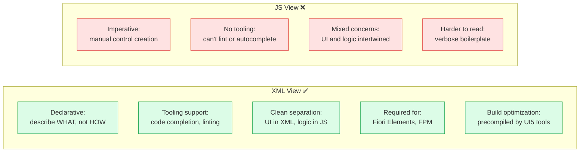
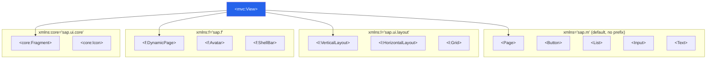
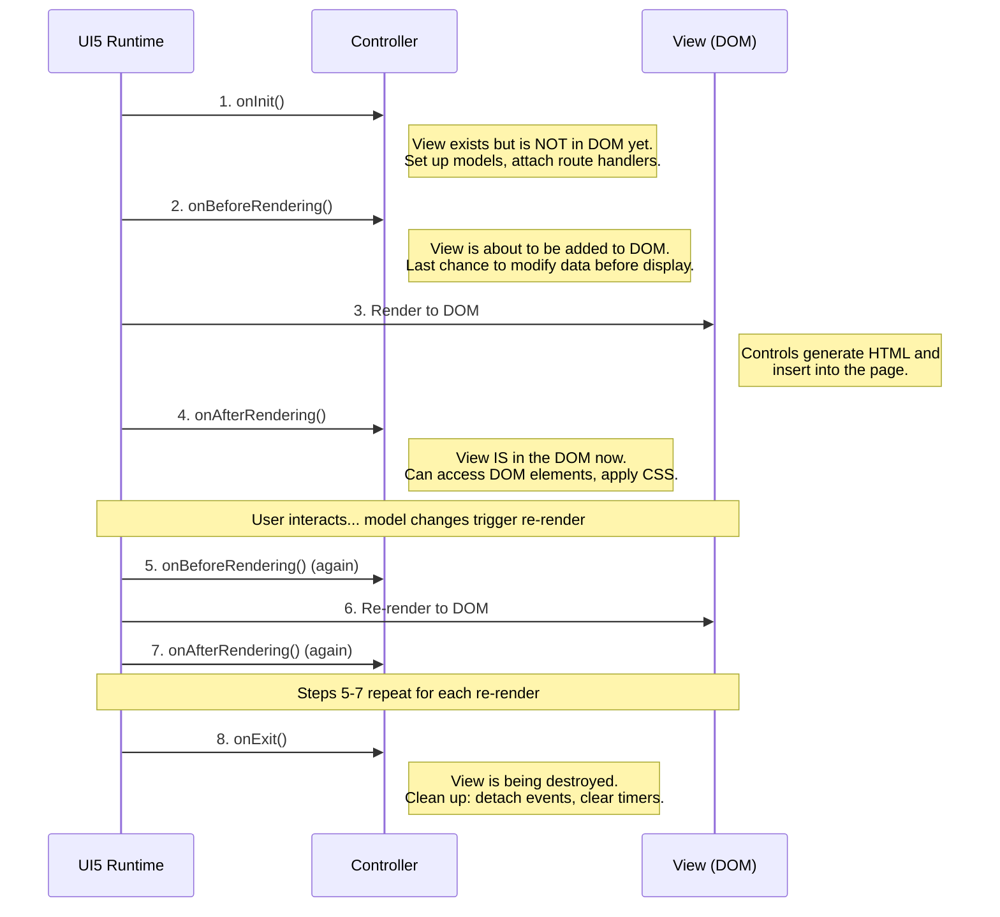
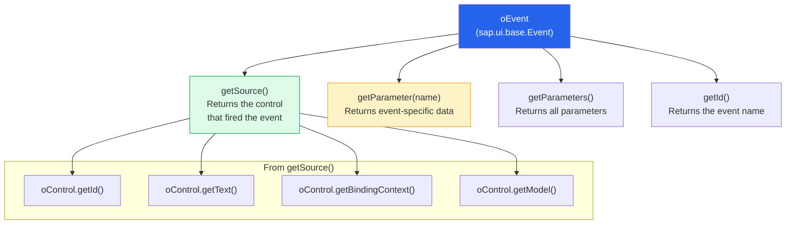
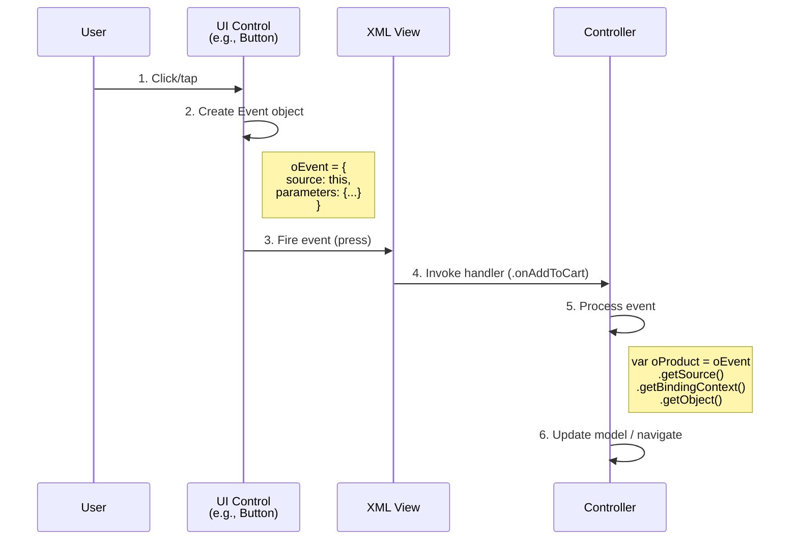
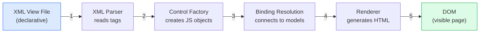
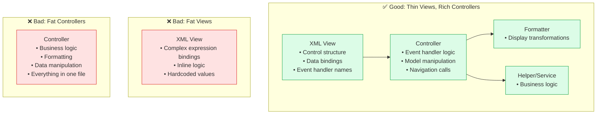

# Module 02: Views & Controllers

> **Goal**: Master XML Views and Controllers — the two layers that define what the user sees and how the app responds to interactions.

---

## Table of Contents

- [View Types in UI5](#view-types-in-ui5)
- [XML View Syntax Deep Dive](#xml-view-syntax-deep-dive)
- [Controller Basics](#controller-basics)
- [Controller Lifecycle Methods](#controller-lifecycle-methods)
- [Event Handling in Views](#event-handling-in-views)
- [The Event Object](#the-event-object)
- [View-Controller Connection](#view-controller-connection)
- [Best Practices](#best-practices)

---

## View Types in UI5

UI5 supports four view types, but **XML is the standard**:

| View Type | Extension | Status | When to Use |
|-----------|-----------|--------|-------------|
| **XML** | `.view.xml` | **Recommended** | Always — the standard for all new development |
| JavaScript | `.view.js` | Legacy | Avoid — hard to read, mixes UI with logic |
| JSON | `.view.json` | Rarely used | Almost never — limited and cumbersome |
| HTML | `.view.html` | Rarely used | Almost never — conflicts with UI5 rendering |

### Why XML Views Are Preferred



### Comparison: XML View vs JS View

The same button in both syntaxes:

**XML View (clean, declarative):**
```xml
<Button text="{i18n>addToCart}" icon="sap-icon://cart" press=".onAddToCart" type="Emphasized" />
```

**JS View (verbose, imperative):**
```javascript
createContent: function () {
    var oButton = new sap.m.Button({
        text: "{i18n>addToCart}",
        icon: "sap-icon://cart",
        press: [this.onAddToCart, this],
        type: sap.m.ButtonType.Emphasized
    });
    return oButton;
}
```

---

## XML View Syntax Deep Dive

### Anatomy of an XML View

```xml
<?xml version="1.0" encoding="UTF-8"?>
<!-- Optional XML declaration -->

<mvc:View
    controllerName="com.shopeasy.app.controller.Home"
    xmlns:mvc="sap.ui.core.mvc"
    xmlns="sap.m"
    xmlns:l="sap.ui.layout"
    xmlns:f="sap.f"
    xmlns:core="sap.ui.core">

    <!-- Content goes here -->
    <Page title="{i18n>homeTitle}">
        <content>
            <List items="{/Products}">
                <StandardListItem
                    title="{Name}"
                    description="{Description}"
                    press=".onProductPress" />
            </List>
        </content>
    </Page>

</mvc:View>
```

### Namespaces Explained

Namespaces map prefixes to UI5 control libraries. Each library contains a different set of controls:



**Rule:** The namespace without a prefix (`xmlns="sap.m"`) is the **default namespace**. Controls from `sap.m` don't need a prefix. All other namespaces require their declared prefix.

### Control Nesting & Aggregations

UI5 controls contain child controls through **aggregations**. In XML, each aggregation is a child element:

```xml
<Page title="My Page">        <!-- Page control -->
    <content>                  <!-- "content" aggregation (default) -->
        <VBox>                 <!-- VBox control -->
            <items>            <!-- "items" aggregation (default for VBox) -->
                <Text text="Hello" />
                <Button text="Click" />
            </items>
        </VBox>
    </content>
    <footer>                   <!-- "footer" aggregation -->
        <Toolbar>
            <ToolbarSpacer />
            <Button text="Save" />
        </Toolbar>
    </footer>
</Page>
```

**Default aggregation:** Most controls have a default aggregation. For `Page`, it's `content`. For `VBox`/`HBox`, it's `items`. You can omit the default aggregation tag:

```xml
<!-- These are equivalent: -->
<VBox>
    <items>
        <Text text="Hello" />
    </items>
</VBox>

<!-- Same thing, shorter (items is the default aggregation): -->
<VBox>
    <Text text="Hello" />
</VBox>
```

---

## Controller Basics

A Controller is a JavaScript module that handles the logic for a specific View. It extends `sap.ui.core.mvc.Controller`.

### Controller Structure

```javascript
sap.ui.define([
    "sap/ui/core/mvc/Controller",
    "com/shopeasy/app/model/formatter"
], function (Controller, formatter) {
    "use strict";

    return Controller.extend("com.shopeasy.app.controller.Home", {

        // Make formatter available in XML views as ".formatter.functionName"
        formatter: formatter,

        // Lifecycle method — runs once when view is created
        onInit: function () {
            // Setup code here
        },

        // Custom event handler — called by the view
        onProductPress: function (oEvent) {
            // Handle button click
        },

        // Private helper method (convention: prefix with _)
        _loadData: function () {
            // Internal logic
        }
    });
});
```

### Accessing UI5 Infrastructure from Controllers

```javascript
// Access the view this controller belongs to
var oView = this.getView();

// Access a specific control by its ID
var oList = this.byId("productList");

// Access models
var oModel = this.getView().getModel();              // Default model
var oCartModel = this.getView().getModel("cart");     // Named model
var oI18nModel = this.getView().getModel("i18n");     // i18n model

// Access the owning component
var oComponent = this.getOwnerComponent();

// Access the router
var oRouter = this.getOwnerComponent().getRouter();

// Get i18n texts
var oBundle = this.getView().getModel("i18n").getResourceBundle();
var sText = oBundle.getText("addToCart");
```

---

## Controller Lifecycle Methods



### When to Use Each Method

| Method | Runs | Use For |
|--------|------|---------|
| `onInit` | **Once** on creation | Attach route handlers, create local models, initialize state |
| `onBeforeRendering` | **Every** render cycle | Adjust data/properties before the DOM updates |
| `onAfterRendering` | **Every** render cycle | Direct DOM access, third-party library integration |
| `onExit` | **Once** on destruction | Remove global listeners, clear intervals, release resources |

### Example: Full Controller

```javascript
sap.ui.define([
    "sap/ui/core/mvc/Controller",
    "sap/ui/model/json/JSONModel",
    "com/shopeasy/app/model/formatter"
], function (Controller, JSONModel, formatter) {
    "use strict";

    return Controller.extend("com.shopeasy.app.controller.ProductList", {
        formatter: formatter,

        onInit: function () {
            // Create a view-local model for UI state
            var oViewModel = new JSONModel({
                isFilterOpen: false,
                selectedCategory: "all"
            });
            this.getView().setModel(oViewModel, "viewModel");

            // Listen for route matches
            this.getOwnerComponent().getRouter()
                .getRoute("productList")
                .attachPatternMatched(this._onRouteMatched, this);
        },

        onAfterRendering: function () {
            // Apply content density CSS class
            this.getView().addStyleClass(
                this.getOwnerComponent().getContentDensityClass()
            );
        },

        onExit: function () {
            // Nothing to clean up in this case
        },

        // Route handler
        _onRouteMatched: function (oEvent) {
            var sCategoryId = oEvent.getParameter("arguments").categoryId;
            this._filterByCategory(sCategoryId);
        },

        // Event handler for search
        onSearch: function (oEvent) {
            var sQuery = oEvent.getParameter("query");
            // Apply filter...
        }
    });
});
```

---

## Event Handling in Views

### Attaching Events in XML

UI5 controls fire events when the user interacts with them. You attach handlers in the XML:

```xml
<!-- Button press event -->
<Button text="Add to Cart" press=".onAddToCart" />

<!-- Input change events -->
<Input
    value="{/searchQuery}"
    liveChange=".onSearchLiveChange"
    change=".onSearchChange"
    submit=".onSearchSubmit" />

<!-- List item press -->
<List items="{/Products}">
    <StandardListItem
        title="{Name}"
        type="Navigation"
        press=".onProductPress" />
</List>

<!-- Select change -->
<Select change=".onCategoryChange" selectedKey="{viewModel>/category}">
    <core:Item key="all" text="All Categories" />
    <core:Item key="electronics" text="Electronics" />
</Select>
```

### The Dot Prefix (`.`)

The leading dot in `.onAddToCart` means "look for this method on the **controller instance**":

```
".onAddToCart"  →  this.onAddToCart  (on the controller)
"onAddToCart"   →  Global function   (BAD — don't do this!)
```

**Always use the dot prefix!**

### Common Events by Control Type

| Control | Events | Triggered When |
|---------|--------|---------------|
| `Button` | `press` | User clicks the button |
| `Input` | `change`, `liveChange`, `submit` | Value changes, each keystroke, Enter pressed |
| `List` | `itemPress`, `selectionChange` | Item tapped, selection changes |
| `SearchField` | `search`, `liveChange` | Search button/Enter, each keystroke |
| `Select` | `change` | User selects a different item |
| `Switch` | `change` | Toggle switched on/off |
| `CheckBox` | `select` | Checked/unchecked |
| `Table` | `itemPress`, `updateFinished` | Row clicked, data loaded |
| `NavContainer` | `navigate`, `afterNavigate` | Page navigation starts/ends |

---

## The Event Object

Every event handler receives an `oEvent` parameter (the event object) that provides information about what happened.



### Practical Examples

```javascript
// Button press — get the button that was clicked
onAddToCart: function (oEvent) {
    var oButton = oEvent.getSource();           // The Button control
    var oContext = oButton.getBindingContext();  // Its data binding context
    var oProduct = oContext.getObject();         // The bound data object
    // oProduct = { ProductId: "PROD001", Name: "Headphones", Price: 249.99, ... }
},

// Input liveChange — get what the user is typing
onSearchLiveChange: function (oEvent) {
    var sValue = oEvent.getParameter("value");  // Current input value
    var sNewValue = oEvent.getParameter("newValue"); // Same as value
},

// List item press — get the pressed item
onProductPress: function (oEvent) {
    var oItem = oEvent.getSource();             // The ListItem
    var sPath = oItem.getBindingContext().getPath(); // e.g., "/Products('PROD001')"
    var sProductId = oItem.getBindingContext().getProperty("ProductId");
},

// Select change — get the selected item
onCategoryChange: function (oEvent) {
    var oSelectedItem = oEvent.getParameter("selectedItem");
    var sKey = oSelectedItem.getKey();           // e.g., "electronics"
    var sText = oSelectedItem.getText();         // e.g., "Electronics"
}
```

### Event Flow in UI5



---

## View-Controller Connection

### How Views Find Their Controller

The connection is established by the `controllerName` attribute on the `<mvc:View>` tag:

```xml
<mvc:View
    controllerName="com.shopeasy.app.controller.Home"
    xmlns:mvc="sap.ui.core.mvc"
    xmlns="sap.m">
```

UI5 resolves this to a file path:
```
com.shopeasy.app.controller.Home
↓ (dots → slashes)
com/shopeasy/app/controller/Home
↓ (apply resourceroots: com.shopeasy.app → ./)
./controller/Home.controller.js
```

### View Rendering Pipeline



**What happens at each step:**

1. **Parse**: UI5's XML parser reads the view file and identifies each control tag
2. **Create**: For each tag, UI5 instantiates the corresponding JavaScript control class (e.g., `<Button>` → `new sap.m.Button()`)
3. **Bind**: Data bindings (`{/ProductName}`, `{i18n>title}`) are resolved against available models
4. **Render**: Each control's `Renderer` generates the HTML string
5. **DOM**: The HTML is inserted into the page's DOM

---

## Best Practices

### View Organization



### Do's and Don'ts

| Do | Don't |
|----|-------|
| Use XML views exclusively | Use JavaScript views for new code |
| Keep views declarative (data bindings, event names) | Put logic in views (complex expressions) |
| Use `this.byId()` to access controls | Use `sap.ui.getCore().byId()` (fragile) |
| Create a BaseController for shared logic | Duplicate logic across controllers |
| Use formatters for display transformations | Format data in controllers and hardcode in views |
| Use i18n for all user-visible text | Hardcode strings in views or controllers |
| Prefix private methods with `_` | Expose internal methods without convention |
| Keep controllers thin — delegate to helpers | Put all business logic in controllers |

### BaseController Pattern

Create a `BaseController.js` with shared functionality:

```javascript
// webapp/controller/BaseController.js
sap.ui.define([
    "sap/ui/core/mvc/Controller"
], function (Controller) {
    "use strict";

    return Controller.extend("com.shopeasy.app.controller.BaseController", {
        getRouter: function () {
            return this.getOwnerComponent().getRouter();
        },

        getModel: function (sName) {
            return this.getView().getModel(sName);
        },

        setModel: function (oModel, sName) {
            this.getView().setModel(oModel, sName);
        },

        getResourceBundle: function () {
            return this.getOwnerComponent().getModel("i18n").getResourceBundle();
        },

        navTo: function (sRouteName, oParameters) {
            this.getRouter().navTo(sRouteName, oParameters);
        }
    });
});
```

Then other controllers extend BaseController instead of Controller:

```javascript
sap.ui.define([
    "com/shopeasy/app/controller/BaseController"
], function (BaseController) {
    "use strict";

    return BaseController.extend("com.shopeasy.app.controller.Home", {
        onInit: function () {
            // Can use this.getRouter(), this.getModel(), etc.
        },

        onNavigateToProducts: function () {
            // Cleaner with BaseController helpers:
            this.navTo("productList", { categoryId: "electronics" });
        }
    });
});
```

---

## Summary

1. **XML Views** are the standard — they're declarative, tooling-friendly, and required for modern UI5 features
2. **Namespaces** map prefixes to UI5 libraries (`xmlns:f="sap.f"` → `<f:Avatar />`)
3. **Controllers** handle events and manage data — they extend `sap.ui.core.mvc.Controller`
4. **Lifecycle**: `onInit` (once) → `onBeforeRendering` → `onAfterRendering` → `onExit` (once)
5. **Events** connect views to controllers — use dot prefix (`.onMyHandler`)
6. **oEvent** provides `getSource()` and `getParameter()` for event details
7. **BaseController** pattern eliminates repeated boilerplate

**Next**: [Module 03: Data Binding](./03-data-binding.md) — Learn how UI5 connects Models to Views automatically.
