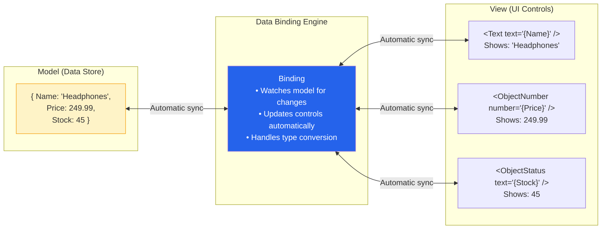
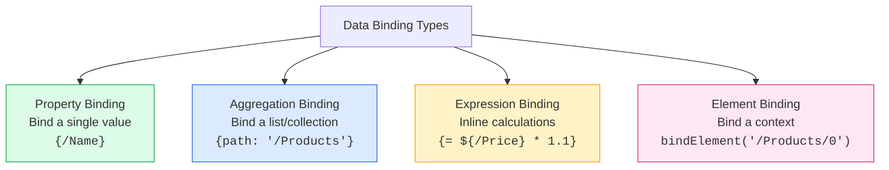
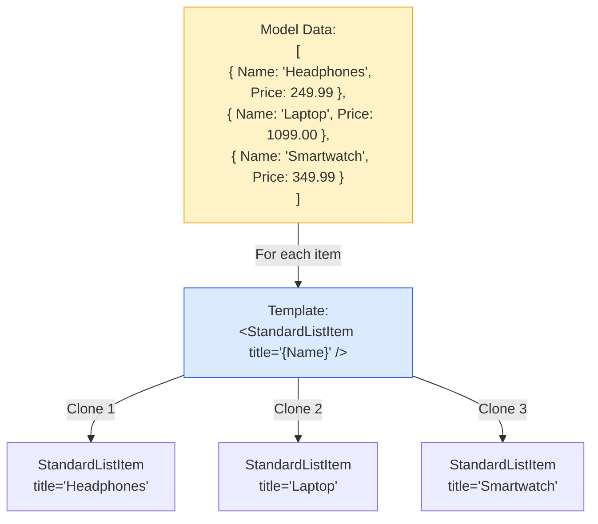
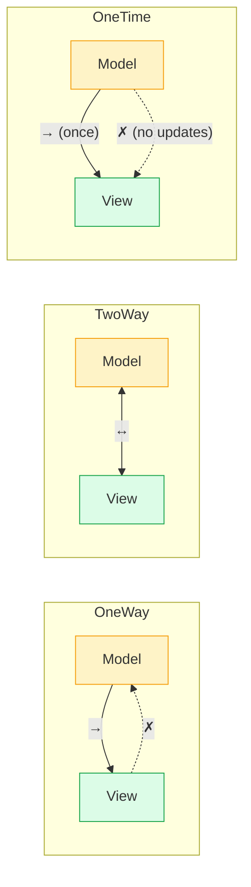
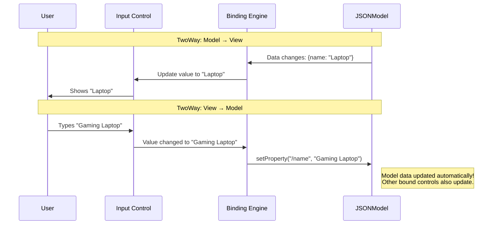
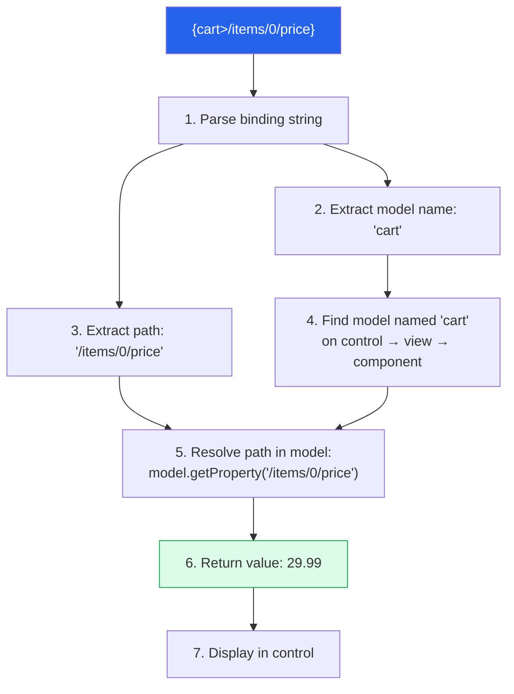
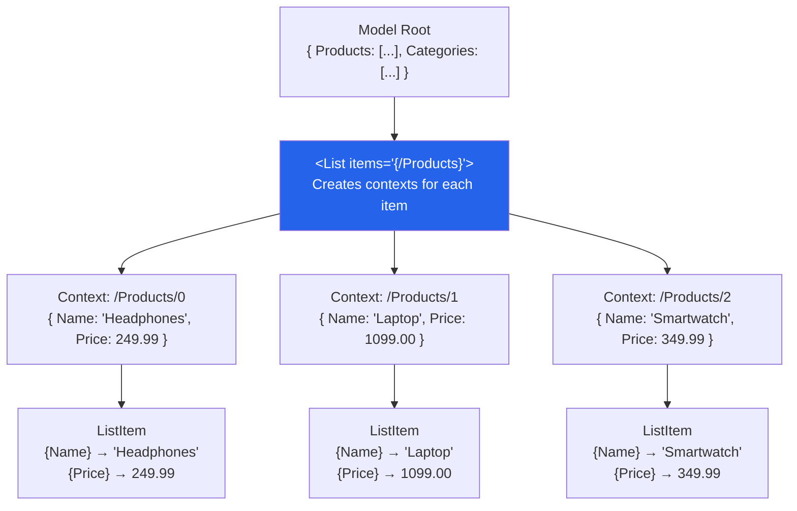
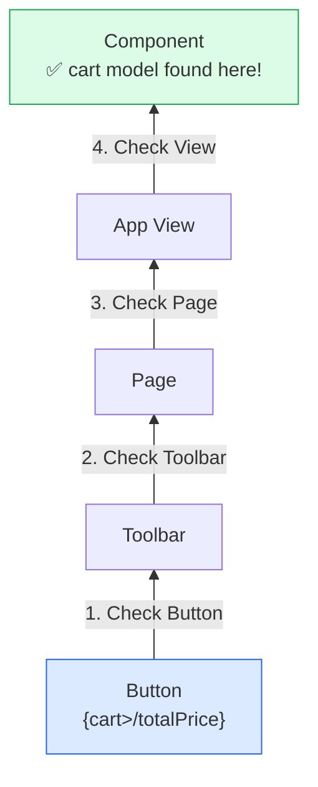
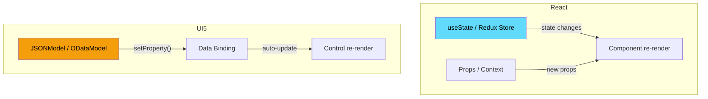

# Module 03: Data Binding

> **Goal**: Understand data binding — the mechanism that automatically synchronizes your data (Models) with your UI (Views), eliminating manual DOM manipulation.

---

## Table of Contents

- [What is Data Binding?](#what-is-data-binding)
- [Binding Types](#binding-types)
- [Binding Modes](#binding-modes)
- [Binding Syntax](#binding-syntax)
- [Relative vs Absolute Paths](#relative-vs-absolute-paths)
- [Named Models vs Default Model](#named-models-vs-default-model)
- [Type System](#type-system)
- [Comparison with React State Management](#comparison-with-react-state-management)

---

## What is Data Binding?

Data binding is the automatic connection between your **data** (stored in Models) and your **UI** (defined in Views). When data changes, the UI updates automatically — and vice versa.

### Without Data Binding (Manual DOM)

```javascript
// ❌ Without data binding — YOU manage everything
document.getElementById("productName").textContent = product.name;
document.getElementById("productPrice").textContent = "$" + product.price;

// When data changes, you must manually update EVERY element:
product.price = 299.99;
document.getElementById("productPrice").textContent = "$" + product.price;
// Forgot to update the cart total? Bug! 🐛
```

### With Data Binding (UI5 Way)

```xml
<!-- ✅ With data binding — UI5 manages everything -->
<Text text="{Name}" />
<ObjectNumber number="{Price}" unit="{Currency}" />

<!-- When the model data changes, ALL bound controls update automatically! -->
```

### How It Works



---

## Binding Types

UI5 has four types of data binding, each serving a different purpose:



### 1. Property Binding

Binds a **single model property** to a **single control property**.

```xml
<!-- Simple property binding -->
<Text text="{/ProductName}" />

<!-- With a named model -->
<Text text="{cart>/totalPrice}" />

<!-- With i18n model -->
<Text text="{i18n>appTitle}" />

<!-- With formatter -->
<Text text="{
    path: '/Price',
    formatter: '.formatter.formatPrice'
}" />
```

**How it resolves:**

```
{/ProductName}
 │
 └── "/" = absolute path from model root
      └── "ProductName" = property name
           └── Looks up: model.getProperty("/ProductName")
                └── Returns: "Wireless Headphones"
```

### 2. Aggregation Binding

Binds a **collection** (array) to a **list-like control**. UI5 creates one child control per item.

```xml
<!-- Aggregation binding with template -->
<List items="{/Products}">
    <!-- This template is repeated for EACH product -->
    <StandardListItem
        title="{Name}"
        description="{Description}"
        info="{Price}" />
</List>

<!-- More complex aggregation binding -->
<List items="{
    path: '/Products',
    sorter: { path: 'Name' },
    filters: [{ path: 'Stock', operator: 'GT', value1: 0 }]
}">
    <StandardListItem title="{Name}" />
</List>
```

**What happens at runtime:**



### 3. Expression Binding

Inline calculations and conditional logic directly in the view. Starts with `{=` and can reference model properties with `${...}`.

```xml
<!-- Simple calculation -->
<Text text="{= ${/Price} * ${/Quantity} }" />

<!-- Conditional visibility -->
<Button visible="{= ${/Stock} > 0}" text="Add to Cart" />

<!-- Ternary operator -->
<ObjectStatus
    text="{= ${/Stock} > 0 ? 'Available' : 'Sold Out'}"
    state="{= ${/Stock} > 0 ? 'Success' : 'Error'}" />

<!-- String concatenation -->
<Text text="{= ${/ReviewCount} + ' reviews'}" />

<!-- Using named models -->
<Panel visible="{= !${device>/system/phone}}" />

<!-- Comparison -->
<Text text="{= ${cart>/itemCount} === 0 ? 'Cart is empty' : ${cart>/itemCount} + ' items'}" />
```

**When to use Expression Binding vs Formatters:**

| Use Expression Binding | Use Formatters |
|----------------------|----------------|
| Simple boolean checks | Complex logic (multiple conditions) |
| Basic arithmetic | Business rules |
| Ternary expressions | Need unit testing |
| One-off display logic | Reusable across views |

### 4. Element Binding (Context Binding)

Binds an entire control to a **specific entity** in the model. All child bindings become relative to this context.

```javascript
// In a controller — bind the view to a specific product
onRouteMatched: function (oEvent) {
    var sProductId = oEvent.getParameter("arguments").productId;

    // For OData model:
    this.getView().bindElement({
        path: "/Products('" + sProductId + "')",
        events: {
            dataReceived: function () {
                // Data loaded
            }
        }
    });

    // For JSON model:
    this.getView().bindElement("/Products/" + iIndex);
}
```

```xml
<!-- After bindElement("/Products('PROD001')"), all bindings are relative -->
<Page title="{Name}">
    <ObjectHeader
        title="{Name}"
        number="{Price}"
        numberUnit="{Currency}">
        <statuses>
            <ObjectStatus text="{Stock} in stock" />
        </statuses>
    </ObjectHeader>
    <Text text="{Description}" />
</Page>

<!--
  {Name}  → resolves to /Products('PROD001')/Name
  {Price} → resolves to /Products('PROD001')/Price
  No need to repeat the full path for each property!
-->
```

---

## Binding Modes

Binding modes control the **direction** of data flow between Model and View.



### Comparison

| Mode | Direction | Use Case | Example |
|------|-----------|----------|---------|
| **OneWay** | Model → View | Display-only data | Product name, price display |
| **TwoWay** | Model ↔ View | Editable forms | Input fields, checkboxes |
| **OneTime** | Model → View (once) | Static data | App title, config values |

### Default Modes by Model Type

| Model Type | Default Mode | Why |
|-----------|-------------|-----|
| JSONModel | TwoWay | Local data is often editable |
| ODataModel v2 | OneWay | Server data shouldn't change without explicit save |
| ODataModel v4 | TwoWay | Designed for direct editing patterns |
| ResourceModel (i18n) | OneTime | Translations don't change at runtime |

### Setting Binding Mode

```javascript
// Set the default mode for an entire model
oModel.setDefaultBindingMode(sap.ui.model.BindingMode.OneWay);

// From our project — webapp/model/models.js:
var oModel = new JSONModel(Device);
oModel.setDefaultBindingMode(BindingMode.OneWay);  // Device info is read-only
```

```xml
<!-- Override mode for a specific binding -->
<Input value="{
    path: '/ProductName',
    mode: 'OneWay'
}" />
```

### TwoWay Binding in Action



---

## Binding Syntax

UI5 supports two binding syntaxes: **simple** and **complex**.

### Simple Binding Syntax

Used for straightforward property bindings:

```xml
<!-- Absolute path -->
<Text text="{/ProductName}" />

<!-- Named model with absolute path -->
<Text text="{cart>/totalPrice}" />

<!-- Relative path (requires a binding context) -->
<Text text="{Name}" />
```

### Complex Binding Syntax

Used when you need formatters, types, constraints, or multiple parts:

```xml
<!-- With formatter -->
<Text text="{
    path: '/Price',
    formatter: '.formatter.formatPrice'
}" />

<!-- With type and format options -->
<Text text="{
    path: '/Price',
    type: 'sap.ui.model.type.Currency',
    formatOptions: { showMeasure: false },
    constraints: { minimum: 0 }
}" />

<!-- Multi-part binding (parts syntax) -->
<Text text="{
    parts: [
        { path: '/Price' },
        { path: '/Currency' }
    ],
    formatter: '.formatter.formatPriceWithCurrency'
}" />

<!-- Named model in complex syntax -->
<ObjectNumber number="{
    path: 'cart>/totalPrice',
    formatter: '.formatter.formatPrice'
}" />
```

### Binding Resolution Flow



---

## Relative vs Absolute Paths

### Absolute Paths

Start with `/` — always resolve from the model's root:

```xml
<Text text="{/Products/0/Name}" />      <!-- First product's name -->
<Text text="{/totalPrice}" />            <!-- Root-level totalPrice -->
<Text text="{cart>/itemCount}" />         <!-- Root-level in cart model -->
```

### Relative Paths

Don't start with `/` — resolve from the current **binding context**:

```xml
<List items="{/Products}">
    <!--
        Each item gets a binding context like:
        /Products/0, /Products/1, /Products/2, ...
    -->
    <StandardListItem
        title="{Name}"              <!-- Relative: /Products/0/Name -->
        description="{Description}" <!-- Relative: /Products/0/Description -->
        info="{Price}"              <!-- Relative: /Products/0/Price -->
    />
</List>
```

### How Context Works



---

## Named Models vs Default Model

### Default Model (Empty String Key)

Set without a name — accessed with just `{/path}`:

```javascript
// Setting the default model:
this.setModel(oODataModel);  // No second argument = default
// or
this.setModel(oODataModel, "");  // Empty string = default

// In manifest.json, the empty-string key:
"models": {
    "": { "dataSource": "mainService" }
}
```

```xml
<!-- Accessing the default model (no prefix): -->
<Text text="{/ProductName}" />
<List items="{/Products}" />
```

### Named Models

Set with a name — accessed with `{modelName>/path}`:

```javascript
this.setModel(oCartModel, "cart");
this.setModel(oDeviceModel, "device");
this.setModel(oI18nModel, "i18n");
```

```xml
<!-- Accessing named models (prefix required): -->
<Text text="{cart>/totalPrice}" />
<Text text="{device>/system/phone}" />
<Text text="{i18n>appTitle}" />
```

### Model Lookup Order

When UI5 resolves a binding like `{cart>/totalPrice}`, it looks for the model named `"cart"` by traversing up the control hierarchy:



Models set on the **Component** are available everywhere. Models set on a **View** are only available within that view and its children.

---

## Type System

UI5 provides built-in types (`sap.ui.model.type.*`) for automatic formatting and validation.

### Common Types

| Type | Input | Display | Validates |
|------|-------|---------|-----------|
| `sap.ui.model.type.String` | `"hello"` | `"hello"` | Max length, pattern |
| `sap.ui.model.type.Integer` | `42` | `"42"` | Min, max |
| `sap.ui.model.type.Float` | `3.14` | `"3.14"` | Min, max, decimals |
| `sap.ui.model.type.Currency` | `[249.99, "USD"]` | `"249.99 USD"` | Min, max |
| `sap.ui.model.type.Date` | `Date` object | `"Mar 22, 2026"` | Min, max date |
| `sap.ui.model.type.DateTime` | `Date` object | `"Mar 22, 2026, 3:45 PM"` | Min, max |

### Using Types in Bindings

```xml
<!-- Currency formatting -->
<ObjectNumber number="{
    parts: [{path: 'Price'}, {path: 'Currency'}],
    type: 'sap.ui.model.type.Currency',
    formatOptions: { showMeasure: false }
}" unit="{Currency}" />

<!-- Date formatting -->
<Text text="{
    path: '/OrderDate',
    type: 'sap.ui.model.type.Date',
    formatOptions: { style: 'medium' }
}" />

<!-- Integer with constraints -->
<Input value="{
    path: '/Quantity',
    type: 'sap.ui.model.type.Integer',
    constraints: { minimum: 1, maximum: 99 }
}" />
```

Types handle:
- **Parsing**: Convert user input (string) to model value (number, date)
- **Formatting**: Convert model value to display string
- **Validation**: Reject invalid input (triggers `validationError` event)

---

## Comparison with React State Management

If you know React, here's how UI5 data binding maps:



### Side-by-Side Examples

**React: Display a product name**
```jsx
const [product, setProduct] = useState({ name: "Headphones" });
return <h1>{product.name}</h1>;

// To update:
setProduct({ ...product, name: "Laptop" });
// Component re-renders → h1 shows "Laptop"
```

**UI5: Display a product name**
```xml
<Title text="{/Name}" />
```
```javascript
// Model has: { Name: "Headphones" }
// To update:
oModel.setProperty("/Name", "Laptop");
// Binding auto-updates → Title shows "Laptop"
```

**React: List of items**
```jsx
const [products, setProducts] = useState([...]);
return (
    <ul>
        {products.map(p => <li key={p.id}>{p.name}</li>)}
    </ul>
);
```

**UI5: List of items**
```xml
<List items="{/Products}">
    <StandardListItem title="{Name}" />
</List>
<!-- No .map() needed — aggregation binding handles iteration! -->
```

**React: Two-way binding (forms)**
```jsx
const [name, setName] = useState("");
return <input value={name} onChange={e => setName(e.target.value)} />;
```

**UI5: Two-way binding (forms)**
```xml
<Input value="{/Name}" />
<!-- With TwoWay binding mode, typing auto-updates the model. No onChange needed! -->
```

### Key Differences

| Aspect | React | UI5 |
|--------|-------|-----|
| Update trigger | `setState` / `dispatch` | `setProperty` / `setData` |
| Re-render scope | Entire component tree (virtual DOM diff) | Only bound controls |
| Direction | One-way by default (need onChange for two-way) | Configurable (OneWay, TwoWay, OneTime) |
| State location | Component-local or global store | Model (component or view level) |
| List rendering | Manual `.map()` | Automatic via aggregation binding |

---

## Summary

1. **Data binding** eliminates manual DOM updates — model changes auto-update the UI
2. **Four binding types**: Property (`{/Name}`), Aggregation (`items="{/Products}"`), Expression (`{= ...}`), Element (`bindElement`)
3. **Three binding modes**: OneWay (display), TwoWay (forms), OneTime (static)
4. **Simple syntax** `{/path}` for basic bindings; **complex syntax** for formatters, types, and multi-part bindings
5. **Relative paths** resolve from the current binding context; **absolute paths** start from the model root
6. **Named models** use a prefix (`{cart>/path}`); the **default model** uses no prefix (`{/path}`)
7. **Types** handle formatting, parsing, and validation automatically

**Next**: [Module 04: Models](./04-models.md) — Deep dive into JSONModel, ODataModel, ResourceModel, and model propagation.
