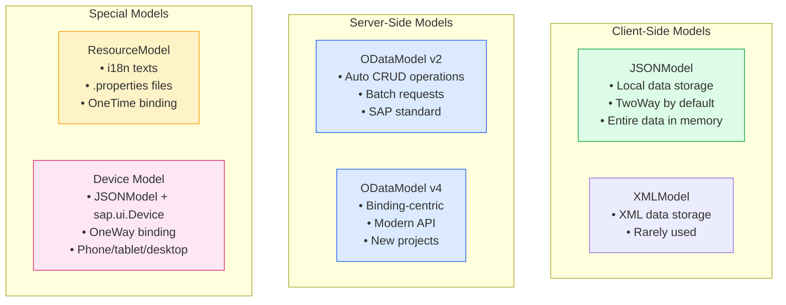
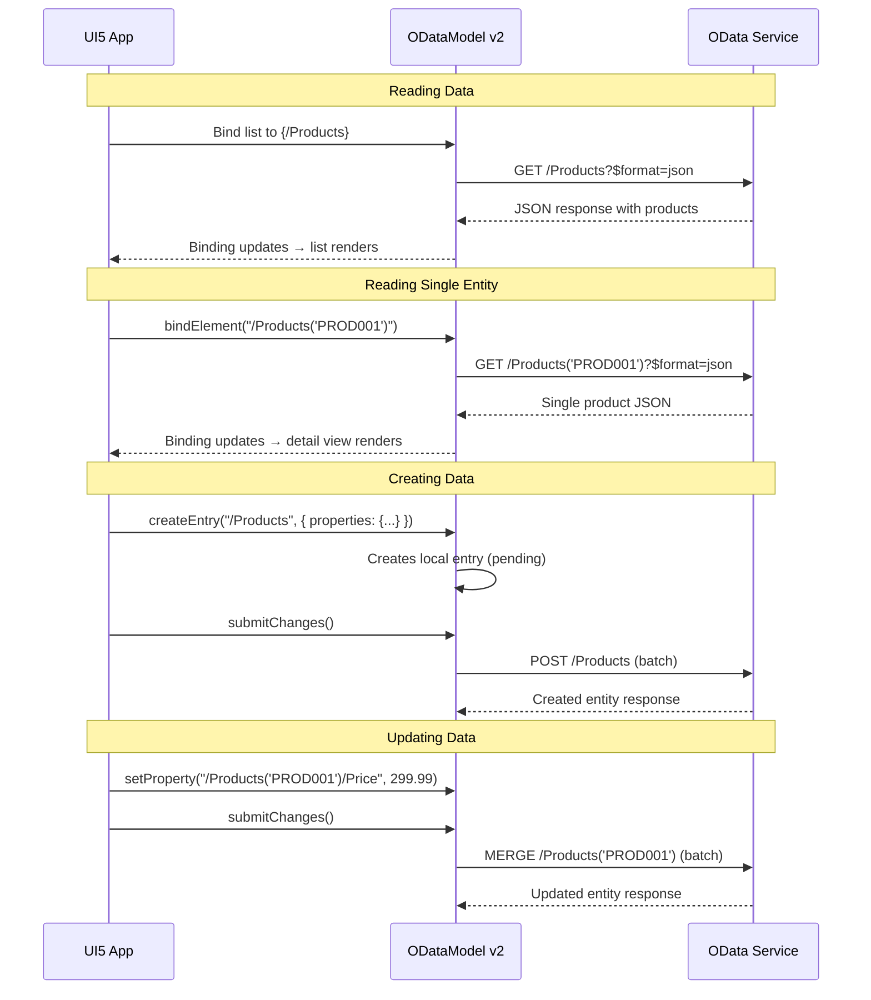
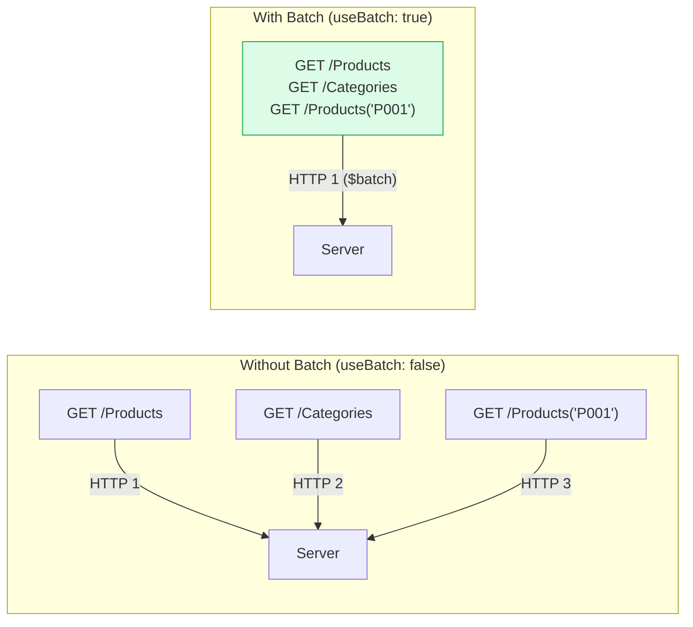
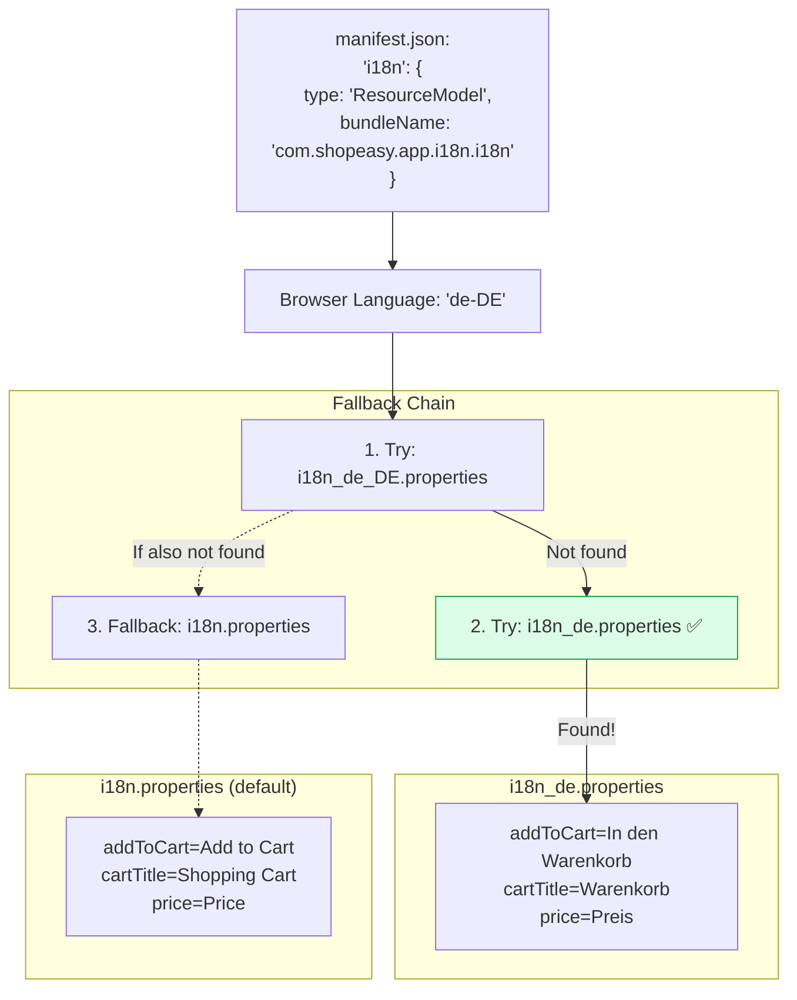
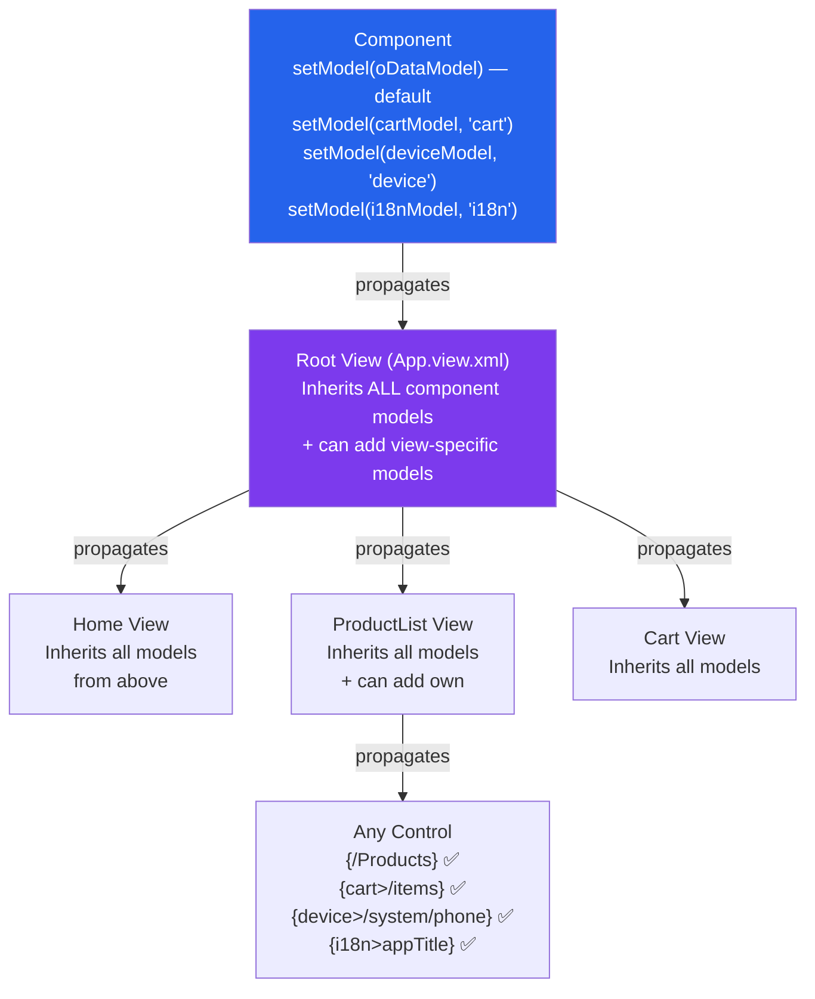
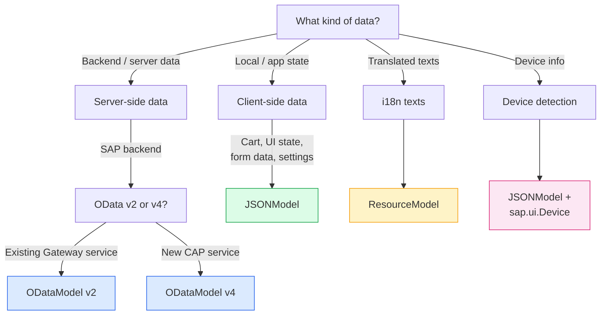

# Module 04: Models

> **Goal**: Understand the different model types in UI5, when to use each one, and how models propagate through the application.

---

## Table of Contents

- [Model Overview](#model-overview)
- [JSONModel](#jsonmodel)
- [ODataModel v2](#odatamodel-v2)
- [ODataModel v4](#odatamodel-v4)
- [ResourceModel (i18n)](#resourcemodel-i18n)
- [Device Model](#device-model)
- [Model Propagation](#model-propagation)
- [When to Use Which Model](#when-to-use-which-model)

---

## Model Overview

Models are the **data layer** of your UI5 application. They hold data, notify the UI when data changes, and handle communication with backend services.



### Models in Our Project

| Model Name | Type | Defined In | Purpose |
|-----------|------|-----------|---------|
| `""` (default) | ODataModel v2 | `manifest.json` | Product/category data from OData service |
| `"i18n"` | ResourceModel | `manifest.json` | Translation texts |
| `"cart"` | JSONModel | `manifest.json` + `Component.js` | Shopping cart state |
| `"device"` | JSONModel | `Component.js` | Device detection info |

---

## JSONModel

The **JSONModel** stores data as a plain JavaScript object in the browser's memory. It's the most commonly used model for local/client-side data.

### Creating a JSONModel

```javascript
// From webapp/Component.js:
var oCartModel = new JSONModel({
    items: [],
    totalPrice: 0,
    itemCount: 0,
    currency: "USD"
});
this.setModel(oCartModel, "cart");
```

### Core Methods

#### getData() / setData()

```javascript
// Get the entire model data object
var oData = oModel.getData();
// Returns: { items: [...], totalPrice: 109.97, ... }

// Replace ALL data (destructive!)
oModel.setData({
    items: [],
    totalPrice: 0,
    itemCount: 0
});

// Merge with existing data (non-destructive)
oModel.setData({ newProperty: "value" }, true);  // true = merge
```

#### getProperty() / setProperty()

```javascript
// Read a specific property
var aItems = oModel.getProperty("/items");           // Array
var sName = oModel.getProperty("/items/0/name");     // "Wireless Mouse"
var fPrice = oModel.getProperty("/items/0/price");   // 29.99

// Update a specific property (fires change events!)
oModel.setProperty("/totalPrice", 99.99);
oModel.setProperty("/items/0/quantity", 3);
```

#### refresh()

```javascript
// Force all bindings to re-read from the model
oModel.refresh();       // Normal refresh
oModel.refresh(true);   // Force update — even if model thinks nothing changed
```

### The JSONModel Trap

```mermaid
graph TD
    subgraph "✅ Works — UI Updates"
        A1["oModel.setProperty('/items', newArray)"]
        A2["setProperty fires change event"]
        A3["Bound controls re-render"]
        A1 --> A2 --> A3
    end

    subgraph "❌ Broken — UI Does NOT Update"
        B1["var items = oModel.getProperty('/items')"]
        B2["items.push(newItem)"]
        B3["Model doesn't know array changed!"]
        B4["UI still shows old data"]
        B1 --> B2 --> B3 --> B4
    end

    subgraph "✅ Fix — Call refresh()"
        C1["var items = oModel.getProperty('/items')"]
        C2["items.push(newItem)"]
        C3["oModel.refresh(true)"]
        C4["All bindings re-evaluate"]
        C1 --> C2 --> C3 --> C4
    end

    style A3 fill:#dcfce7,stroke:#16a34a
    style B4 fill:#fee2e2,stroke:#dc2626
    style C4 fill:#dcfce7,stroke:#16a34a
```



This pattern is used throughout `webapp/model/cart.js`:

```javascript
// From cart.js — after modifying items:
aItems.push(oCartItem);
oCartModel.setProperty("/items", aItems);  // Fire change event
_recalculateTotal(oCartModel);
oCartModel.refresh(true);                  // Safety net
```

### JSONModel Size Limit

JSONModel has a default size limit of **100** for list bindings. If your array has more than 100 items, only the first 100 will appear in a bound list.

```javascript
// Increase the limit:
oModel.setSizeLimit(500);

// Or set to a very large number:
oModel.setSizeLimit(Number.MAX_SAFE_INTEGER);
```

---

## ODataModel v2

The **ODataModel v2** connects to an OData service and handles CRUD operations automatically. It's the standard for communicating with SAP backends.

### How OData Works



### Configuration in manifest.json

```json
"": {
    "dataSource": "mainService",
    "preload": true,
    "settings": {
        "defaultBindingMode": "TwoWay",
        "defaultCountMode": "Inline",
        "useBatch": true
    }
}
```

| Setting | Value | Meaning |
|---------|-------|---------|
| `dataSource` | `"mainService"` | References the data source defined in `sap.app.dataSources` |
| `preload` | `true` | Start loading metadata immediately |
| `defaultBindingMode` | `"TwoWay"` | User edits flow back to the model (locally) |
| `defaultCountMode` | `"Inline"` | Total count is included in data responses |
| `useBatch` | `true` | Bundle multiple requests into one HTTP call |

### Common ODataModel v2 Operations

```javascript
// READ a list (handled automatically by binding)
// Just bind in XML: <List items="{/Products}" />

// READ a single entity
oModel.read("/Products('PROD001')", {
    success: function (oData) {
        console.log(oData.Name);  // "Wireless Headphones"
    },
    error: function (oError) {
        console.error("Read failed:", oError);
    }
});

// CREATE a new entity
var oContext = oModel.createEntry("/Products", {
    properties: {
        Name: "New Product",
        Price: 99.99,
        Stock: 50
    }
});
oModel.submitChanges();  // Send to server

// UPDATE (through binding — TwoWay)
oModel.setProperty("/Products('PROD001')/Price", 299.99);
oModel.submitChanges();  // Send changes to server

// DELETE
oModel.remove("/Products('PROD001')", {
    success: function () { /* removed */ },
    error: function () { /* failed */ }
});
```

### Batch Mode

When `useBatch: true`, ODataModel groups multiple requests into a single `$batch` HTTP request:



---

## ODataModel v4

ODataModel v4 is the newer version with a fundamentally different architecture. It uses a **binding-centric** approach where bindings manage their own data requests.

### Key Differences from v2

| Feature | ODataModel v2 | ODataModel v4 |
|---------|--------------|--------------|
| API style | Model-centric (model.read/create) | Binding-centric (bindings trigger requests) |
| Batch | Optional (`useBatch`) | Always batched (by binding group) |
| Data access | `oModel.getProperty(path)` | `oContext.getProperty(prop)` (through binding context) |
| Change tracking | `hasPendingChanges()` at model level | `hasPendingChanges()` at binding level |
| Class | `sap.ui.model.odata.v2.ODataModel` | `sap.ui.model.odata.v4.ODataModel` |
| Maturity | Mature, widely used | Newer, growing adoption |

### v4 Example

```javascript
// manifest.json for v4:
"": {
    "dataSource": "mainService",
    "settings": {
        "operationMode": "Server",
        "autoExpandSelect": true,
        "groupId": "$auto"
    }
}

// Controller — v4 uses binding contexts
onInit: function () {
    var oList = this.byId("productList");
    // Binding automatically triggers data request
    oList.bindItems({
        path: "/Products",
        template: new sap.m.StandardListItem({
            title: "{Name}"
        })
    });
}
```

### When to Use v2 vs v4

| Choose v2 | Choose v4 |
|-----------|-----------|
| Existing SAP Gateway services | New CAP (Cloud Application Programming) services |
| Maintenance of existing apps | Greenfield projects |
| Team familiarity with v2 | Need v4-specific features (draft, deep create) |
| Our ShopEasy project uses v2 | SAP recommends v4 for new development |

---

## ResourceModel (i18n)

The **ResourceModel** handles internationalization (i18n) by loading `.properties` files containing key-value text pairs.

### How It Works



### Using in Views

```xml
<!-- Simple text reference -->
<Button text="{i18n>addToCart}" />
<Page title="{i18n>productsTitle}" />

<!-- The key maps to the .properties file entry -->
```

### Using in Controllers

```javascript
// Get the resource bundle
var oBundle = this.getView().getModel("i18n").getResourceBundle();

// Get a simple text
var sTitle = oBundle.getText("appTitle");  // "ShopEasy"

// Get text with placeholders
var sMsg = oBundle.getText("itemAdded", ["Wireless Mouse"]);
// → '"Wireless Mouse" added to cart'

var sStock = oBundle.getText("lowStock", [3]);
// → "Low Stock (3 left)"
```

### Our i18n Files

From `webapp/i18n/i18n.properties`:
```properties
appTitle=ShopEasy
addToCart=Add to Cart
lowStock=Low Stock ({0} left)
itemAdded="{0}" added to cart
```

From `webapp/i18n/i18n_de.properties`:
```properties
appTitle=ShopEasy
addToCart=In den Warenkorb
lowStock=Nur noch {0} auf Lager
itemAdded=\u201e{0}\u201c zum Warenkorb hinzugefügt
```

---

## Device Model

The Device model wraps `sap.ui.Device` in a JSONModel for use in data binding. It provides information about the user's device.

### Creation (from Component.js)

```javascript
var oDeviceModel = new JSONModel(Device);
oDeviceModel.setDefaultBindingMode("OneWay");  // Read-only!
this.setModel(oDeviceModel, "device");
```

### Available Properties

```javascript
// Device model data structure:
{
    system: {
        phone: false,
        tablet: false,
        desktop: true,
        combi: false       // Touch desktop (like Surface)
    },
    os: {
        name: "win",       // "win", "mac", "linux", "ios", "Android"
        version: 10
    },
    browser: {
        name: "cr",        // "cr" = Chrome, "ff" = Firefox, "sf" = Safari
        version: 112
    },
    support: {
        touch: false,
        pointer: true,
        orientation: false
    }
}
```

### Using in Views

```xml
<!-- Show different layouts based on device -->
<Panel visible="{= !${device>/system/phone}}">
    <!-- Desktop/tablet content — hidden on phones -->
</Panel>

<!-- Adjust spacing -->
<FlexBox direction="{= ${device>/system/phone} ? 'Column' : 'Row'}">
    <items>
        <Text text="Responsive layout!" />
    </items>
</FlexBox>
```

### Creation via models.js

Our project also has a dedicated model factory at `webapp/model/models.js`:

```javascript
// From webapp/model/models.js
createDeviceModel: function () {
    var oModel = new JSONModel(Device);
    oModel.setDefaultBindingMode(BindingMode.OneWay);
    return oModel;
}
```

---

## Model Propagation

Model **propagation** is the mechanism by which models "flow down" from parent elements to child elements, making them available throughout the control hierarchy.

### Propagation Chain



### Setting Models at Different Levels

```javascript
// Component level — available EVERYWHERE
this.setModel(oCartModel, "cart");  // In Component.js

// View level — available only within this view
this.getView().setModel(oViewModel, "viewModel");  // In Controller

// Control level — available only on this control and children
oPanel.setModel(oDetailModel, "detail");
```

### How Lookup Works

When UI5 resolves a binding like `{cart>/totalPrice}` on a Button control:

1. Check if the **Button** has a model named `"cart"` → No
2. Check if the Button's **parent** (e.g., Toolbar) has it → No
3. Check if Toolbar's **parent** (e.g., Page) has it → No
4. Check if Page's **parent** (e.g., App View) has it → No
5. Check the **Component** → **Yes!** Found the cart model

This is similar to how CSS inheritance or React's Context API works — values are available to all descendants unless overridden at a lower level.

---

## When to Use Which Model



### Quick Reference

| Data | Model Type | Binding Mode | Example |
|------|-----------|-------------|---------|
| Products from backend | ODataModel | OneWay | `{/Products}`, `{/ProductName}` |
| Shopping cart | JSONModel | TwoWay | `{cart>/items}`, `{cart>/totalPrice}` |
| UI state (filters, toggles) | JSONModel | TwoWay | `{viewModel>/isFilterOpen}` |
| Translated text | ResourceModel | OneTime | `{i18n>addToCart}` |
| Device detection | JSONModel | OneWay | `{device>/system/phone}` |
| Form input (new entity) | JSONModel or OData createEntry | TwoWay | `{newProduct>/name}` |

### Client-Side vs Server-Side Models

| | Client-Side (JSONModel) | Server-Side (ODataModel) |
|---|------------------------|--------------------------|
| **Data location** | Browser memory | Backend server |
| **Data loading** | All data loaded at once | Loaded on demand (paging) |
| **CRUD** | Manual (setProperty, etc.) | Automatic (read/create/update/remove) |
| **Filtering/Sorting** | In browser (client) | On server ($filter, $orderby) |
| **Size limit** | Limited by browser memory | Virtually unlimited |
| **Persistence** | Lost on page refresh | Stored on server |
| **Best for** | Small datasets, app state | Large datasets, business data |

---

## Summary

1. **JSONModel** — Client-side data (cart, UI state). TwoWay by default. Use `setProperty` for reactive updates.
2. **ODataModel v2** — Server-side data via OData protocol. Automatic CRUD, batch mode, SAP standard.
3. **ODataModel v4** — Newer binding-centric approach. Use for new CAP projects.
4. **ResourceModel** — i18n translation texts from `.properties` files. OneTime binding.
5. **Device model** — JSONModel wrapping `sap.ui.Device`. OneWay (read-only).
6. **Model propagation** — Models set on the Component are available everywhere; models set on a View are scoped to that view.
7. **JSONModel trap** — Direct array mutation doesn't trigger UI updates. Use `setProperty` or call `refresh(true)`.

**Next**: [Module 05: Routing & Navigation](./05-routing.md) — Learn how URL-based navigation works in UI5.
