# Module 05: Routing & Navigation

> **Goal**: Understand how UI5's routing system maps URLs to views, handles navigation between pages, and supports deep linking.

---

## Table of Contents

- [What is Routing?](#what-is-routing)
- [Router Configuration in manifest.json](#router-configuration-in-manifestjson)
- [Routes: Pattern Syntax & Parameters](#routes-pattern-syntax--parameters)
- [Targets: View Loading & viewLevel](#targets-view-loading--viewlevel)
- [Route Matching & patternMatched Event](#route-matching--patternmatched-event)
- [Navigating Programmatically](#navigating-programmatically)
- [Back Navigation](#back-navigation)
- [Deep Linking](#deep-linking)
- [Nested Routes](#nested-routes)
- [Not Found / Error Handling Routes](#not-found--error-handling-routes)
- [Comparison with React Router](#comparison-with-react-router)

---

## What is Routing?

Routing is the system that controls **which view is displayed** based on the **URL**. It enables Single Page Application (SPA) navigation — the page never fully reloads, only the content changes.

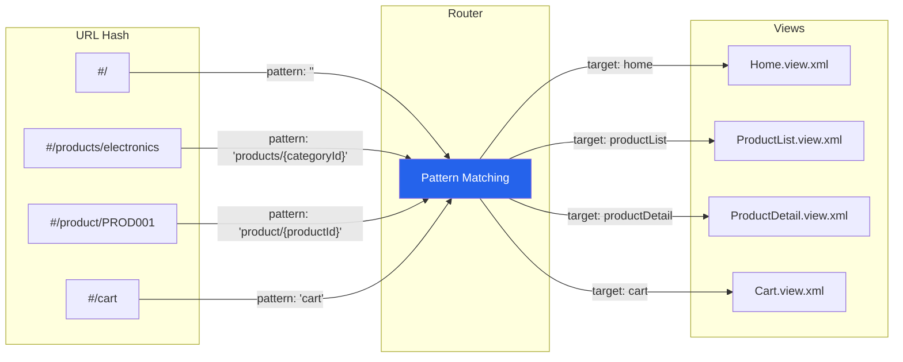

### How URL Hashes Work

UI5 uses **hash-based routing** — the part of the URL after `#`:

```
https://myapp.com/index.html#/products/electronics
                              └─────────┬──────────┘
                                   The "hash"
                              (never sent to server)
```

**Key points:**
- The hash (`#/...`) is handled entirely by JavaScript in the browser
- Changing the hash does **not** trigger a page reload
- The browser's back/forward buttons change the hash, which the router detects
- This is the same principle used by React Router (HashRouter), Vue Router, and Angular

---

## Router Configuration in manifest.json

The router is configured in the `sap.ui5.routing` section of `manifest.json`. It has three parts: **config**, **routes**, and **targets**.

### Full Routing Configuration (Our Project)

```mermaid
graph TD
    ROUTING["sap.ui5.routing"]

    subgraph "config (Defaults)"
        RCLASS["routerClass:<br/>sap.m.routing.Router"]
        VTYPE["viewType: XML"]
        VPATH["viewPath:<br/>com.shopeasy.app.view"]
        CID["controlId: app"]
        CAGG["controlAggregation: pages"]
        TRANS["transition: slide"]
        ASYNC["async: true"]
    end

    subgraph "routes (URL Patterns)"
        R1["home<br/>pattern: ''"]
        R2["productList<br/>pattern: 'products/{categoryId}'"]
        R3["productDetail<br/>pattern: 'product/{productId}'"]
        R4["cart<br/>pattern: 'cart'"]
        R5["checkout<br/>pattern: 'checkout'"]
    end

    subgraph "targets (View Mapping)"
        T1["home → Home.view.xml<br/>viewLevel: 1"]
        T2["productList → ProductList.view.xml<br/>viewLevel: 2"]
        T3["productDetail → ProductDetail.view.xml<br/>viewLevel: 3"]
        T4["cart → Cart.view.xml<br/>viewLevel: 2"]
        T5["checkout → Checkout.view.xml<br/>viewLevel: 3"]
    end

    ROUTING --> RCLASS
    ROUTING --> VTYPE
    ROUTING --> VPATH
    ROUTING --> CID
    ROUTING --> CAGG
    ROUTING --> TRANS
    ROUTING --> ASYNC

    R1 --> T1
    R2 --> T2
    R3 --> T3
    R4 --> T4
    R5 --> T5

    style ROUTING fill:#2563eb,color:#fff
```

### Config Section Explained

```json
"config": {
    "routerClass": "sap.m.routing.Router",
    "viewType": "XML",
    "viewPath": "com.shopeasy.app.view",
    "controlId": "app",
    "controlAggregation": "pages",
    "transition": "slide",
    "async": true
}
```

| Property | Value | Meaning |
|----------|-------|---------|
| `routerClass` | `sap.m.routing.Router` | Router that supports page transitions |
| `viewType` | `"XML"` | Default view type for all targets |
| `viewPath` | `"com.shopeasy.app.view"` | Base path — target `"Home"` resolves to `com.shopeasy.app.view.Home` |
| `controlId` | `"app"` | ID of the container control in the root view (typically `<App id="app">`) |
| `controlAggregation` | `"pages"` | The aggregation where target views are placed |
| `transition` | `"slide"` | Animation between pages (`slide`, `fade`, `flip`, `show`) |
| `async` | `true` | Load target views asynchronously |

### How controlId and controlAggregation Work

```xml
<!-- In App.view.xml (root view): -->
<App id="app">     <!-- ← controlId: "app" -->
    <pages>         <!-- ← controlAggregation: "pages" -->
        <!-- Router places target views HERE -->
    </pages>
</App>
```

---

## Routes: Pattern Syntax & Parameters

### Route Definition

Each route maps a **URL pattern** to one or more **targets**:

```json
"routes": [
    {
        "name": "home",
        "pattern": "",
        "target": ["home"]
    },
    {
        "name": "productList",
        "pattern": "products/{categoryId}",
        "target": ["productList"]
    },
    {
        "name": "productDetail",
        "pattern": "product/{productId}",
        "target": ["productDetail"]
    },
    {
        "name": "cart",
        "pattern": "cart",
        "target": ["cart"]
    }
]
```

### Pattern Syntax

| Pattern | Matches | Example URL | Parameters |
|---------|---------|-------------|-----------|
| `""` | Empty hash (root) | `#/` | None |
| `"cart"` | Static segment | `#/cart` | None |
| `"products/{categoryId}"` | Required parameter | `#/products/electronics` | `categoryId: "electronics"` |
| `"product/{productId}"` | Required parameter | `#/product/PROD001` | `productId: "PROD001"` |
| `"search/:query:"` | Optional parameter | `#/search` or `#/search/laptops` | `query: "laptops"` or `undefined` |
| `"orders/{orderId}/items/{itemId}"` | Multiple parameters | `#/orders/123/items/456` | `orderId: "123"`, `itemId: "456"` |
| `"products{?query}"` | Query string | `#/products?sort=price` | `query: { sort: "price" }` |

### Required vs Optional Parameters

```
Required: {paramName}    → Must be present in the URL
Optional: :paramName:    → Can be omitted

Pattern: "products/{category}/:page:"
  #/products/electronics       → category="electronics", page=undefined
  #/products/electronics/2     → category="electronics", page="2"
```

### Route Matching Order

Routes are matched **top to bottom**. The first matching route wins.

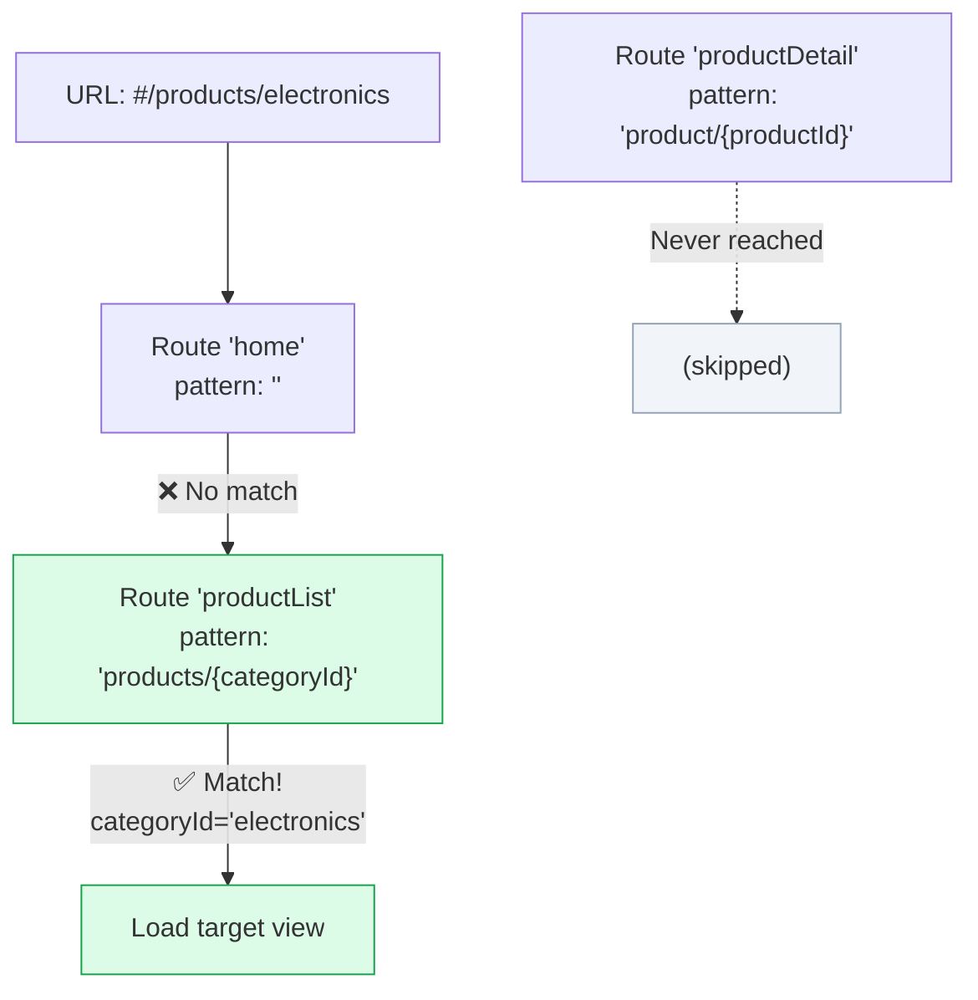

**Gotcha:** Put more specific patterns before general ones:
```json
// ✅ Correct order:
{ "pattern": "products/{categoryId}" },
{ "pattern": "products" }

// ❌ Wrong order — "products" always matches first:
{ "pattern": "products" },
{ "pattern": "products/{categoryId}" }  // Never reached!
```

---

## Targets: View Loading & viewLevel

Targets define **which view to load** and **where to place it** when a route matches.

### Target Definition

```json
"targets": {
    "home": {
        "viewId": "home",
        "viewName": "Home",
        "viewLevel": 1
    },
    "productList": {
        "viewId": "productList",
        "viewName": "ProductList",
        "viewLevel": 2
    },
    "productDetail": {
        "viewId": "productDetail",
        "viewName": "ProductDetail",
        "viewLevel": 3
    },
    "cart": {
        "viewId": "cart",
        "viewName": "Cart",
        "viewLevel": 2
    },
    "checkout": {
        "viewId": "checkout",
        "viewName": "Checkout",
        "viewLevel": 3
    }
}
```

### viewLevel and Navigation Animation

The `viewLevel` property determines the **direction** of the slide animation:

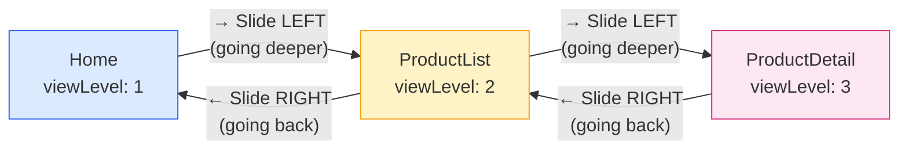

**Rules:**
- Navigating from **lower** viewLevel to **higher** → **slide left** (forward)
- Navigating from **higher** viewLevel to **lower** → **slide right** (backward)
- **Same** viewLevel → **fade** (lateral navigation, like Home ↔ Cart)

### Our Navigation Hierarchy

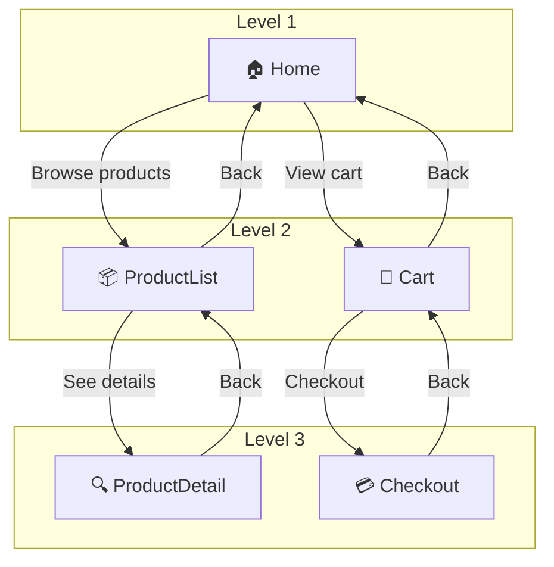

---

## Route Matching & patternMatched Event

When the URL changes (user navigates or types a URL), the router fires events that controllers can listen to.

### Attaching to Route Events

```javascript
// In a controller's onInit:
onInit: function () {
    // Listen for THIS specific route
    this.getOwnerComponent().getRouter()
        .getRoute("productList")
        .attachPatternMatched(this._onRouteMatched, this);
},

// The handler receives an event with route arguments
_onRouteMatched: function (oEvent) {
    var oArgs = oEvent.getParameter("arguments");
    var sCategoryId = oArgs.categoryId;
    // e.g., "electronics" from #/products/electronics

    // Now load data for this category
    this._filterProducts(sCategoryId);
}
```

### patternMatched vs matched

| Event | Fires When | Use For |
|-------|-----------|---------|
| `patternMatched` | This specific route matches | Most common — handle route parameters |
| `matched` | This route OR any child route matches | Parent routes in nested scenarios |

### Route Matching Flow

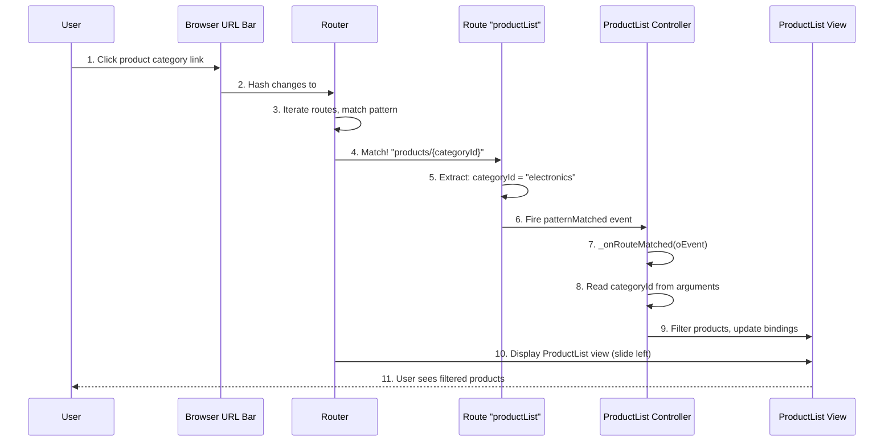

---

## Navigating Programmatically

### navTo() — The Primary Navigation Method

```javascript
// Navigate to a route with parameters
this.getOwnerComponent().getRouter().navTo("productDetail", {
    productId: "PROD001"
});
// → URL becomes: #/product/PROD001

// Navigate to a simple route (no parameters)
this.getOwnerComponent().getRouter().navTo("cart");
// → URL becomes: #/cart

// Navigate to home
this.getOwnerComponent().getRouter().navTo("home");
// → URL becomes: #/

// Navigate with optional parameter
this.getOwnerComponent().getRouter().navTo("productList", {
    categoryId: "electronics"
});
// → URL becomes: #/products/electronics

// Replace history (no back button entry)
this.getOwnerComponent().getRouter().navTo("home", {}, true);
// The `true` means replace current history entry
```

### Common Navigation Patterns

```javascript
// From a list item press event → navigate to detail
onProductPress: function (oEvent) {
    var oItem = oEvent.getSource();
    var oContext = oItem.getBindingContext();
    var sProductId = oContext.getProperty("ProductId");

    this.getOwnerComponent().getRouter().navTo("productDetail", {
        productId: sProductId
    });
},

// From a category tile → navigate to product list
onCategoryPress: function (oEvent) {
    var sCategoryId = oEvent.getSource()
        .getBindingContext()
        .getProperty("CategoryId");

    this.getOwnerComponent().getRouter().navTo("productList", {
        categoryId: sCategoryId
    });
},

// From "Add to Cart" confirmation → navigate to cart
onGoToCart: function () {
    this.getOwnerComponent().getRouter().navTo("cart");
}
```

---

## Back Navigation

### The onNavBack Pattern

UI5 doesn't have a built-in "back" button handler — you implement it in your controller:

```javascript
onNavBack: function () {
    var oHistory = sap.ui.core.routing.History.getInstance();
    var sPreviousHash = oHistory.getPreviousHash();

    if (sPreviousHash !== undefined) {
        // There's a previous page in browser history → go back
        window.history.go(-1);
    } else {
        // No history (user arrived via deep link) → go home
        this.getOwnerComponent().getRouter().navTo("home", {}, true);
        // true = replace history, so back button doesn't loop
    }
}
```

### Navigation Stack

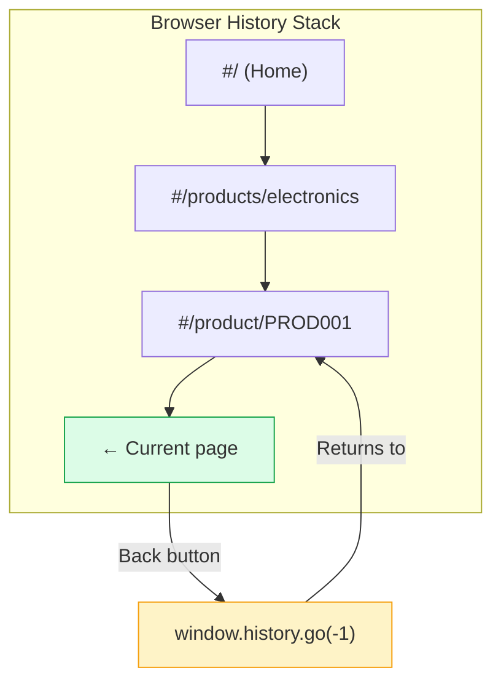

### Using onNavBack in Views

```xml
<!-- Page with a back button (NavButton) -->
<Page
    title="{i18n>productDetailsTitle}"
    showNavButton="true"
    navButtonPress=".onNavBack">

    <!-- Page content -->

</Page>
```

### BaseController Implementation

Put `onNavBack` in your BaseController so all controllers inherit it:

```javascript
// In BaseController.js
onNavBack: function () {
    var sPreviousHash = sap.ui.core.routing.History.getInstance().getPreviousHash();

    if (sPreviousHash !== undefined) {
        window.history.go(-1);
    } else {
        this.getRouter().navTo("home", {}, true);
    }
}
```

---

## Deep Linking

Deep linking means users can **bookmark a specific page** and return to it later by opening that URL directly.

### How It Works

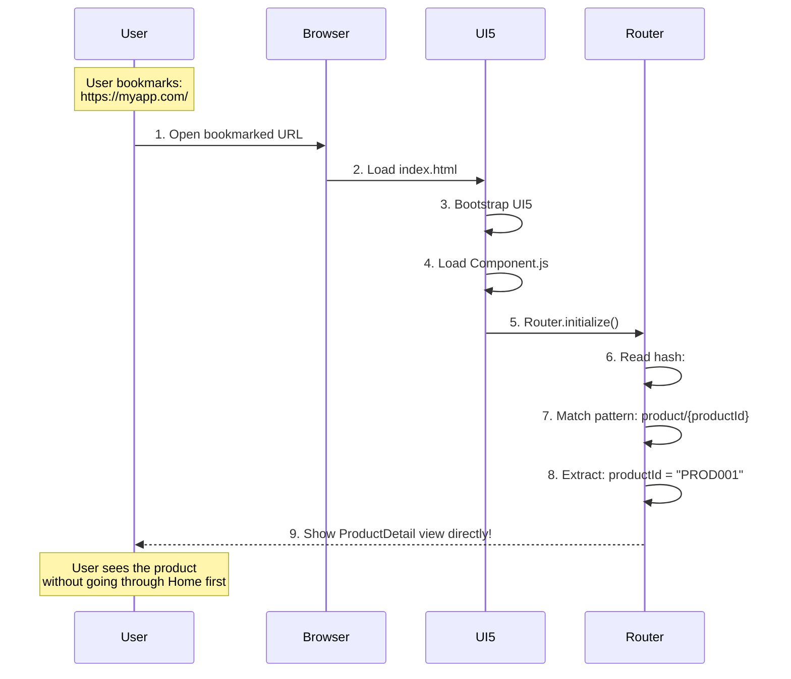

### Deep Linking Considerations

1. **All routes should be bookmarkable** — Every page the user can navigate to should have a meaningful URL
2. **Handle missing data gracefully** — If a user bookmarks a product that later gets deleted, show a "Not Found" page
3. **No history on first load** — When a user opens a deep link, `History.getPreviousHash()` is `undefined`. Your `onNavBack` should handle this (navigate to home)

```javascript
// Handle case where deep-linked entity doesn't exist
_onRouteMatched: function (oEvent) {
    var sProductId = oEvent.getParameter("arguments").productId;

    this.getView().bindElement({
        path: "/Products('" + sProductId + "')",
        events: {
            dataReceived: function (oData) {
                if (!oData.getParameter("data")) {
                    // Product not found → show error page
                    this.getRouter().getTargets().display("notFound");
                }
            }.bind(this)
        }
    });
}
```

---

## Nested Routes

Nested routes allow parent-child relationships between routes, useful for master-detail layouts.

### Example: Products → Product Detail

```json
"routes": [
    {
        "name": "productList",
        "pattern": "products/{categoryId}",
        "target": ["productList"],
        "subroutes": [
            {
                "name": "productInCategory",
                "pattern": "products/{categoryId}/{productId}",
                "target": ["productList", "productDetail"]
            }
        ]
    }
]
```

With `subroutes`, navigating to `#/products/electronics/PROD001` would:
1. Display the `productList` target (master list)
2. Display the `productDetail` target (detail pane)
3. Both are visible simultaneously (in a `SplitApp` or `FlexibleColumnLayout`)

### Nested Route URL Structure

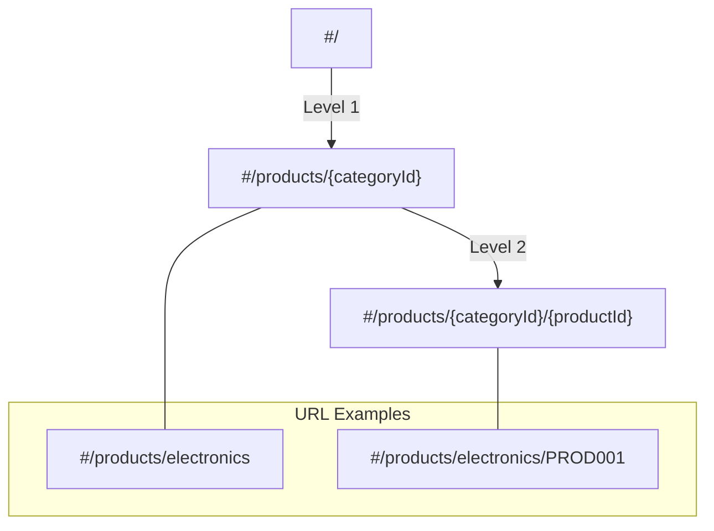

---

## Not Found / Error Handling Routes

### Catch-All Route (bypassed Event)

```javascript
// In Component.js or App.controller.js:
this.getRouter().attachBypassed(function (oEvent) {
    // No route matched the URL hash
    var sHash = oEvent.getParameter("hash");
    console.log("No route matched: " + sHash);
});
```

### Not Found Target

```json
// In manifest.json:
"routing": {
    "config": {
        "bypassed": {
            "target": ["notFound"]
        }
    },
    "targets": {
        "notFound": {
            "viewName": "NotFound",
            "viewId": "notFound",
            "viewLevel": 1
        }
    }
}
```

### Not Found View

```xml
<!-- webapp/view/NotFound.view.xml -->
<mvc:View
    controllerName="com.shopeasy.app.controller.NotFound"
    xmlns:mvc="sap.ui.core.mvc"
    xmlns="sap.m">

    <MessagePage
        title="Page Not Found"
        text="The page you're looking for doesn't exist."
        description="Please check the URL or go back to the home page."
        icon="sap-icon://document"
        showNavButton="true"
        navButtonPress=".onNavBack">
        <customDescription>
            <Link text="Go to Home Page" press=".onGoHome" />
        </customDescription>
    </MessagePage>

</mvc:View>
```

---

## Comparison with React Router

If you know React Router, here's how UI5 routing maps:

| Feature | React Router | UI5 Router |
|---------|-------------|------------|
| Configuration | `<Route path="/products/:id">` | manifest.json routes array |
| URL access | `useParams()` | `oEvent.getParameter("arguments")` |
| Navigation | `useNavigate()` / `<Link>` | `router.navTo()` |
| Route matching | Component-based (`<Routes>`) | Config-based (pattern matching) |
| Hash vs History | `BrowserRouter` / `HashRouter` | Hash-based by default |
| 404 handling | `<Route path="*">` | `bypassed` config |
| Nested routes | `<Route>` nesting + `<Outlet>` | `subroutes` in config |
| Back navigation | `navigate(-1)` | `window.history.go(-1)` |
| Route guards | Custom auth wrapper | `routeMatched` event handler |
| Lazy loading | `React.lazy()` | Built-in (`async: true`) |

### Side-by-Side Example

**React Router:**
```jsx
// Configuration:
<Route path="/product/:productId" element={<ProductDetail />} />

// Reading params:
const { productId } = useParams();

// Navigating:
const navigate = useNavigate();
navigate(`/product/${id}`);

// Back:
navigate(-1);
```

**UI5 Router:**
```json
// Configuration (manifest.json):
{
    "name": "productDetail",
    "pattern": "product/{productId}",
    "target": ["productDetail"]
}
```

```javascript
// Reading params:
_onRouteMatched: function (oEvent) {
    var sProductId = oEvent.getParameter("arguments").productId;
}

// Navigating:
this.getRouter().navTo("productDetail", { productId: sId });

// Back:
window.history.go(-1);
```

### URL-to-View Mapping

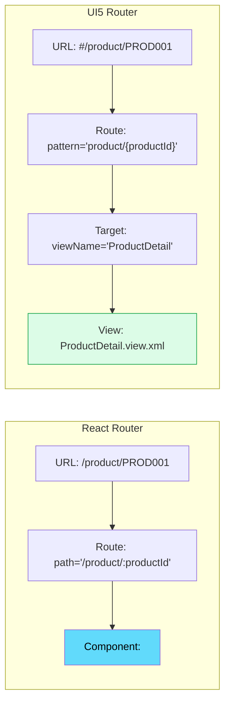

---

## Routing Flow Summary

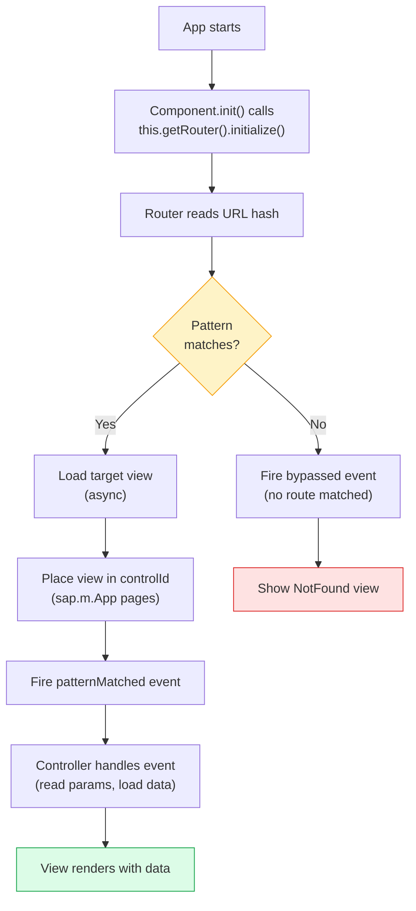

---

## Summary

1. **Routing** maps URL hashes to views — like React Router but configuration-based
2. **Config** sets defaults: router class, view type, container control, animation style
3. **Routes** define URL patterns with `{required}` and `:optional:` parameters
4. **Targets** specify which view to load and its `viewLevel` (determines animation direction)
5. **patternMatched** event delivers route parameters to controllers
6. **navTo()** navigates programmatically — pass route name and parameter object
7. **onNavBack** pattern uses `History.getPreviousHash()` with fallback to home
8. **Deep linking** works automatically — the router matches the hash on page load
9. **bypassed** config handles unmatched URLs (404 pages)
10. **Route order matters** — more specific patterns should come before general ones

**Next**: Continue to [Module 06: Controls Deep Dive](./06-controls.md) for an in-depth look at the UI5 control library.
