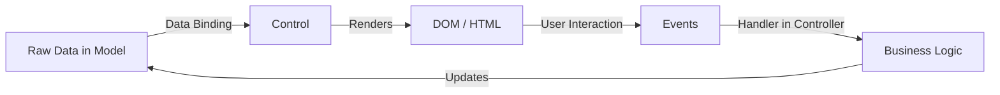
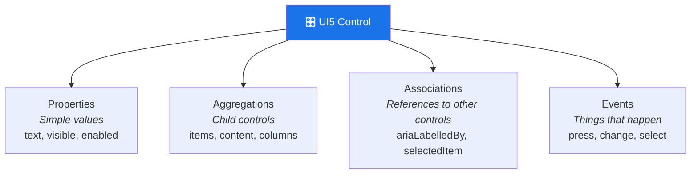
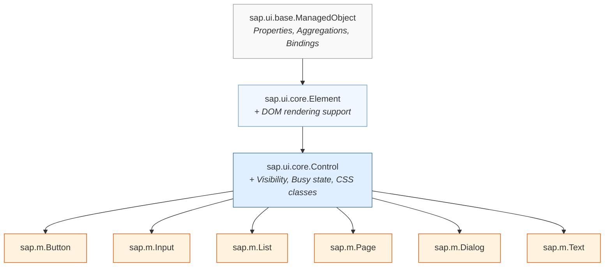
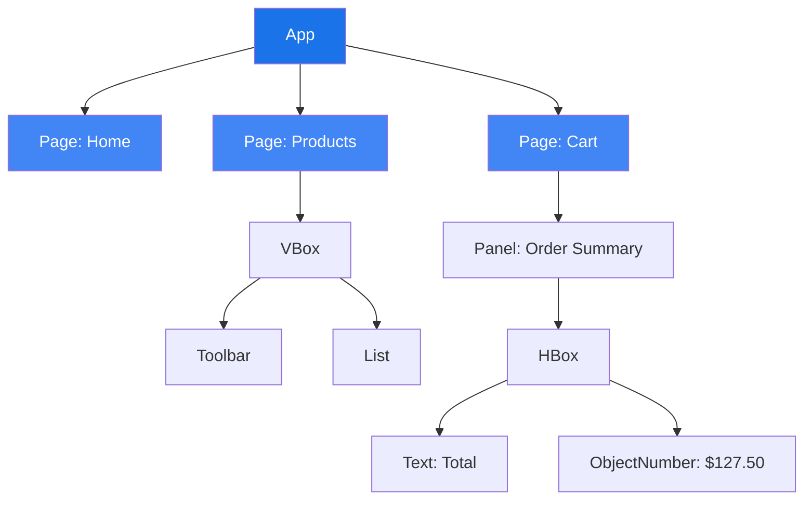
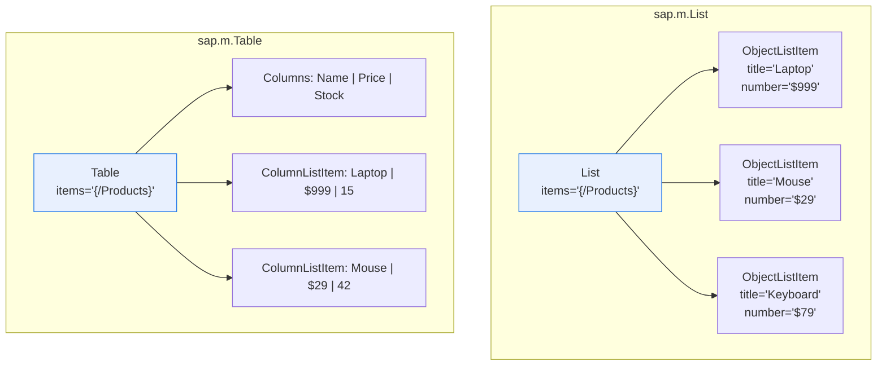
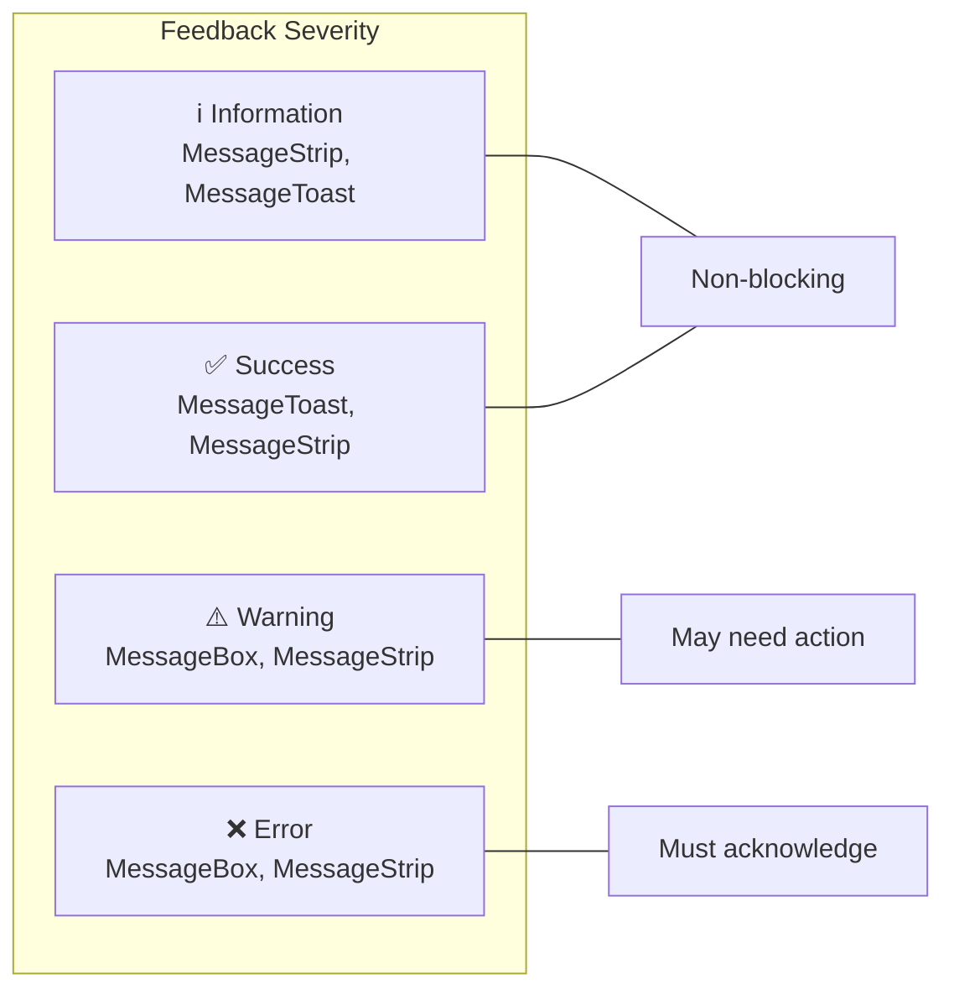
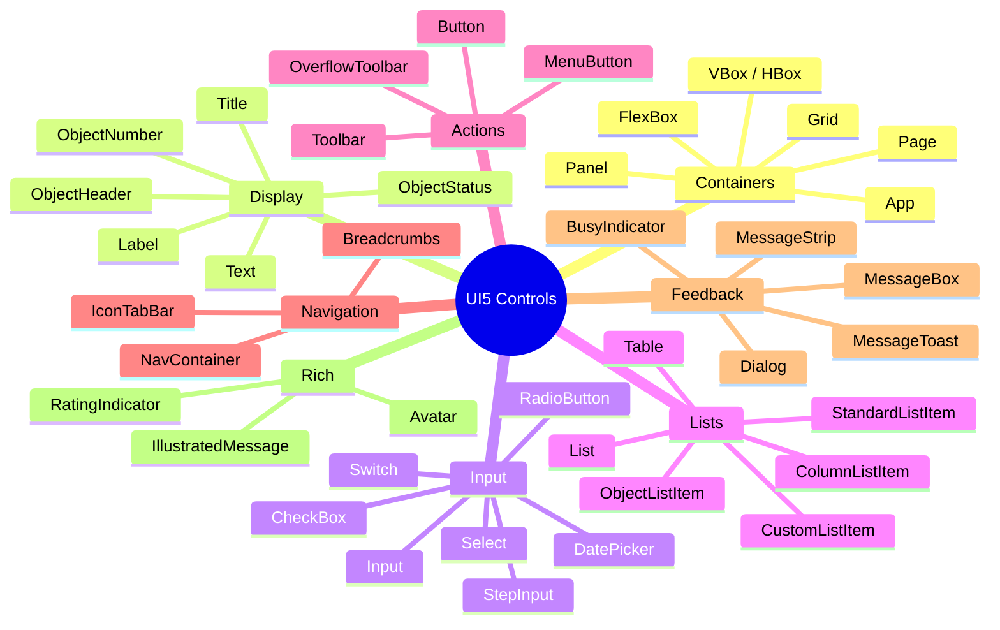

# Module 06: Controls Deep Dive

> **Goal**: Understand UI5 controls — the building blocks of every SAP Fiori user interface.
> Every button, list, table, and popup you see on screen is a **control**.

---

## Table of Contents

- [What Is a UI5 Control?](#what-is-a-ui5-control)
- [Control Anatomy](#control-anatomy)
- [Control Inheritance Hierarchy](#control-inheritance-hierarchy)
- [Control Categories](#control-categories)
  - [Container Controls](#container-controls)
  - [Display Controls](#display-controls)
  - [Input Controls](#input-controls)
  - [List Controls](#list-controls)
  - [Action Controls](#action-controls)
  - [Navigation Controls](#navigation-controls)
  - [Feedback Controls](#feedback-controls)
  - [Rich Controls](#rich-controls)
- [Margin & Padding CSS Classes](#margin--padding-css-classes)
- [SAP Icon Font](#sap-icon-font)
- [Control API Patterns](#control-api-patterns)
- [In Our ShopEasy App](#in-our-shopeasy-app)

---

## What Is a UI5 Control?

A **control** is a reusable UI element that knows how to render itself, manage its own data, and respond to user interaction. If you know React, a control is similar to a component — but with a stricter, more formalized API.

Every visible thing on a UI5 screen is a control: a `Button`, a `Text`, a `List`, a `Page`, even the top-level `App` container.



### Key Characteristics

| Trait | Description |
|-------|-------------|
| **Self-rendering** | Each control generates its own HTML (you never write `<div>` or `<span>` yourself) |
| **Encapsulated** | Internal DOM structure is hidden — you interact through the API, not the DOM |
| **Themeable** | Controls respect the active SAP theme (Quartz, Horizon, etc.) automatically |
| **Accessible** | Built-in ARIA roles, keyboard navigation, and screen reader support |
| **Responsive** | `sap.m` controls adapt to different screen sizes out of the box |

---

## Control Anatomy

Every UI5 control has four types of interface members:



### 1. Properties — Simple Values

Properties hold primitive values like strings, numbers, and booleans.

```xml
<Button
    text="Add to Cart"
    enabled="true"
    type="Emphasized"
    icon="sap-icon://cart"
    visible="{= ${cart>/itemCount} > 0 }" />
```

- `text` — a `string` property
- `enabled` — a `boolean` property
- `type` — an `enum` property (ButtonType)

### 2. Aggregations — Child Controls

Aggregations define parent-child relationships. A `Page` aggregates `content`; a `List` aggregates `items`.

```xml
<Page title="Products">
    <!-- "content" is an aggregation of Page -->
    <content>
        <List items="{/Products}">
            <!-- "items" is an aggregation of List -->
            <items>
                <StandardListItem title="{Name}" />
            </items>
        </List>
    </content>
</Page>
```

There are two kinds:
- **0..n aggregations** — zero or more children (e.g., `content`, `items`)
- **0..1 aggregations** — at most one child (e.g., `beginButton` on Dialog)

### 3. Associations — References to Other Controls

Associations are loose references (by ID) to other controls. They don't imply ownership.

```xml
<Label text="Quantity" labelFor="quantityInput" />
<Input id="quantityInput" />
```

The `labelFor` association links the Label to the Input for accessibility (screen readers announce "Quantity" when the input is focused).

### 4. Events — Things That Happen

Events let you react to user actions.

```xml
<Button text="Buy Now" press=".onBuyNow" />
<Input value="{/name}" change=".onNameChange" />
<List items="{/Products}" selectionChange=".onSelectionChange" />
```

The dot prefix (`.onBuyNow`) means "call the method `onBuyNow` on the controller instance."

---

## Control Inheritance Hierarchy

All UI5 controls inherit from a common base class chain. Understanding this helps you know which methods are available on every control.



| Class | What It Adds |
|-------|-------------|
| **ManagedObject** | Properties, aggregations, associations, data binding, lifecycle (init, exit) |
| **Element** | An ID in the DOM, custom data, layout data, dependent controls |
| **Control** | `visible`, `busy`, `busyIndicatorDelay`, tooltip, CSS custom classes, rendering |

Every `sap.m.*` control (Button, List, Page, etc.) ultimately inherits from `Control`, which means **every control** has `setVisible()`, `setBusy()`, `addStyleClass()`, etc.

---

## Control Categories

### Container Controls

Container controls **hold other controls** and define layout structure.

| Control | Purpose | Key Aggregation |
|---------|---------|-----------------|
| `sap.m.App` | Root container for the entire application, manages page navigation | `pages` |
| `sap.m.Page` | A full-screen page with header bar, content area, and footer | `content` |
| `sap.m.Panel` | A collapsible container with a header | `content` |
| `sap.m.VBox` | Vertical stack layout (children top-to-bottom) | `items` |
| `sap.m.HBox` | Horizontal stack layout (children left-to-right) | `items` |
| `sap.m.FlexBox` | CSS Flexbox wrapper — full control over direction, alignment, wrapping | `items` |
| `sap.ui.layout.Grid` | 12-column responsive grid (like Bootstrap grid) | `content` |

```xml
<!-- Vertical layout with a horizontal row inside -->
<VBox class="sapUiSmallMargin">
    <Title text="Product Info" />
    <HBox alignItems="Center" justifyContent="SpaceBetween">
        <Text text="{Name}" />
        <ObjectNumber number="{Price}" unit="USD" />
    </HBox>
</VBox>
```



### Display Controls

Display controls **show data** to the user (read-only).

| Control | Purpose | Example |
|---------|---------|---------|
| `sap.m.Text` | Basic text display | `<Text text="{Description}" />` |
| `sap.m.Label` | Label for form fields (includes `labelFor` for accessibility) | `<Label text="Name" labelFor="nameInput" />` |
| `sap.m.Title` | Section header with semantic level (H1–H6) | `<Title text="Products" level="H2" />` |
| `sap.m.ObjectHeader` | Rich display: title, number, attributes, statuses | Product detail header |
| `sap.m.ObjectStatus` | Semantic status text with color (Success, Warning, Error) | "In Stock" (green) |
| `sap.m.ObjectNumber` | Formatted number with unit | "$42.50 USD" |

```xml
<!-- ObjectHeader in our ProductDetail view -->
<ObjectHeader
    title="{Name}"
    number="{path: 'Price', formatter: '.formatter.formatPrice'}"
    numberUnit="USD">
    <statuses>
        <ObjectStatus
            text="{path: 'Stock', formatter: '.formatter.formatAvailability'}"
            state="{path: 'Stock', formatter: '.formatter.formatAvailabilityState'}" />
    </statuses>
</ObjectHeader>
```

### Input Controls

Input controls let users **enter or select data**.

| Control | Purpose | Key Properties |
|---------|---------|---------------|
| `sap.m.Input` | Single-line text input | `value`, `placeholder`, `type` (Text, Email, Number, Password, Tel, Url) |
| `sap.m.TextArea` | Multi-line text input | `value`, `rows`, `maxLength` |
| `sap.m.Select` | Dropdown list (single selection) | `selectedKey`, `items` |
| `sap.m.ComboBox` | Dropdown with type-ahead filtering | `value`, `selectedKey`, `items` |
| `sap.m.DatePicker` | Date selection with calendar popup | `value`, `displayFormat`, `valueFormat` |
| `sap.m.CheckBox` | Boolean toggle with label | `selected`, `text` |
| `sap.m.RadioButton` | One-of-many selection | `selected`, `text`, `groupName` |
| `sap.m.StepInput` | Numeric input with +/- buttons | `value`, `min`, `max`, `step` |
| `sap.m.Switch` | On/off toggle switch | `state`, `type` |

```xml
<!-- Checkout form example -->
<Label text="{i18n>firstName}" labelFor="firstNameInput" />
<Input id="firstNameInput"
    value="{checkout>/firstName}"
    placeholder="Enter your first name" />

<Label text="{i18n>quantity}" labelFor="qtyInput" />
<StepInput id="qtyInput"
    value="{addToCart>/quantity}"
    min="1" max="99" step="1" />

<DatePicker
    value="{/deliveryDate}"
    displayFormat="MMM d, yyyy"
    valueFormat="yyyy-MM-dd" />
```

### List Controls

List controls display **collections of data** — the most-used controls in enterprise apps.

| Control | Purpose | Typical Binding |
|---------|---------|----------------|
| `sap.m.List` | Vertical list of items | `items="{/Products}"` |
| `sap.m.Table` | Tabular data with columns | `items="{/Products}"` + `<columns>` |
| `sap.m.StandardListItem` | Simple list item: title, description, icon | Title + Description |
| `sap.m.ObjectListItem` | Rich list item: title, number, attributes, statuses | Product card in a list |
| `sap.m.CustomListItem` | Fully custom layout inside a list item | Any content |
| `sap.m.ColumnListItem` | Row in a Table (one cell per column) | Cells matching columns |



```xml
<!-- ObjectListItem in our ProductList view -->
<List id="productList" items="{/Products}">
    <items>
        <ObjectListItem
            title="{Name}"
            number="{path: 'Price', formatter: '.formatter.formatPrice'}"
            numberUnit="{Currency}"
            type="Navigation"
            press=".onProductPress">
            <firstStatus>
                <ObjectStatus
                    text="{path: 'Stock', formatter: '.formatter.formatAvailability'}"
                    state="{path: 'Stock', formatter: '.formatter.formatAvailabilityState'}" />
            </firstStatus>
        </ObjectListItem>
    </items>
</List>
```

**Table with ColumnListItem**:

```xml
<Table items="{/Products}">
    <columns>
        <Column><Text text="Name" /></Column>
        <Column><Text text="Price" /></Column>
        <Column><Text text="Stock" /></Column>
    </columns>
    <items>
        <ColumnListItem>
            <cells>
                <Text text="{Name}" />
                <ObjectNumber number="{Price}" unit="{Currency}" />
                <ObjectStatus
                    text="{path: 'Stock', formatter: '.formatter.formatAvailability'}"
                    state="{path: 'Stock', formatter: '.formatter.formatAvailabilityState'}" />
            </cells>
        </ColumnListItem>
    </items>
</Table>
```

### Action Controls

Action controls let users **trigger operations**.

| Control | Purpose | Key Properties |
|---------|---------|---------------|
| `sap.m.Button` | Clickable button | `text`, `icon`, `type`, `press` |
| `sap.m.Toolbar` | Horizontal bar holding action controls | `content` |
| `sap.m.OverflowToolbar` | Toolbar that collapses items into a "..." menu on small screens | `content` |
| `sap.m.ToolbarSpacer` | Pushes items to the right side of a toolbar | — |
| `sap.m.MenuButton` | Button that opens a dropdown menu | `text`, `menu` |

```xml
<OverflowToolbar>
    <Title text="{i18n>productsTitle}" />
    <ToolbarSpacer />
    <SearchField width="300px" search=".onSearch" />
    <Button icon="sap-icon://sort" press=".onSort" />
    <Button icon="sap-icon://filter" press=".onFilter" />
</OverflowToolbar>
```

**Button types** follow SAP Fiori design guidelines:

| Type | Appearance | When to Use |
|------|-----------|-------------|
| `Default` | Transparent with border | Secondary actions |
| `Emphasized` | Bold/blue filled | Primary action (max 1 per view) |
| `Accept` | Green | Positive actions (Approve, Confirm) |
| `Reject` | Red | Negative actions (Reject, Delete) |
| `Transparent` | No border or background | Toolbar icon buttons, Cancel |
| `Ghost` | Transparent with border on hover | Low-priority actions |

### Navigation Controls

Navigation controls help users **move between sections** within a page.

| Control | Purpose | Example |
|---------|---------|---------|
| `sap.m.IconTabBar` | Horizontal tabs with icons and counts | Sections within a product detail |
| `sap.m.NavContainer` | Container that manages page-level navigation with transitions | Internal page switching |
| `sap.m.Breadcrumbs` | Trail of links showing the user's location | Home > Electronics > Laptop |

```xml
<IconTabBar>
    <items>
        <IconTabFilter text="Description" icon="sap-icon://hint" key="desc">
            <content>
                <Text text="{Description}" />
            </content>
        </IconTabFilter>
        <IconTabFilter text="Reviews" icon="sap-icon://comment" count="{ReviewCount}" key="reviews">
            <content>
                <List items="{/Reviews}">...</List>
            </content>
        </IconTabFilter>
    </items>
</IconTabBar>
```

### Feedback Controls

Feedback controls **communicate status** to the user.

| Control | Purpose | Modality |
|---------|---------|----------|
| `sap.m.MessageToast` | Brief auto-dismissing text notification | Non-blocking toast |
| `sap.m.MessageBox` | Modal dialog for confirmations and alerts | Blocking dialog |
| `sap.m.MessageStrip` | Inline colored bar with status message | Inline banner |
| `sap.m.BusyIndicator` | Spinner overlay while loading | Loading state |
| `sap.m.Dialog` | Custom modal dialog | Blocking dialog |

```javascript
// MessageToast — auto-dismisses after ~3 seconds
sap.m.MessageToast.show("Item added to cart!");

// MessageBox — requires user action
sap.m.MessageBox.confirm("Remove this item from cart?", {
    title: "Confirm Removal",
    onClose: function (oAction) {
        if (oAction === sap.m.MessageBox.Action.OK) {
            // proceed with removal
        }
    }
});
```

```xml
<!-- MessageStrip — inline in a view -->
<MessageStrip
    text="Free shipping on orders over $50!"
    type="Information"
    showIcon="true"
    class="sapUiSmallMarginBottom" />
```



### Rich Controls

Rich controls provide **specialized, higher-level UI elements**.

| Control | Purpose | Example |
|---------|---------|---------|
| `sap.f.Avatar` | User/entity photo or initials | User profile circle |
| `sap.m.RatingIndicator` | Star rating display/input | ★★★★☆ |
| `sap.m.IllustratedMessage` | Large illustration + text for empty/error states | "No products found" |

```xml
<RatingIndicator
    value="{path: 'Rating', formatter: '.formatter.formatRating'}"
    maxValue="5"
    editable="false"
    class="sapUiSmallMarginBottom" />

<IllustratedMessage
    illustrationType="sapIllus-NoData"
    title="{i18n>noProducts}"
    description="Try adjusting your filters" />
```

---

## Margin & Padding CSS Classes

UI5 provides a set of predefined CSS classes for consistent spacing. **Always use these instead of writing custom CSS margins.**

### Margin Classes

| Class | Size | All Sides | Top | Bottom | Begin (Left) | End (Right) | Top+Bottom | Begin+End |
|-------|------|-----------|-----|--------|-------------|-----------|------------|-----------|
| Tiny | 0.5rem | `sapUiTinyMargin` | `sapUiTinyMarginTop` | `sapUiTinyMarginBottom` | `sapUiTinyMarginBegin` | `sapUiTinyMarginEnd` | `sapUiTinyMarginTopBottom` | `sapUiTinyMarginBeginEnd` |
| Small | 1rem | `sapUiSmallMargin` | `sapUiSmallMarginTop` | `sapUiSmallMarginBottom` | `sapUiSmallMarginBegin` | `sapUiSmallMarginEnd` | `sapUiSmallMarginTopBottom` | `sapUiSmallMarginBeginEnd` |
| Medium | 2rem | `sapUiMediumMargin` | `sapUiMediumMarginTop` | `sapUiMediumMarginBottom` | `sapUiMediumMarginBegin` | `sapUiMediumMarginEnd` | `sapUiMediumMarginTopBottom` | `sapUiMediumMarginBeginEnd` |
| Large | 3rem | `sapUiLargeMargin` | `sapUiLargeMarginTop` | `sapUiLargeMarginBottom` | `sapUiLargeMarginBegin` | `sapUiLargeMarginEnd` | `sapUiLargeMarginTopBottom` | `sapUiLargeMarginBeginEnd` |

### No-Margin Class

Remove margins entirely: `sapUiNoMargin`, `sapUiNoMarginTop`, `sapUiNoMarginBottom`, etc.

### Usage Example

```xml
<VBox class="sapUiSmallMargin">
    <Title text="Order Summary" class="sapUiSmallMarginBottom" />
    <Text text="{Description}" class="sapUiTinyMarginBottom" />
    <Button text="Place Order" class="sapUiMediumMarginTop" />
</VBox>
```

> **Why "Begin" and "End" instead of "Left" and "Right"?**
> UI5 supports right-to-left (RTL) languages like Arabic and Hebrew. "Begin" means the start of the reading direction (left in English, right in Arabic). Using Begin/End ensures correct spacing in all languages.

---

## SAP Icon Font

UI5 includes the **SAP icon font** — a large set of vector icons built into the framework. No image files needed.

### Syntax

```
sap-icon://icon-name
```

### Common Icons

| Icon | Code | Typical Use |
|------|------|-------------|
| 🏠 | `sap-icon://home` | Home navigation |
| 🛒 | `sap-icon://cart` | Shopping cart |
| ➕ | `sap-icon://add` | Add / Create |
| ✏️ | `sap-icon://edit` | Edit |
| 🗑️ | `sap-icon://delete` | Delete |
| 🔍 | `sap-icon://search` | Search |
| ⚙️ | `sap-icon://action-settings` | Settings |
| ✅ | `sap-icon://accept` | Confirm / Approve |
| ❌ | `sap-icon://decline` | Cancel / Reject |
| ⬇️ | `sap-icon://download` | Download |
| 📊 | `sap-icon://bar-chart` | Analytics |
| 📋 | `sap-icon://list` | List view |
| 🔔 | `sap-icon://bell` | Notifications |
| 👤 | `sap-icon://person-placeholder` | User |

### Usage in Controls

```xml
<!-- Button with icon -->
<Button icon="sap-icon://cart" text="View Cart" press=".onCartPress" />

<!-- Icon-only button (toolbar) -->
<Button icon="sap-icon://filter" tooltip="Filter" press=".onFilter" />

<!-- In a StandardListItem -->
<StandardListItem title="{Name}" icon="sap-icon://product" />

<!-- Standalone icon -->
<core:Icon src="sap-icon://accept" color="#2b7c2b" size="2rem" />
```

### Finding Icons

Browse all available icons in the **Icon Explorer**:
- [SAP Icon Explorer](https://sapui5.hana.ondemand.com/test-resources/sap/m/demokit/iconExplorer/webapp/index.html)

---

## Control API Patterns

Every UI5 control follows the same API conventions. Once you learn the pattern, you can use any control.

### Getters and Setters

For every property `xyz`, UI5 auto-generates:

| Method | Purpose | Example |
|--------|---------|---------|
| `getXyz()` | Read the property | `oButton.getText()` → `"Add to Cart"` |
| `setXyz(value)` | Set the property | `oButton.setText("Remove")` |

```javascript
var oInput = this.byId("nameInput");

// Read the current value
var sName = oInput.getValue();

// Set a new value
oInput.setValue("John Doe");

// Check boolean properties
var bEnabled = oButton.getEnabled();
oButton.setEnabled(false);
```

### Aggregation Methods

For every 0..n aggregation `items`, UI5 auto-generates:

| Method | Purpose |
|--------|---------|
| `getItems()` | Get all children as an array |
| `addItem(oChild)` | Add a child at the end |
| `insertItem(oChild, iIndex)` | Insert a child at a specific position |
| `removeItem(oChild)` | Remove a specific child |
| `removeAllItems()` | Remove all children |
| `destroyItems()` | Remove and destroy all children |
| `indexOfItem(oChild)` | Get the index of a child |

```javascript
var oList = this.byId("productList");

// Get all list items
var aItems = oList.getItems();

// Get number of items
var iCount = aItems.length;

// Remove a specific item
oList.removeItem(aItems[0]);
```

### Event Methods

For every event `press`, UI5 auto-generates:

| Method | Purpose |
|--------|---------|
| `attachPress(fnHandler, oContext)` | Register an event handler |
| `detachPress(fnHandler, oContext)` | Unregister an event handler |
| `firePress(oParameters)` | Programmatically fire the event |

```javascript
// Attach an event handler in code
oButton.attachPress(function (oEvent) {
    sap.m.MessageToast.show("Button pressed!");
});

// Detach later if needed
oButton.detachPress(fnMyHandler);
```

> **Best Practice**: Prefer declaring event handlers in XML views (`press=".onButtonPress"`) over attaching them programmatically in JavaScript. XML declarations are more readable and easier to find.

### Common Methods on All Controls

Since all controls inherit from `sap.ui.core.Control`:

```javascript
var oControl = this.byId("myControl");

// Visibility
oControl.setVisible(false);    // Hide (removed from DOM flow)
oControl.getVisible();

// Busy state (shows loading spinner overlay)
oControl.setBusy(true);        // Show spinner
oControl.setBusyIndicatorDelay(0); // Show immediately (default is 1000ms)

// CSS classes
oControl.addStyleClass("myCustomClass");
oControl.removeStyleClass("myCustomClass");
oControl.hasStyleClass("myCustomClass");
oControl.toggleStyleClass("myCustomClass");

// Tooltip
oControl.setTooltip("More info about this control");

// DOM reference (use sparingly!)
var oDomRef = oControl.getDomRef();
```

---

## In Our ShopEasy App

Here's where the major control categories appear in our project:

| View | Key Controls Used |
|------|-------------------|
| `App.view.xml` | `App` (container) |
| `Home.view.xml` | `Page`, `VBox`, `List`, `StandardListItem`, `Title`, `Text` |
| `ProductList.view.xml` | `Page`, `OverflowToolbar`, `SearchField`, `Select`, `List`, `ObjectListItem`, `ObjectStatus` |
| `ProductDetail.view.xml` | `Page`, `ObjectHeader`, `IconTabBar`, `VBox`, `RatingIndicator`, `Button` |
| `Cart.view.xml` | `Page`, `List`, `ObjectListItem`, `Panel`, `ObjectNumber`, `Button` |
| `Checkout.view.xml` | `Page`, `Panel`, `VBox`, `Label`, `Input`, `Select`, `Button` |
| `AddToCartDialog.fragment.xml` | `Dialog`, `VBox`, `ObjectHeader`, `StepInput`, `Label`, `HBox`, `ObjectNumber`, `Button` |

---

## Summary



### Key Takeaways

1. **Controls are the building blocks** — every visible element is a control
2. **Four interface members**: properties, aggregations, associations, events
3. **Consistent API patterns**: `getXyz()`, `setXyz()`, `attachEvent()`, `addItem()`, etc.
4. **Use `sap.m` controls** — they're mobile-ready, accessible, and themed
5. **Use built-in CSS margin classes** — never write custom margin CSS
6. **Use `sap-icon://`** — vector icons with no image files needed
7. **Check the API Reference** at [sapui5.hana.ondemand.com/#/api](https://sapui5.hana.ondemand.com/#/api) when in doubt

---

**Next**: [Module 07 — Fragments & Dialogs →](07-fragments-and-dialogs.md)
