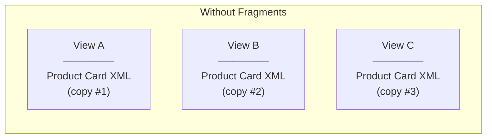
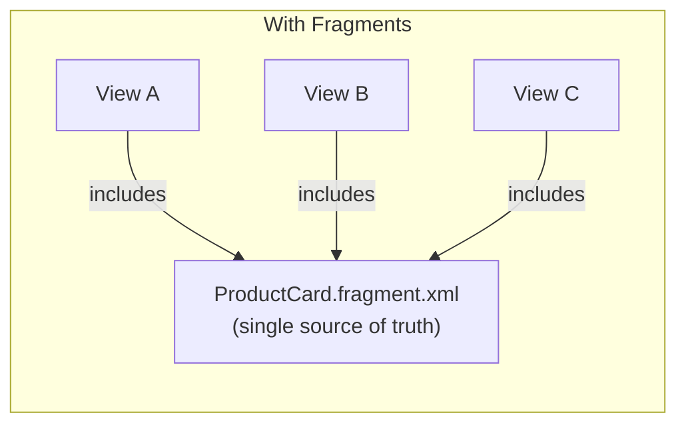
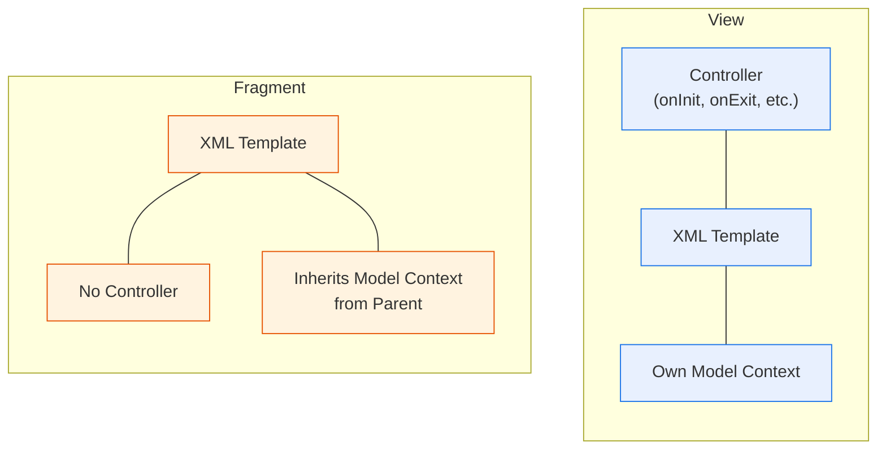
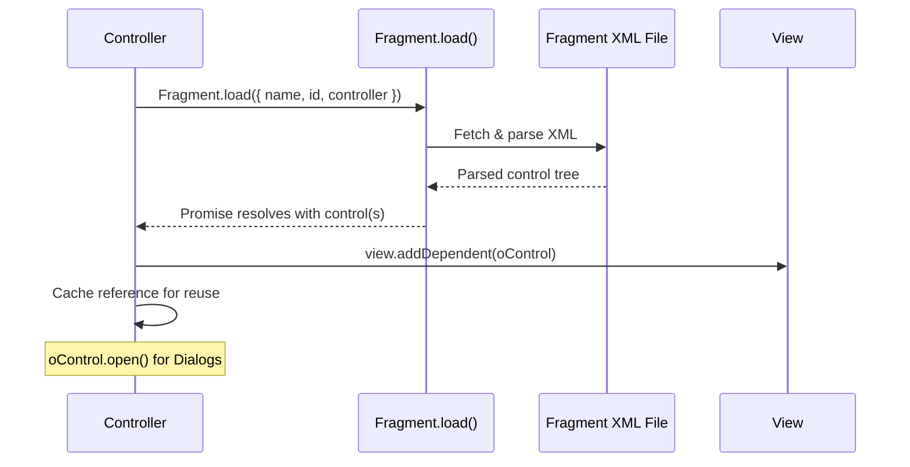
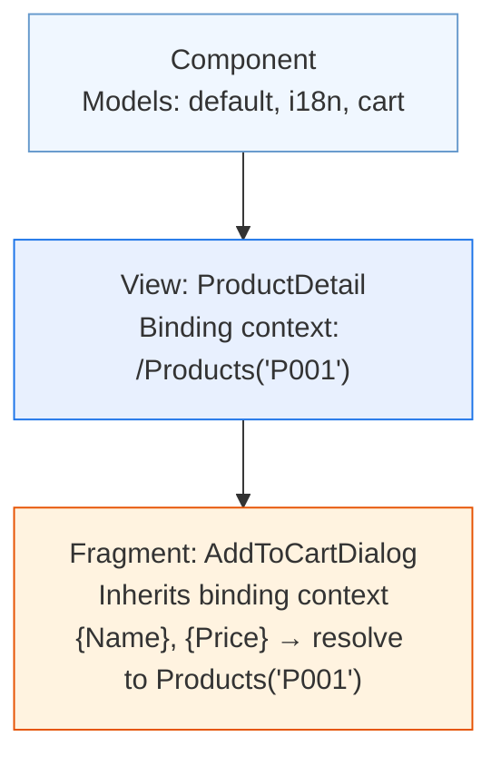
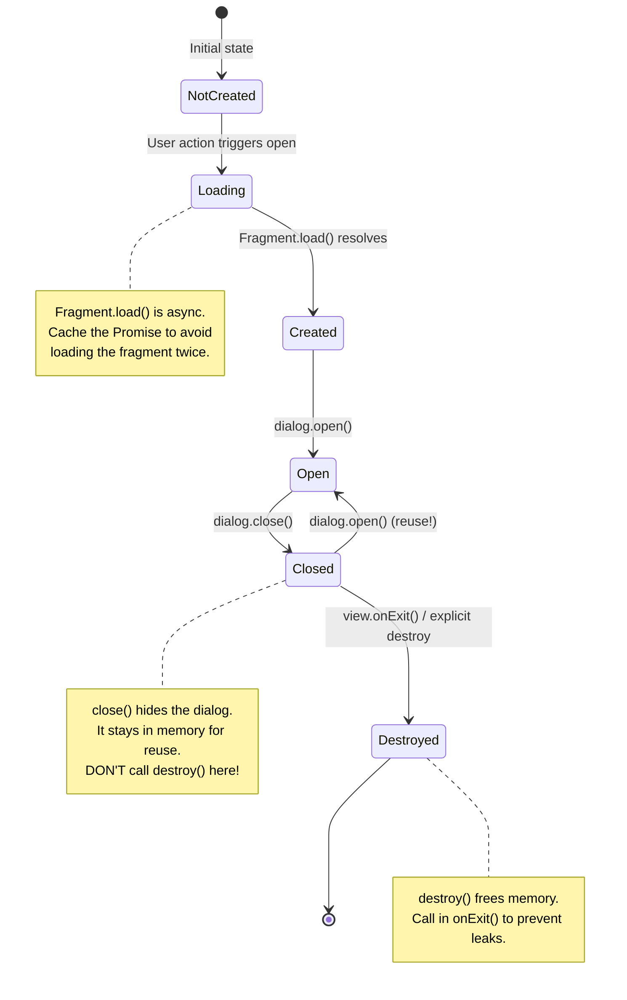
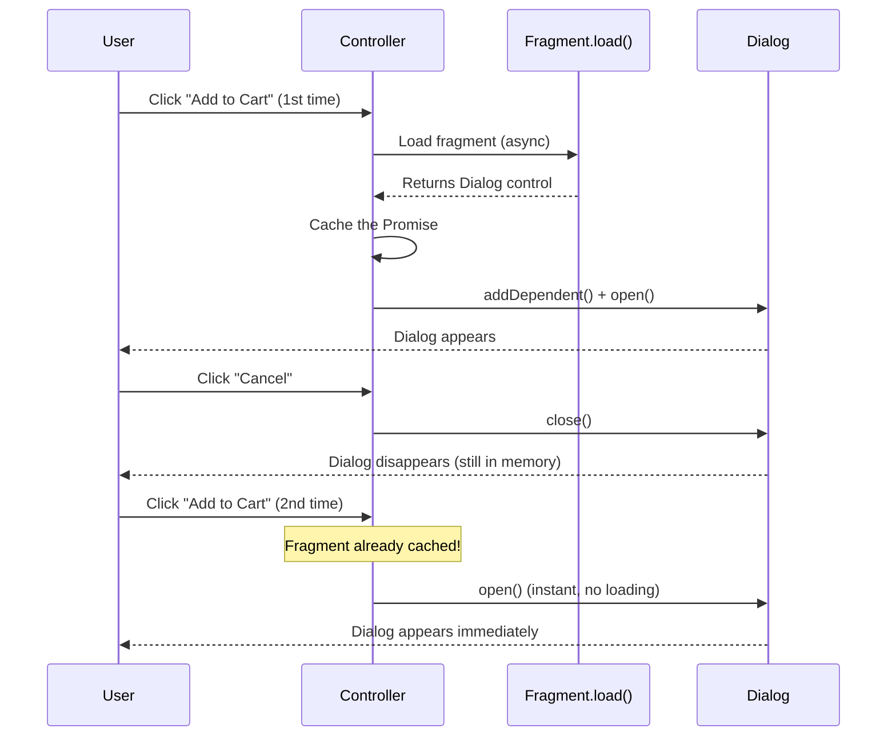
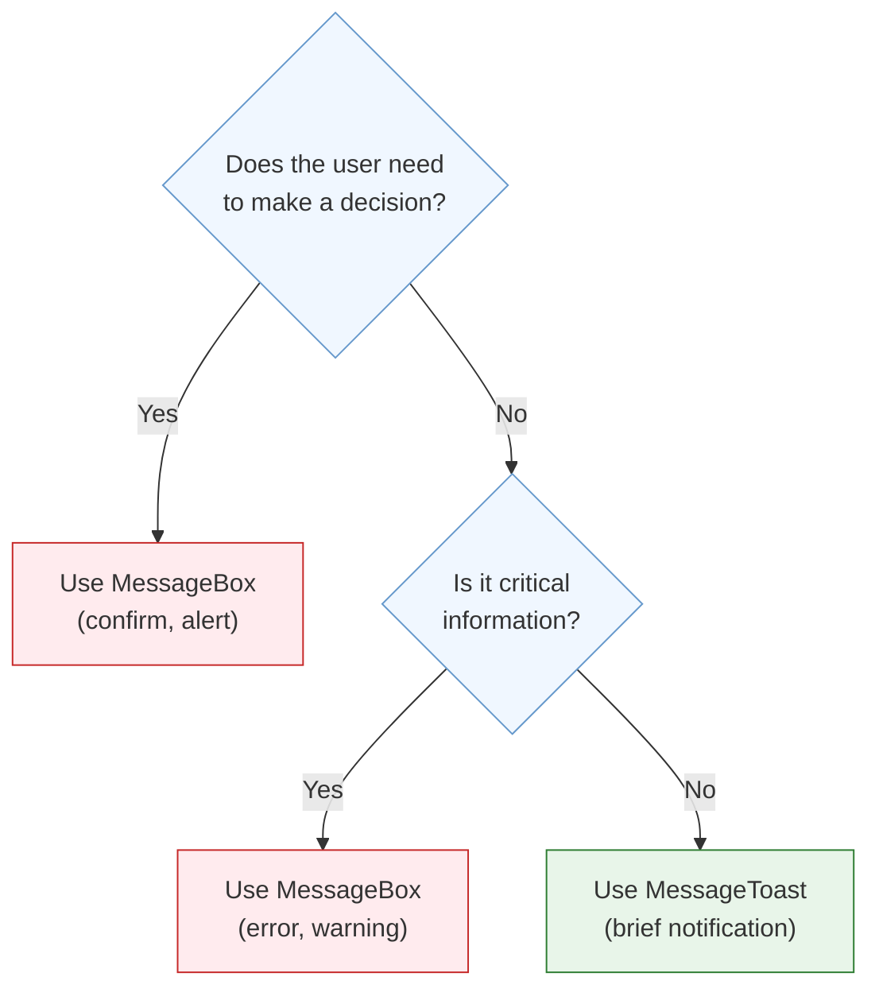
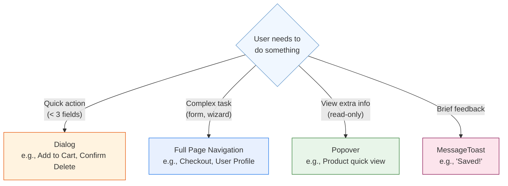
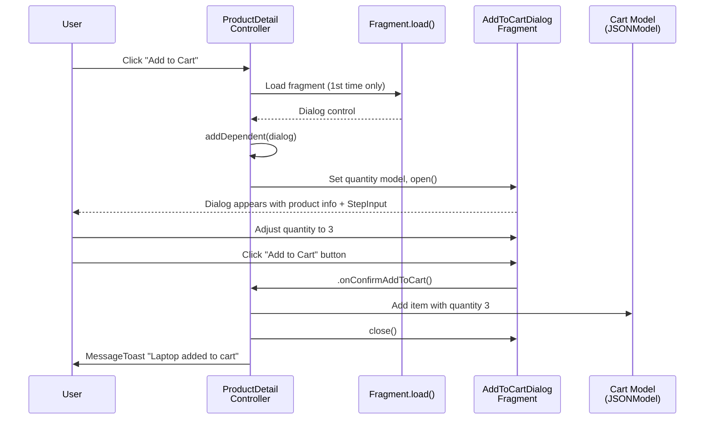

# Module 07: Fragments & Dialogs

> **Goal**: Learn how to create reusable UI pieces with fragments, and how to display
> modal overlays like Dialogs, MessageBoxes, and Popovers.

---

## Table of Contents

- [What Are Fragments?](#what-are-fragments)
- [Fragment vs View](#fragment-vs-view)
- [Creating Fragments (XML)](#creating-fragments-xml)
- [Loading Fragments](#loading-fragments)
- [Fragment ID Handling](#fragment-id-handling)
- [Fragment Binding Context](#fragment-binding-context)
- [Dialogs](#dialogs)
  - [Dialog Lifecycle](#dialog-lifecycle)
  - [Dialog Patterns: Lazy Loading & addDependent()](#dialog-patterns-lazy-loading--adddependent)
- [MessageBox](#messagebox)
- [MessageToast](#messagetoast)
- [Popover and ResponsivePopover](#popover-and-responsivepopover)
- [When to Use Dialog vs Full Navigation](#when-to-use-dialog-vs-full-navigation)
- [In Our ShopEasy App](#in-our-shopeasy-app)

---

## What Are Fragments?

A **fragment** is a lightweight, reusable piece of UI that can be embedded inside views or loaded on demand. Think of it as a **partial template** — like a React component that has no state of its own.

Fragments solve the **DRY problem**: if the same chunk of UI appears in multiple views, extract it into a fragment and reuse it everywhere.





### Common Use Cases

| Use Case | Example in ShopEasy |
|----------|-------------------|
| **Dialogs** | `AddToCartDialog.fragment.xml` — the "Add to Cart" popup |
| **Reusable UI pieces** | `ProductCard.fragment.xml` — a product display card |
| **Complex list items** | `CartItem.fragment.xml` — a cart line item |
| **Form sections** | `CheckoutSummary.fragment.xml` — order summary panel |

---

## Fragment vs View

Fragments look like views, but they're deliberately simpler:

| Feature | View | Fragment |
|---------|------|----------|
| Root element | `<mvc:View>` | `<core:FragmentDefinition>` |
| Has a Controller | ✅ Yes (one per view) | ❌ No (uses parent's controller) |
| Lifecycle hooks | ✅ `onInit`, `onExit`, `onBeforeRendering`, `onAfterRendering` | ❌ None |
| Can contain multiple root controls | ❌ One root control | ✅ Multiple root controls |
| Has its own ID prefix | ✅ `viewId--controlId` | ⚠️ Only if you explicitly provide a fragment ID |
| Data binding | Own model context | Inherits from the view it's added to |



> **Key Insight**: Because fragments have no controller, event handlers declared in a fragment (like `press=".onConfirmAddToCart"`) are resolved on the **parent view's controller**. This is why you pass `controller: this` when loading a fragment.

---

## Creating Fragments (XML)

A fragment file uses `<core:FragmentDefinition>` as its root element:

```xml
<!-- webapp/fragment/ProductCard.fragment.xml -->
<core:FragmentDefinition
    xmlns:core="sap.ui.core"
    xmlns="sap.m">

    <VBox class="sapUiSmallMargin">
        <Image src="{ImageUrl}" width="200px" />
        <Title text="{Name}" />
        <ObjectNumber
            number="{path: 'Price', formatter: '.formatter.formatPrice'}"
            unit="{Currency}" />
        <ObjectStatus
            text="{path: 'Stock', formatter: '.formatter.formatAvailability'}"
            state="{path: 'Stock', formatter: '.formatter.formatAvailabilityState'}" />
    </VBox>

</core:FragmentDefinition>
```

### File Naming Convention

Fragments live in the `fragment/` folder and follow this naming pattern:

```
webapp/fragment/FragmentName.fragment.xml
```

The namespace path becomes:
```
com.shopeasy.app.fragment.FragmentName
```

---

## Loading Fragments

### The Modern Way: `Fragment.load()` (Async)

`Fragment.load()` returns a **Promise** that resolves to the fragment's root control. This is the recommended approach since UI5 1.58+.



```javascript
sap.ui.define([
    "sap/ui/core/mvc/Controller",
    "sap/ui/core/Fragment"
], function (Controller, Fragment) {
    "use strict";

    return Controller.extend("com.shopeasy.app.controller.ProductDetail", {

        onAddToCartPress: function () {
            // Load the fragment only once (lazy loading)
            if (!this._pAddToCartDialog) {
                this._pAddToCartDialog = Fragment.load({
                    id: this.getView().getId(),
                    name: "com.shopeasy.app.fragment.AddToCartDialog",
                    controller: this
                }).then(function (oDialog) {
                    this.getView().addDependent(oDialog);
                    return oDialog;
                }.bind(this));
            }

            // Open the dialog when the promise resolves
            this._pAddToCartDialog.then(function (oDialog) {
                oDialog.open();
            });
        }
    });
});
```

### Fragment.load() Parameters

| Parameter | Type | Purpose |
|-----------|------|---------|
| `name` | `string` | Full namespace path to the fragment file |
| `id` | `string` | ID prefix for controls inside the fragment |
| `controller` | `object` | The controller that handles events declared in the fragment XML |
| `type` | `string` | Fragment type — usually omitted (defaults to XML) |

### Inline Fragments (Less Common)

You can also embed a fragment directly in a view's XML using `<core:Fragment>`:

```xml
<mvc:View xmlns:core="sap.ui.core" xmlns="sap.m" xmlns:mvc="sap.ui.core.mvc">
    <Page>
        <content>
            <!-- Inline fragment reference -->
            <core:Fragment
                fragmentName="com.shopeasy.app.fragment.ProductCard"
                type="XML" />
        </content>
    </Page>
</mvc:View>
```

> **Limitation**: Inline fragments don't support the `id` parameter, so control IDs inside them may collide if the same fragment is used multiple times in the same view.

---

## Fragment ID Handling

### The Problem

Controls inside a fragment need unique IDs in the DOM. If you use the same fragment twice without an ID prefix, you get duplicate IDs — which breaks UI5.

### The Solution: `createId()`

When loading a fragment, pass the view's ID as the fragment ID prefix:

```javascript
Fragment.load({
    id: this.getView().getId(),  // e.g., "productDetail"
    name: "com.shopeasy.app.fragment.AddToCartDialog",
    controller: this
});
```

This prefixes all control IDs inside the fragment with the view ID:

```
Fragment control id="idQuantityInput"
    → Runtime id: "productDetail--idQuantityInput"
```

### Accessing Fragment Controls with `byId()`

Because of the prefix, you must use `this.byId()` (which adds the view ID prefix automatically):

```javascript
// ✅ Correct — adds the view ID prefix
var oInput = this.byId("idQuantityInput");

// ❌ Wrong — looks for the literal ID "idQuantityInput" in the global registry
var oInput = sap.ui.getCore().byId("idQuantityInput");
```

If you used a different ID prefix (not the view ID), use `Fragment.byId()`:

```javascript
var oInput = Fragment.byId("myFragmentId", "idQuantityInput");
```

---

## Fragment Binding Context

Fragments **inherit** the binding context from the control they're added to. This is why `addDependent()` is so important — it connects the fragment to the view's model propagation chain.



Inside the fragment, bindings like `{Name}` and `{Price}` resolve to the same context as the parent view. Additional named models (`{i18n>key}`, `{cart>/items}`) are also available because `addDependent()` makes the fragment part of the view's control tree.

---

## Dialogs

### Dialog Lifecycle

A Dialog goes through distinct phases. The recommended pattern caches the dialog instance and reuses it.



### Dialog Lifecycle in Code

```javascript
return Controller.extend("com.shopeasy.app.controller.ProductDetail", {

    // PHASE 1: LOAD (only once)
    onOpenDialog: function () {
        if (!this._pDialog) {
            this._pDialog = Fragment.load({
                id: this.getView().getId(),
                name: "com.shopeasy.app.fragment.AddToCartDialog",
                controller: this
            }).then(function (oDialog) {
                this.getView().addDependent(oDialog);
                return oDialog;
            }.bind(this));
        }

        // PHASE 2: OPEN
        this._pDialog.then(function (oDialog) {
            oDialog.open();
        });
    },

    // PHASE 3: CLOSE (keep alive for reuse)
    onCancelDialog: function () {
        this.byId("addToCartDialog").close();
    },

    // PHASE 4: DESTROY (cleanup on view exit)
    onExit: function () {
        if (this._pDialog) {
            this._pDialog.then(function (oDialog) {
                oDialog.destroy();
            });
        }
    }
});
```

### Dialog Patterns: Lazy Loading & addDependent()

#### Lazy Loading

The dialog fragment is loaded **on first use**, not at view initialization. This speeds up the initial page load because the fragment XML doesn't need to be fetched until the user actually opens the dialog.



#### `addDependent()` — Why It Matters

Dialogs are rendered in a **special DOM area** called the "static area" (outside the view's DOM tree). Without `addDependent()`, the dialog wouldn't have access to the view's models.

```javascript
// This line connects the dialog to the view's model propagation
this.getView().addDependent(oDialog);
```

What `addDependent()` does:

1. **Model propagation** — The dialog can access `{i18n>key}`, `{cart>/items}`, and the default model
2. **Lifecycle management** — When the view is destroyed, the dialog is automatically destroyed too
3. **Binding context inheritance** — The dialog sees the same binding context as the view

---

## MessageBox

`sap.m.MessageBox` provides ready-made modal dialogs for common scenarios. Unlike custom dialogs, MessageBoxes are **stateless** — they create and destroy themselves automatically.

### MessageBox Methods

| Method | Icon | Use Case |
|--------|------|----------|
| `MessageBox.alert()` | ⚠️ Warning | Important information that needs acknowledgment |
| `MessageBox.confirm()` | ❓ Question | Yes/No decisions |
| `MessageBox.error()` | ❌ Error | Error notifications |
| `MessageBox.information()` | ℹ️ Info | Informational messages |
| `MessageBox.warning()` | ⚠️ Warning | Cautionary messages |
| `MessageBox.success()` | ✅ Success | Success confirmations |
| `MessageBox.show()` | Custom | Fully customizable message box |

### Examples

```javascript
sap.ui.define([
    "sap/m/MessageBox"
], function (MessageBox) {

    // Simple alert
    MessageBox.alert("Your session will expire in 5 minutes.");

    // Confirmation with callback
    MessageBox.confirm("Remove this item from your cart?", {
        title: "Confirm Removal",
        emphasizedAction: MessageBox.Action.OK,
        onClose: function (sAction) {
            if (sAction === MessageBox.Action.OK) {
                // User confirmed — remove the item
                this._removeCartItem(sItemId);
            }
        }.bind(this)
    });

    // Error with details
    MessageBox.error("Failed to place order. Please try again.", {
        title: "Order Error",
        details: "HTTP 500: Internal Server Error\nRequest ID: ABC-123",
        actions: [MessageBox.Action.RETRY, MessageBox.Action.CLOSE],
        onClose: function (sAction) {
            if (sAction === MessageBox.Action.RETRY) {
                this._submitOrder();
            }
        }.bind(this)
    });

    // Custom show() with any actions
    MessageBox.show("Save changes before leaving?", {
        title: "Unsaved Changes",
        icon: MessageBox.Icon.QUESTION,
        actions: ["Save", "Discard", MessageBox.Action.CANCEL],
        emphasizedAction: "Save",
        onClose: function (sAction) {
            if (sAction === "Save") { /* save */ }
            else if (sAction === "Discard") { /* discard */ }
            // Cancel: do nothing
        }
    });
});
```

---

## MessageToast

`sap.m.MessageToast` shows a brief, auto-dismissing notification at the bottom of the screen. It's **non-blocking** — the user doesn't need to click anything.

```javascript
sap.ui.define([
    "sap/m/MessageToast"
], function (MessageToast) {

    // Basic usage
    MessageToast.show("Item added to cart!");

    // With options
    MessageToast.show("Order placed successfully!", {
        duration: 5000,           // Display for 5 seconds (default: 3000)
        width: "20em",            // Width of the toast
        at: "center center",      // Position (default: "center bottom")
        offset: "0 -100"          // Offset from the position
    });
});
```

### When to Use MessageToast vs MessageBox



| Scenario | Use |
|----------|-----|
| "Item added to cart" | MessageToast |
| "Are you sure you want to delete?" | MessageBox.confirm() |
| "Order placed successfully" | MessageToast |
| "Network error — please retry" | MessageBox.error() |
| "Your session expired" | MessageBox.warning() |
| "Saved!" | MessageToast |

---

## Popover and ResponsivePopover

A **Popover** is a non-modal overlay that appears next to a control (e.g., clicking a button shows more info). Unlike a Dialog, the user can interact with the rest of the page while a Popover is open.

### ResponsivePopover

`sap.m.ResponsivePopover` is the preferred choice — it renders as a **Popover on desktop** and a **Dialog on phone** (where Popovers are too small).

```xml
<!-- fragment/ProductInfo.fragment.xml -->
<core:FragmentDefinition
    xmlns:core="sap.ui.core"
    xmlns="sap.m">

    <ResponsivePopover
        title="Product Info"
        placement="Auto">
        <content>
            <VBox class="sapUiSmallMargin">
                <Label text="Category" />
                <Text text="{CategoryId}" />
                <Label text="Stock" class="sapUiSmallMarginTop" />
                <ObjectStatus
                    text="{path: 'Stock', formatter: '.formatter.formatAvailability'}"
                    state="{path: 'Stock', formatter: '.formatter.formatAvailabilityState'}" />
            </VBox>
        </content>
    </ResponsivePopover>

</core:FragmentDefinition>
```

```javascript
// Open a ResponsivePopover
onInfoPress: function (oEvent) {
    var oButton = oEvent.getSource();

    if (!this._pPopover) {
        this._pPopover = Fragment.load({
            id: this.getView().getId(),
            name: "com.shopeasy.app.fragment.ProductInfo",
            controller: this
        }).then(function (oPopover) {
            this.getView().addDependent(oPopover);
            return oPopover;
        }.bind(this));
    }

    this._pPopover.then(function (oPopover) {
        // openBy() positions the popover next to the trigger control
        oPopover.openBy(oButton);
    });
}
```

### Popover Placement Options

| Placement | Description |
|-----------|-------------|
| `Auto` | UI5 picks the best position (recommended) |
| `Top` | Above the trigger control |
| `Bottom` | Below the trigger control |
| `Left` / `Right` | Beside the trigger control |
| `HorizontalPreferredLeft` | Left if space allows, otherwise right |
| `VerticalPreferredTop` | Top if space allows, otherwise bottom |

---

## When to Use Dialog vs Full Navigation



| Criteria | Dialog | Full Navigation |
|----------|--------|-----------------|
| **Scope** | Quick, focused task (1-3 inputs) | Complex task (forms, wizards) |
| **Context** | User stays on current page | User moves to a new page |
| **URL** | URL doesn't change | URL changes (bookmarkable) |
| **Back button** | Closes dialog | Navigates back |
| **Example** | "Add to Cart" quantity picker | Checkout flow |
| **Data volume** | Small (a few fields) | Large (full forms) |

### Decision Guide

1. **Can the task be done in under 10 seconds?** → Dialog
2. **Does the task need its own URL (bookmarking/sharing)?** → Navigation
3. **Does the user need to see the original page while acting?** → Popover
4. **Is it just a success/error message?** → MessageToast or MessageBox

---

## In Our ShopEasy App

Our app uses fragments extensively:

| Fragment | Purpose | Loaded By |
|----------|---------|-----------|
| `AddToCartDialog.fragment.xml` | Quantity picker dialog when adding to cart | `ProductDetail.controller.js` |
| `ProductCard.fragment.xml` | Reusable product display card | `Home.view.xml`, `ProductList.view.xml` |
| `CartItem.fragment.xml` | Cart line item with quantity and remove | `Cart.view.xml` |
| `CheckoutSummary.fragment.xml` | Order summary panel | `Checkout.view.xml` |

### AddToCartDialog — Full Flow



---

## Summary

### Key Takeaways

1. **Fragments are lightweight, reusable UI pieces** — no controller, no lifecycle
2. **Always use `Fragment.load()`** — the modern async approach
3. **Pass `controller: this`** so fragment event handlers resolve on your controller
4. **Always call `addDependent()`** to connect the fragment to the view's models
5. **Lazy-load dialogs** — load on first use, cache the Promise, reuse the instance
6. **Destroy in `onExit()`** to prevent memory leaks
7. **MessageToast for quick feedback**, **MessageBox for decisions/errors**
8. **ResponsivePopover** for contextual info (adapts to phone screens automatically)
9. **Use dialogs for quick tasks**, **full navigation for complex tasks**

---

**Previous**: [← Module 06 — Controls Deep Dive](06-controls.md)
**Next**: [Module 08 — Internationalization (i18n) →](08-i18n.md)
