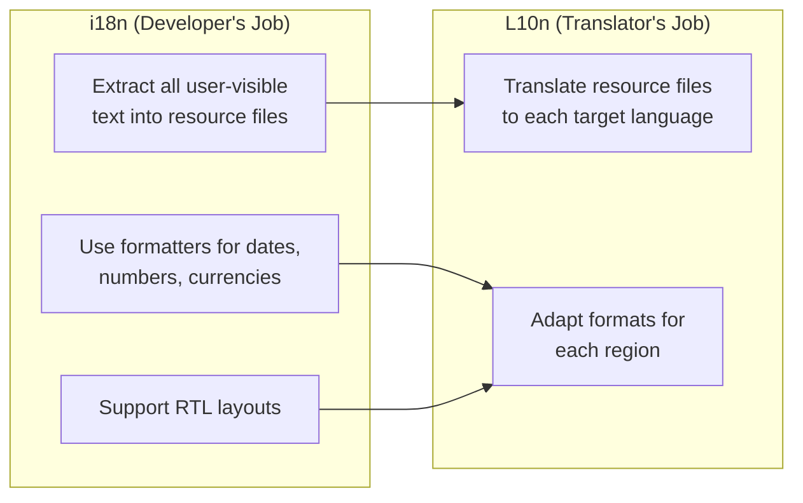
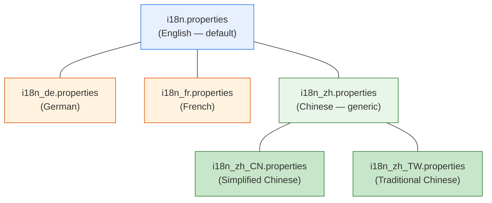
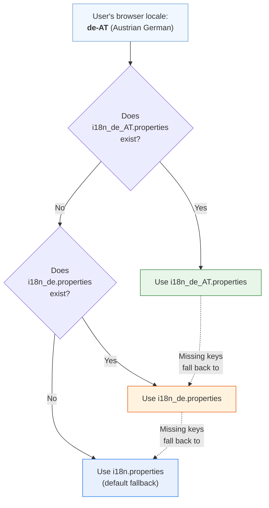
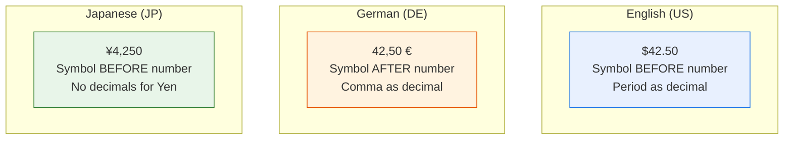

# Module 08: Internationalization (i18n)

> **Goal**: Learn how to make your UI5 app work in multiple languages and locales.
> In enterprise SAP projects, i18n is not optional — it's a **requirement**.

---

## Table of Contents

- [What Is i18n and Why It Matters](#what-is-i18n-and-why-it-matters)
- [Resource Bundle Files](#resource-bundle-files)
- [File Naming Convention](#file-naming-convention)
- [Locale Detection and Fallback Chain](#locale-detection-and-fallback-chain)
- [Using i18n in XML Views](#using-i18n-in-xml-views)
- [Using i18n in Controllers](#using-i18n-in-controllers)
- [Placeholders: Dynamic Values in Texts](#placeholders-dynamic-values-in-texts)
- [Date, Time, and Number Formatting](#date-time-and-number-formatting)
- [Currency Formatting](#currency-formatting)
- [Right-to-Left (RTL) Language Support](#right-to-left-rtl-language-support)
- [Testing with Different Locales](#testing-with-different-locales)
- [In Our ShopEasy App](#in-our-shopeasy-app)

---

## What Is i18n and Why It Matters

**i18n** stands for **i**nternationalizatio**n** — there are 18 letters between the "i" and the "n". It's the process of designing your application so it can be adapted to different languages and regions without code changes.

A closely related term is **L10n** (localization) — actually translating the content and adapting formats for a specific locale.



### Why Is It Mandatory in Enterprise Apps?

| Reason | Example |
|--------|---------|
| **Global companies** | SAP runs in 180+ countries — your app must work in German, Chinese, Arabic, etc. |
| **Legal requirements** | Some countries require software to support the local language |
| **User experience** | Users are more productive in their native language |
| **SAP Fiori guidelines** | All Fiori apps must be translatable — hardcoded strings fail certification |
| **Maintainability** | Centralizing text in resource files makes updates easier |

### The Golden Rule

> **Never hardcode user-visible strings in views or controllers.**
> Always use i18n resource bundles.

```xml
<!-- ❌ BAD — hardcoded string -->
<Button text="Add to Cart" />

<!-- ✅ GOOD — i18n key -->
<Button text="{i18n>addToCart}" />
```

---

## Resource Bundle Files

Resource bundles are simple **`.properties` files** using the `key=value` format (Java-style). Each line maps a key to a text string.

```properties
# This is a comment
appTitle=ShopEasy
appDescription=Your one-stop online shop
addToCart=Add to Cart
cartItemCount=Cart ({0})
lowStock=Low Stock ({0} left)
```

### Format Rules

| Rule | Example |
|------|---------|
| One key-value pair per line | `appTitle=ShopEasy` |
| Comments start with `#` or `!` | `# Application texts` |
| Keys are case-sensitive | `appTitle` ≠ `AppTitle` |
| No quotes around values | `appTitle=ShopEasy` (not `"ShopEasy"`) |
| Multi-line values use `\` at end | `longText=This is a very \` <br/> `long text` |
| Empty lines are ignored | |
| Placeholders use `{0}`, `{1}` | `itemAdded="{0}" added to cart` |

### Declaring the Resource Model in manifest.json

```json
{
    "sap.ui5": {
        "models": {
            "i18n": {
                "type": "sap.ui.model.resource.ResourceModel",
                "settings": {
                    "bundleName": "com.shopeasy.app.i18n.i18n"
                }
            }
        }
    }
}
```

`bundleName` uses dot notation to point to the file:
- `com.shopeasy.app.i18n.i18n` → `webapp/i18n/i18n.properties`

---

## File Naming Convention

Resource bundle files follow a strict naming pattern that UI5 uses to find the right translation:

```
i18n.properties                   ← Default (usually English)
i18n_de.properties                ← German
i18n_fr.properties                ← French
i18n_zh_CN.properties             ← Simplified Chinese (China)
i18n_zh_TW.properties             ← Traditional Chinese (Taiwan)
i18n_pt_BR.properties             ← Portuguese (Brazil)
i18n_en_GB.properties             ← English (UK)
```

### Naming Pattern

```
i18n[_language[_REGION]].properties
```

| Part | Format | Examples |
|------|--------|---------|
| Language | ISO 639-1 (2 lowercase letters) | `de`, `fr`, `zh`, `ja`, `ar` |
| Region | ISO 3166-1 (2 uppercase letters) | `DE`, `CN`, `TW`, `BR`, `GB` |



---

## Locale Detection and Fallback Chain

When UI5 needs to load the i18n resource bundle, it determines the user's locale and follows a **fallback chain** to find the best matching file.



### How Locale Is Determined

UI5 checks these sources in order (first match wins):

| Priority | Source | Example |
|----------|--------|---------|
| 1 | URL parameter `sap-language` | `?sap-language=de` |
| 2 | URL parameter `sap-ui-language` | `?sap-ui-language=de` |
| 3 | Bootstrap config `data-sap-ui-language` | `data-sap-ui-language="de"` |
| 4 | Browser language setting | `navigator.language` → `de-DE` |

### Key-Level Fallback

The fallback isn't all-or-nothing. If the German file (`i18n_de.properties`) has **some** keys translated but is missing others, UI5 falls back to the default file **per key**:

```properties
# i18n_de.properties (German — partial translation)
appTitle=ShopEasy
productsTitle=Produkte
# "addToCart" is NOT in this file

# i18n.properties (English — default)
appTitle=ShopEasy
productsTitle=Products
addToCart=Add to Cart
```

Result for a German user:
- `appTitle` → "ShopEasy" (from German file)
- `productsTitle` → "Produkte" (from German file)
- `addToCart` → "Add to Cart" (fallback to default — English)

---

## Using i18n in XML Views

Reference i18n texts in XML views using the `{i18n>key}` binding syntax:

```xml
<Page title="{i18n>productsTitle}">
    <content>
        <Title text="{i18n>homeTitle}" />
        <Text text="{i18n>homeSubtitle}" />

        <Button text="{i18n>addToCart}" press=".onAddToCart" />

        <SearchField placeholder="{i18n>search}" search=".onSearch" />

        <!-- i18n in list items -->
        <StandardListItem title="{i18n>emptyCart}" description="{i18n>emptyCartMessage}" />
    </content>
</Page>
```

### How It Works

1. `{i18n>addToCart}` tells UI5: "Look in the model named `i18n`"
2. The `i18n` model is a `ResourceModel` (declared in manifest.json)
3. The ResourceModel loads the appropriate `.properties` file
4. It finds the key `addToCart` and returns the value `"Add to Cart"` (or `"In den Warenkorb"` for German)
5. The value is displayed in the Button's `text` property

---

## Using i18n in Controllers

In controllers, you access the resource bundle programmatically:

```javascript
// Get the resource bundle
var oBundle = this.getView().getModel("i18n").getResourceBundle();

// Read a simple text
var sTitle = oBundle.getText("appTitle");
// → "ShopEasy"

// Read a text with placeholders
var sMessage = oBundle.getText("itemAdded", ["Wireless Mouse"]);
// → '"Wireless Mouse" added to cart'

var sStock = oBundle.getText("lowStock", [3]);
// → "Low Stock (3 left)"
```

### Common Pattern: BaseController Helper

In our ShopEasy app, the `BaseController` provides a helper method:

```javascript
// BaseController.js
getResourceBundle: function () {
    return this.getOwnerComponent().getModel("i18n").getResourceBundle();
}

// Usage in any controller
var oBundle = this.getResourceBundle();
var sMessage = oBundle.getText("orderConfirmation");
```

---

## Placeholders: Dynamic Values in Texts

Placeholders let you insert dynamic values into translated text. They use **positional indices**: `{0}`, `{1}`, `{2}`, etc.

### In the .properties File

```properties
# {0} = product name
itemAdded="{0}" added to cart

# {0} = number of items remaining
lowStock=Low Stock ({0} left)

# {0} = number of items in cart
cartItemCount=Cart ({0})

# {0} = customer name, {1} = order number
orderConfirmation=Thank you {0}! Your order #{1} has been placed.
```

### In JavaScript

```javascript
var oBundle = this.getResourceBundle();

// Single placeholder
oBundle.getText("itemAdded", ["Laptop"]);
// → '"Laptop" added to cart'

// Multiple placeholders
oBundle.getText("orderConfirmation", ["John", "12345"]);
// → "Thank you John! Your order #12345 has been placed."
```

### Why Placeholders Matter for Translation

Translators can reorder placeholders to match their language's grammar:

```properties
# English: Subject-Verb-Object order
itemAdded="{0}" added to cart

# German: Different word order
itemAdded="{0}" zum Warenkorb hinzugefügt

# Japanese: Object-Subject-Verb order
itemAdded={0}がカートに追加されました
```

The `{0}` placeholder stays the same in every language — only its position changes. This is why you should **never concatenate strings** in code:

```javascript
// ❌ BAD — impossible to translate correctly
var sMessage = productName + " added to cart";

// ✅ GOOD — translators can reorder {0}
var sMessage = oBundle.getText("itemAdded", [productName]);
```

---

## Date, Time, and Number Formatting

Different locales display dates, times, and numbers differently. UI5 handles this automatically through its formatting APIs.

### Date Formatting

```javascript
sap.ui.define([
    "sap/ui/core/format/DateFormat"
], function (DateFormat) {

    // Short date
    var oDateFormat = DateFormat.getDateInstance({ style: "short" });
    oDateFormat.format(new Date(2026, 2, 22));
    // English: "3/22/26"
    // German:  "22.03.26"
    // Japanese: "2026/03/22"

    // Medium date
    var oMedium = DateFormat.getDateInstance({ style: "medium" });
    oMedium.format(new Date(2026, 2, 22));
    // English: "Mar 22, 2026"
    // German:  "22.03.2026"

    // Custom pattern
    var oCustom = DateFormat.getDateInstance({ pattern: "yyyy-MM-dd" });
    oCustom.format(new Date(2026, 2, 22));
    // All locales: "2026-03-22"
});
```

### Number Formatting

```javascript
sap.ui.define([
    "sap/ui/core/format/NumberFormat"
], function (NumberFormat) {

    var oFormat = NumberFormat.getFloatInstance({
        decimals: 2,
        groupingEnabled: true
    });

    oFormat.format(1234567.89);
    // English: "1,234,567.89"
    // German:  "1.234.567,89"
    // French:  "1 234 567,89"
});
```

### Locale Differences

| Format | English (US) | German (DE) | French (FR) | Japanese (JP) |
|--------|-------------|-------------|-------------|---------------|
| Date (short) | 3/22/26 | 22.03.26 | 22/03/26 | 2026/03/22 |
| Date (medium) | Mar 22, 2026 | 22.03.2026 | 22 mars 2026 | 2026年3月22日 |
| Number | 1,234.56 | 1.234,56 | 1 234,56 | 1,234.56 |
| Percent | 45% | 45 % | 45 % | 45% |

---

## Currency Formatting

Currency formatting is especially important in shopping apps. UI5 provides the `sap.ui.model.type.Currency` type that handles everything:

### In XML Views (Using Type Binding)

```xml
<ObjectNumber
    number="{
        path: 'Price',
        type: 'sap.ui.model.type.Currency',
        formatOptions: { showMeasure: false }
    }"
    unit="{CurrencyCode}" />
```

### Using Parts (Price + Currency Code Together)

```xml
<ObjectNumber
    number="{
        parts: ['Price', 'CurrencyCode'],
        type: 'sap.ui.model.type.Currency',
        formatOptions: { showMeasure: true }
    }" />
```

### In JavaScript

```javascript
sap.ui.define([
    "sap/ui/core/format/NumberFormat"
], function (NumberFormat) {

    var oCurrencyFormat = NumberFormat.getCurrencyInstance();

    oCurrencyFormat.format(42.5, "USD");
    // English: "USD 42.50"     or "$42.50"
    // German:  "42,50 USD"     or "42,50 $"

    oCurrencyFormat.format(42.5, "EUR");
    // English: "EUR 42.50"     or "€42.50"
    // German:  "42,50 EUR"     or "42,50 €"
});
```

### Why Currency Position Matters



---

## Right-to-Left (RTL) Language Support

Languages like **Arabic**, **Hebrew**, and **Persian** read right-to-left. UI5 handles RTL automatically:

### What Changes in RTL Mode

| Element | LTR (English) | RTL (Arabic) |
|---------|---------------|--------------|
| Text direction | Left to right → | ← Right to left |
| Page layout | Sidebar on left | Sidebar on right |
| Icons | Arrow pointing right → | Arrow pointing left ← |
| Margins | `sapUiSmallMarginBegin` = left | `sapUiSmallMarginBegin` = right |
| Buttons in toolbar | Left-aligned | Right-aligned |

### How UI5 Detects RTL

UI5 automatically enables RTL mode when the locale is an RTL language. You can also force it:

```html
<!-- Force RTL in index.html -->
<script id="sap-ui-bootstrap"
    data-sap-ui-rtl="true"
    ...>
</script>
```

Or via URL parameter:
```
http://localhost:8080/index.html?sap-ui-rtl=true
```

### Developer Best Practices for RTL

1. **Use `Begin`/`End` instead of `Left`/`Right`** in margin/padding classes
2. **Use FlexBox** for layouts (auto-reverses in RTL)
3. **Use SAP icons** — they auto-mirror for RTL
4. **Never use CSS `float: left`** — use FlexBox alignment instead
5. **Test with `?sap-ui-rtl=true`** to verify your layout works

---

## Testing with Different Locales

### URL Parameters

The fastest way to test different languages:

```
http://localhost:8080/index.html?sap-language=de        ← German
http://localhost:8080/index.html?sap-language=fr        ← French
http://localhost:8080/index.html?sap-language=zh_CN     ← Simplified Chinese
http://localhost:8080/index.html?sap-language=ar        ← Arabic (also triggers RTL)
http://localhost:8080/index.html?sap-language=ja        ← Japanese
```

### Checking for Missing Translations

When a key is missing in a locale-specific file, UI5 falls back to the default file silently. To catch missing translations:

1. **Open the browser console** and look for warnings about missing keys
2. **Compare files**: ensure all keys in `i18n.properties` exist in locale files
3. **Use the UI5 Support Tool**: press `Ctrl+Alt+Shift+S` → "Technical Information" → check i18n model

### Pseudo-Translation Testing

A common technique: prefix all texts with a special character to visually identify hardcoded strings that bypass i18n:

```properties
# i18n_test.properties (pseudo-locale for testing)
appTitle=ShopEasy
addToCart=Add to Cart
```

Any text on screen **without** the `` brackets is a hardcoded string that needs to be moved to i18n.

---

## In Our ShopEasy App

### Resource Bundle Structure

```
webapp/i18n/
├── i18n.properties         ← English (default)
└── i18n_de.properties      ← German
```

### manifest.json Configuration

```json
"i18n": {
    "type": "sap.ui.model.resource.ResourceModel",
    "settings": {
        "bundleName": "com.shopeasy.app.i18n.i18n"
    }
}
```

### Example Keys (English → German)

| Key | English | German |
|-----|---------|--------|
| `appTitle` | ShopEasy | ShopEasy |
| `homeTitle` | Welcome to ShopEasy | Willkommen bei ShopEasy |
| `addToCart` | Add to Cart | In den Warenkorb |
| `emptyCart` | Your cart is empty | Ihr Warenkorb ist leer |
| `lowStock` | Low Stock ({0} left) | Nur noch {0} auf Lager |
| `itemAdded` | "{0}" added to cart | "{0}" zum Warenkorb hinzugefügt |

### How i18n Flows Through the App

```mermaid
flowchart LR
    Browser["Browser<br/>Language: de-DE"]
    Browser --> UI5["UI5 Runtime<br/>Locale: de"]
    UI5 --> RM["ResourceModel<br/>Loads i18n_de.properties"]
    RM --> View["XML View<br/>{i18n>addToCart}<br/>→ 'In den Warenkorb'"]
    RM --> Controller["Controller<br/>getText('itemAdded', ['Laptop'])<br/>→ '\"Laptop\" zum Warenkorb hinzugefügt'"]
```

### Naming Conventions We Follow

| Convention | Example |
|-----------|---------|
| Use camelCase | `addToCart`, `emptyCartMessage` |
| Group by feature prefix | `cart*`, `product*`, `order*` |
| Verbs for buttons | `addToCart`, `placeOrder`, `continueShopping` |
| Nouns for titles | `productsTitle`, `cartTitle` |
| Descriptive names | `emptyCartMessage` (not `message1`) |

---

## Summary

```mermaid
mindmap
  root((i18n in UI5))
    Resource Bundles
      .properties files
      key=value format
      Placeholders {0} {1}
    Naming
      i18n.properties
      i18n_de.properties
      i18n_zh_CN.properties
    Locale Detection
      URL param sap-language
      Browser language
      Fallback chain
    Usage
      XML View: "{i18n>key}"
      Controller: getText
      Placeholders: getText key args
    Formatting
      DateFormat
      NumberFormat
      CurrencyFormat
      Locale-aware
    RTL Support
      Arabic Hebrew
      Begin/End margins
      Auto-mirrored icons
```

### Key Takeaways

1. **Never hardcode user-visible strings** — always use i18n resource bundles
2. **File naming matters**: `i18n_de.properties` for German, `i18n_zh_CN.properties` for Simplified Chinese
3. **Fallback chain**: `i18n_de_AT` → `i18n_de` → `i18n` (per key, not per file)
4. **Use `{i18n>key}` in XML views** and `getText("key")` in controllers
5. **Use `{0}`, `{1}` placeholders** — never concatenate strings
6. **Use UI5 format APIs** for dates, numbers, and currencies — they're locale-aware
7. **Test with `?sap-language=de`** (or any other locale) in the URL
8. **Support RTL** by using Begin/End instead of Left/Right

---

**Previous**: [← Module 07 — Fragments & Dialogs](07-fragments-and-dialogs.md)
**Next**: [Module 09 — Formatting & Validation →](09-formatting.md)
