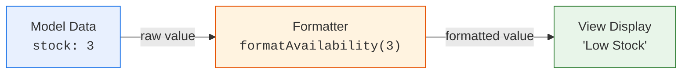
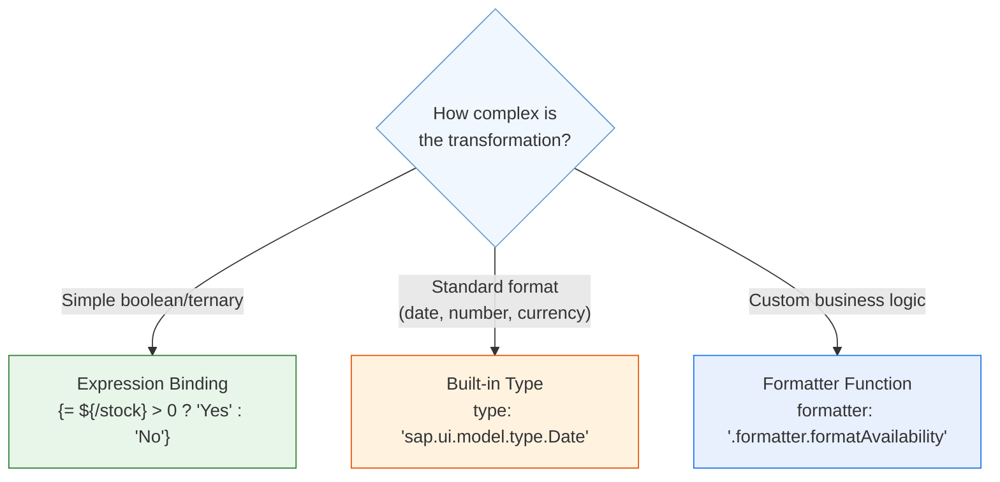
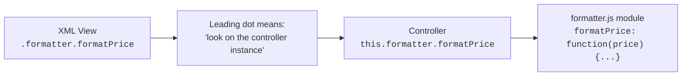
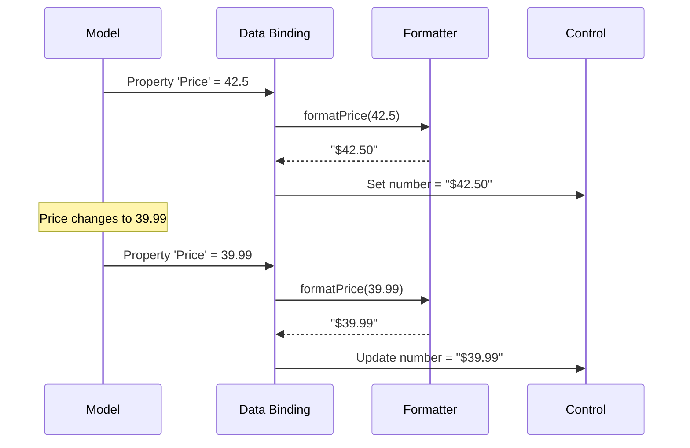
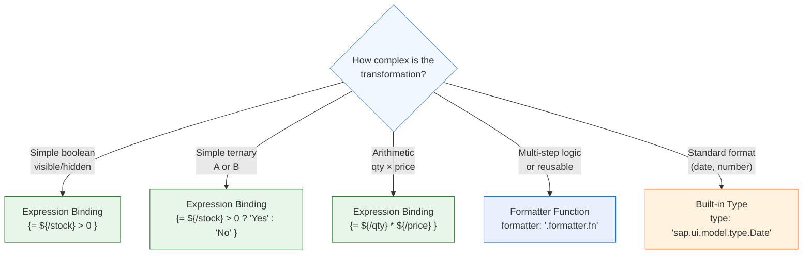
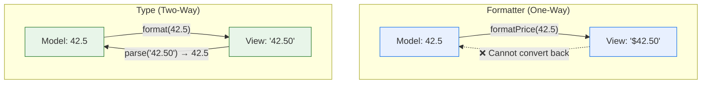
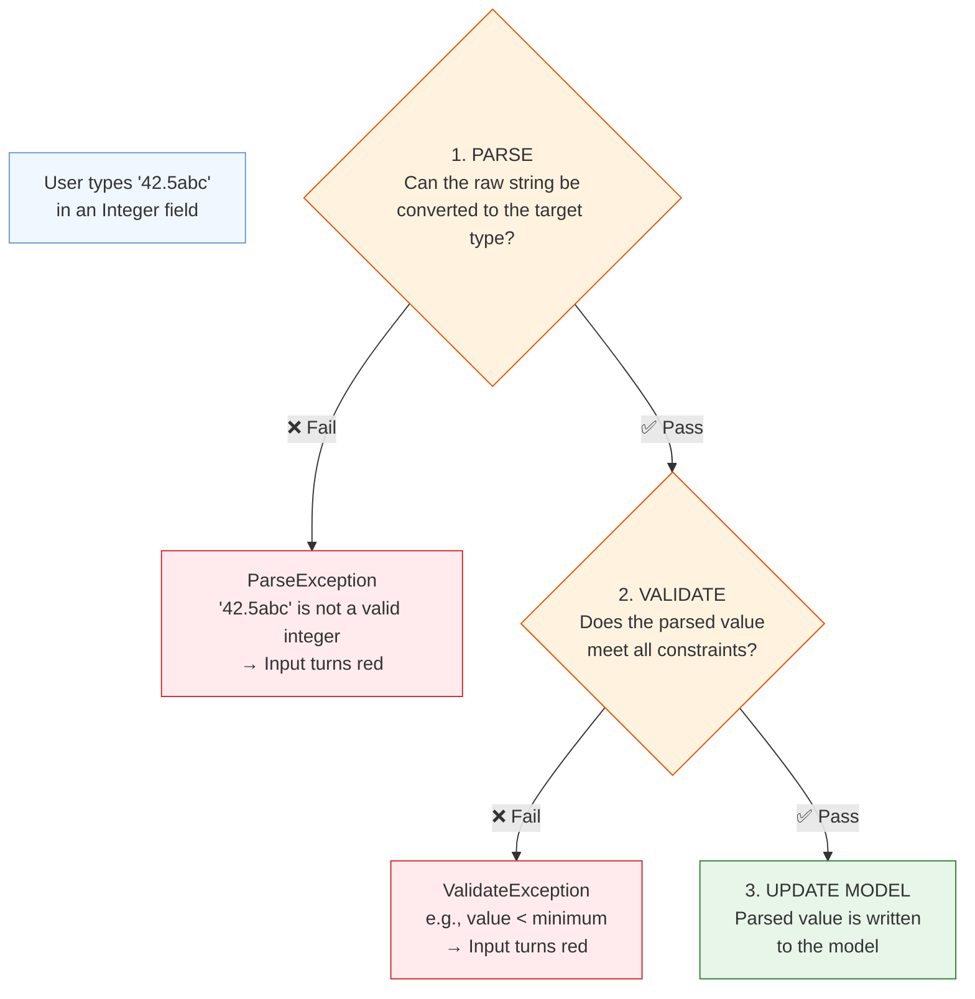
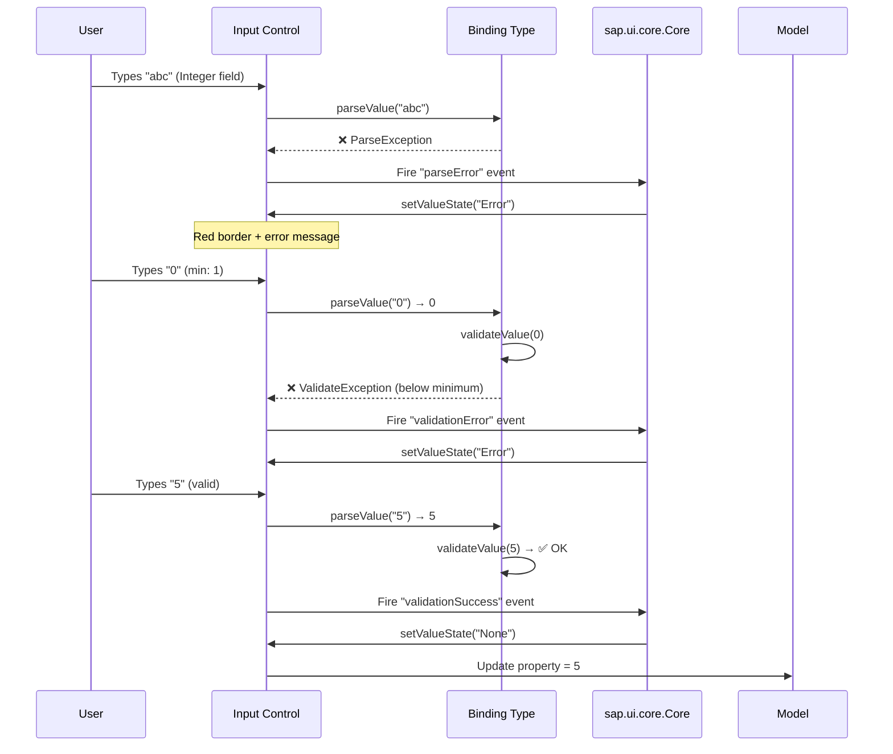

# Module 09: Formatting & Validation

> **Goal**: Learn how to transform raw data into user-friendly display values with
> formatters, and how to validate user input with types and constraints.

---

## Table of Contents

- [What Are Formatters?](#what-are-formatters)
- [Defining Formatters in a Separate Module](#defining-formatters-in-a-separate-module)
- [Binding to Formatters](#binding-to-formatters)
- [Multiple-Path Formatters (Parts)](#multiple-path-formatters-parts)
- [Expression Binding vs Formatters](#expression-binding-vs-formatters)
- [UI5 Built-in Types](#ui5-built-in-types)
- [Custom Types](#custom-types)
- [Constraints and Validation](#constraints-and-validation)
- [Validation Events and Error Handling](#validation-events-and-error-handling)
- [Input Validation Patterns](#input-validation-patterns)
- [In Our ShopEasy App](#in-our-shopeasy-app)

---

## What Are Formatters?

A **formatter** is a pure function that transforms raw model data into a display-friendly value. The data in the model stays unchanged — the formatter only affects what the user **sees**.



### Why Use Formatters?

| Benefit | Explanation |
|---------|-------------|
| **Separation of concerns** | Display logic lives in formatters, not scattered across views and controllers |
| **Reusability** | The same formatter can be used in many views |
| **Testability** | Pure functions (input → output) are trivial to unit test |
| **Clean views** | XML views stay readable — no inline JavaScript expressions |

### Three Ways to Transform Data in Views



---

## Defining Formatters in a Separate Module

Best practice: put all formatters in a dedicated module (`model/formatter.js`) and import it into controllers.

### Step 1: Create the Formatter Module

```javascript
// webapp/model/formatter.js
sap.ui.define([
    "sap/ui/core/ValueState"
], function (ValueState) {
    "use strict";

    return {

        formatPrice: function (price) {
            if (price == null || isNaN(price)) {
                return "";
            }
            return "$" + parseFloat(price).toFixed(2);
        },

        formatAvailability: function (stock) {
            if (stock == null || isNaN(stock)) {
                return "";
            }
            var iStock = parseInt(stock, 10);
            if (iStock === 0) {
                return "Out of Stock";
            } else if (iStock <= 5) {
                return "Low Stock";
            }
            return "In Stock";
        },

        formatAvailabilityState: function (stock) {
            if (stock == null || isNaN(stock)) {
                return ValueState.None;
            }
            var iStock = parseInt(stock, 10);
            if (iStock === 0) {
                return ValueState.Error;
            } else if (iStock <= 5) {
                return ValueState.Warning;
            }
            return ValueState.Success;
        }
    };
});
```

### Step 2: Import and Attach in the Controller

```javascript
// webapp/controller/ProductList.controller.js
sap.ui.define([
    "com/shopeasy/app/controller/BaseController",
    "com/shopeasy/app/model/formatter"    // ← import
], function (BaseController, formatter) {
    "use strict";

    return BaseController.extend("com.shopeasy.app.controller.ProductList", {
        formatter: formatter,              // ← attach as controller property
        // ...
    });
});
```

### Step 3: Reference in XML View

```xml
<ObjectStatus
    text="{path: 'Stock', formatter: '.formatter.formatAvailability'}"
    state="{path: 'Stock', formatter: '.formatter.formatAvailabilityState'}" />
```

### How the Dot Prefix Works



> **GOTCHA**: The dot `.` prefix is **critical**. Without it, UI5 looks for a **global** function, which will fail. Always use the dot.

---

## Binding to Formatters

### Single-Path Formatter

Bind one model property and transform it:

```xml
<ObjectNumber
    number="{path: 'Price', formatter: '.formatter.formatPrice'}" />
```

The formatter receives the bound value as its argument:

```javascript
formatPrice: function (price) {
    // price = the value at path 'Price' in the model
    return "$" + parseFloat(price).toFixed(2);
}
```

### Formatter Execution Flow



---

## Multiple-Path Formatters (Parts)

When a formatter needs values from **multiple model properties**, use the `parts` syntax:

```xml
<Text text="{
    parts: [
        {path: 'Price'},
        {path: 'Currency'}
    ],
    formatter: '.formatter.formatPriceWithCurrency'
}" />
```

The formatter receives each value as a separate argument:

```javascript
formatPriceWithCurrency: function (fPrice, sCurrency) {
    if (fPrice == null) {
        return "";
    }
    return parseFloat(fPrice).toFixed(2) + " " + sCurrency;
    // → "42.50 USD"
}
```

### Parts from Different Models

You can mix paths from different models:

```xml
<Text text="{
    parts: [
        {path: 'Price'},
        {path: 'cart>/itemCount'}
    ],
    formatter: '.formatter.formatSomething'
}" />
```

```javascript
formatSomething: function (fPrice, iCartCount) {
    // fPrice comes from the default model
    // iCartCount comes from the 'cart' named model
}
```

---

## Expression Binding vs Formatters

### Expression Binding

Expression binding uses the `{= ... }` syntax for **simple inline expressions** directly in XML:

```xml
<!-- Boolean visibility -->
<Button visible="{= ${cart>/itemCount} > 0 }" text="View Cart" />

<!-- Ternary text -->
<Text text="{= ${Stock} > 0 ? 'Available' : 'Sold Out' }" />

<!-- Arithmetic -->
<ObjectNumber number="{= ${addToCart>/quantity} * ${Price} }" unit="{CurrencyCode}" />

<!-- String concatenation -->
<Title text="{= ${/items}.length + ' items in cart' }" />
```

### When to Use Which

| Criteria | Expression Binding | Formatter Function |
|----------|-------------------|-------------------|
| **Complexity** | Simple (one-liners) | Complex (multi-line logic) |
| **Reusability** | Single use | Reusable across views |
| **Testability** | Cannot unit test | Easy to unit test |
| **Debugging** | Cannot set breakpoints | Full debugger support |
| **Readability** | Gets messy beyond simple ternary | Clean, named functions |
| **Performance** | Slightly faster (no function call) | Negligible difference |



> **Rule of thumb**: If the expression has more than one `?` or any `if/else` logic, use a formatter.

---

## UI5 Built-in Types

UI5 provides built-in type classes that handle **formatting AND parsing** (two-way). Unlike formatters (one-way display only), types can also convert user input back to model values.

### Common Built-in Types

| Type | Import Path | Use Case |
|------|-------------|----------|
| `Currency` | `sap.ui.model.type.Currency` | Price + currency code |
| `Date` | `sap.ui.model.type.Date` | Date values |
| `DateTime` | `sap.ui.model.type.DateTime` | Date + time values |
| `Time` | `sap.ui.model.type.Time` | Time values |
| `Float` | `sap.ui.model.type.Float` | Decimal numbers |
| `Integer` | `sap.ui.model.type.Integer` | Whole numbers |
| `String` | `sap.ui.model.type.String` | Text with constraints |

### Using Types in Bindings

```xml
<!-- Date formatting -->
<Text text="{
    path: 'orderDate',
    type: 'sap.ui.model.type.Date',
    formatOptions: { style: 'medium' }
}" />
<!-- English: "Mar 22, 2026"  |  German: "22.03.2026" -->

<!-- Currency formatting (two paths: amount + currency) -->
<ObjectNumber number="{
    parts: ['Price', 'CurrencyCode'],
    type: 'sap.ui.model.type.Currency',
    formatOptions: { showMeasure: false }
}" />

<!-- Float with specific decimals -->
<Input value="{
    path: 'weight',
    type: 'sap.ui.model.type.Float',
    formatOptions: { decimals: 2 },
    constraints: { minimum: 0, maximum: 1000 }
}" />

<!-- Integer -->
<Input value="{
    path: 'quantity',
    type: 'sap.ui.model.type.Integer',
    constraints: { minimum: 1 }
}" />
```

### Types vs Formatters



| Feature | Formatter | Type |
|---------|-----------|------|
| Direction | One-way (model → view) | Two-way (model ↔ view) |
| Parsing | No | Yes (converts user input back to model value) |
| Validation | No | Yes (enforces constraints) |
| Locale-aware | Only if you code it | Automatic |
| Use case | Display-only transformations | Input fields that need validation |

---

## Custom Types

When built-in types don't fit your needs, you can create custom types by extending `sap.ui.model.SimpleType`.

### Example: Email Type

```javascript
// webapp/model/types/EmailType.js
sap.ui.define([
    "sap/ui/model/SimpleType",
    "sap/ui/model/ValidateException"
], function (SimpleType, ValidateException) {
    "use strict";

    return SimpleType.extend("com.shopeasy.app.model.types.EmailType", {

        // format: Model value → Display value
        formatValue: function (sValue) {
            return sValue;
        },

        // parse: Display value → Model value
        parseValue: function (sValue) {
            return sValue;
        },

        // validate: Check if the parsed value meets constraints
        validateValue: function (sValue) {
            var rEmail = /^[^\s@]+@[^\s@]+\.[^\s@]+$/;
            if (sValue && !rEmail.test(sValue)) {
                throw new ValidateException("Please enter a valid email address");
            }
        }
    });
});
```

### Using the Custom Type

```xml
<Input value="{
    path: 'checkout>/email',
    type: 'com.shopeasy.app.model.types.EmailType'
}" />
```

---

## Constraints and Validation

Constraints are rules attached to types that **automatically validate** user input.

### Built-in Type Constraints

```xml
<!-- String with max length -->
<Input value="{
    path: 'firstName',
    type: 'sap.ui.model.type.String',
    constraints: { maxLength: 50 }
}" />

<!-- Integer with range -->
<Input value="{
    path: 'quantity',
    type: 'sap.ui.model.type.Integer',
    constraints: { minimum: 1, maximum: 999 }
}" />

<!-- Float with precision -->
<Input value="{
    path: 'price',
    type: 'sap.ui.model.type.Float',
    formatOptions: { decimals: 2 },
    constraints: { minimum: 0.01 }
}" />

<!-- Date with range -->
<DatePicker value="{
    path: 'deliveryDate',
    type: 'sap.ui.model.type.Date',
    formatOptions: { style: 'medium' },
    constraints: {
        minimum: '2026-01-01'
    }
}" />
```

### Validation Pipeline

When a user types a value into an Input control, UI5 runs through a pipeline:



---

## Validation Events and Error Handling

### Core Validation Events

UI5's Core object fires events when validation fails. You can attach handlers in your Component or Controller:

```javascript
// In Component.js or a controller's onInit
sap.ui.getCore().attachParseError(function (oEvent) {
    var oElement = oEvent.getParameter("element");
    oElement.setValueState("Error");
    oElement.setValueStateText(oEvent.getParameter("message"));
});

sap.ui.getCore().attachValidationError(function (oEvent) {
    var oElement = oEvent.getParameter("element");
    oElement.setValueState("Error");
    oElement.setValueStateText(oEvent.getParameter("message"));
});

sap.ui.getCore().attachValidationSuccess(function (oEvent) {
    var oElement = oEvent.getParameter("element");
    oElement.setValueState("None");
    oElement.setValueStateText("");
});

sap.ui.getCore().attachFormatError(function (oEvent) {
    var oElement = oEvent.getParameter("element");
    oElement.setValueState("Error");
    oElement.setValueStateText(oEvent.getParameter("message"));
});
```

### Event Flow



---

## Input Validation Patterns

### Pattern 1: Check All Inputs Before Submit

Before submitting a form, check that all inputs are valid:

```javascript
onPlaceOrder: function () {
    // Get all input controls in the form
    var aInputs = [
        this.byId("firstNameInput"),
        this.byId("lastNameInput"),
        this.byId("emailInput"),
        this.byId("phoneInput")
    ];

    // Check each input's value state
    var bValid = true;
    aInputs.forEach(function (oInput) {
        if (oInput.getValueState() === "Error") {
            bValid = false;
        }
        // Also check for empty required fields
        if (!oInput.getValue()) {
            oInput.setValueState("Error");
            oInput.setValueStateText("This field is required");
            bValid = false;
        }
    });

    if (!bValid) {
        sap.m.MessageBox.alert("Please fix the errors before placing your order.");
        return;
    }

    // All valid — proceed with order
    this._submitOrder();
}
```

### Pattern 2: Live Validation on Input Change

```javascript
onEmailChange: function (oEvent) {
    var sValue = oEvent.getParameter("value");
    var oInput = oEvent.getSource();
    var rEmail = /^[^\s@]+@[^\s@]+\.[^\s@]+$/;

    if (!sValue) {
        oInput.setValueState("Error");
        oInput.setValueStateText("Email is required");
    } else if (!rEmail.test(sValue)) {
        oInput.setValueState("Error");
        oInput.setValueStateText("Please enter a valid email");
    } else {
        oInput.setValueState("None");
        oInput.setValueStateText("");
    }
}
```

### Pattern 3: Using MessageManager (Advanced)

UI5 provides a `MessageManager` that collects all validation messages:

```javascript
sap.ui.define([
    "sap/ui/core/mvc/Controller",
    "sap/ui/core/message/Message",
    "sap/ui/core/MessageType"
], function (Controller, Message, MessageType) {

    return Controller.extend("...", {
        onInit: function () {
            var oMessageManager = sap.ui.getCore().getMessageManager();
            // Register the view to enable automatic message handling
            oMessageManager.registerObject(this.getView(), true);
        }
    });
});
```

---

## In Our ShopEasy App

### Formatter Module

Our `webapp/model/formatter.js` contains these formatters:

| Formatter | Input | Output | Used In |
|-----------|-------|--------|---------|
| `formatPrice(price)` | `42.5` | `"$42.50"` | ProductList, ProductDetail, Cart |
| `formatAvailability(stock)` | `3` | `"Low Stock"` | ProductList, ProductDetail |
| `formatAvailabilityState(stock)` | `3` | `ValueState.Warning` | ProductList, ProductDetail |
| `formatRating(rating)` | `4.666` | `4.7` | ProductDetail |
| `formatDate(date)` | `"2026-03-22"` | `"Mar 22, 2026"` | Order history |
| `formatCartTotal(items)` | `[{price:29.99, qty:2}]` | `"$59.98"` | Cart |
| `formatImageUrl(path)` | `"images/laptop.jpg"` | `"./images/laptop.jpg"` | All product views |

### Expression Binding in AddToCartDialog

Our `AddToCartDialog.fragment.xml` uses expression binding for the live subtotal:

```xml
<ObjectNumber
    number="{= ${addToCart>/quantity} * ${Price} }"
    unit="{CurrencyCode}"
    emphasized="true" />
```

This multiplies the selected quantity by the product price and updates in real time as the user adjusts the StepInput.

### Type Binding in AddToCartDialog

```xml
<ObjectHeader
    number="{
        path: 'Price',
        type: 'sap.ui.model.type.Currency',
        formatOptions: { showMeasure: false }
    }"
    numberUnit="{CurrencyCode}" />
```

---

## Summary

```mermaid
mindmap
  root((Formatting &<br/>Validation))
    Formatters
      Pure functions
      model/formatter.js
      .formatter.functionName
      Single path binding
      Multi-path with parts
    Expression Binding
      "{= ... }" syntax
      Simple one-liners
      Boolean / ternary
      Arithmetic
    Built-in Types
      Currency
      Date / DateTime
      Float / Integer
      String
      Locale-aware
      Two-way parsing
    Constraints
      minimum / maximum
      maxLength
      pattern
      Auto-validation
    Validation Events
      parseError
      validationError
      validationSuccess
      ValueState feedback
```

### Key Takeaways

1. **Formatters are pure functions** that transform data for display — keep them side-effect free
2. **Define formatters in `model/formatter.js`**, import into controllers, reference with `.formatter.name`
3. **Use `parts`** for multi-value formatters — each bound value becomes a function argument
4. **Expression binding** for simple one-liners; **formatters** for anything more complex
5. **Built-in types** handle locale-aware formatting AND validation (two-way)
6. **Constraints** automatically validate user input — no manual code needed for common checks
7. **Attach to core validation events** to show error states on inputs
8. **Always guard against `undefined`/`null`** at the top of every formatter

---

**Previous**: [← Module 08 — Internationalization (i18n)](08-i18n.md)
**Next**: [Module 10 — Filtering, Sorting & Grouping →](10-filtering-sorting.md)
