# Module 10: Filtering, Sorting & Grouping

> **Goal**: Learn how to filter, sort, and group list data in UI5 — the most common
> operations in any enterprise application.

---

## Table of Contents

- [Overview: The Filter/Sorter Pipeline](#overview-the-filtersorter-pipeline)
- [sap.ui.model.Filter](#sapuimodelfilter)
  - [Filter Constructor](#filter-constructor)
  - [FilterOperator Values](#filteroperator-values)
- [Multi-Filters: Combining with AND / OR](#multi-filters-combining-with-and--or)
- [Applying Filters to List Bindings](#applying-filters-to-list-bindings)
- [Client-Side vs Server-Side Filtering](#client-side-vs-server-side-filtering)
- [sap.ui.model.Sorter](#sapuimodelsorter)
- [Applying Sorters](#applying-sorters)
- [Grouping with Sorter](#grouping-with-sorter)
- [ViewSettingsDialog](#viewsettingsdialog)
- [SearchField Integration](#searchfield-integration)
- [FilterBar for Complex Filter UIs](#filterbar-for-complex-filter-uis)
- [Performance: Client vs Server](#performance-client-vs-server)
- [In Our ShopEasy App](#in-our-shopeasy-app)

---

## Overview: The Filter/Sorter Pipeline

Filters and sorters operate on the **binding**, not on the model data directly. The model holds all the data; the binding decides which items to show and in what order.

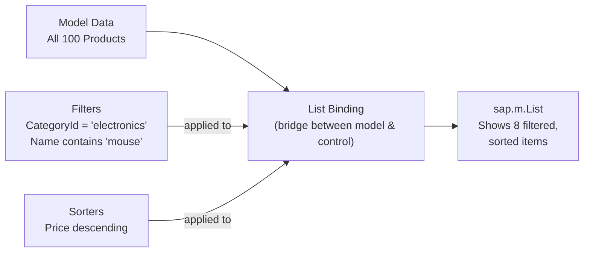

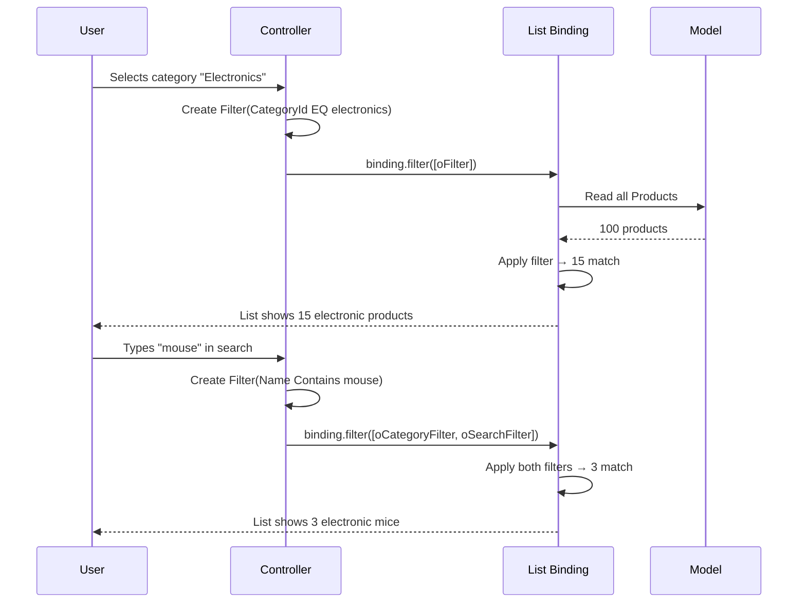

---

## sap.ui.model.Filter

The `Filter` class defines a condition that items must match to be displayed.

### Filter Constructor

There are two ways to create a Filter:

**Simple constructor** (positional arguments):

```javascript
new Filter(sPath, sOperator, oValue1, oValue2);

// Examples:
new Filter("CategoryId", FilterOperator.EQ, "electronics")
new Filter("Price", FilterOperator.BT, 10, 100)        // Between 10 and 100
new Filter("Name", FilterOperator.Contains, "mouse")
```

**Object constructor** (named arguments):

```javascript
new Filter({
    path: "Name",
    operator: FilterOperator.Contains,
    value1: "mouse",
    caseSensitive: false    // case-insensitive match
});
```

### FilterOperator Values

`sap.ui.model.FilterOperator` is an enum with all comparison operators:

| Operator | Meaning | SQL Equivalent | Example |
|----------|---------|---------------|---------|
| `EQ` | Equals | `= 'x'` | `new Filter("Status", EQ, "active")` |
| `NE` | Not Equals | `!= 'x'` | `new Filter("Status", NE, "deleted")` |
| `GT` | Greater Than | `> x` | `new Filter("Price", GT, 50)` |
| `GE` | Greater or Equal | `>= x` | `new Filter("Rating", GE, 4)` |
| `LT` | Less Than | `< x` | `new Filter("Price", LT, 100)` |
| `LE` | Less or Equal | `<= x` | `new Filter("Stock", LE, 5)` |
| `BT` | Between | `BETWEEN x AND y` | `new Filter("Price", BT, 10, 100)` |
| `Contains` | Contains substring | `LIKE '%x%'` | `new Filter("Name", Contains, "mouse")` |
| `StartsWith` | Starts with | `LIKE 'x%'` | `new Filter("Name", StartsWith, "Wire")` |
| `EndsWith` | Ends with | `LIKE '%x'` | `new Filter("Name", EndsWith, "Pro")` |
| `Any` | Lambda: any match in collection | `any(x: x/y eq z)` | OData v4 collection filter |
| `All` | Lambda: all match in collection | `all(x: x/y eq z)` | OData v4 collection filter |

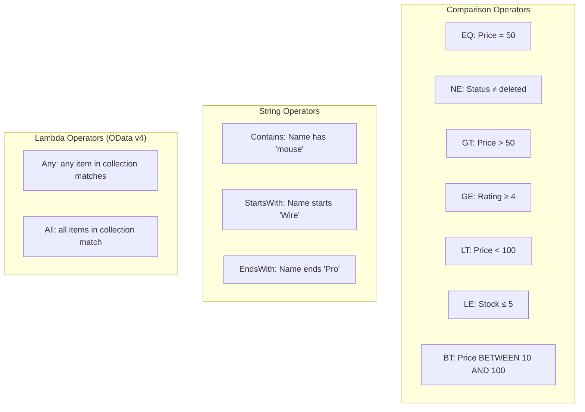

---

## Multi-Filters: Combining with AND / OR

Real-world filtering often requires combining multiple conditions.

### AND Logic — All Conditions Must Match

```javascript
// Show products that are:
// - In the "electronics" category AND
// - Priced over $50 AND
// - In stock

var oFilter = new Filter({
    filters: [
        new Filter("CategoryId", FilterOperator.EQ, "electronics"),
        new Filter("Price", FilterOperator.GT, 50),
        new Filter("Stock", FilterOperator.GT, 0)
    ],
    and: true   // ← AND logic
});
```

### OR Logic — Any Condition Can Match

```javascript
// Show products in "electronics" OR "accessories"
var oFilter = new Filter({
    filters: [
        new Filter("CategoryId", FilterOperator.EQ, "electronics"),
        new Filter("CategoryId", FilterOperator.EQ, "accessories")
    ],
    and: false  // ← OR logic (this is the default)
});
```

### Nesting AND and OR (Complex Logic)

```javascript
// (CategoryId = 'electronics' OR CategoryId = 'accessories')
// AND (Price > 10)
// AND (Rating >= 4)

var oCategoryFilter = new Filter({
    filters: [
        new Filter("CategoryId", FilterOperator.EQ, "electronics"),
        new Filter("CategoryId", FilterOperator.EQ, "accessories")
    ],
    and: false  // OR between categories
});

var oFinalFilter = new Filter({
    filters: [
        oCategoryFilter,
        new Filter("Price", FilterOperator.GT, 10),
        new Filter("Rating", FilterOperator.GE, 4)
    ],
    and: true   // AND between all criteria
});
```

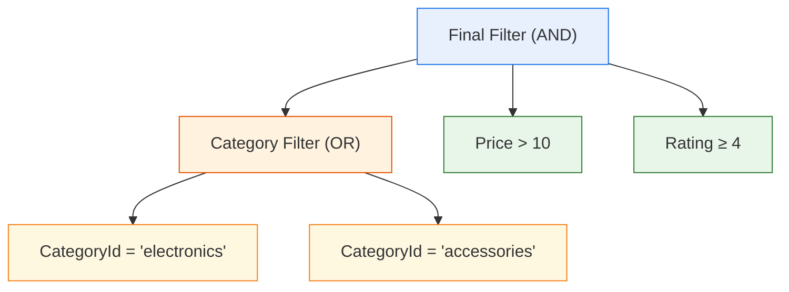

### Shortcut: Array of Filters

When you pass an **array** of Filter objects to `binding.filter()`, they are combined with **AND logic by default**:

```javascript
// These two are equivalent:
oBinding.filter([filterA, filterB]);

oBinding.filter(new Filter({
    filters: [filterA, filterB],
    and: true
}));
```

---

## Applying Filters to List Bindings

Filters are applied to the **binding** of a list control's aggregation:

```javascript
// Step 1: Get the list control
var oList = this.byId("productList");

// Step 2: Get the binding for the "items" aggregation
var oBinding = oList.getBinding("items");

// Step 3: Apply filters
oBinding.filter(aFilters);
```

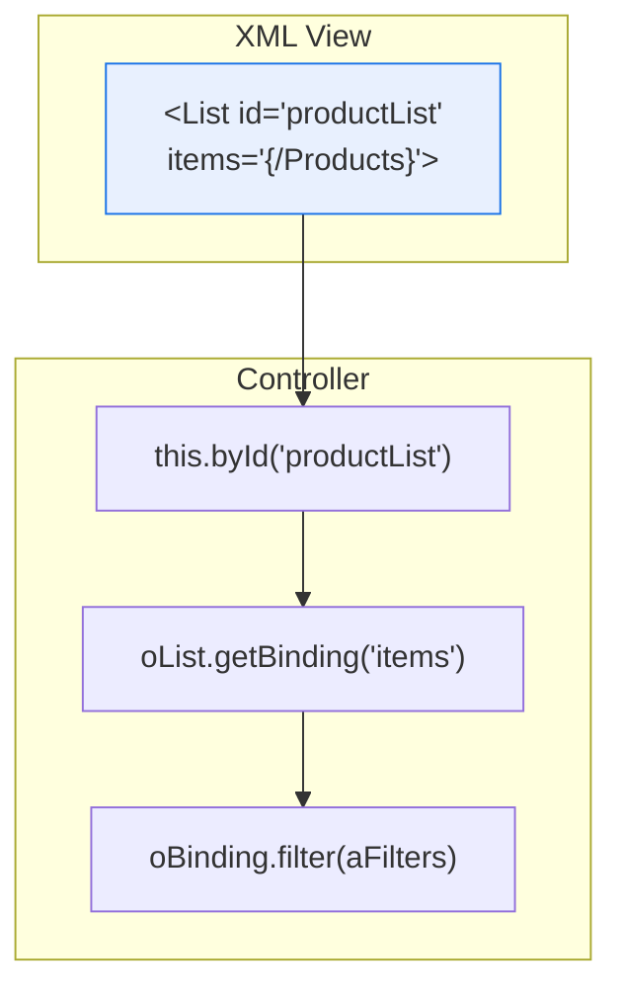

### Removing All Filters

Pass an empty array to clear all filters:

```javascript
oBinding.filter([]);
// → Shows ALL items (no filtering)
```

> **GOTCHA**: Passing `null` or `undefined` may cause errors. Always use an empty array `[]` to remove filters.

### FilterType: Application vs Control

```javascript
// Application filters (your business logic)
oBinding.filter(aFilters, sap.ui.model.FilterType.Application);

// Control filters (set by the control itself, e.g., growing list)
oBinding.filter(aFilters, sap.ui.model.FilterType.Control);
```

Application and Control filters are combined with AND logic. This lets controls add their own filters without conflicting with your business filters.

---

## Client-Side vs Server-Side Filtering

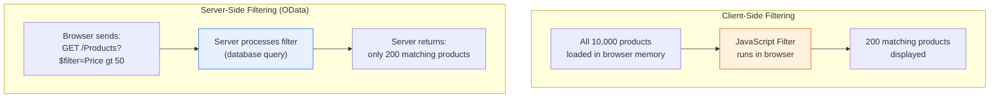

| Aspect | Client-Side | Server-Side (OData) |
|--------|-------------|-------------------|
| **Where filtering happens** | In the browser (JavaScript) | On the server (database) |
| **Network requests** | One initial load (all data) | One request per filter change |
| **Performance for small data** | Fast (no network round-trip) | Slower (network overhead) |
| **Performance for large data** | Slow (loading 10K+ items) | Fast (server handles it) |
| **Works with** | JSONModel, loaded OData data | ODataModel |
| **Memory usage** | High (all data in memory) | Low (only filtered results) |
| **When to use** | < 1,000 items, JSONModel | > 1,000 items, real OData |

### How It Works in Code

**Client-side** (JSONModel — our ShopEasy mock setup):

```javascript
// All data is already in the browser
var oBinding = oList.getBinding("items");
oBinding.filter(new Filter("Name", FilterOperator.Contains, "mouse"));
// → Filters in-memory, instant result
```

**Server-side** (ODataModel — production):

```javascript
// The filter is sent to the server as a $filter query parameter
var oBinding = oList.getBinding("items");
oBinding.filter(new Filter("Name", FilterOperator.Contains, "mouse"));
// → Triggers: GET /Products?$filter=substringof('mouse',Name)
// → Server queries database and returns only matching products
```

The code looks **identical**! The ODataModel automatically translates UI5 Filter objects into OData `$filter` query parameters. This is one of UI5's biggest strengths — you can develop with mock data (client-side) and switch to a real backend (server-side) without changing your controller code.

---

## sap.ui.model.Sorter

The `Sorter` class defines how items are ordered in a list.

### Sorter Constructor

```javascript
new Sorter(sPath, bDescending, fnGroupFunction, fnComparator);
```

| Parameter | Type | Description | Default |
|-----------|------|-------------|---------|
| `sPath` | `string` | The model property to sort by | (required) |
| `bDescending` | `boolean` | `true` for Z→A / high→low | `false` |
| `fnGroupFunction` | `function` | Groups items (covered below) | `null` |
| `fnComparator` | `function` | Custom compare function | UI5's built-in |

```javascript
// Sort by Name, ascending (A → Z)
new Sorter("Name", false)

// Sort by Price, descending (high → low)
new Sorter("Price", true)

// Sort by Rating, descending (best first)
new Sorter("Rating", true)
```

---

## Applying Sorters

Sorters are applied the same way as filters — through the binding:

```javascript
var oList = this.byId("productList");
var oBinding = oList.getBinding("items");

// Single sorter
oBinding.sort(new Sorter("Price", true));

// Multiple sorters (primary + secondary)
oBinding.sort([
    new Sorter("CategoryId", false),   // Primary: by category (A→Z)
    new Sorter("Price", true)          // Secondary: by price (high→low) within each category
]);

// Remove all sorting
oBinding.sort([]);
```

### Our ShopEasy Sort Handler

```javascript
onSortChange: function (oEvent) {
    var sSelectedKey = oEvent.getParameter("selectedItem").getKey();
    var bDescending = (sSelectedKey === "Price");

    var oSorter = new Sorter(sSelectedKey, bDescending);

    var oList = this.byId("productList");
    oList.getBinding("items").sort(oSorter);
}
```

---

## Grouping with Sorter

Grouping is done through the Sorter's third parameter — a **group function**. UI5 inserts group headers between groups of items.

```javascript
var oSorter = new Sorter("CategoryId", false, function (oContext) {
    var sCategoryId = oContext.getProperty("CategoryId");
    return {
        key: sCategoryId,
        text: "Category: " + sCategoryId
    };
});

oList.getBinding("items").sort(oSorter);
```

This produces:

```
─── Category: Accessories ───
  Mouse Pad         $12.99
  USB Cable         $8.99

─── Category: Electronics ───
  Laptop            $999.00
  Wireless Mouse    $29.99
  Mechanical Keyboard $79.99
```

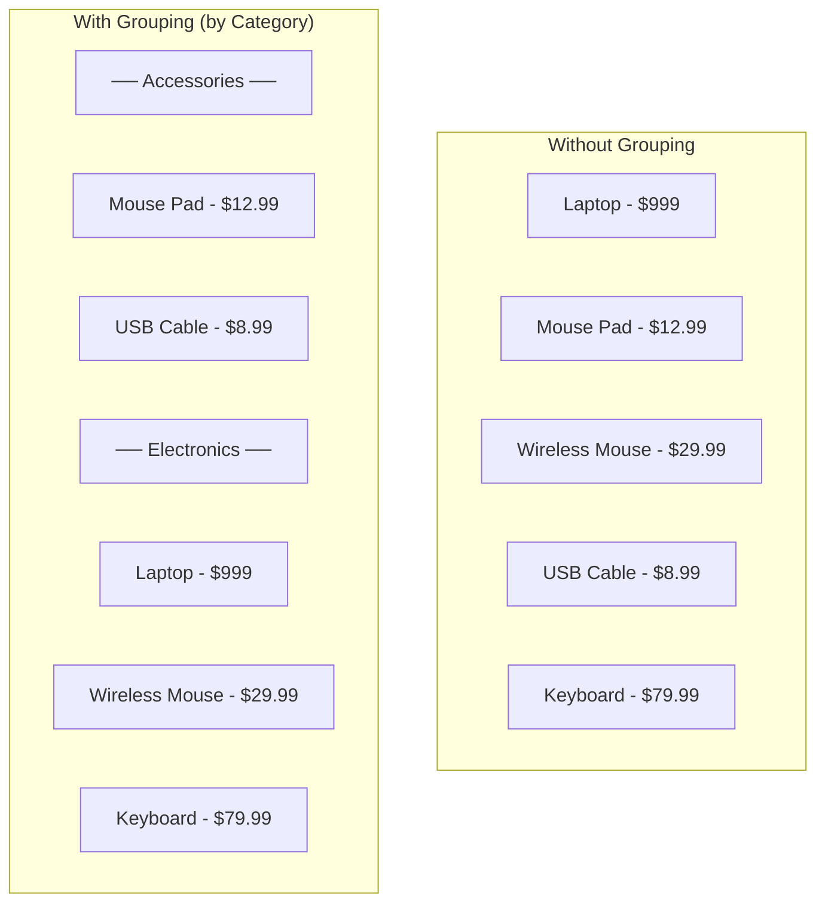

---

## ViewSettingsDialog

`sap.m.ViewSettingsDialog` is a ready-made dialog that lets users configure **sorting, filtering, and grouping** from a standard UI — no custom dialog needed.

```javascript
sap.ui.define([
    "sap/m/ViewSettingsDialog",
    "sap/m/ViewSettingsItem",
    "sap/m/ViewSettingsFilterItem"
], function (ViewSettingsDialog, ViewSettingsItem, ViewSettingsFilterItem) {

    onOpenViewSettings: function () {
        if (!this._oViewSettingsDialog) {
            this._oViewSettingsDialog = new ViewSettingsDialog({
                title: "Settings",

                // Sort options
                sortItems: [
                    new ViewSettingsItem({ text: "Name", key: "Name" }),
                    new ViewSettingsItem({ text: "Price", key: "Price" }),
                    new ViewSettingsItem({ text: "Rating", key: "Rating" })
                ],

                // Group options
                groupItems: [
                    new ViewSettingsItem({ text: "Category", key: "CategoryId" }),
                    new ViewSettingsItem({ text: "Availability", key: "Stock" })
                ],

                // Filter options
                filterItems: [
                    new ViewSettingsFilterItem({
                        text: "Price Range",
                        key: "Price",
                        multiSelect: false,
                        items: [
                            new ViewSettingsItem({ text: "Under $50", key: "Price___LT___50" }),
                            new ViewSettingsItem({ text: "$50 - $100", key: "Price___BT___50___100" }),
                            new ViewSettingsItem({ text: "Over $100", key: "Price___GT___100" })
                        ]
                    })
                ],

                confirm: this._onViewSettingsConfirm.bind(this)
            });
        }

        this._oViewSettingsDialog.open();
    },

    _onViewSettingsConfirm: function (oEvent) {
        var oBinding = this.byId("productList").getBinding("items");

        // Apply sort
        var sSortPath = oEvent.getParameter("sortItem").getKey();
        var bDescending = oEvent.getParameter("sortDescending");
        var aSorters = [new Sorter(sSortPath, bDescending)];

        // Apply group
        var oGroupItem = oEvent.getParameter("groupItem");
        if (oGroupItem) {
            var sGroupPath = oGroupItem.getKey();
            aSorters.unshift(new Sorter(sGroupPath, false, true));
        }

        oBinding.sort(aSorters);

        // Apply filters (simplified)
        var aFilters = [];
        var aFilterItems = oEvent.getParameter("filterItems");
        // ... build filters from selected items ...
        oBinding.filter(aFilters);
    }
});
```

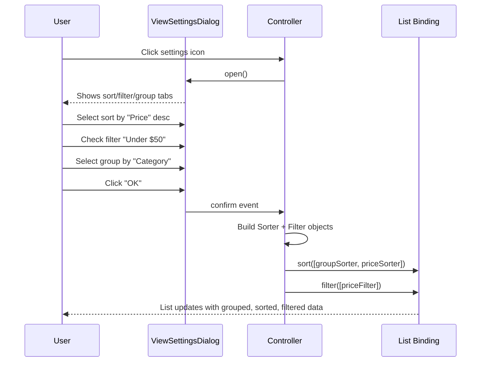

---

## SearchField Integration

The `sap.m.SearchField` is typically placed in a toolbar above a list:

```xml
<OverflowToolbar>
    <Title text="{i18n>productsTitle}" />
    <ToolbarSpacer />
    <SearchField
        width="300px"
        placeholder="{i18n>search}"
        search=".onSearch" />
</OverflowToolbar>
```

### Search Handler Pattern

```javascript
onSearch: function (oEvent) {
    var sQuery = oEvent.getParameter("query") || "";
    var aFilters = [];

    if (sQuery) {
        aFilters.push(
            new Filter("Name", FilterOperator.Contains, sQuery)
        );
    }

    // Combine with existing category filter
    if (this._sCategoryId) {
        aFilters.push(
            new Filter("CategoryId", FilterOperator.EQ, this._sCategoryId)
        );
    }

    this.byId("productList").getBinding("items").filter(aFilters);
}
```

### Search Across Multiple Fields

To search in both Name AND Description:

```javascript
onSearch: function (oEvent) {
    var sQuery = oEvent.getParameter("query") || "";
    var aFilters = [];

    if (sQuery) {
        // OR: match in Name OR Description
        var oSearchFilter = new Filter({
            filters: [
                new Filter("Name", FilterOperator.Contains, sQuery),
                new Filter("Description", FilterOperator.Contains, sQuery)
            ],
            and: false  // OR logic
        });
        aFilters.push(oSearchFilter);
    }

    this.byId("productList").getBinding("items").filter(aFilters);
}
```

---

## FilterBar for Complex Filter UIs

For apps with many filter criteria, use `sap.ui.comp.filterbar.FilterBar` (enterprise library) or build a custom filter panel:

```xml
<!-- Custom filter panel using standard sap.m controls -->
<Panel headerText="Filters" expandable="true" expanded="false">
    <content>
        <HBox alignItems="End" class="sapUiSmallMargin">
            <VBox class="sapUiSmallMarginEnd">
                <Label text="Category" />
                <Select id="categoryFilter" change=".onFilterChange">
                    <items>
                        <core:Item key="" text="All" />
                        <core:Item key="electronics" text="Electronics" />
                        <core:Item key="accessories" text="Accessories" />
                        <core:Item key="clothing" text="Clothing" />
                    </items>
                </Select>
            </VBox>

            <VBox class="sapUiSmallMarginEnd">
                <Label text="Min Price" />
                <Input id="minPriceFilter" type="Number" placeholder="0" change=".onFilterChange" />
            </VBox>

            <VBox class="sapUiSmallMarginEnd">
                <Label text="Max Price" />
                <Input id="maxPriceFilter" type="Number" placeholder="999" change=".onFilterChange" />
            </VBox>

            <VBox>
                <Label text="In Stock Only" />
                <CheckBox id="inStockFilter" select=".onFilterChange" />
            </VBox>
        </HBox>
    </content>
</Panel>
```

---

## Performance: Client vs Server

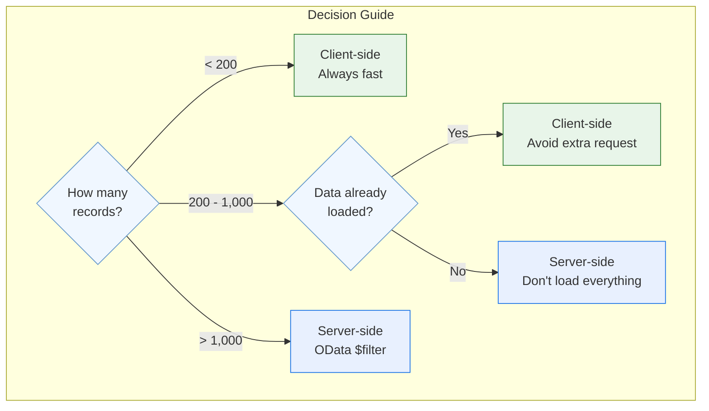

### Best Practices

| Practice | Why |
|----------|-----|
| Use server-side filtering for large datasets | Avoids loading thousands of records into the browser |
| Use client-side filtering for JSONModel | JSONModel data is always local — no server to query |
| Debounce live search | Prevents firing a filter on every keystroke |
| Show a loading indicator | User knows something is happening during server-side filtering |
| Combine search + category filter with AND | Users expect to search within a filtered category |
| Reset filters on navigation | Avoids stale filters when returning to a page |

---

## In Our ShopEasy App

### ProductList.controller.js — Filter & Sort in Action

Our ProductList controller demonstrates the core patterns:

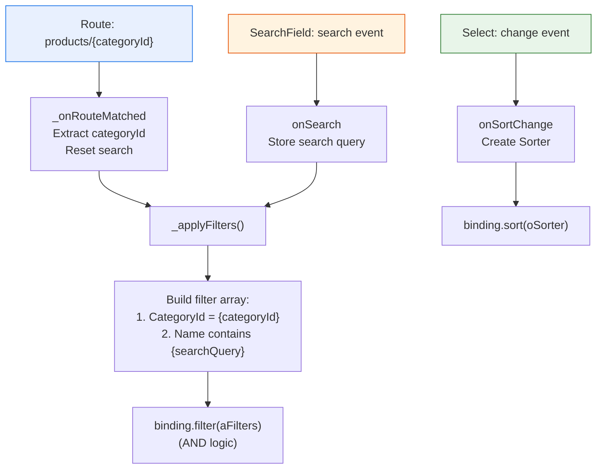

### How _applyFilters() Combines Criteria

```javascript
_applyFilters: function () {
    var aFilters = [];

    // Category filter (from route parameter)
    if (this._sCategoryId) {
        aFilters.push(
            new Filter("CategoryId", FilterOperator.EQ, this._sCategoryId)
        );
    }

    // Search filter (from SearchField)
    if (this._sSearchQuery) {
        aFilters.push(
            new Filter("Name", FilterOperator.Contains, this._sSearchQuery)
        );
    }

    // Apply both filters (AND logic: show products matching
    // the category AND containing the search text)
    var oBinding = this.byId("productList").getBinding("items");
    if (oBinding) {
        oBinding.filter(aFilters);
    }
}
```

---

## Summary

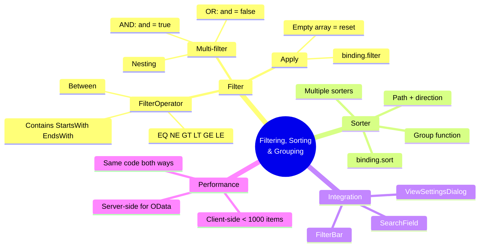

### Key Takeaways

1. **Filter and Sorter operate on bindings**, not on model data directly
2. **FilterOperator** provides all comparison types: EQ, Contains, BT, GT, etc.
3. **Combine filters** with AND (`and: true`) or OR (`and: false`) — nesting is supported
4. **Apply with `binding.filter()`** — pass an empty array `[]` to reset
5. **Sorter** takes a path and direction — pass an array for multi-level sorting
6. **Grouping** uses a Sorter with a group function as the third parameter
7. **ViewSettingsDialog** provides a ready-made UI for sort/filter/group
8. **Client-side vs server-side** filtering: same code, different execution — ODataModel sends `$filter` to server automatically
9. **Always reset filters in `_onRouteMatched`** to avoid stale state

---

**Previous**: [← Module 09 — Formatting & Validation](09-formatting.md)
**Next**: [Module 11 — OData Services →](11-odata.md)
