# Module 11: OData Services

> **Goal**: Understand OData — the standard data protocol used by SAP systems — and
> how UI5's ODataModel makes CRUD operations seamless.

---

## Table of Contents

- [What Is OData?](#what-is-odata)
- [OData v2 vs v4: Key Differences](#odata-v2-vs-v4-key-differences)
- [OData URL Conventions](#odata-url-conventions)
- [ODataModel v2 in UI5](#odatamodel-v2-in-ui5)
  - [Constructor and Service URL](#constructor-and-service-url)
  - [CRUD Operations](#crud-operations)
  - [Batch Mode and Change Groups](#batch-mode-and-change-groups)
  - [Deferred Mode](#deferred-mode)
  - [Event Handling](#event-handling)
- [Binding to OData](#binding-to-odata)
- [Metadata: What It Is and Why It Matters](#metadata-what-it-is-and-why-it-matters)
- [Mock Server: Simulating OData Without a Backend](#mock-server-simulating-odata-without-a-backend)
- [Error Handling with OData](#error-handling-with-odata)
- [OData in Real SAP Projects](#odata-in-real-sap-projects)
- [In Our ShopEasy App](#in-our-shopeasy-app)

---

## What Is OData?

**OData** (Open Data Protocol) is a standardized RESTful protocol for building and consuming data APIs. SAP adopted OData as its **primary data protocol** — virtually every SAP backend service exposes data through OData.

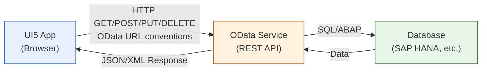

### Why OData?

| Benefit | Explanation |
|---------|-------------|
| **Standardized** | One protocol across all SAP systems — learn it once, use everywhere |
| **Self-describing** | The `$metadata` document describes the entire API (no Swagger needed) |
| **Query capabilities** | Built-in filtering, sorting, paging, expanding — no custom API design |
| **CRUD built-in** | GET (read), POST (create), PUT/MERGE (update), DELETE — all standardized |
| **UI5 integration** | UI5's ODataModel handles everything automatically |
| **Batch requests** | Multiple operations in a single HTTP call |

### OData vs REST Comparison

| Feature | Plain REST API | OData |
|---------|---------------|-------|
| URL structure | You design it | Standardized (`/EntitySet('key')`) |
| Filtering | Custom query params | `$filter=Price gt 50` |
| Sorting | Custom query params | `$orderby=Price desc` |
| Pagination | Custom (page/size) | `$top=10&$skip=20` |
| Metadata | Swagger/OpenAPI (separate) | `$metadata` (built-in) |
| Response format | You design it | Standardized JSON/XML structure |
| Client library | You write it | UI5 ODataModel handles it |

---

## OData v2 vs v4: Key Differences

SAP supports both versions, but they have significantly different APIs in UI5.

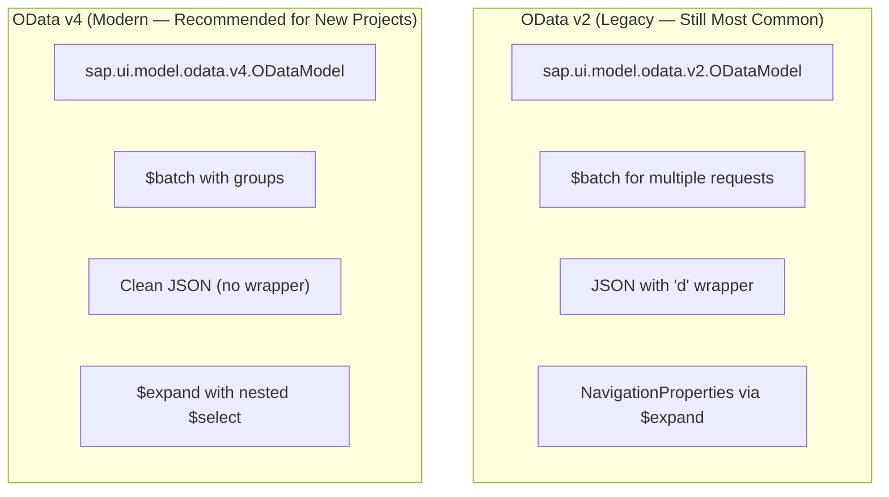

| Aspect | OData v2 | OData v4 |
|--------|----------|----------|
| **UI5 Model class** | `sap.ui.model.odata.v2.ODataModel` | `sap.ui.model.odata.v4.ODataModel` |
| **CRUD methods** | `read()`, `create()`, `update()`, `remove()` | Binding-based (no direct methods) |
| **Batch** | `submitChanges()`, `resetChanges()` | Group-based batch |
| **JSON format** | `{ "d": { "results": [...] } }` | `{ "value": [...] }` |
| **Filter syntax** | `substringof('x', Name)` | `contains(Name, 'x')` |
| **SAP adoption** | Most existing SAP systems | New SAP CAP projects, S/4HANA Cloud |
| **API complexity** | Imperative (call methods) | Declarative (binding-driven) |

> **For this learning project**, we use OData v2 because it's the most common in existing SAP projects. The concepts are transferable to v4.

> **GOTCHA**: v2 and v4 have **completely different APIs**. Code written for v2 will **not** work with v4 and vice versa. Always check which version your project uses.

---

## OData URL Conventions

OData URLs follow a predictable structure. Understanding this structure helps you debug network requests in the browser DevTools.

### Basic URL Structure

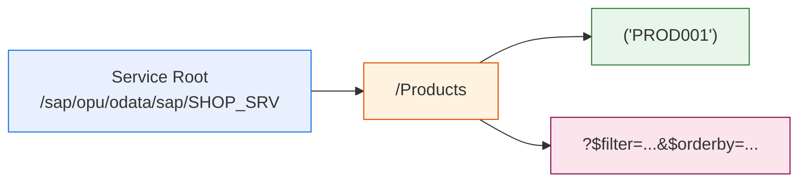

### URL Examples

| URL | Description | Returns |
|-----|-------------|---------|
| `/Products` | All products | Array of all products |
| `/Products('PROD001')` | Single product by key | One product object |
| `/Products/$count` | Count of all products | Integer |
| `/Categories('CAT001')/Products` | Products in a category (navigation) | Array of related products |
| `/$metadata` | Service metadata document | XML schema |

### Query Options

| Query Option | Purpose | Example |
|-------------|---------|---------|
| `$filter` | Filter results | `$filter=Price gt 50` |
| `$orderby` | Sort results | `$orderby=Price desc` |
| `$top` | Limit number of results | `$top=10` |
| `$skip` | Skip first N results (paging) | `$skip=20` |
| `$select` | Choose specific fields | `$select=Name,Price` |
| `$expand` | Include related entities | `$expand=Category` |
| `$count` / `$inlinecount` | Include total count | `$inlinecount=allpages` |

### Complete URL Example

```
GET /sap/opu/odata/sap/SHOP_SRV/Products
    ?$filter=CategoryId eq 'electronics' and Price gt 50
    &$orderby=Price desc
    &$top=10
    &$skip=0
    &$select=ProductId,Name,Price,Stock
    &$expand=Category
    &$inlinecount=allpages
```

This request says: "Give me the first 10 electronic products priced over $50, sorted by price (highest first), including their category details, and tell me the total count."

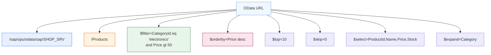

---

## ODataModel v2 in UI5

### Constructor and Service URL

The ODataModel is typically created declaratively in `manifest.json`:

```json
{
    "sap.app": {
        "dataSources": {
            "mainService": {
                "uri": "/sap/opu/odata/sap/SHOP_SRV/",
                "type": "OData",
                "settings": {
                    "odataVersion": "2.0",
                    "localUri": "localService/metadata.xml"
                }
            }
        }
    },
    "sap.ui5": {
        "models": {
            "": {
                "dataSource": "mainService",
                "preload": true,
                "settings": {
                    "defaultBindingMode": "TwoWay",
                    "useBatch": true
                }
            }
        }
    }
}
```

Or programmatically (less common):

```javascript
var oModel = new sap.ui.model.odata.v2.ODataModel({
    serviceUrl: "/sap/opu/odata/sap/SHOP_SRV/",
    defaultBindingMode: "TwoWay",
    useBatch: true
});
this.setModel(oModel);
```

### CRUD Operations

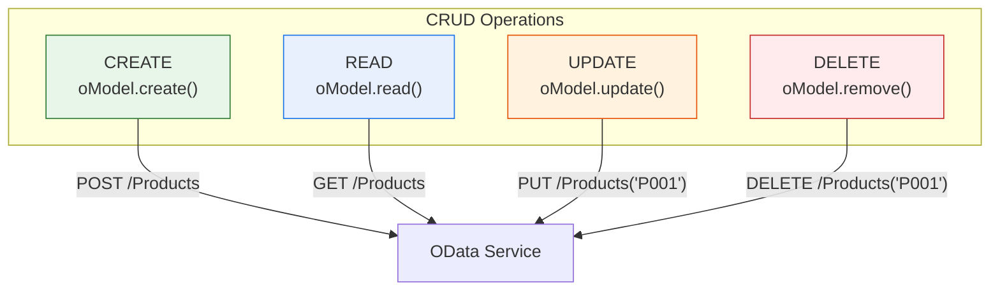

#### READ — Fetch Data

```javascript
var oModel = this.getModel();

oModel.read("/Products", {
    success: function (oData) {
        // oData.results is an array of all products
        console.log("Products:", oData.results);
    },
    error: function (oError) {
        console.error("Read failed:", oError);
    }
});

// Read a single entity
oModel.read("/Products('PROD001')", {
    success: function (oData) {
        // oData is the single product object
        console.log("Product:", oData.Name);
    },
    error: function (oError) {
        console.error("Read failed:", oError);
    }
});

// Read with query options
oModel.read("/Products", {
    filters: [new Filter("CategoryId", FilterOperator.EQ, "electronics")],
    sorters: [new Sorter("Price", true)],
    urlParameters: {
        "$top": "10",
        "$select": "ProductId,Name,Price"
    },
    success: function (oData) {
        console.log("Filtered products:", oData.results);
    }
});
```

#### CREATE — Add New Data

```javascript
var oNewProduct = {
    ProductId: "PROD999",
    Name: "New Gadget",
    Price: "49.99",
    CategoryId: "electronics",
    Stock: 100
};

oModel.create("/Products", oNewProduct, {
    success: function (oData) {
        sap.m.MessageToast.show("Product created: " + oData.Name);
    },
    error: function (oError) {
        sap.m.MessageBox.error("Creation failed");
    }
});
```

#### UPDATE — Modify Existing Data

```javascript
var oUpdatedData = {
    Price: "39.99",
    Stock: 50
};

// update() sends PUT (replace entire entity)
oModel.update("/Products('PROD001')", oUpdatedData, {
    success: function () {
        sap.m.MessageToast.show("Product updated");
    },
    error: function (oError) {
        sap.m.MessageBox.error("Update failed");
    }
});

// For partial updates, some services support MERGE:
oModel.update("/Products('PROD001')", oUpdatedData, {
    merge: true  // Sends MERGE instead of PUT
});
```

#### DELETE — Remove Data

```javascript
oModel.remove("/Products('PROD001')", {
    success: function () {
        sap.m.MessageToast.show("Product deleted");
    },
    error: function (oError) {
        sap.m.MessageBox.error("Deletion failed");
    }
});
```

### Batch Mode and Change Groups

When `useBatch: true`, UI5 bundles multiple OData requests into a single HTTP `$batch` request. This reduces network overhead dramatically.

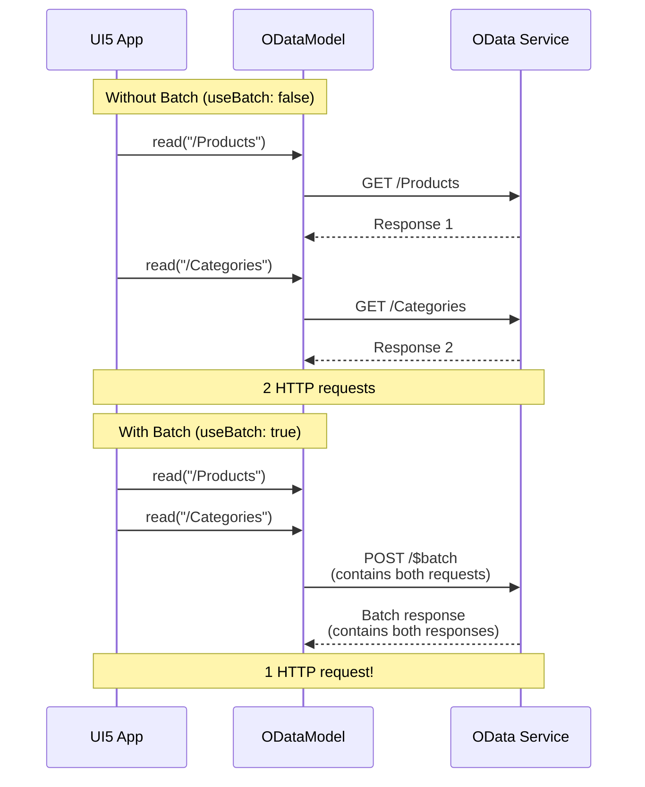

#### Change Groups

You can organize operations into groups that are submitted together:

```javascript
// Default group — all reads go here
oModel.read("/Products", { /* ... */ });

// Named group — collect changes before submitting
oModel.create("/Products", oNewProduct, {
    groupId: "myChanges"
});

oModel.update("/Products('PROD001')", oData, {
    groupId: "myChanges"
});

// Submit all changes in the group at once
oModel.submitChanges({
    groupId: "myChanges",
    success: function () {
        sap.m.MessageToast.show("All changes saved");
    },
    error: function () {
        sap.m.MessageBox.error("Save failed");
    }
});

// Or discard all pending changes
oModel.resetChanges(["myChanges"]);
```

### Deferred Mode

By default, OData bindings trigger reads automatically. In **deferred mode**, you control when reads happen:

```javascript
var oModel = new sap.ui.model.odata.v2.ODataModel({
    serviceUrl: "/sap/opu/odata/sap/SHOP_SRV/",
    defaultOperationMode: sap.ui.model.odata.OperationMode.Client,
    deferredGroups: ["myReads"]
});

// This read won't execute immediately
oModel.read("/Products", { groupId: "myReads" });

// Execute when you're ready
oModel.submitChanges({ groupId: "myReads" });
```

### Event Handling

The ODataModel fires events you can listen to:

```javascript
var oModel = this.getModel();

// Fires after any request completes successfully
oModel.attachRequestCompleted(function (oEvent) {
    var sUrl = oEvent.getParameter("url");
    console.log("Request completed:", sUrl);
});

// Fires when any request fails
oModel.attachRequestFailed(function (oEvent) {
    var oResponse = oEvent.getParameter("response");
    console.error("Request failed:", oResponse.statusCode, oResponse.statusText);
});

// Fires when batch request is sent
oModel.attachBatchRequestSent(function () {
    console.log("Batch request sent");
});

// Fires when all metadata is loaded
oModel.attachMetadataLoaded(function () {
    console.log("Metadata loaded — model is ready");
});

// Fires when metadata loading fails
oModel.attachMetadataFailed(function () {
    console.error("Could not load OData metadata!");
});
```

---

## Binding to OData

One of UI5's most powerful features: when you bind a control to an OData path, the **ODataModel automatically fetches the data** from the server. You don't call `read()` manually for most use cases.

```xml
<!-- This automatically triggers: GET /Products -->
<List items="{/Products}">
    <items>
        <StandardListItem title="{Name}" description="{Description}" />
    </items>
</List>

<!-- This automatically triggers: GET /Products('PROD001') -->
<!-- (when the binding context is set to this path) -->
<ObjectHeader
    title="{Name}"
    number="{Price}"
    numberUnit="{Currency}" />
```

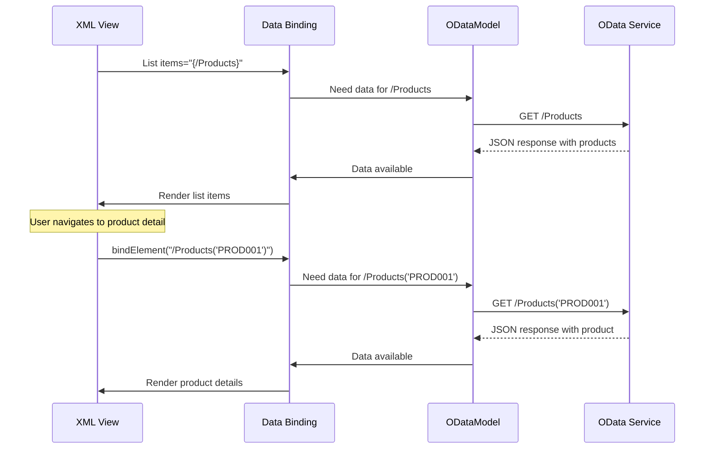

### Element Binding (Binding a Specific Entity)

To display a single entity (e.g., a product detail page), use **element binding**:

```javascript
// In the controller — bind the view to a specific product
this.getView().bindElement({
    path: "/Products('PROD001')",
    events: {
        dataRequested: function () {
            this.getView().setBusy(true);
        }.bind(this),
        dataReceived: function () {
            this.getView().setBusy(false);
        }.bind(this)
    }
});
```

After this call, all bindings in the view like `{Name}`, `{Price}`, `{Stock}` automatically resolve to the properties of product PROD001.

---

## Metadata: What It Is and Why It Matters

The **metadata document** (`$metadata`) describes the entire data structure of an OData service. It's like a database schema or a TypeScript type definition — but for the API.

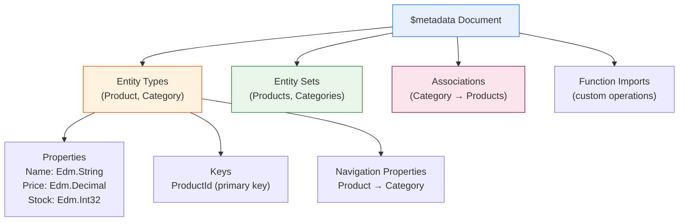

### Why Metadata Matters

1. **Automatic model behavior** — ODataModel reads the metadata to know the data types, key fields, and relationships
2. **Data binding validation** — UI5 knows that `Price` is `Edm.Decimal` and can format/validate accordingly
3. **Navigation** — The metadata defines how entities relate (Category → Products)
4. **Mock Server** — The Mock Server reads metadata to simulate the real service structure

### Our metadata.xml (Simplified)

```xml
<EntityType Name="Product">
    <Key>
        <PropertyRef Name="ProductId" />
    </Key>
    <Property Name="ProductId"   Type="Edm.String"  Nullable="false" />
    <Property Name="Name"        Type="Edm.String"  Nullable="false" />
    <Property Name="Price"       Type="Edm.Decimal" Precision="10" Scale="2" />
    <Property Name="Stock"       Type="Edm.Int32" />
    <NavigationProperty Name="Category" ... />
</EntityType>

<EntitySet Name="Products" EntityType="SHOP_SRV.Product" />
```

### Common OData Types

| Edm Type | JavaScript Equivalent | Example |
|----------|----------------------|---------|
| `Edm.String` | `string` | `"Laptop"` |
| `Edm.Int32` | `number` (integer) | `42` |
| `Edm.Int64` | `string` (too large for JS number) | `"9007199254740993"` |
| `Edm.Decimal` | `string` (precision preserved) | `"42.50"` |
| `Edm.Single` | `number` (float) | `4.7` |
| `Edm.Boolean` | `boolean` | `true` |
| `Edm.DateTime` | `Date` (v2) or `string` (v4) | `/Date(1234567890000)/` |
| `Edm.Guid` | `string` | `"550e8400-e29b-41d4-a716-446655440000"` |

---

## Mock Server: Simulating OData Without a Backend

The **Mock Server** intercepts HTTP requests in the browser and responds with local JSON data. It's essential for frontend development without a real backend.

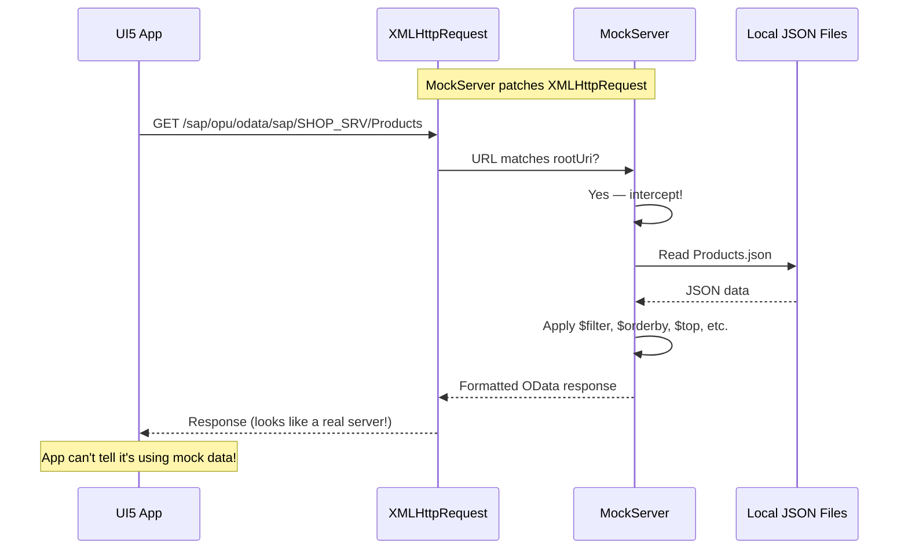

### How Mock Server Works

1. **Reads `metadata.xml`** to understand the service schema (entity types, associations, entity sets)
2. **Loads JSON files** from the `mockdata/` folder. File names must match EntitySet names:
   - `Products.json` → serves data for the `Products` entity set
   - `Categories.json` → serves data for the `Categories` entity set
3. **Intercepts XHR requests** matching the configured `rootUri`
4. **Processes OData query options** (`$filter`, `$orderby`, `$top`, `$skip`, etc.) against the in-memory data
5. **Returns properly formatted OData responses** with correct HTTP status codes

### Mock Server Setup (Our App)

```javascript
// webapp/localService/mockserver.js
sap.ui.define([
    "sap/ui/core/util/MockServer",
    "sap/base/Log"
], function (MockServer, Log) {
    "use strict";

    var oMockServer;

    return {
        init: function () {
            var sRootUri = "/sap/opu/odata/sap/SHOP_SRV/";
            var sLocalServicePath = sap.ui.require.toUrl(
                "com/shopeasy/app/localService"
            );

            oMockServer = new MockServer({ rootUri: sRootUri });

            MockServer.config({
                autoRespond: true,
                autoRespondAfter: 500  // Simulated latency
            });

            oMockServer.simulate(
                sLocalServicePath + "/mockdata/metadata.xml",
                {
                    sMockdataBaseUrl: sLocalServicePath + "/mockdata",
                    bGenerateMissingMockData: false
                }
            );

            oMockServer.start();
            Log.info("MockServer: Running at " + sRootUri);
        },

        destroy: function () {
            if (oMockServer) {
                oMockServer.stop();
                oMockServer.destroy();
                oMockServer = null;
            }
        }
    };
});
```

### Mock Data Files

```json
// webapp/localService/mockdata/Products.json
[
    {
        "ProductId": "PROD001",
        "Name": "Laptop Pro 15",
        "Description": "High-performance laptop...",
        "Price": "999.00",
        "Currency": "USD",
        "CategoryId": "electronics",
        "Stock": 15,
        "Rating": 4.5,
        "ReviewCount": 128
    },
    {
        "ProductId": "PROD002",
        "Name": "Wireless Mouse",
        "Price": "29.99",
        "Currency": "USD",
        "CategoryId": "accessories",
        "Stock": 42,
        "Rating": 4.2,
        "ReviewCount": 89
    }
]
```

### When to Use Mock Server

| Use Mock Server | Don't Use Mock Server |
|-----------------|----------------------|
| Local development without backend | Integration testing with real backend |
| Running automated tests (QUnit, OPA5) | Performance testing (no real latency) |
| Prototyping before backend exists | Testing backend business logic |
| Demos and presentations | End-to-end testing |
| Offline development | Production |

---

## Error Handling with OData

### Handling Read/Write Errors

```javascript
oModel.read("/Products", {
    success: function (oData) {
        // Handle success
    },
    error: function (oError) {
        // oError structure:
        // {
        //   message: "HTTP request failed",
        //   statusCode: 404,
        //   statusText: "Not Found",
        //   responseText: "{ error: { ... } }"
        // }

        var sMessage = "Failed to load products";
        try {
            var oResponse = JSON.parse(oError.responseText);
            sMessage = oResponse.error.message.value;
        } catch (e) {
            // Use default message
        }

        sap.m.MessageBox.error(sMessage);
    }
});
```

### Global Error Handling

Attach to model-level events to catch all errors centrally:

```javascript
// In Component.js
init: function () {
    var oModel = this.getModel();

    oModel.attachRequestFailed(function (oEvent) {
        var oResponse = oEvent.getParameter("response");
        if (oResponse.statusCode === 401) {
            // Session expired — redirect to login
            window.location.href = "/login";
        } else if (oResponse.statusCode >= 500) {
            sap.m.MessageBox.error(
                "A server error occurred. Please try again later."
            );
        }
    });

    oModel.attachMetadataFailed(function () {
        sap.m.MessageBox.error(
            "Cannot connect to the data service. " +
            "Please check your network connection."
        );
    });
}
```

### Common HTTP Status Codes in OData

| Code | Meaning | Common Cause |
|------|---------|-------------|
| `200` | OK | Successful read |
| `201` | Created | Successful create |
| `204` | No Content | Successful update/delete |
| `400` | Bad Request | Invalid filter/query syntax |
| `401` | Unauthorized | Session expired, not logged in |
| `403` | Forbidden | No permission for this operation |
| `404` | Not Found | Entity doesn't exist |
| `409` | Conflict | Concurrent modification (ETag mismatch) |
| `500` | Server Error | Backend bug or crash |

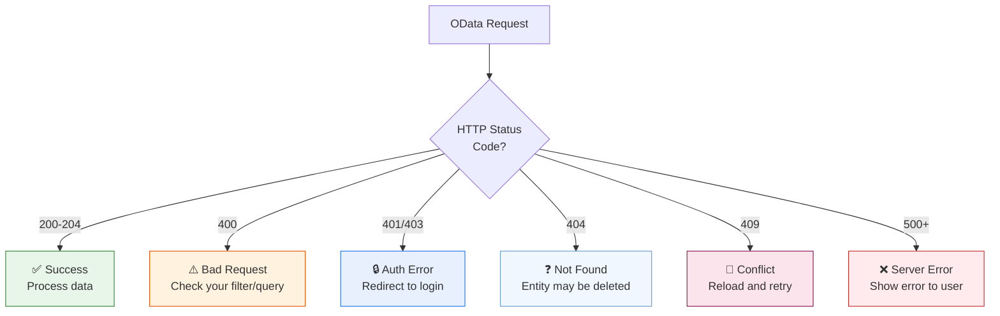

---

## OData in Real SAP Projects

### SAP Gateway (On-Premise)

In traditional SAP systems, OData services are built using **SAP Gateway** (transaction `SEGW` in ABAP):

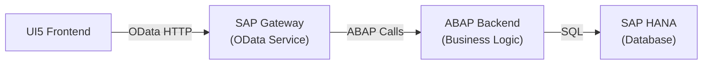

### SAP CAP (Cloud Application Programming Model)

For new cloud-native projects, SAP recommends the **Cloud Application Programming (CAP)** framework:

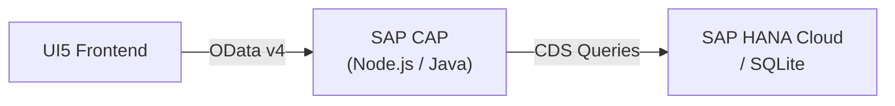

### SAP BTP (Business Technology Platform)

In cloud deployments, the architecture adds more layers:

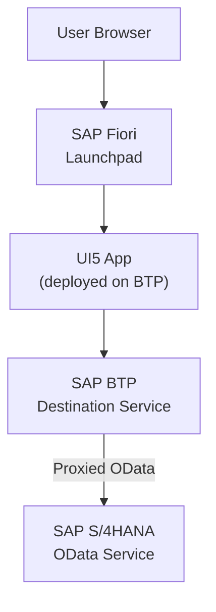

### Key Points for Real Projects

| Aspect | Detail |
|--------|--------|
| **Service URL** | In `manifest.json`, the URI might be relative (`/sap/opu/odata/sap/SERVICE/`) and resolved by the deployment platform |
| **Authentication** | Handled by the Fiori Launchpad or BTP — your app doesn't manage login |
| **CSRF Tokens** | ODataModel fetches CSRF tokens automatically for write operations |
| **ETags** | Used for optimistic locking — the server rejects updates if data changed since you read it |
| **$batch** | Always enabled in production to reduce network calls |
| **Error messages** | Backend returns structured error messages that UI5 can display via `MessageManager` |

---

## In Our ShopEasy App

### Architecture Overview

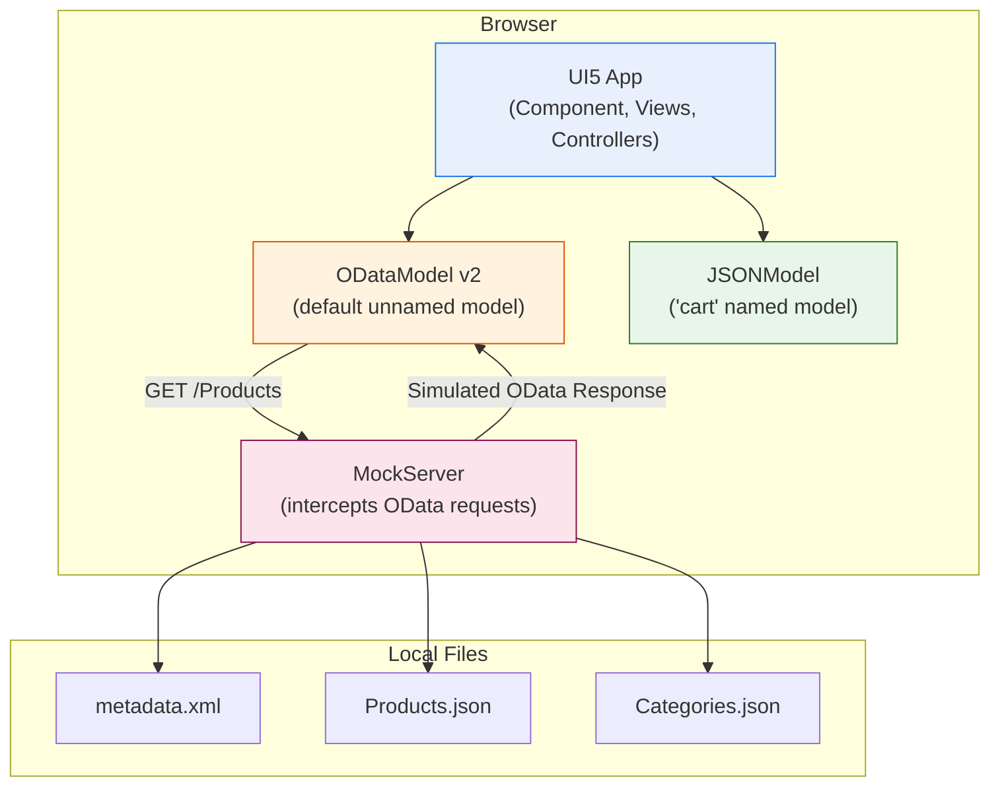

### What Happens When the App Starts

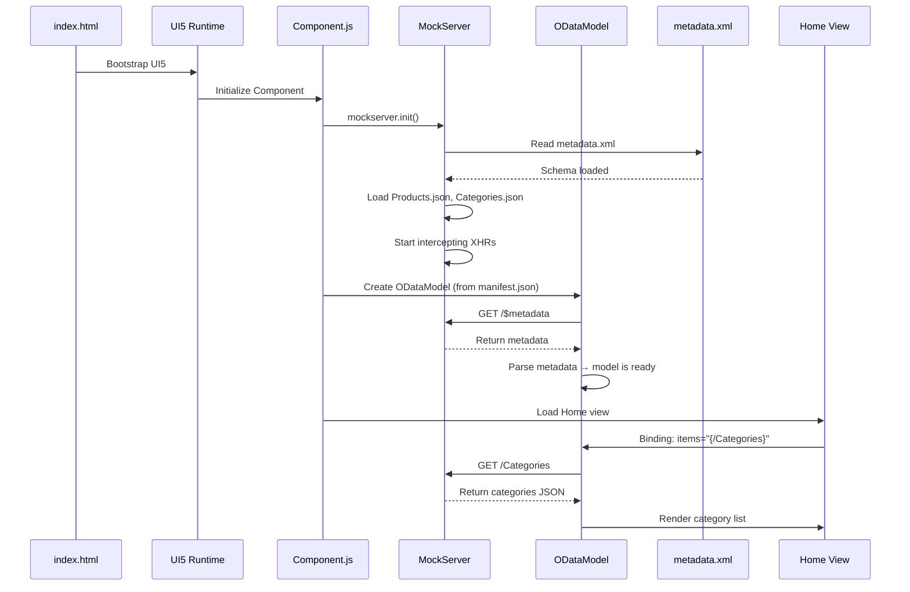

### manifest.json Data Source Configuration

```json
"dataSources": {
    "mainService": {
        "uri": "/sap/opu/odata/sap/SHOP_SRV/",
        "type": "OData",
        "settings": {
            "odataVersion": "2.0",
            "localUri": "localService/metadata.xml"
        }
    }
}
```

### File Structure

```
webapp/localService/
├── mockserver.js              ← MockServer setup
└── mockdata/
    ├── metadata.xml           ← OData schema
    ├── Products.json          ← Product data (matches "Products" EntitySet)
    └── Categories.json        ← Category data (matches "Categories" EntitySet)
```

---

## Summary

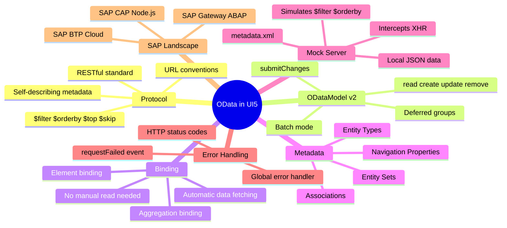

### Key Takeaways

1. **OData is SAP's standard data protocol** — learn it well, you'll use it in every SAP project
2. **OData v2 is most common** in existing systems; v4 is recommended for new CAP projects
3. **URL conventions are predictable**: `/EntitySet`, `/EntitySet('key')`, `$filter`, `$orderby`, etc.
4. **UI5's ODataModel handles everything**: binding to a path automatically triggers server requests
5. **CRUD methods**: `read()`, `create()`, `update()`, `remove()` — all with success/error callbacks
6. **Batch mode** bundles multiple requests into one HTTP call — always use it in production
7. **Mock Server** lets you develop without a backend — same code works with real OData later
8. **Error handling** should be global (model events) + local (per-request callbacks)
9. **Metadata** describes your entire API — UI5 reads it automatically to understand data types and relationships

---

**Previous**: [← Module 10 — Filtering, Sorting & Grouping](10-filtering-sorting.md)
**Next**: [Module 12 — Testing →](12-testing.md)
