# Module 12: Testing

> **Objective**: Learn how to write reliable tests for your UI5 application using QUnit for unit tests
> and OPA5 for integration tests. Understand the testing pyramid, test structure, and SAP testing best practices.

---

## Table of Contents

- [Why Testing Matters](#why-testing-matters)
- [The Testing Pyramid](#the-testing-pyramid)
- [QUnit Basics](#qunit-basics)
- [Testing UI5 Modules](#testing-ui5-modules)
- [Testing Formatters](#testing-formatters)
- [Testing Models and Helpers](#testing-models-and-helpers)
- [Testing Controllers](#testing-controllers)
- [Sinon.js: Stubs, Spies, and Mocks](#sinonjs-stubs-spies-and-mocks)
- [OPA5: Integration Testing](#opa5-integration-testing)
- [Test Pages and Runners](#test-pages-and-runners)
- [Running Tests](#running-tests)
- [Code Coverage](#code-coverage)
- [Testing Best Practices](#testing-best-practices)
- [Summary](#summary)

---

## Why Testing Matters

In enterprise SAP applications, testing is not optional — it's a **critical requirement**. Here's why:

1. **Business-critical software** — SAP applications handle payroll, supply chain, finance. A bug can cost millions.
2. **Long lifecycles** — Enterprise apps live for 10+ years. Tests protect against regressions.
3. **Large teams** — Multiple developers work on the same codebase. Tests catch integration issues.
4. **Compliance** — Many industries require test evidence for audits.
5. **Confidence to refactor** — Without tests, developers are afraid to improve code.

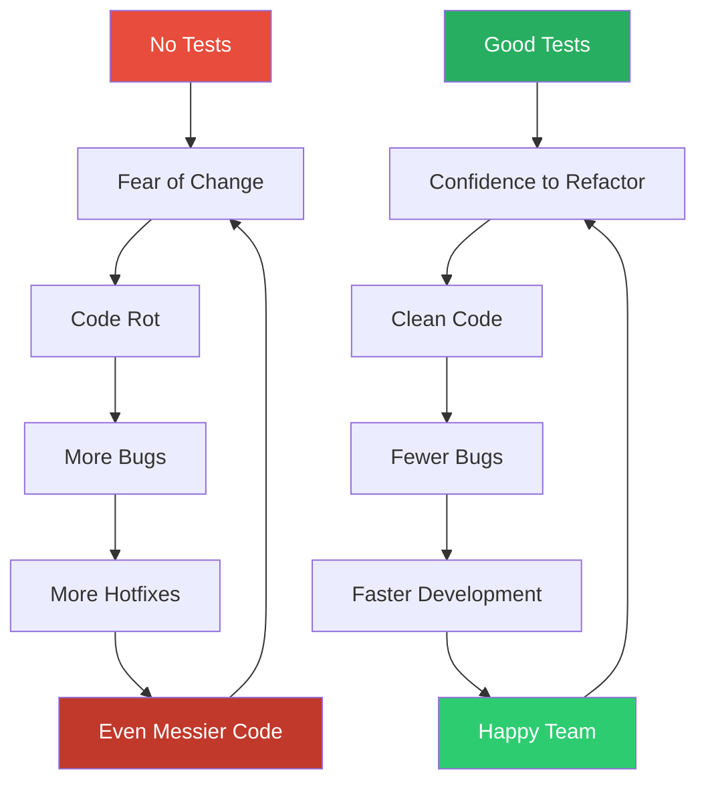

---

## The Testing Pyramid

The testing pyramid guides **how many** tests of each type you should write:

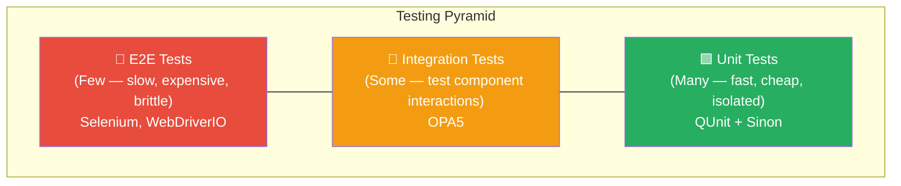

| Level | Tool in UI5 | Speed | What It Tests | How Many? |
|-------|-------------|-------|---------------|-----------|
| **Unit** | QUnit + Sinon | ⚡ Very fast (ms) | Individual functions, formatters, model logic | ~70% of tests |
| **Integration** | OPA5 | 🔄 Medium (seconds) | User flows, view interactions, navigation | ~20% of tests |
| **E2E** | Selenium / WebDriverIO | 🐢 Slow (minutes) | Full app in real browser with real backend | ~10% of tests |

### What UI5 Provides Out of the Box

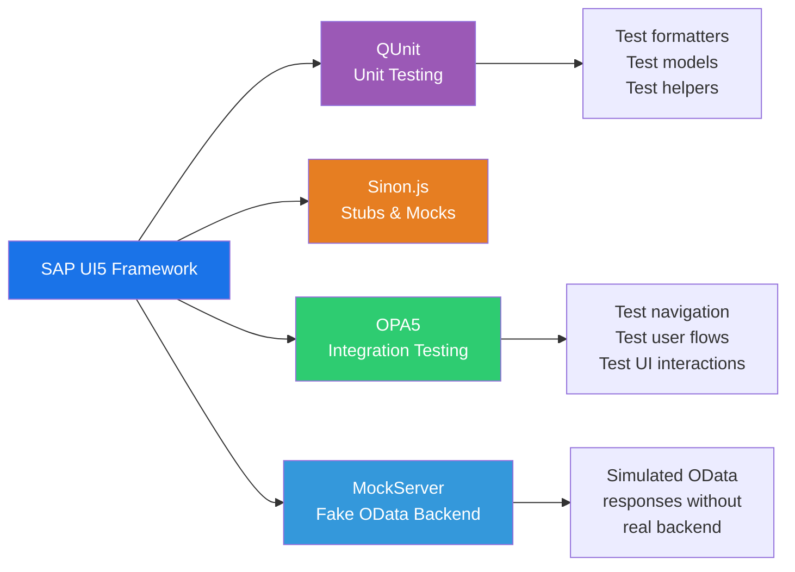

---

## QUnit Basics

[QUnit](https://qunitjs.com/) is the testing framework that ships with UI5. It was originally created for testing jQuery and is the standard for UI5 unit testing.

### QUnit.module() — Grouping Tests

`QUnit.module()` groups related tests together, similar to `describe()` in Jest/Mocha:

```javascript
// Group tests logically by feature or function
QUnit.module("Formatter", function () {

    // Nested module for a specific formatter
    QUnit.module("formatPrice", function () {
        // Tests go here...
    });

    QUnit.module("formatStatus", function () {
        // Tests go here...
    });
});
```

### QUnit.test() — Individual Tests

`QUnit.test()` defines a single test case, similar to `it()` or `test()` in Jest:

```javascript
QUnit.test("should format price with currency symbol", function (assert) {
    // Arrange
    var fPrice = 29.99;

    // Act
    var sResult = formatter.formatPrice(fPrice);

    // Assert
    assert.strictEqual(sResult, "$29.99", "Price formatted correctly");
});
```

### Assert Methods — The Complete Toolkit

QUnit provides several assertion methods. Here's every one you'll need:

```javascript
QUnit.test("Assert methods demo", function (assert) {

    // === assert.strictEqual(actual, expected, message) ===
    // Uses === comparison. THE most common assertion.
    assert.strictEqual(1 + 1, 2, "1 + 1 equals 2");
    assert.strictEqual("hello", "hello", "Strings match exactly");
    assert.strictEqual(formatter.formatPrice(10), "$10.00", "Formatted price");

    // === assert.ok(value, message) ===
    // Passes if value is truthy (not null, undefined, 0, false, "")
    assert.ok(true, "true is truthy");
    assert.ok([], "Empty array is truthy");
    assert.ok("text", "Non-empty string is truthy");
    assert.ok(model.getData(), "Model has data");

    // === assert.notOk(value, message) ===
    // Passes if value is falsy
    assert.notOk(false, "false is falsy");
    assert.notOk(null, "null is falsy");
    assert.notOk(undefined, "undefined is falsy");
    assert.notOk("", "Empty string is falsy");

    // === assert.deepEqual(actual, expected, message) ===
    // Deep comparison for objects and arrays (like lodash isEqual)
    assert.deepEqual(
        { name: "Laptop", price: 999 },
        { name: "Laptop", price: 999 },
        "Objects are deeply equal"
    );
    assert.deepEqual([1, 2, 3], [1, 2, 3], "Arrays are deeply equal");

    // === assert.throws(fn, expected, message) ===
    // Verifies that a function throws an error
    assert.throws(
        function () {
            throw new Error("Invalid input");
        },
        /Invalid input/,
        "Throws error with correct message"
    );
    assert.throws(
        function () {
            formatter.formatPrice("not a number");
        },
        Error,
        "Throws Error for invalid input"
    );
});
```

### Choosing the Right Assertion

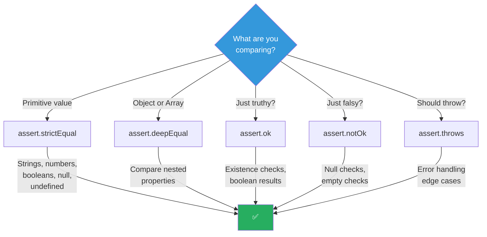

### Setup and Teardown (Hooks)

Run code before and after each test using hooks:

```javascript
QUnit.module("Cart Model", function (hooks) {

    // Runs BEFORE each test in this module
    hooks.beforeEach(function () {
        this.oCartModel = new JSONModel({
            items: [],
            totalPrice: 0
        });
    });

    // Runs AFTER each test in this module
    hooks.afterEach(function () {
        this.oCartModel.destroy();
    });

    QUnit.test("should start with empty cart", function (assert) {
        var aItems = this.oCartModel.getProperty("/items");
        assert.strictEqual(aItems.length, 0, "Cart starts empty");
    });

    QUnit.test("should add item to cart", function (assert) {
        var aItems = this.oCartModel.getProperty("/items");
        aItems.push({ name: "Laptop", price: 999 });
        this.oCartModel.setProperty("/items", aItems);
        assert.strictEqual(
            this.oCartModel.getProperty("/items").length,
            1,
            "Cart has one item"
        );
    });
});
```

---

## Testing UI5 Modules

UI5 modules are loaded asynchronously with `sap.ui.define`. Your tests must load them the same way:

```javascript
sap.ui.define([
    "com/sap/shop/model/formatter",
    "sap/ui/model/json/JSONModel"
], function (formatter, JSONModel) {
    "use strict";

    QUnit.module("Formatter Tests");

    QUnit.test("should exist", function (assert) {
        assert.ok(formatter, "Formatter module loaded successfully");
    });
});
```

### Test File Structure

```
webapp/test/
├── testsuite.qunit.html        ← Master test runner
├── unit/
│   ├── unitTests.qunit.html    ← Unit test HTML runner
│   ├── unitTests.qunit.js      ← Lists all unit test modules
│   └── model/
│       ├── formatter.js         ← Tests for formatter.js
│       └── models.js            ← Tests for models.js
└── integration/
    ├── opaTests.qunit.html     ← OPA5 test HTML runner
    ├── opaTests.qunit.js       ← Lists all OPA5 tests
    └── journeys/
        ├── NavigationJourney.js  ← Navigation test journey
        └── ShoppingJourney.js    ← Shopping flow test journey
```

---

## Testing Formatters

Formatters are **pure functions** — they take input and return output with no side effects. This makes them the **easiest** thing to test:

```javascript
// webapp/test/unit/model/formatter.js
sap.ui.define([
    "com/sap/shop/model/formatter"
], function (formatter) {
    "use strict";

    QUnit.module("Formatter - formatPrice");

    QUnit.test("should format a number as currency", function (assert) {
        assert.strictEqual(
            formatter.formatPrice(29.99),
            "$29.99",
            "Formats decimal price"
        );
    });

    QUnit.test("should handle zero", function (assert) {
        assert.strictEqual(
            formatter.formatPrice(0),
            "$0.00",
            "Formats zero price"
        );
    });

    QUnit.test("should handle null gracefully", function (assert) {
        assert.strictEqual(
            formatter.formatPrice(null),
            "",
            "Returns empty string for null"
        );
    });

    QUnit.test("should handle undefined gracefully", function (assert) {
        assert.strictEqual(
            formatter.formatPrice(undefined),
            "",
            "Returns empty string for undefined"
        );
    });

    QUnit.module("Formatter - formatStatus");

    QUnit.test("should return 'Success' for 'A' status", function (assert) {
        assert.strictEqual(
            formatter.formatStatus("A"),
            "Success",
            "Available maps to Success"
        );
    });

    QUnit.test("should return 'Warning' for 'L' status", function (assert) {
        assert.strictEqual(
            formatter.formatStatus("L"),
            "Warning",
            "Low stock maps to Warning"
        );
    });

    QUnit.test("should return 'Error' for 'O' status", function (assert) {
        assert.strictEqual(
            formatter.formatStatus("O"),
            "Error",
            "Out of stock maps to Error"
        );
    });
});
```

> **Why formatters are great first tests**: No dependencies, no async, no DOM — just input → output.

---

## Testing Models and Helpers

Model helpers involve a bit more setup because they manipulate JSONModel data:

```javascript
// webapp/test/unit/model/models.js
sap.ui.define([
    "com/sap/shop/model/models",
    "sap/ui/model/json/JSONModel"
], function (models, JSONModel) {
    "use strict";

    QUnit.module("Models - createDeviceModel");

    QUnit.test("should create a device model", function (assert) {
        // Act
        var oModel = models.createDeviceModel();

        // Assert
        assert.ok(oModel instanceof JSONModel, "Returns a JSONModel instance");
        assert.ok(
            oModel.getData().support !== undefined,
            "Has support properties"
        );
    });

    QUnit.test("device model should have touch support info", function (assert) {
        var oModel = models.createDeviceModel();
        var oData = oModel.getData();

        assert.ok(
            typeof oData.support.touch === "boolean",
            "Touch support is a boolean"
        );
    });
});
```

### Testing Cart Logic (Business Logic)

```javascript
sap.ui.define([
    "com/sap/shop/model/cart",
    "sap/ui/model/json/JSONModel"
], function (cart, JSONModel) {
    "use strict";

    QUnit.module("Cart Logic", function (hooks) {
        hooks.beforeEach(function () {
            this.oCartModel = new JSONModel({
                items: [],
                totalPrice: 0
            });
        });

        hooks.afterEach(function () {
            this.oCartModel.destroy();
        });

        QUnit.test("addItem should add product to cart", function (assert) {
            var oProduct = { id: "P1", name: "Laptop", price: 999, quantity: 1 };

            cart.addItem(this.oCartModel, oProduct);

            var aItems = this.oCartModel.getProperty("/items");
            assert.strictEqual(aItems.length, 1, "Cart has 1 item");
            assert.strictEqual(aItems[0].name, "Laptop", "Item is Laptop");
        });

        QUnit.test("addItem should increase quantity for duplicate", function (assert) {
            var oProduct = { id: "P1", name: "Laptop", price: 999, quantity: 1 };

            cart.addItem(this.oCartModel, oProduct);
            cart.addItem(this.oCartModel, oProduct);

            var aItems = this.oCartModel.getProperty("/items");
            assert.strictEqual(aItems.length, 1, "Still 1 item");
            assert.strictEqual(aItems[0].quantity, 2, "Quantity increased");
        });

        QUnit.test("removeItem should remove product from cart", function (assert) {
            var oProduct = { id: "P1", name: "Laptop", price: 999, quantity: 1 };
            cart.addItem(this.oCartModel, oProduct);

            cart.removeItem(this.oCartModel, "P1");

            var aItems = this.oCartModel.getProperty("/items");
            assert.strictEqual(aItems.length, 0, "Cart is empty");
        });

        QUnit.test("getTotalPrice should sum all items", function (assert) {
            cart.addItem(this.oCartModel, { id: "P1", name: "A", price: 100, quantity: 2 });
            cart.addItem(this.oCartModel, { id: "P2", name: "B", price: 50, quantity: 1 });

            var fTotal = cart.getTotalPrice(this.oCartModel);
            assert.strictEqual(fTotal, 250, "Total = 100*2 + 50*1");
        });
    });
});
```

---

## Testing Controllers

Controllers are harder to test because they depend on views, models, the router, and other framework objects. Use **stubs** to isolate them:

```javascript
sap.ui.define([
    "com/sap/shop/controller/ProductList.controller",
    "sap/ui/model/json/JSONModel",
    "sap/ui/base/ManagedObject",
    "sinon"
], function (ProductListController, JSONModel, ManagedObject, sinon) {
    "use strict";

    QUnit.module("ProductList Controller", function (hooks) {
        hooks.beforeEach(function () {
            this.oController = new ProductListController();

            // Stub the getView() method since there's no real view
            this.oViewStub = new ManagedObject();
            this.oViewStub.setModel(new JSONModel({
                Products: [
                    { Name: "Laptop", Price: 999 },
                    { Name: "Phone", Price: 699 }
                ]
            }));

            sinon.stub(this.oController, "getView").returns(this.oViewStub);
        });

        hooks.afterEach(function () {
            this.oController.destroy();
            this.oViewStub.destroy();
        });

        QUnit.test("should get product count", function (assert) {
            var oModel = this.oController.getView().getModel();
            var aProducts = oModel.getProperty("/Products");
            assert.strictEqual(aProducts.length, 2, "Has 2 products");
        });
    });
});
```

### Stubbing the Router

```javascript
hooks.beforeEach(function () {
    this.oController = new ProductListController();

    // Create a fake router
    this.oRouterStub = {
        navTo: sinon.stub()
    };

    // Stub getRouter to return our fake
    sinon.stub(this.oController, "getRouter").returns(this.oRouterStub);
});

QUnit.test("should navigate to product detail", function (assert) {
    this.oController.onProductPress({ /* fake event */ });

    assert.ok(
        this.oRouterStub.navTo.calledOnce,
        "Router.navTo was called once"
    );
    assert.ok(
        this.oRouterStub.navTo.calledWith("productDetail"),
        "Navigated to productDetail route"
    );
});
```

---

## Sinon.js: Stubs, Spies, and Mocks

Sinon.js ships with UI5 and is essential for isolating units under test.

### Spies — Watch Function Calls

```javascript
QUnit.test("spy example", function (assert) {
    var fnCallback = sinon.spy();

    // Call the spy
    fnCallback("hello");
    fnCallback("world");

    assert.ok(fnCallback.calledTwice, "Called twice");
    assert.ok(fnCallback.calledWith("hello"), "First call with 'hello'");
    assert.ok(fnCallback.calledWith("world"), "Second call with 'world'");
});
```

### Stubs — Replace Function Behavior

```javascript
QUnit.test("stub example", function (assert) {
    var oApi = {
        fetchProducts: function () {
            // Real implementation calls backend
        }
    };

    // Replace with controlled behavior
    var fnStub = sinon.stub(oApi, "fetchProducts").returns([
        { name: "Laptop" },
        { name: "Phone" }
    ]);

    var aProducts = oApi.fetchProducts();
    assert.strictEqual(aProducts.length, 2, "Returns stubbed data");
    assert.ok(fnStub.calledOnce, "Function was called");

    fnStub.restore(); // Always restore stubs
});
```

### Sandbox — Automatic Cleanup

```javascript
QUnit.module("With Sandbox", function (hooks) {
    hooks.beforeEach(function () {
        // Sandbox auto-restores all stubs/spies in afterEach
        this.sandbox = sinon.createSandbox();
    });

    hooks.afterEach(function () {
        this.sandbox.restore(); // Cleans up everything
    });

    QUnit.test("using sandbox", function (assert) {
        var fnStub = this.sandbox.stub(someObject, "method").returns(42);
        assert.strictEqual(someObject.method(), 42, "Stubbed value");
        // No need to manually restore — sandbox handles it
    });
});
```

### Sinon at a Glance

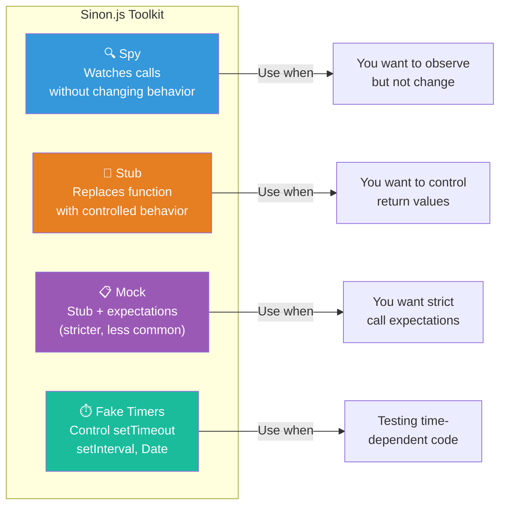

---

## OPA5: Integration Testing

OPA5 (**O**ne **P**age **A**cceptance testing, version **5**) is UI5's built-in integration testing framework. It tests your app from the user's perspective — clicking buttons, navigating pages, checking what appears on screen.

### What Makes OPA5 Special?

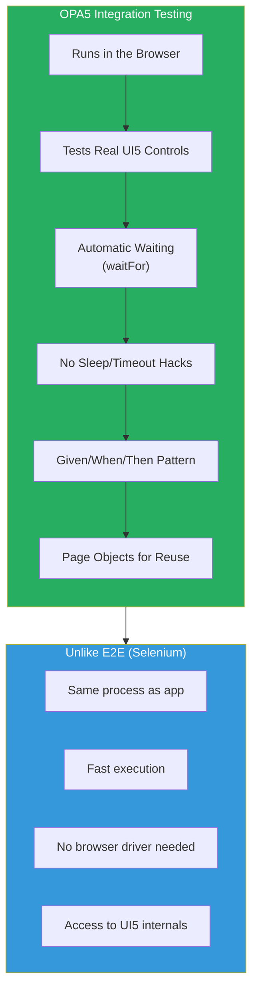

### The Given/When/Then Pattern

OPA5 uses the **Given/When/Then** pattern (also known as **Arrange/Act/Assert** for UI):

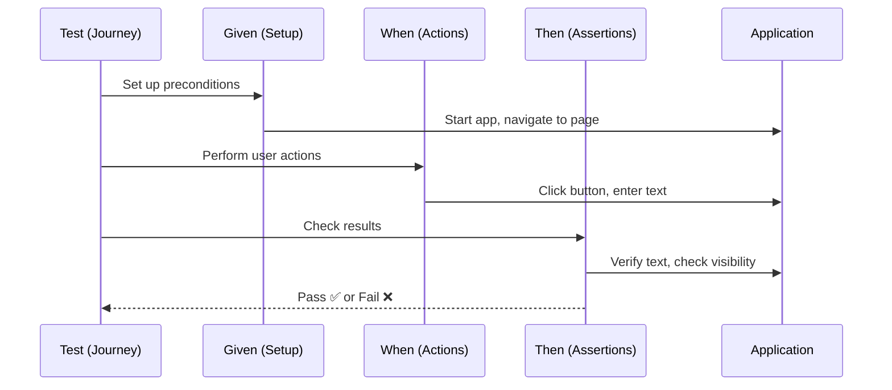

```javascript
// A test journey using Given/When/Then
opaTest("Should navigate to product list", function (Given, When, Then) {
    // Given: The app is started
    Given.iStartMyApp();

    // When: The user clicks on "Products" in the navigation
    When.onTheHomePage.iPressTheProductsLink();

    // Then: The product list page is displayed
    Then.onTheProductListPage.iShouldSeeTheProductList();
    Then.onTheProductListPage.theListShouldHaveProducts();

    // Cleanup
    Then.iTeardownMyApp();
});
```

### waitFor — The Core of OPA5

`waitFor` is what makes OPA5 powerful. It **polls the DOM** until a condition is met (or times out). No `setTimeout` hacks!

```javascript
// Inside a page object
waitFor({
    // WHAT to find
    controlType: "sap.m.ObjectListItem",
    viewName: "ProductList",

    // FILTER further
    matchers: new Properties({
        title: "Laptop Pro"
    }),

    // IF FOUND, do this
    success: function (aControls) {
        Opa5.assert.ok(true, "Found the Laptop Pro item");
    },

    // IF NOT FOUND within timeout
    errorMessage: "Could not find the Laptop Pro product"
});
```

### waitFor Flow

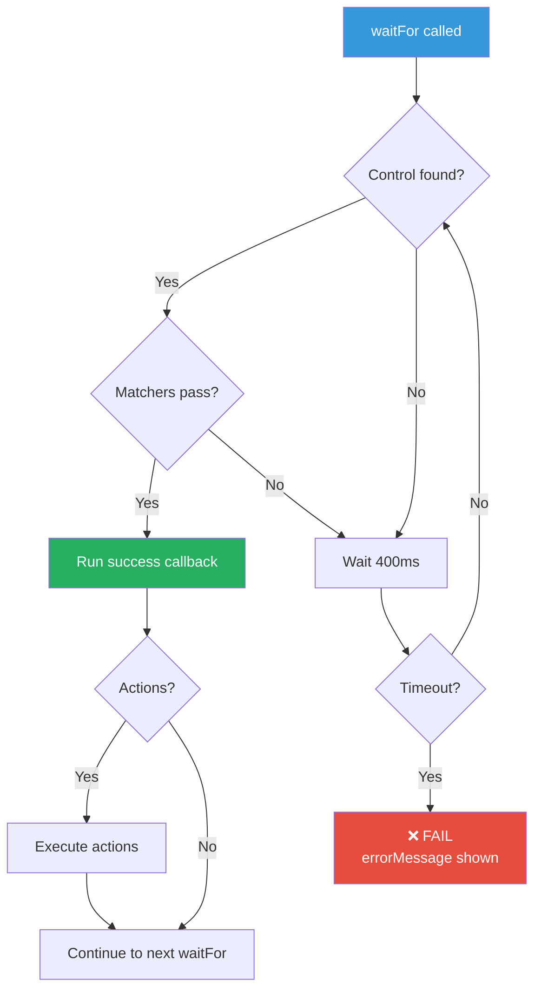

### Matchers

Matchers filter the controls found by `waitFor`:

```javascript
// Match by properties
new Properties({ title: "Laptop", price: "999" })

// Match by ancestor (control is inside this parent)
new Ancestor(oPage)

// Match by I18N text (for localized strings)
new I18NText({ propertyName: "text", key: "productTitle" })

// Match by binding path
new BindingPath({ path: "/Products/0/Name" })

// Custom matcher function
function (oControl) {
    return oControl.getText().indexOf("Laptop") > -1;
}
```

### Actions

Actions simulate user interactions:

```javascript
// Press (click) a control
new Press()

// Enter text into an input
new EnterText({ text: "Search query" })

// Combined in waitFor:
waitFor({
    id: "searchField",
    viewName: "ProductList",
    actions: new EnterText({ text: "Laptop" }),
    success: function () {
        Opa5.assert.ok(true, "Entered search text");
    }
});
```

### Page Objects Pattern

Page Objects encapsulate the UI interactions for a specific page, making tests **readable and reusable**:

```javascript
// webapp/test/integration/pages/ProductList.js
sap.ui.define([
    "sap/ui/test/Opa5",
    "sap/ui/test/actions/Press",
    "sap/ui/test/actions/EnterText",
    "sap/ui/test/matchers/Properties",
    "sap/ui/test/matchers/AggregationLengthEquals"
], function (Opa5, Press, EnterText, Properties, AggregationLengthEquals) {
    "use strict";

    var sViewName = "ProductList";

    Opa5.createPageObjects({
        onTheProductListPage: {

            // === ACTIONS (When) ===
            actions: {
                iSearchForProduct: function (sQuery) {
                    return this.waitFor({
                        id: "searchField",
                        viewName: sViewName,
                        actions: new EnterText({ text: sQuery }),
                        errorMessage: "Search field not found"
                    });
                },

                iPressOnProduct: function (sProductName) {
                    return this.waitFor({
                        controlType: "sap.m.ObjectListItem",
                        viewName: sViewName,
                        matchers: new Properties({ title: sProductName }),
                        actions: new Press(),
                        errorMessage: "Product '" + sProductName + "' not found"
                    });
                }
            },

            // === ASSERTIONS (Then) ===
            assertions: {
                iShouldSeeTheProductList: function () {
                    return this.waitFor({
                        id: "productList",
                        viewName: sViewName,
                        success: function () {
                            Opa5.assert.ok(true, "Product list is displayed");
                        },
                        errorMessage: "Product list not found"
                    });
                },

                theListShouldHaveProducts: function (iCount) {
                    return this.waitFor({
                        id: "productList",
                        viewName: sViewName,
                        matchers: new AggregationLengthEquals({
                            name: "items",
                            length: iCount
                        }),
                        success: function () {
                            Opa5.assert.ok(true, "List has " + iCount + " products");
                        },
                        errorMessage: "List does not have " + iCount + " products"
                    });
                }
            }
        }
    });
});
```

### Journeys — Organizing Test Scenarios

A **Journey** is a sequence of test steps that tells a story:

```javascript
// webapp/test/integration/journeys/ShoppingJourney.js
sap.ui.define([
    "sap/ui/test/opaQunit",
    "sap/ui/test/Opa5",
    "./pages/Home",
    "./pages/ProductList",
    "./pages/ProductDetail",
    "./pages/Cart"
], function (opaTest, Opa5) {
    "use strict";

    QUnit.module("Shopping Journey");

    opaTest("Should browse and add product to cart", function (Given, When, Then) {
        // Given the app is running
        Given.iStartMyApp();

        // When I navigate to products
        When.onTheHomePage.iPressTheProductsLink();

        // Then I see the product list
        Then.onTheProductListPage.iShouldSeeTheProductList();

        // When I search for a laptop
        When.onTheProductListPage.iSearchForProduct("Laptop");

        // Then I see filtered results
        Then.onTheProductListPage.theListShouldHaveProducts(1);

        // When I click on the laptop
        When.onTheProductListPage.iPressOnProduct("Laptop Pro");

        // Then I see the product detail
        Then.onTheProductDetailPage.iShouldSeeProductTitle("Laptop Pro");

        // When I add to cart
        When.onTheProductDetailPage.iPressAddToCart();

        // Then the cart has 1 item
        Then.onTheCartPage.theCartShouldHaveItems(1);

        // Cleanup
        Then.iTeardownMyApp();
    });
});
```

### OPA5 Architecture Overview

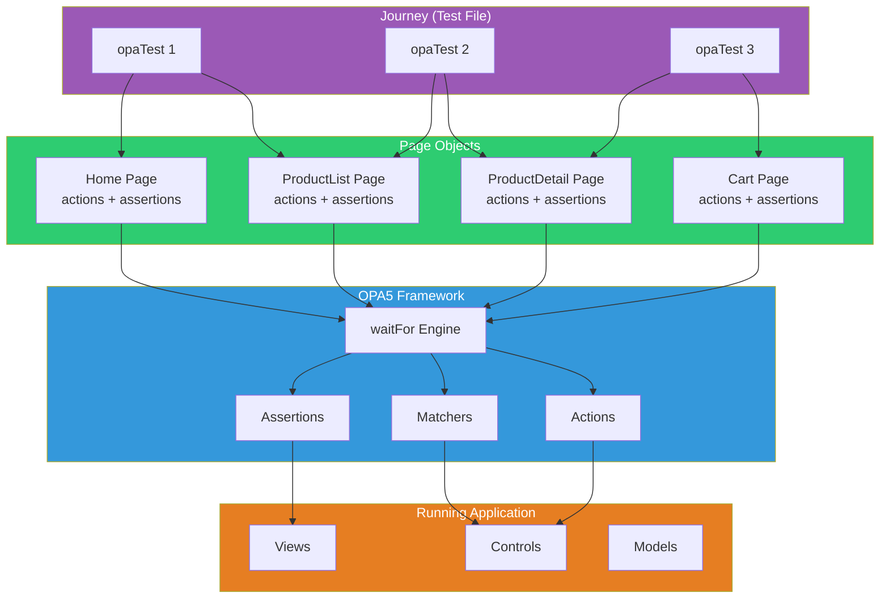

---

## Test Pages and Runners

UI5 tests run in HTML pages that bootstrap both QUnit and your test code.

### Unit Test HTML Runner

```html
<!-- webapp/test/unit/unitTests.qunit.html -->
<!DOCTYPE html>
<html>
<head>
    <title>Unit Tests - ShopEasy</title>
    <meta charset="utf-8">

    <!-- QUnit CSS (test result styling) -->
    <link rel="stylesheet"
          href="https://openui5.hana.ondemand.com/resources/sap/ui/thirdparty/qunit-2.css">

    <!-- Bootstrap UI5 for module loading -->
    <script src="https://openui5.hana.ondemand.com/resources/sap-ui-core.js"
            data-sap-ui-resourceroots='{"com.sap.shop": "../../"}'
            data-sap-ui-async="true">
    </script>

    <!-- QUnit + Sinon (shipped with UI5) -->
    <script src="https://openui5.hana.ondemand.com/resources/sap/ui/thirdparty/qunit-2.js"></script>
    <script src="https://openui5.hana.ondemand.com/resources/sap/ui/thirdparty/sinon-4.js"></script>

    <!-- Load test modules -->
    <script src="unitTests.qunit.js"></script>
</head>
<body>
    <div id="qunit"></div>
    <div id="qunit-fixture"></div>
</body>
</html>
```

### Unit Test Module Loader

```javascript
// webapp/test/unit/unitTests.qunit.js
sap.ui.define([
    "com/sap/shop/test/unit/model/formatter",
    "com/sap/shop/test/unit/model/models"
], function () {
    "use strict";
    // QUnit starts automatically when all modules are loaded
    QUnit.start();
});
```

### Master Test Suite

```html
<!-- webapp/test/testsuite.qunit.html -->
<!DOCTYPE html>
<html>
<head>
    <title>Test Suite - ShopEasy</title>
    <meta charset="utf-8">
    <script src="https://openui5.hana.ondemand.com/resources/sap/ui/thirdparty/qunit-2.js"></script>
    <script>
        // Redirect to individual test pages
        QUnit.config.testTimeout = 60000;

        var defined = false;
        sap.ui.require(["sap/ui/test/TestSuiteConfig"], function () {
            defined = true;
        });

        QUnit.test("Unit Tests", function (assert) {
            assert.ok(true, "See unit/unitTests.qunit.html");
        });

        QUnit.test("Integration Tests", function (assert) {
            assert.ok(true, "See integration/opaTests.qunit.html");
        });
    </script>
</head>
<body>
    <div id="qunit"></div>
</body>
</html>
```

---

## Running Tests

### From the Command Line

```bash
# Run all tests (configured in package.json)
npm test

# Start dev server first, then open test pages
npm start
# Then navigate to:
# http://localhost:8080/test/unit/unitTests.qunit.html
# http://localhost:8080/test/integration/opaTests.qunit.html
```

### In the Browser

Simply navigate to the test HTML file. QUnit provides a rich UI:

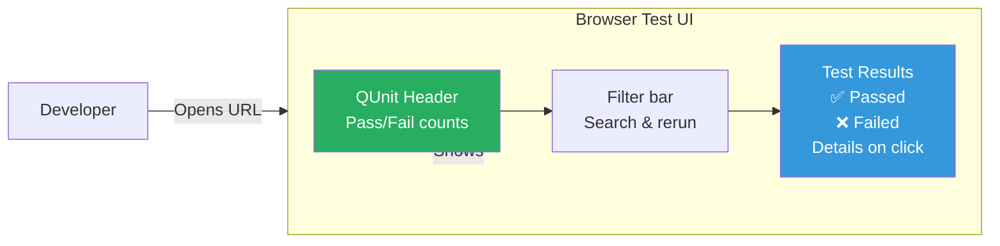

### Test Execution Lifecycle

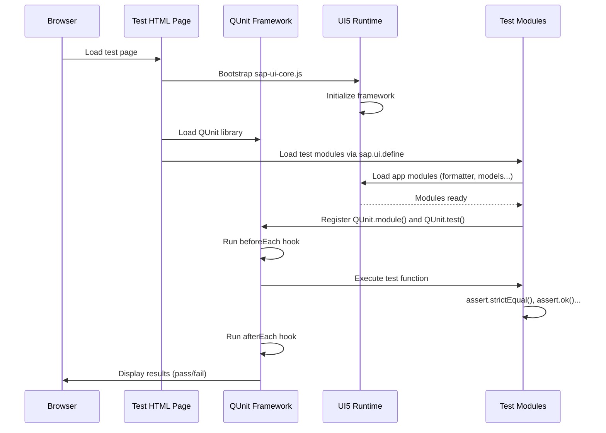

---

## Code Coverage

Code coverage measures how much of your source code is exercised by tests.

### Enabling Coverage with Istanbul (Blanket.js)

UI5 supports code coverage through the `blanket.js` library or `istanbul`:

```html
<!-- Add to unitTests.qunit.html for coverage -->
<script src="https://openui5.hana.ondemand.com/resources/sap/ui/thirdparty/blanket.js"
        data-cover-only="[com/sap/shop]"
        data-cover-never="[test]">
</script>
```

### Coverage Metrics

| Metric | What It Measures | Target |
|--------|-----------------|--------|
| **Statements** | % of statements executed | > 80% |
| **Branches** | % of if/else branches taken | > 70% |
| **Functions** | % of functions called | > 80% |
| **Lines** | % of lines executed | > 80% |

### What to Cover

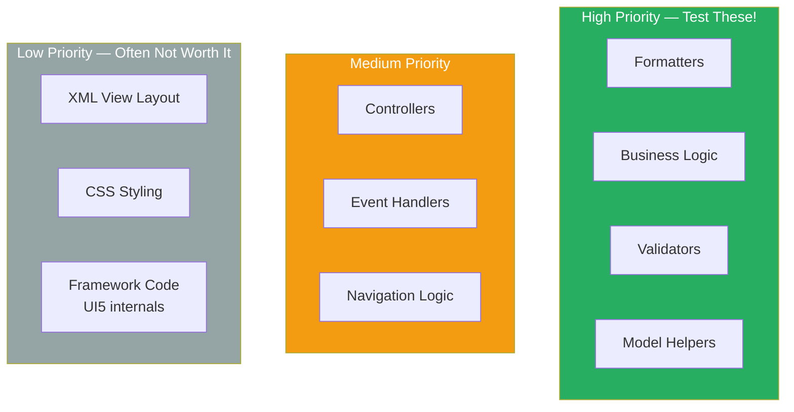

---

## Testing Best Practices

### The SAP Way

1. **Test first, or test alongside** — Write tests as you write features, not after.
2. **One assertion per concept** — Each test should verify one behavior.
3. **Name tests descriptively** — Test name = specification. "should format price with two decimals".
4. **Arrange-Act-Assert** — Structure every test clearly.
5. **Don't test the framework** — Trust that `sap.m.Button` works. Test YOUR logic.
6. **Isolate with stubs** — Controllers should be testable without real views.
7. **Fast tests = more tests** — Keep unit tests under 10ms each.
8. **Use MockServer for OData** — Never depend on a real backend in tests.

### Common Anti-Patterns

| Anti-Pattern | Problem | Better Approach |
|--------------|---------|-----------------|
| Testing private methods | Brittle, breaks on refactor | Test public API behavior |
| Testing framework code | Waste of time | Focus on your business logic |
| Sleeping in tests | Flaky, slow | Use OPA5's `waitFor` |
| Sharing state between tests | Order-dependent failures | Fresh setup in `beforeEach` |
| Huge test files | Hard to find failures | One test file per source file |
| No cleanup in `afterEach` | Memory leaks, side effects | Destroy models, restore stubs |

### Test File Naming Convention

```
Source file:                 Test file:
webapp/model/formatter.js → webapp/test/unit/model/formatter.js
webapp/model/cart.js       → webapp/test/unit/model/cart.js
webapp/controller/Home.controller.js → webapp/test/unit/controller/Home.js
```

---

## Summary

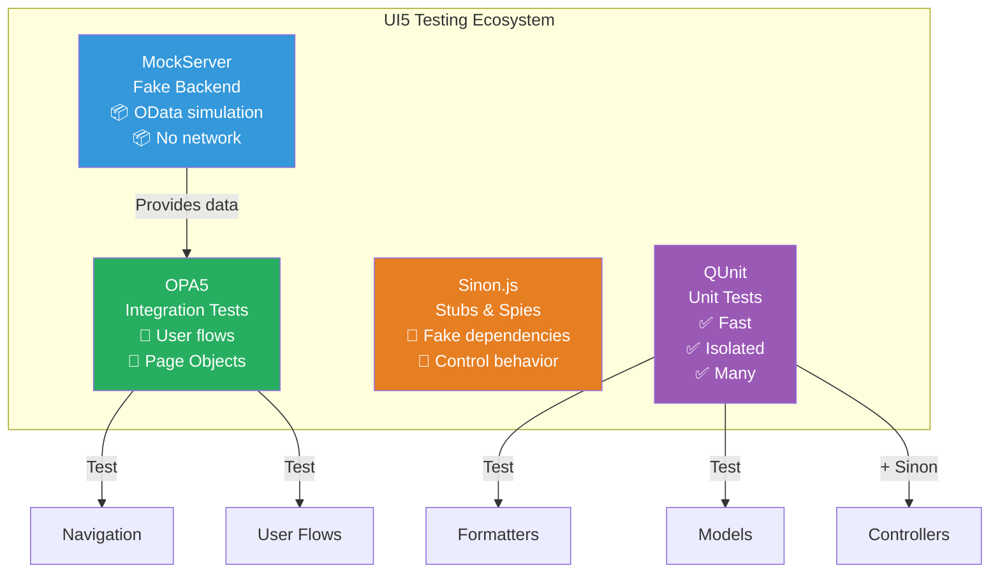

### Key Takeaways

| Concept | Remember |
|---------|----------|
| **Testing Pyramid** | Many unit tests, some integration, few E2E |
| **QUnit** | `QUnit.module()` to group, `QUnit.test()` to test, `assert.*` to verify |
| **Sinon** | `sinon.stub()` to fake, `sinon.spy()` to watch, always `.restore()` |
| **OPA5** | `Given/When/Then`, `waitFor` for async, Page Objects for reuse |
| **Coverage** | Aim for 80%+ on business logic, don't chase 100% |
| **Best Practice** | Test behavior not implementation, isolate dependencies, clean up |

---

**Next Module**: [Module 13: Responsive Design & Theming →](./13-theming-responsive.md)
