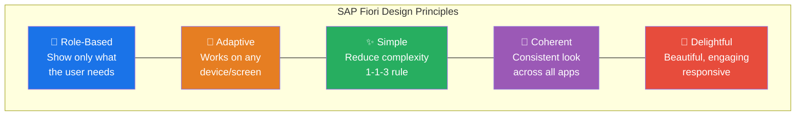
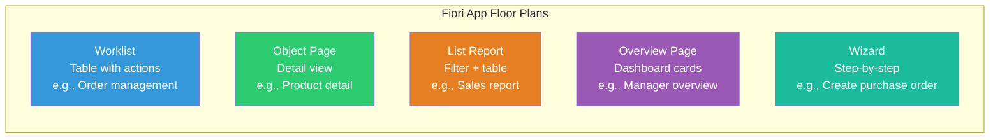
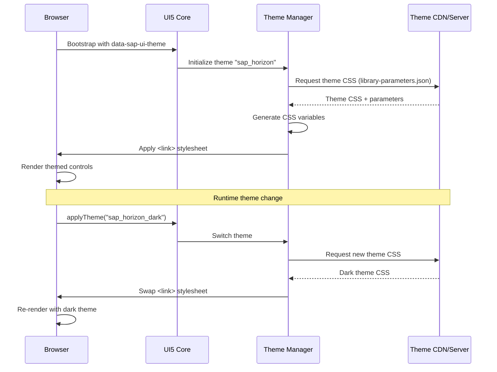
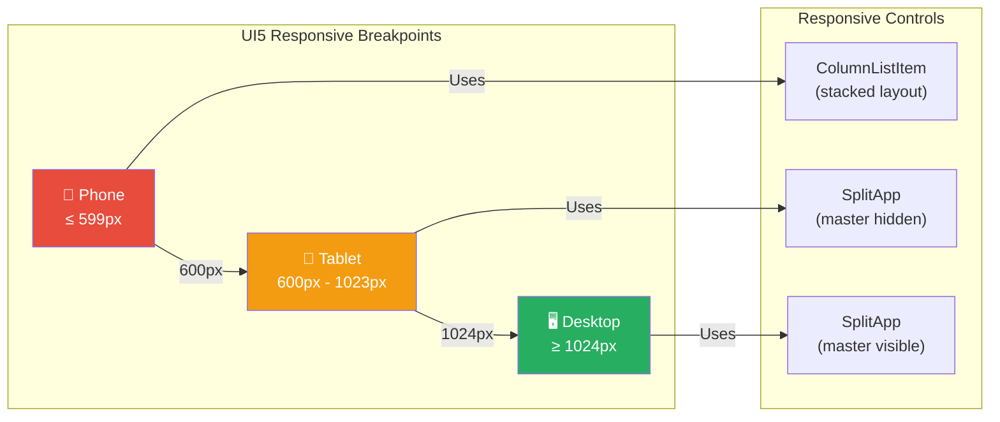
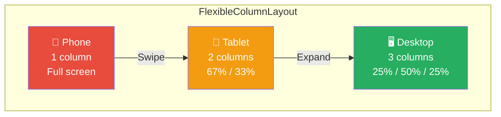
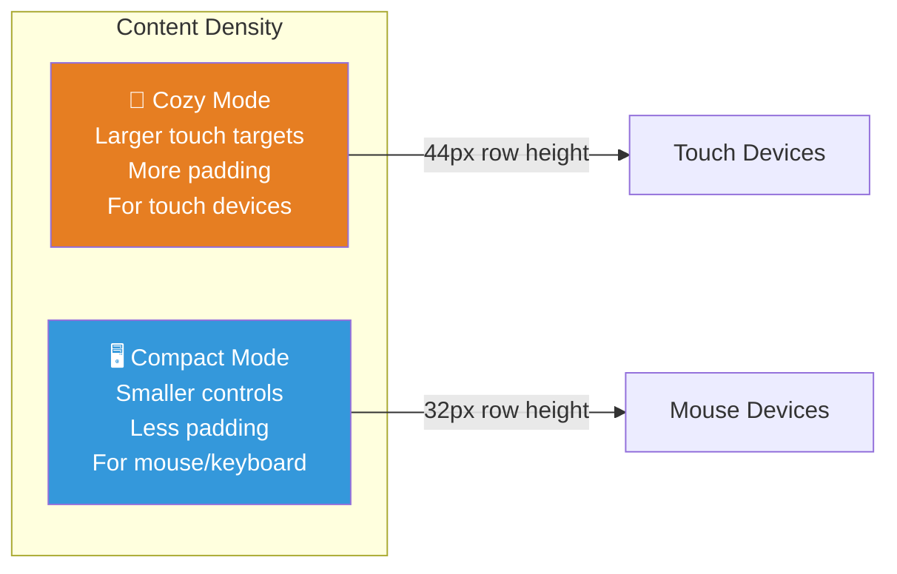
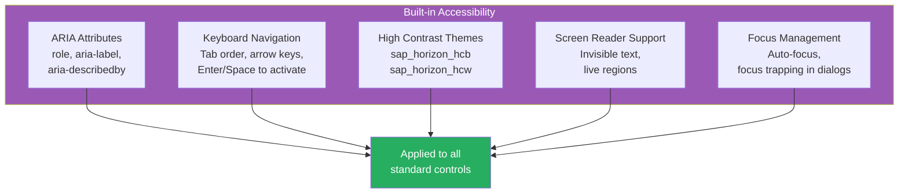
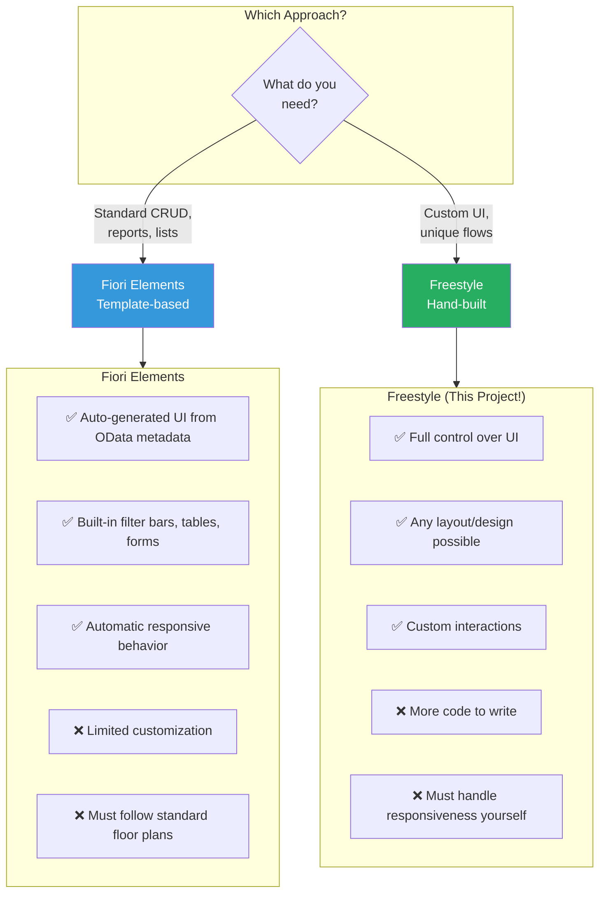
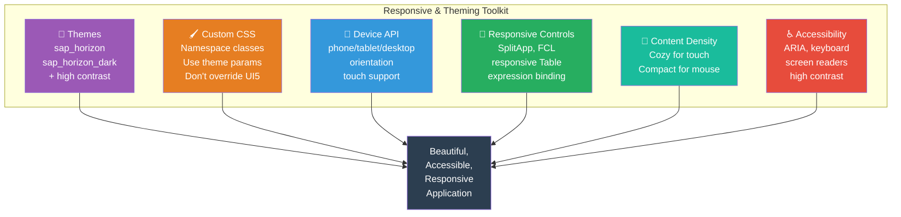

# Module 13: Responsive Design & Theming

> **Objective**: Learn how to build SAP UI5 applications that look great on any device, support multiple
> themes, and follow SAP Fiori design guidelines for accessibility and responsive behavior.

---

## Table of Contents

- [SAP Fiori Design Guidelines](#sap-fiori-design-guidelines)
- [Themes in UI5](#themes-in-ui5)
- [Custom CSS Best Practices](#custom-css-best-practices)
- [Responsive Design in UI5](#responsive-design-in-ui5)
- [Content Density: Compact vs Cozy](#content-density-compact-vs-cozy)
- [Accessibility (a11y)](#accessibility-a11y)
- [Fiori Elements vs Freestyle](#fiori-elements-vs-freestyle)
- [Summary](#summary)

---

## SAP Fiori Design Guidelines

**SAP Fiori** is SAP's design language for enterprise applications. It defines how every SAP application should look and behave. Think of it as SAP's equivalent to Google's Material Design or Apple's Human Interface Guidelines.

### The Five Fiori Principles



### The 1-1-3 Rule

SAP Fiori follows a simplicity principle:

- **1 user** — designed for a specific role
- **1 use case** — focused on a single task
- **3 screens maximum** — complete the task in 3 steps or less

### Fiori App Types



---

## Themes in UI5

UI5 comes with several pre-built themes that control the entire visual appearance of your application — colors, fonts, spacing, borders, shadows.

### Available Themes

| Theme | Era | Look | Best For |
|-------|-----|------|----------|
| **sap_horizon** | 2022+ | Modern, clean, light | New applications (default) |
| **sap_horizon_dark** | 2022+ | Dark mode of Horizon | Dark mode preference |
| **sap_horizon_hcb** | 2022+ | High contrast black | Accessibility (vision impaired) |
| **sap_horizon_hcw** | 2022+ | High contrast white | Accessibility (vision impaired) |
| **sap_fiori_3** | 2019 | Quartz theme | Existing Fiori 3 apps |
| **sap_fiori_3_dark** | 2019 | Dark mode of Fiori 3 | Dark mode (legacy) |
| **sap_belize** | 2016 | Classic Fiori | Legacy applications |
| **sap_belize_plus** | 2016 | Enhanced Belize | Legacy with improvements |

### Setting the Theme

#### In index.html (bootstrap)

```html
<script
    src="https://openui5.hana.ondemand.com/resources/sap-ui-core.js"
    data-sap-ui-theme="sap_horizon"
    data-sap-ui-libs="sap.m"
    data-sap-ui-async="true"
    data-sap-ui-resourceroots='{"com.sap.shop": "./"}'
    data-sap-ui-compatVersion="edge">
</script>
```

#### In URL (for testing)

```
http://localhost:8080/index.html?sap-ui-theme=sap_horizon_dark
```

#### Switching at Runtime

```javascript
// In any controller
sap.ui.getCore().applyTheme("sap_horizon_dark");
```

### Theme Loading Flow



### Theme Parameters (CSS Variables)

UI5 themes expose **parameters** you can use in custom CSS to stay theme-compatible:

```javascript
// Access theme parameters in JavaScript
sap.ui.define([
    "sap/ui/core/theming/Parameters"
], function (Parameters) {
    "use strict";

    // Get a single parameter
    var sBrandColor = Parameters.get("sapBrandColor");
    // Returns something like "#0070f2" for Horizon

    // Get multiple parameters at once
    Parameters.get({
        name: ["sapBrandColor", "sapBackgroundColor", "sapTextColor"],
        callback: function (oParams) {
            console.log(oParams.sapBrandColor);     // "#0070f2"
            console.log(oParams.sapBackgroundColor); // "#ffffff"
            console.log(oParams.sapTextColor);       // "#1d2d3e"
        }
    });
});
```

### Common Theme Parameters

| Parameter | Purpose | Horizon Value |
|-----------|---------|---------------|
| `sapBrandColor` | Primary brand color | `#0070f2` |
| `sapHighlightColor` | Highlight/accent color | `#0070f2` |
| `sapBackgroundColor` | Page background | `#ffffff` |
| `sapTextColor` | Default text color | `#1d2d3e` |
| `sapLink_Color` | Link text color | `#0064d9` |
| `sapErrorColor` | Error state | `#aa0808` |
| `sapWarningColor` | Warning state | `#e76500` |
| `sapSuccessColor` | Success state | `#256f3a` |
| `sapInformativeColor` | Info state | `#0070f2` |
| `sapNeutralColor` | Neutral state | `#788fa6` |

---

## Custom CSS Best Practices

### Rule 1: Namespace Your CSS Classes

Always prefix custom CSS classes to avoid conflicts with UI5's internal styles:

```css
/* ✅ GOOD: Namespaced */
.shopEasyProductCard {
    padding: 1rem;
    border-radius: 8px;
}

.shopEasyPriceTag {
    font-weight: bold;
    color: var(--sapPositiveColor, #256f3a);
}

/* ❌ BAD: Generic names will clash with UI5 */
.card {
    padding: 1rem;
}

.header {
    font-size: 20px;
}
```

### Rule 2: Use Theme Parameters in CSS

```css
/* ✅ GOOD: Theme-aware custom styles */
.shopEasyHighlight {
    background-color: var(--sapHighlightColor);
    color: var(--sapContent_ContrastTextColor);
    border: 1px solid var(--sapContent_ForegroundBorderColor);
}

/* ❌ BAD: Hardcoded colors break in dark themes */
.shopEasyHighlight {
    background-color: #0070f2;
    color: white;
    border: 1px solid #ccc;
}
```

### Rule 3: Don't Override UI5 Internal Styles

```css
/* ❌ BAD: Fragile, breaks on UI5 updates */
.sapMBtn .sapMBtnInner {
    border-radius: 20px !important;
}

/* ✅ GOOD: Use the custom CSS class approach */
.shopEasyRoundedButton {
    border-radius: 20px;
}
```

### Rule 4: Reference Your CSS in manifest.json

```json
{
    "sap.ui5": {
        "rootView": { ... },
        "resources": {
            "css": [
                {
                    "uri": "css/style.css"
                }
            ]
        }
    }
}
```

---

## Responsive Design in UI5

UI5 provides several built-in mechanisms for responsive design — you rarely need media queries.

### sap.ui.Device API

The `sap.ui.Device` API detects the current device and browser capabilities:

```javascript
sap.ui.define([
    "sap/ui/Device"
], function (Device) {
    "use strict";

    // Device type detection
    Device.system.phone;    // true if phone
    Device.system.tablet;   // true if tablet
    Device.system.desktop;  // true if desktop

    // Orientation
    Device.orientation.portrait;   // true if portrait
    Device.orientation.landscape;  // true if landscape

    // Browser detection
    Device.browser.chrome;  // true if Chrome
    Device.browser.firefox; // true if Firefox
    Device.browser.safari;  // true if Safari

    // OS detection
    Device.os.windows;  // true if Windows
    Device.os.macintosh; // true if macOS
    Device.os.ios;       // true if iOS
    Device.os.android;   // true if Android

    // Touch support
    Device.support.touch;  // true if touch-capable

    // Listen for orientation changes
    Device.orientation.attachHandler(function (oEvent) {
        var bLandscape = oEvent.getParameter("landscape");
        // Adapt layout...
    });
});
```

### Device Model — Use in Views

In `Component.js`, the device model makes device info available for data binding:

```javascript
// Component.js
init: function () {
    // ... other init code ...
    this.setModel(models.createDeviceModel(), "device");
}
```

Then use it in XML views with expression binding:

```xml
<!-- Show different text on phone vs desktop -->
<Text text="{= ${device>/system/phone} ? 'Tap' : 'Click'} to view details" />

<!-- Hide element on phones -->
<Image src="banner.png" visible="{= !${device>/system/phone}}" />

<!-- Change list mode based on device -->
<List mode="{= ${device>/system/phone} ? 'None' : 'SingleSelectMaster'}" />
```

### Responsive Breakpoints



### Responsive Controls

UI5 controls automatically adapt to screen size. Here are the key responsive controls:

#### SplitApp / SplitContainer

```xml
<!-- Automatically shows master/detail side-by-side on desktop,
     and as separate pages on phone -->
<SplitApp id="app">
    <masterPages>
        <Page title="Products">
            <List items="{/Products}">
                <StandardListItem title="{Name}" />
            </List>
        </Page>
    </masterPages>
    <detailPages>
        <Page title="Product Detail">
            <!-- Detail content -->
        </Page>
    </detailPages>
</SplitApp>
```

#### FlexibleColumnLayout (FCL)

The most powerful responsive layout — shows 1, 2, or 3 columns based on screen width:



```xml
<FlexibleColumnLayout id="fcl"
    layout="{appView>/layout}"
    backgroundDesign="Translucent">
    <beginColumnPages>
        <mvc:XMLView viewName="com.sap.shop.view.ProductList" />
    </beginColumnPages>
    <midColumnPages>
        <mvc:XMLView viewName="com.sap.shop.view.ProductDetail" />
    </midColumnPages>
    <endColumnPages>
        <mvc:XMLView viewName="com.sap.shop.view.Cart" />
    </endColumnPages>
</FlexibleColumnLayout>
```

#### Responsive Table

Tables automatically adapt — switching from full columns to a popin (stacked) layout on small screens:

```xml
<Table items="{/Products}">
    <columns>
        <!-- Always visible -->
        <Column>
            <Text text="Product" />
        </Column>
        <!-- Pops into a new row on small screens -->
        <Column minScreenWidth="Tablet" demandPopin="true" popinDisplay="Inline">
            <Text text="Category" />
        </Column>
        <!-- Hidden on phones, popin on tablet -->
        <Column minScreenWidth="Desktop" demandPopin="true">
            <Text text="Description" />
        </Column>
        <Column hAlign="End">
            <Text text="Price" />
        </Column>
    </columns>
    <items>
        <ColumnListItem>
            <Text text="{Name}" />
            <Text text="{Category}" />
            <Text text="{Description}" />
            <ObjectNumber number="{Price}" unit="USD" />
        </ColumnListItem>
    </items>
</Table>
```

### Responsive Margin and Padding Classes

UI5 provides CSS utility classes for responsive spacing:

```xml
<!-- Responsive margins (adapt to screen size) -->
<VBox class="sapUiResponsiveMargin">
    <!-- 1rem on desktop, 0.5rem on tablet, 0 on phone -->
</VBox>

<!-- Specific margins -->
<Panel class="sapUiSmallMarginTop sapUiMediumMarginBottom">
    <!-- Small top margin, medium bottom margin -->
</Panel>

<!-- Responsive padding -->
<FlexBox class="sapUiResponsivePadding--header
                sapUiResponsivePadding--content
                sapUiResponsivePadding--footer">
</FlexBox>
```

#### Available Margin Classes

| Class | Size | When to Use |
|-------|------|-------------|
| `sapUiTinyMargin` | 0.5rem (8px) | Minimal spacing |
| `sapUiSmallMargin` | 1rem (16px) | Small spacing |
| `sapUiMediumMargin` | 2rem (32px) | Medium spacing |
| `sapUiLargeMargin` | 3rem (48px) | Large spacing |
| `sapUiResponsiveMargin` | Varies | Adapts to screen |
| `sapUiNoMargin` | 0 | Remove margins |

Add direction suffixes: `Top`, `Bottom`, `Begin`, `End`, `TopBottom`, `BeginEnd`

Example: `sapUiSmallMarginTop`, `sapUiMediumMarginBeginEnd`

### Expression Binding for Device-Specific Behavior

```xml
<!-- Different number of columns based on device -->
<GridList items="{/Products}">
    <customLayout>
        <grid:GridBoxLayout
            boxMinWidth="{= ${device>/system/phone} ? '16rem' : '20rem'}" />
    </customLayout>
</GridList>

<!-- Different page title on different devices -->
<Page title="{= ${device>/system/phone} ? 'Shop' : 'ShopEasy - Online Store'}">
</Page>

<!-- Show/hide search on phone -->
<SearchField
    width="{= ${device>/system/phone} ? '100%' : '300px'}"
    visible="{= !${device>/system/phone} || ${viewModel>/showSearch}}" />
```

---

## Content Density: Compact vs Cozy

UI5 controls come in two density modes — this affects padding, touch targets, and overall spacing.



### Setting Content Density

```javascript
// In Component.js — auto-detect
init: function () {
    // Apply compact mode if not touch device
    this.getContentDensityClass = function () {
        if (!this._sContentDensityClass) {
            if (!sap.ui.Device.support.touch) {
                this._sContentDensityClass = "sapUiSizeCompact";
            } else {
                this._sContentDensityClass = "sapUiSizeCozy";
            }
        }
        return this._sContentDensityClass;
    };
}
```

```javascript
// In App.controller.js — apply to view
onInit: function () {
    this.getView().addStyleClass(
        this.getOwnerComponent().getContentDensityClass()
    );
}
```

Or apply globally via `<body>`:

```html
<!-- Cozy (default, good for touch) -->
<body class="sapUiBody sapUiSizeCozy">

<!-- Compact (good for desktop) -->
<body class="sapUiBody sapUiSizeCompact">
```

---

## Accessibility (a11y)

UI5 has extensive built-in accessibility support. SAP applications must meet **WCAG 2.1 Level AA** standards.

### What UI5 Provides Automatically



### Your Accessibility Responsibilities

Even though UI5 handles most accessibility, you still need to:

```xml
<!-- 1. Provide meaningful labels for inputs -->
<Label text="Email Address" labelFor="emailInput" />
<Input id="emailInput" type="Email" placeholder="name@example.com" />

<!-- 2. Add tooltips for icon-only buttons -->
<Button icon="sap-icon://cart" tooltip="View Shopping Cart" />

<!-- 3. Use InvisibleText for screen readers -->
<core:InvisibleText id="priceDesc" text="Product price in US dollars" />
<ObjectNumber
    number="{Price}"
    unit="USD"
    ariaDescribedBy="priceDesc" />

<!-- 4. Set page titles for screen readers -->
<Page title="Product List" showNavButton="true" navButtonPress="onNavBack">
</Page>

<!-- 5. Use semantic colors correctly -->
<ObjectStatus
    text="{status}"
    state="{= ${stock} > 10 ? 'Success' : ${stock} > 0 ? 'Warning' : 'Error'}" />
```

### Keyboard Navigation

| Key | Action |
|-----|--------|
| `Tab` | Move to next focusable element |
| `Shift + Tab` | Move to previous element |
| `Enter` / `Space` | Activate focused control |
| `Arrow keys` | Navigate within control (lists, tables) |
| `Escape` | Close dialog/popover |
| `F6` | Navigate between UI regions |
| `F7` | Toggle focus between cell and row (tables) |

### Testing Accessibility

```javascript
// Use the UI5 Support Assistant for a11y checks
// In browser console:
sap.ui.require(["sap/ui/support/RuleAnalyzer"], function (RuleAnalyzer) {
    RuleAnalyzer.analyze({
        type: "global"
    }).then(function (oResult) {
        console.log("Accessibility issues:", oResult);
    });
});
```

---

## Fiori Elements vs Freestyle

When building SAP applications, you choose between two approaches:



| Aspect | Fiori Elements | Freestyle |
|--------|---------------|-----------|
| **Development speed** | Very fast | Slower |
| **Customization** | Limited | Unlimited |
| **Learning curve** | OData annotations | Full UI5 knowledge |
| **Best for** | Standard business apps | Unique UX requirements |
| **Code volume** | Minimal (annotation-driven) | Significant |
| **Maintenance** | SAP handles updates | You maintain |
| **This project** | — | ✅ ShopEasy is freestyle |

> **Why this project uses Freestyle**: You're learning UI5 fundamentals. Freestyle teaches you everything.
> Once you understand freestyle, Fiori Elements is easy — it's just a higher-level abstraction.

---

## Summary



### Key Takeaways

| Concept | Remember |
|---------|----------|
| **Fiori Principles** | Role-based, Adaptive, Simple, Coherent, Delightful |
| **Themes** | Use `sap_horizon` for new apps; switch with `applyTheme()` |
| **Custom CSS** | Namespace classes, use theme parameters, never override UI5 internals |
| **Device API** | `sap.ui.Device.system.phone/tablet/desktop` for detection |
| **Responsive Controls** | SplitApp, FCL, responsive Table with `demandPopin` |
| **Content Density** | Cozy for touch (44px rows), Compact for mouse (32px rows) |
| **Accessibility** | Labels, tooltips, InvisibleText, semantic colors, keyboard nav |
| **Fiori Elements vs Freestyle** | Elements for standard apps, Freestyle for custom (learn Freestyle first) |

---

**Next Module**: [Module 14: Security →](./14-security.md)
