# Module 14: Security

> **Objective**: Learn how to build secure SAP UI5 applications. Understand XSS prevention, input
> sanitization, CSRF protection, authentication patterns, and SAP's secure coding guidelines.

---

## Table of Contents

- [Why Security Matters](#why-security-matters)
- [Security Layers Overview](#security-layers-overview)
- [XSS (Cross-Site Scripting) Prevention](#xss-cross-site-scripting-prevention)
- [Content Security Policy (CSP)](#content-security-policy-csp)
- [CSRF Token Handling](#csrf-token-handling)
- [Input Validation and Sanitization](#input-validation-and-sanitization)
- [Authentication Patterns](#authentication-patterns)
- [Authorization: Role-Based Visibility](#authorization-role-based-visibility)
- [HTTPS and Secure Communication](#https-and-secure-communication)
- [Sensitive Data Handling](#sensitive-data-handling)
- [SAP Secure Coding Guidelines](#sap-secure-coding-guidelines)
- [Summary](#summary)

---

## Why Security Matters

SAP applications handle some of the most sensitive data in any organization — financial records, personal employee data, supply chain details, customer information. A security breach in an SAP system can result in:

- **Financial loss** — Direct theft or regulatory fines (GDPR fines up to 4% of global revenue)
- **Data exposure** — Employee salaries, customer PII, trade secrets
- **Business disruption** — Systems taken offline, processes halted
- **Reputation damage** — Loss of customer and partner trust

> **Key Principle**: Security is not a feature — it's a **requirement** for every line of code you write.

---

## Security Layers Overview

```mermaid
graph TB
    subgraph Layers["Security Defense in Depth"]
        L1["🌐 Network Layer<br/>HTTPS, TLS, Firewalls"]
        L2["🔐 Authentication Layer<br/>Who are you?<br/>OAuth, SAML, Certificates"]
        L3["🛡️ Authorization Layer<br/>What can you do?<br/>Roles, Permissions"]
        L4["🧹 Input Layer<br/>Validation & Sanitization<br/>Never trust user input"]
        L5["🔒 Output Layer<br/>XSS Prevention<br/>Encoding & Escaping"]
        L6["📋 Policy Layer<br/>CSP, CORS, Headers<br/>Browser enforcement"]
        L7["🗄️ Data Layer<br/>Encryption at rest<br/>Secure storage"]
    end

    L1 --> L2
    L2 --> L3
    L3 --> L4
    L4 --> L5
    L5 --> L6
    L6 --> L7

    style L1 fill:#3498db,color:#fff
    style L2 fill:#9b59b6,color:#fff
    style L3 fill:#e67e22,color:#fff
    style L4 fill:#1abc9c,color:#fff
    style L5 fill:#e74c3c,color:#fff
    style L6 fill:#2ecc71,color:#fff
    style L7 fill:#34495e,color:#fff
```

---

## XSS (Cross-Site Scripting) Prevention

XSS is the **#1 client-side vulnerability** in web applications. An attacker injects malicious JavaScript that runs in other users' browsers.

### How XSS Works

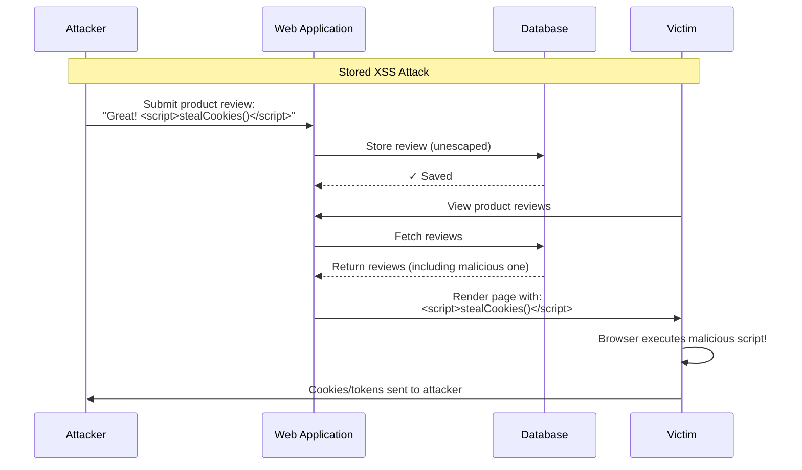

### UI5's Built-in XSS Protection

**Good news**: UI5 controls automatically escape output, making XSS much harder. When you use data binding, values are HTML-encoded before rendering:

```xml
<!-- ✅ SAFE: UI5 automatically HTML-encodes bound values -->
<Text text="{productName}" />
<!-- If productName = "<script>alert('xss')</script>"
     UI5 renders: &lt;script&gt;alert('xss')&lt;/script&gt;
     The browser shows the text literally, NOT executing it -->

<!-- ✅ SAFE: All standard UI5 control properties are escaped -->
<Input value="{userInput}" />
<Title text="{title}" />
<Label text="{label}" />
```

### When You ARE Vulnerable — Anti-Patterns

```javascript
// ❌ DANGEROUS: Setting innerHTML directly bypasses UI5 protection
var oHtml = new sap.ui.core.HTML({
    content: "<div>" + sUserInput + "</div>"  // XSS vulnerability!
});

// ❌ DANGEROUS: Using jQuery to insert unescaped HTML
$("#myDiv").html(sUserInput);  // XSS vulnerability!

// ❌ DANGEROUS: document.write with user data
document.write(sUserInput);  // XSS vulnerability!

// ❌ DANGEROUS: Unescaped values in event handler strings
oButton.attachPress(function () {
    eval(sUserInput);  // Critical vulnerability! Never use eval()
});
```

### SAP Encoding Functions

When you must handle raw HTML or construct URLs, use SAP's encoding utilities:

```javascript
sap.ui.define([
    "sap/base/security/encodeXML",
    "sap/base/security/encodeURL",
    "sap/base/security/encodeJS",
    "sap/base/security/encodeCSS"
], function (encodeXML, encodeURL, encodeJS, encodeCSS) {
    "use strict";

    // Encode for HTML/XML context
    var sSafe = encodeXML(sUserInput);
    // "<script>" becomes "&lt;script&gt;"

    // Encode for URL parameters
    var sUrl = "/api/search?q=" + encodeURL(sSearchQuery);
    // "a&b=c" becomes "a%26b%3Dc"

    // Encode for JavaScript string context
    var sJsSafe = encodeJS(sUserInput);
    // Escapes quotes and special JS characters

    // Encode for CSS value context
    var sCssSafe = encodeCSS(sUserInput);
    // Prevents CSS injection
});
```

### XSS Prevention Decision Tree

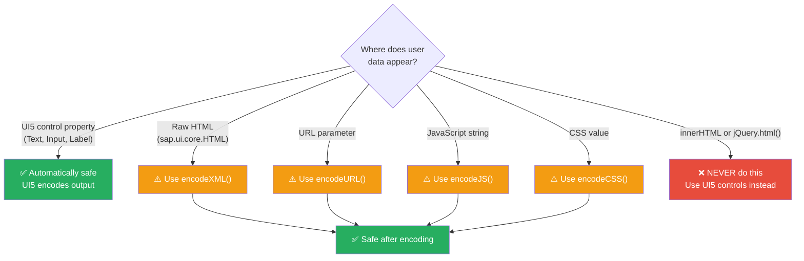

---

## Content Security Policy (CSP)

CSP is a browser-enforced security policy that prevents unauthorized script execution. It tells the browser which sources of content are allowed.

### How CSP Works

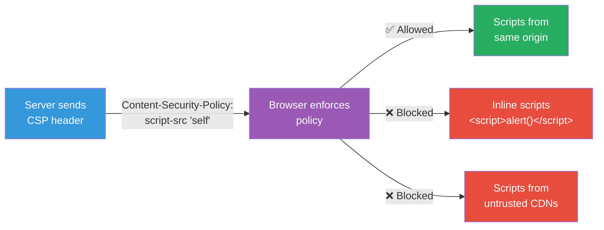

### CSP for UI5 Applications

```html
<!-- Set CSP via meta tag (or preferably via HTTP header) -->
<meta http-equiv="Content-Security-Policy"
      content="default-src 'self';
               script-src  'self' https://openui5.hana.ondemand.com;
               style-src   'self' https://openui5.hana.ondemand.com 'unsafe-inline';
               font-src    'self' https://openui5.hana.ondemand.com;
               img-src     'self' data:;
               connect-src 'self' https://your-odata-server.com;">
```

### UI5 CSP Compatibility

UI5 works with strict CSP, but you need to configure it properly:

```html
<!-- Enable CSP-compatible mode in UI5 bootstrap -->
<script
    src="https://openui5.hana.ondemand.com/resources/sap-ui-core.js"
    data-sap-ui-async="true"
    data-sap-ui-xx-nosync="warn">
    <!-- data-sap-ui-xx-nosync prevents synchronous XHR which CSP may block -->
</script>
```

### CSP Directives Quick Reference

| Directive | Controls | Recommended Value |
|-----------|----------|-------------------|
| `default-src` | Fallback for all | `'self'` |
| `script-src` | JavaScript sources | `'self'` + UI5 CDN |
| `style-src` | CSS sources | `'self'` + UI5 CDN + `'unsafe-inline'` (UI5 needs this) |
| `font-src` | Font files | `'self'` + UI5 CDN |
| `img-src` | Image sources | `'self' data:` |
| `connect-src` | AJAX/WebSocket targets | `'self'` + API servers |
| `frame-src` | Embeddable frames | `'none'` (unless needed) |
| `object-src` | Plugins (Flash, etc.) | `'none'` |

---

## CSRF Token Handling

**CSRF** (Cross-Site Request Forgery) tricks a user's browser into making unauthorized requests to a server where the user is authenticated.

### How CSRF Works

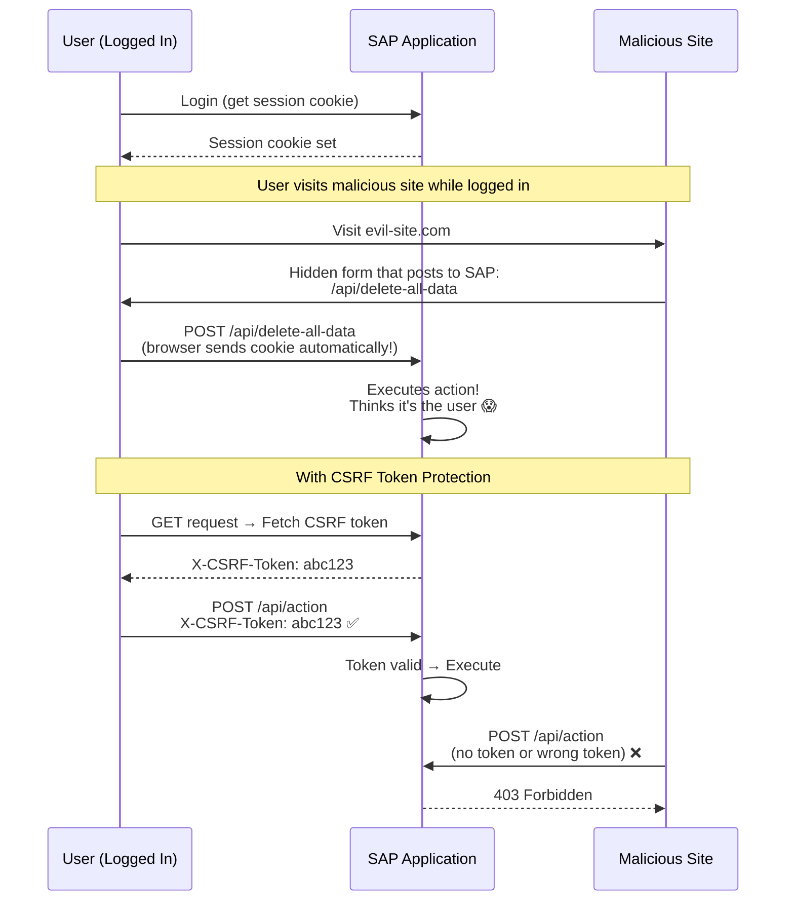

### CSRF in UI5 OData

**Great news**: UI5's ODataModel handles CSRF tokens **automatically**:

```javascript
// ODataModel automatically:
// 1. Fetches CSRF token on first request (GET with X-CSRF-Token: Fetch)
// 2. Includes token in all modifying requests (POST, PUT, DELETE)
// 3. Refreshes token if it expires (server returns 403)

var oModel = new ODataModel("/api/odata/v2/", {
    // CSRF handling is enabled by default
    // No configuration needed!
});

// All these automatically include the CSRF token:
oModel.create("/Products", oNewProduct);
oModel.update("/Products('P1')", oUpdatedData);
oModel.remove("/Products('P1')");
```

### Manual CSRF Token Handling

For non-OData AJAX requests, handle CSRF tokens manually:

```javascript
// Fetch CSRF token
jQuery.ajax({
    url: "/api/endpoint",
    method: "GET",
    headers: {
        "X-CSRF-Token": "Fetch"
    },
    success: function (data, textStatus, xhr) {
        var sCsrfToken = xhr.getResponseHeader("X-CSRF-Token");

        // Use token in subsequent POST request
        jQuery.ajax({
            url: "/api/endpoint",
            method: "POST",
            headers: {
                "X-CSRF-Token": sCsrfToken
            },
            data: JSON.stringify(oPayload),
            contentType: "application/json"
        });
    }
});
```

---

## Input Validation and Sanitization

**Never trust user input.** Validate on both client and server.

### Client-Side Validation in UI5

UI5 provides built-in types with constraints for input validation:

```xml
<!-- Validate email format -->
<Input value="{
    path: '/email',
    type: 'sap.ui.model.type.String',
    constraints: { maxLength: 254 }
}" />

<!-- Validate number range -->
<Input value="{
    path: '/quantity',
    type: 'sap.ui.model.type.Integer',
    constraints: { minimum: 1, maximum: 999 }
}" />

<!-- Validate required fields -->
<Input
    value="{/name}"
    required="true"
    valueLiveUpdate="true"
    valueState="{= ${/name} ? 'None' : 'Error'}"
    valueStateText="Name is required" />
```

### Custom Validation in Controller

```javascript
onSubmitOrder: function () {
    var oModel = this.getView().getModel();
    var sEmail = oModel.getProperty("/email");
    var sPhone = oModel.getProperty("/phone");
    var iQuantity = oModel.getProperty("/quantity");

    // Validate email
    var rEmail = /^[^\s@]+@[^\s@]+\.[^\s@]+$/;
    if (!rEmail.test(sEmail)) {
        MessageBox.error("Please enter a valid email address");
        return;
    }

    // Validate phone (only digits, dashes, spaces, plus)
    var rPhone = /^[+\d\s\-()]+$/;
    if (sPhone && !rPhone.test(sPhone)) {
        MessageBox.error("Phone number contains invalid characters");
        return;
    }

    // Validate quantity (positive integer)
    if (!Number.isInteger(iQuantity) || iQuantity < 1) {
        MessageBox.error("Quantity must be a positive number");
        return;
    }

    // Input is valid — proceed
    this._submitOrder();
}
```

### Validation Layers

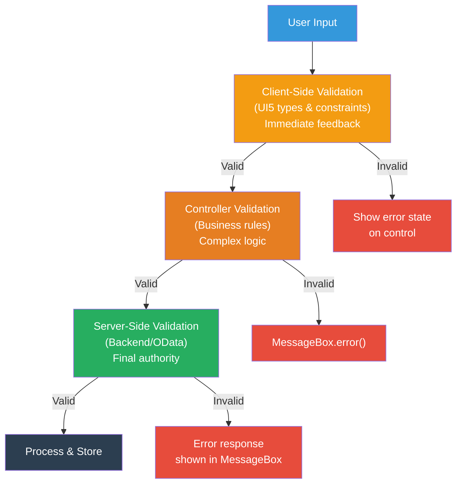

> **Critical Rule**: Client-side validation is for **user experience** (fast feedback). Server-side
> validation is for **security** (never skip it). An attacker can bypass all client-side checks.

---

## Authentication Patterns

Authentication verifies **who** the user is. UI5 applications typically delegate authentication to the server or identity provider.

### Common Authentication Methods

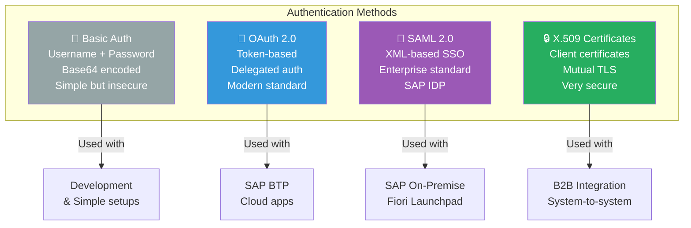

### OAuth 2.0 Flow (Most Common for Cloud)

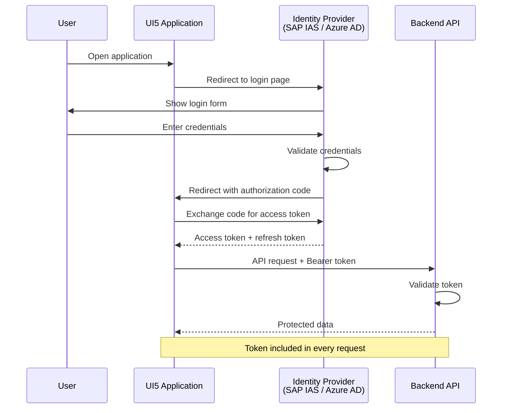

### Handling Authentication in UI5

```javascript
// Check if user is authenticated
sap.ui.define([
    "sap/ui/core/mvc/Controller"
], function (Controller) {
    "use strict";

    return Controller.extend("com.sap.shop.controller.App", {
        onInit: function () {
            // On SAP BTP, authentication is typically handled by the app router
            // The UI5 app receives the user info from the session

            // Check for user info endpoint
            jQuery.ajax({
                url: "/api/userinfo",
                method: "GET",
                success: function (oUserInfo) {
                    // User is authenticated
                    this.getView().getModel("user").setData(oUserInfo);
                }.bind(this),
                error: function (oError) {
                    if (oError.status === 401) {
                        // Not authenticated — redirect to login
                        window.location.href = "/login";
                    }
                }
            });
        }
    });
});
```

---

## Authorization: Role-Based Visibility

Authorization controls **what** an authenticated user can do. In UI5, this typically means showing/hiding UI elements based on user roles.

```javascript
// In Component.js — load user roles
init: function () {
    var oUserModel = new JSONModel({
        name: "",
        roles: [],
        isAdmin: false,
        canEdit: false,
        canDelete: false
    });
    this.setModel(oUserModel, "user");

    // Fetch user roles from backend
    jQuery.ajax({
        url: "/api/user/roles",
        success: function (oData) {
            oUserModel.setData({
                name: oData.name,
                roles: oData.roles,
                isAdmin: oData.roles.indexOf("ADMIN") > -1,
                canEdit: oData.roles.indexOf("EDITOR") > -1,
                canDelete: oData.roles.indexOf("ADMIN") > -1
            });
        }
    });
}
```

```xml
<!-- Show/hide UI elements based on roles -->
<Button
    text="Delete Product"
    icon="sap-icon://delete"
    type="Reject"
    press="onDeleteProduct"
    visible="{user>/canDelete}" />

<Button
    text="Edit Product"
    icon="sap-icon://edit"
    press="onEditProduct"
    visible="{user>/canEdit}" />

<!-- Admin-only section -->
<Panel
    headerText="Administration"
    visible="{user>/isAdmin}">
    <List items="{/AuditLog}">
        <StandardListItem title="{action}" description="{timestamp}" />
    </List>
</Panel>
```

> **Critical Warning**: Client-side role checks are for **UX only** (hiding buttons). Always enforce
> authorization on the **server**. Users can modify client-side code to reveal hidden buttons.

---

## HTTPS and Secure Communication

### Always Use HTTPS

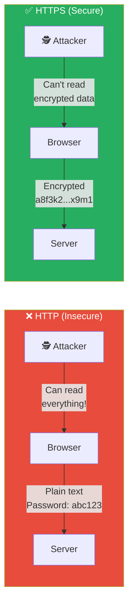

### Secure Communication Checklist

```javascript
// ✅ GOOD: Use HTTPS URLs
var oModel = new ODataModel("https://api.example.com/odata/v2/");

// ❌ BAD: HTTP URLs expose data in transit
var oModel = new ODataModel("http://api.example.com/odata/v2/");

// ✅ GOOD: Use relative URLs (inherits page protocol)
var oModel = new ODataModel("/api/odata/v2/");

// ✅ GOOD: Set secure flag on cookies (server-side)
// Set-Cookie: session=abc123; Secure; HttpOnly; SameSite=Strict
```

---

## Sensitive Data Handling

### Rules for Handling Sensitive Data in UI5

```javascript
// ❌ NEVER store sensitive data in client-side models
var oBadModel = new JSONModel({
    creditCardNumber: "4111-1111-1111-1111",  // Never!
    password: "secret123",                      // Never!
    socialSecurityNumber: "123-45-6789"         // Never!
});

// ❌ NEVER log sensitive data to console
console.log("User password:", sPassword);  // Never!
console.log("Payment details:", oPayment); // Never!

// ❌ NEVER put sensitive data in URLs
// /api/users?password=secret123  ← Appears in browser history, server logs

// ✅ GOOD: Mask sensitive data in the UI
// Show only last 4 digits of card: **** **** **** 1234
formatCreditCard: function (sCardNumber) {
    if (!sCardNumber) return "";
    return "**** **** **** " + sCardNumber.slice(-4);
}

// ✅ GOOD: Send sensitive data only via POST body over HTTPS
jQuery.ajax({
    url: "/api/payment",
    method: "POST",
    contentType: "application/json",
    data: JSON.stringify({
        cardNumber: sCardNumber,
        cvv: sCvv
    })
});

// ✅ GOOD: Clear sensitive data when no longer needed
oPaymentModel.setData({});
```

### Where Sensitive Data Leaks

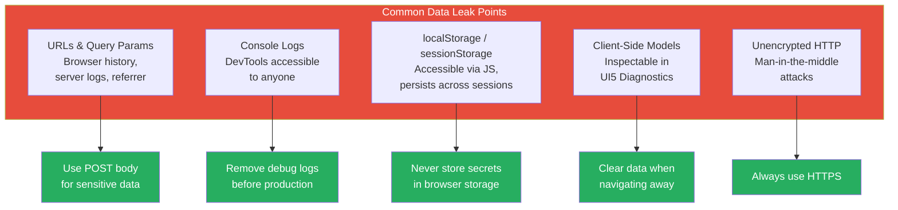

---

## SAP Secure Coding Guidelines

### The Top 10 Rules

| # | Rule | Why |
|---|------|-----|
| 1 | **Never trust user input** | Attackers control all client-side data |
| 2 | **Use UI5 controls for output** | Auto-escaping prevents XSS |
| 3 | **Never use `innerHTML` or `eval()`** | Direct injection vectors |
| 4 | **Always validate on the server** | Client validation is bypassable |
| 5 | **Use HTTPS everywhere** | Prevents eavesdropping |
| 6 | **Implement CSP headers** | Blocks unauthorized scripts |
| 7 | **Use ODataModel for CSRF** | Automatic token handling |
| 8 | **Don't store secrets client-side** | Browser storage is not secure |
| 9 | **Log carefully** | Never log passwords, tokens, PII |
| 10 | **Keep dependencies updated** | Patch known vulnerabilities |

### Security Review Checklist

Before deploying, verify:

- [ ] All user input is validated server-side
- [ ] No `innerHTML`, `jQuery.html()`, or `eval()` with user data
- [ ] CSP headers are configured
- [ ] CSRF tokens are used for state-changing requests
- [ ] HTTPS is enforced
- [ ] No sensitive data in URLs, logs, or client storage
- [ ] Role-based access is enforced server-side
- [ ] Authentication tokens have expiry and refresh logic
- [ ] Third-party libraries are up to date
- [ ] UI5 Support Assistant shows no security warnings

---

## Summary

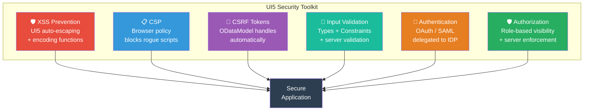

### Key Takeaways

| Concept | Remember |
|---------|----------|
| **XSS** | UI5 controls auto-escape. Never use `innerHTML` or `eval()`. Use `encodeXML()` when needed. |
| **CSP** | Set `Content-Security-Policy` headers. Allow only trusted sources. |
| **CSRF** | ODataModel handles it automatically. For custom AJAX, fetch and send the token. |
| **Validation** | Use UI5 types + constraints for UX. Always validate on server for security. |
| **Authentication** | Delegate to identity provider (OAuth/SAML). Don't build your own. |
| **Authorization** | Hide UI for UX, enforce on server for security. |
| **HTTPS** | Always. No exceptions. |
| **Sensitive Data** | Never in URLs, logs, localStorage, or client models. |

---

**Next Module**: [Module 15: Performance Optimization →](./15-performance.md)
