# Module 15: Performance Optimization

> **Objective**: Learn how to make your SAP UI5 application fast. Understand async loading,
> preloading strategies, lazy loading, OData optimization, bundling, and performance analysis tools.

---

## Table of Contents

- [Why Performance Matters](#why-performance-matters)
- [Key Performance Metrics](#key-performance-metrics)
- [Loading Optimization](#loading-optimization)
- [Component and Library Preloading](#component-and-library-preloading)
- [Lazy Loading Views](#lazy-loading-views)
- [Growing Lists and Paging](#growing-lists-and-paging)
- [OData Optimization](#odata-optimization)
- [Model and Binding Optimization](#model-and-binding-optimization)
- [Debouncing User Input](#debouncing-user-input)
- [Image Optimization](#image-optimization)
- [Building for Production](#building-for-production)
- [Performance Analysis Tools](#performance-analysis-tools)
- [Summary](#summary)

---

## Why Performance Matters

Performance directly impacts user satisfaction and business outcomes:

- **53% of users** abandon pages that take more than 3 seconds to load (Google)
- **100ms delay** → 1% decrease in sales (Amazon)
- **SAP apps are used daily** — even a 1-second improvement saves hours across an organization per year

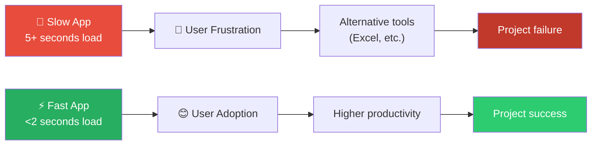

---

## Key Performance Metrics

| Metric | What It Measures | Target | Tool |
|--------|-----------------|--------|------|
| **FCP** (First Contentful Paint) | Time until first content visible | < 1.8s | Lighthouse |
| **LCP** (Largest Contentful Paint) | Time until main content visible | < 2.5s | Lighthouse |
| **TTI** (Time to Interactive) | Time until app responds to input | < 3.8s | Lighthouse |
| **FID** (First Input Delay) | Delay on first user interaction | < 100ms | Chrome UX Report |
| **CLS** (Cumulative Layout Shift) | Visual stability (layout jumps) | < 0.1 | Lighthouse |

```mermaid
gantt
    title Page Load Timeline (Optimized)
    dateFormat X
    axisFormat %Lms

    section Loading
    HTML received           :0, 100
    UI5 bootstrap           :100, 400
    Component-preload.js    :400, 600
    section Rendering
    First Contentful Paint  :milestone, 600, 0
    Views rendered          :600, 900
    Data loaded             :600, 1200
    section Interactive
    Time to Interactive     :milestone, 1200, 0
    App fully usable        :1200, 1500
```

---

## Loading Optimization

### 1. Async Loading — The Most Important Setting

The single most impactful performance setting:

```html
<!-- ✅ CRITICAL: Enable async loading -->
<script
    src="https://openui5.hana.ondemand.com/resources/sap-ui-core.js"
    data-sap-ui-async="true"
    data-sap-ui-theme="sap_horizon"
    data-sap-ui-libs="sap.m"
    data-sap-ui-compatVersion="edge"
    data-sap-ui-resourceroots='{"com.sap.shop": "./"}'>
</script>
```

### Async vs Sync Loading

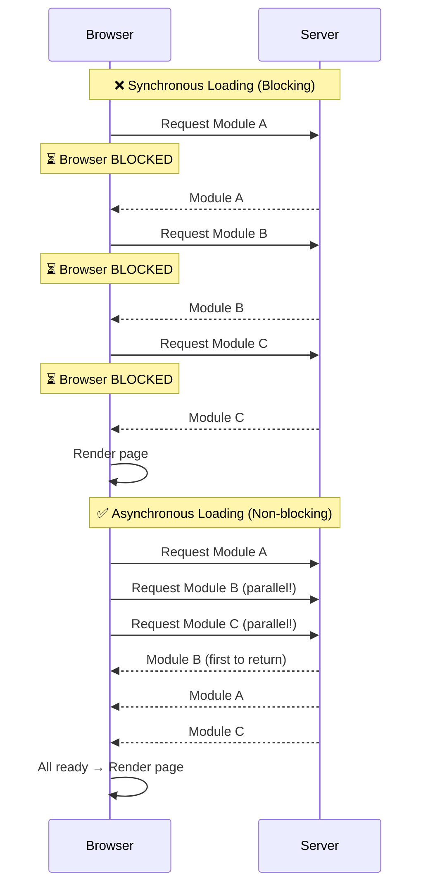

### 2. Manifest-First Loading

Tell UI5 to load `manifest.json` first and use it to configure everything:

```javascript
// Component.js
sap.ui.define([
    "sap/ui/core/UIComponent"
], function (UIComponent) {
    "use strict";

    return UIComponent.extend("com.sap.shop.Component", {
        metadata: {
            manifest: "json"   // ← Load manifest.json first
        },
        init: function () {
            UIComponent.prototype.init.apply(this, arguments);
            this.getRouter().initialize();
        }
    });
});
```

```html
<!-- index.html — use ComponentContainer for manifest-first -->
<script>
    sap.ui.require([
        "sap/ui/core/ComponentContainer"
    ], function (ComponentContainer) {
        new ComponentContainer({
            name: "com.sap.shop",
            settings: {},
            async: true,          // ← Async component loading
            manifest: "json"      // ← Manifest-first
        }).placeAt("content");
    });
</script>
```

### Loading Sequence Comparison

```mermaid
graph TD
    subgraph Bad["❌ Without Optimization"]
        B1["index.html"] --> B2["Load UI5 (sync)"]
        B2 --> B3["Load Component.js"]
        B3 --> B4["Load manifest.json"]
        B4 --> B5["Load each view (1 by 1)"]
        B5 --> B6["Load each controller"]
        B6 --> B7["Load models"]
        B7 --> B8["Render"]
    end

    subgraph Good["✅ With Optimization"]
        G1["index.html"] --> G2["Load UI5 (async)"]
        G2 --> G3["Load Component-preload.js<br/>(ALL modules in ONE request!)"]
        G3 --> G4["Load manifest.json<br/>(already in preload)"]
        G4 --> G5["Render first view immediately"]
        G5 --> G6["Load data (parallel)"]
    end

    style Bad fill:#e74c3c,color:#fff
    style Good fill:#27ae60,color:#fff
```

---

## Component and Library Preloading

### Component-preload.js

The **build tool** bundles all your app files into a single `Component-preload.js` file. Instead of dozens of HTTP requests, the browser makes **one**:

```bash
# Generate preload with UI5 CLI
npx ui5 build --all

# This creates:
# dist/Component-preload.js  ← ALL your app modules bundled together
```

What goes into the preload bundle:

```
Component-preload.js contains:
├── Component.js
├── manifest.json
├── controller/App.controller.js
├── controller/Home.controller.js
├── controller/ProductList.controller.js
├── controller/ProductDetail.controller.js
├── controller/Cart.controller.js
├── controller/Checkout.controller.js
├── view/App.view.xml
├── view/Home.view.xml
├── view/ProductList.view.xml
├── view/ProductDetail.view.xml
├── view/Cart.view.xml
├── view/Checkout.view.xml
├── fragment/ProductCard.fragment.xml
├── fragment/CartItem.fragment.xml
├── fragment/AddToCartDialog.fragment.xml
├── fragment/CheckoutSummary.fragment.xml
├── model/formatter.js
├── model/models.js
├── model/cart.js
├── i18n/i18n.properties
└── css/style.css
```

### Library Preloading

UI5 libraries also have preload bundles. Configure in `manifest.json`:

```json
{
    "sap.ui5": {
        "dependencies": {
            "minUI5Version": "1.120.0",
            "libs": {
                "sap.m": {},
                "sap.ui.core": {},
                "sap.ui.layout": {
                    "lazy": true
                },
                "sap.f": {
                    "lazy": true
                }
            }
        }
    }
}
```

Mark libraries as `"lazy": true` if they're not needed immediately — they load on demand.

---

## Lazy Loading Views

Don't load all views upfront — load them when the user navigates to them:

### Async View Loading in Routes

```json
{
    "sap.ui5": {
        "routing": {
            "config": {
                "routerClass": "sap.m.routing.Router",
                "viewType": "XML",
                "viewPath": "com.sap.shop.view",
                "controlId": "app",
                "controlAggregation": "pages",
                "async": true
            },
            "routes": [
                {
                    "name": "home",
                    "pattern": "",
                    "target": "home"
                },
                {
                    "name": "productList",
                    "pattern": "products",
                    "target": "productList"
                }
            ],
            "targets": {
                "home": {
                    "viewName": "Home",
                    "viewLevel": 1
                },
                "productList": {
                    "viewName": "ProductList",
                    "viewLevel": 2
                }
            }
        }
    }
}
```

The key setting is `"async": true` in the routing config. This ensures views load only when their route is matched.

### Lazy Loading Fragments

```javascript
// Load fragment only when needed (e.g., on button press)
onAddToCart: function () {
    if (!this._oDialog) {
        this._oDialog = this.loadFragment({
            name: "com.sap.shop.fragment.AddToCartDialog"
        });
    }
    this._oDialog.then(function (oDialog) {
        oDialog.open();
    });
}
```

---

## Growing Lists and Paging

For large datasets, don't load everything at once:

### Growing Lists

```xml
<!-- Load 20 items initially, load more on scroll -->
<List
    items="{/Products}"
    growing="true"
    growingThreshold="20"
    growingScrollToLoad="true"
    growingTriggerText="Load more products">
    <StandardListItem
        title="{Name}"
        description="{Category}"
        info="{Price}" />
</List>
```

### Growing Table

```xml
<Table
    items="{/Products}"
    growing="true"
    growingThreshold="50"
    growingScrollToLoad="true">
    <!-- columns and items -->
</Table>
```

### How Growing Works

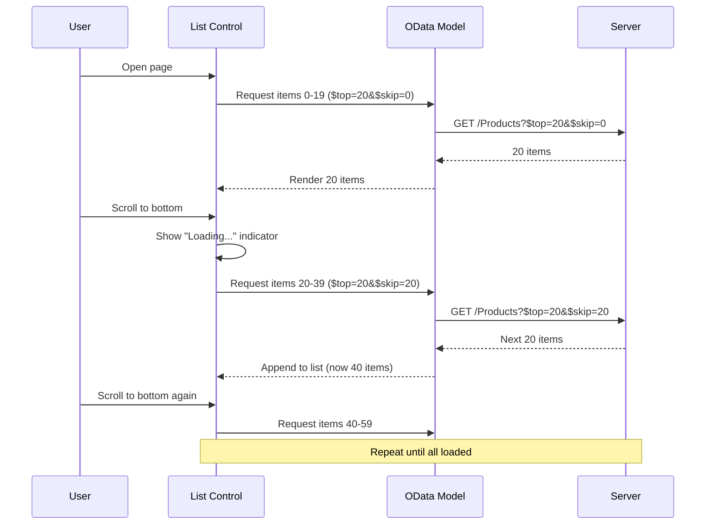

---

## OData Optimization

### $select — Request Only Needed Fields

```javascript
// ❌ BAD: Fetches ALL fields (including large descriptions, images, etc.)
oList.bindItems({
    path: "/Products"
});

// ✅ GOOD: Only fetch what you display
oList.bindItems({
    path: "/Products",
    parameters: {
        select: "ProductId,Name,Price,Category"
    }
});
```

### $expand — Fetch Related Data in One Request

```javascript
// ❌ BAD: N+1 problem — separate request for each product's category
// Request 1: GET /Products
// Request 2: GET /Categories('C1')
// Request 3: GET /Categories('C2')
// ... for every product!

// ✅ GOOD: Expand related data inline
oList.bindItems({
    path: "/Products",
    parameters: {
        expand: "Category",
        select: "Name,Price,Category/Name"
    }
});
// Single request: GET /Products?$expand=Category&$select=Name,Price,Category/Name
```

### Batch Requests

ODataModel v2 automatically batches multiple requests into a single HTTP call:

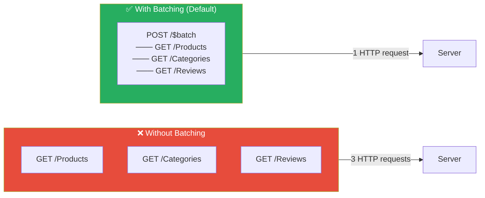

```javascript
// Batching is enabled by default in ODataModel v2
var oModel = new ODataModel({
    serviceUrl: "/api/odata/v2/",
    useBatch: true  // default
});

// Group related requests into the same batch
oModel.read("/Products", { groupId: "initial" });
oModel.read("/Categories", { groupId: "initial" });
// Both requests sent in a single batch call
```

### OData Optimization Summary

| Technique | Savings | How |
|-----------|---------|-----|
| `$select` | Less data transferred | Only request displayed fields |
| `$expand` | Fewer HTTP requests | Inline related entities |
| `$filter` (server) | Less data processed | Filter on server, not client |
| `$top/$skip` | Less data loaded | Pagination / growing lists |
| Batch | Fewer HTTP connections | Group requests (automatic in v2) |
| `$count` | Avoid loading all data | Get count without fetching items |

---

## Model and Binding Optimization

### Avoid Unnecessary Model Updates

```javascript
// ❌ BAD: Sets property on every keystroke, triggers re-render
onLiveChange: function (oEvent) {
    var sValue = oEvent.getParameter("value");
    this.getView().getModel().setProperty("/searchQuery", sValue);
    this._doSearch(sValue); // Fires on every keystroke!
}

// ✅ GOOD: Use the 'change' event instead of 'liveChange' for expensive operations
onSearch: function (oEvent) {
    var sQuery = oEvent.getParameter("query");
    this._doSearch(sQuery); // Only fires on Enter/Search button
}
```

### Suspend and Resume Bindings

When making multiple model changes, suspend bindings to prevent multiple re-renders:

```javascript
onBulkUpdate: function () {
    var oModel = this.getView().getModel();

    // Suspend change events
    oModel.setSizeLimit(500); // increase if needed

    // Make many changes without triggering re-render
    var oData = oModel.getData();
    oData.Products.forEach(function (oProduct) {
        oProduct.discountedPrice = oProduct.Price * 0.9;
    });

    // Single update triggers one re-render
    oModel.setData(oData);
}
```

---

## Debouncing User Input

When the user types in a search field, don't fire a request on every keystroke:

```javascript
sap.ui.define([
    "sap/ui/core/mvc/Controller"
], function (Controller) {
    "use strict";

    return Controller.extend("com.sap.shop.controller.ProductList", {

        onInit: function () {
            this._iDebounceTimer = null;
        },

        onSearchLiveChange: function (oEvent) {
            var sQuery = oEvent.getParameter("newValue");

            // Clear previous timer
            clearTimeout(this._iDebounceTimer);

            // Wait 300ms after user stops typing
            this._iDebounceTimer = setTimeout(function () {
                this._executeSearch(sQuery);
            }.bind(this), 300);
        },

        _executeSearch: function (sQuery) {
            var oList = this.byId("productList");
            var oBinding = oList.getBinding("items");
            var aFilters = [];

            if (sQuery) {
                aFilters.push(new Filter("Name", FilterOperator.Contains, sQuery));
            }

            oBinding.filter(aFilters);
        }
    });
});
```

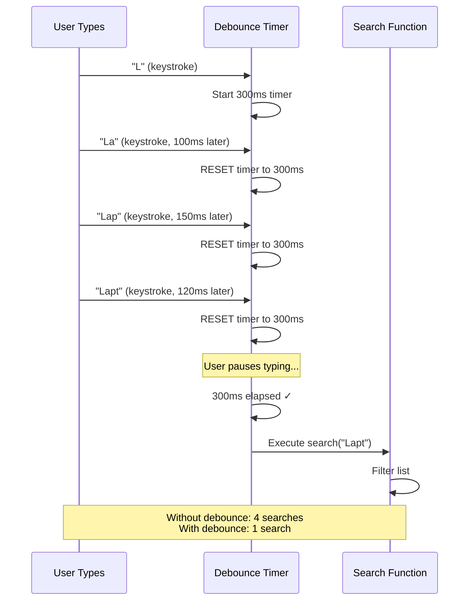

---

## Image Optimization

### Best Practices for Images in UI5

```xml
<!-- ✅ Use appropriate image sizes -->
<Image
    src="images/product-thumb.jpg"
    width="200px"
    height="200px"
    densityAware="true"
    mode="Background" />
<!--
    densityAware: loads product-thumb@2x.jpg for retina displays
    mode="Background": uses CSS background-image (better performance)
-->

<!-- ✅ Lazy load images in lists -->
<List items="{/Products}">
    <CustomListItem>
        <Image
            src="{ImageUrl}"
            width="80px"
            decorative="true"
            lazyLoading="true" />
    </CustomListItem>
</List>

<!-- ✅ Use SAP icons instead of images when possible -->
<Button icon="sap-icon://cart" text="Add to Cart" />
<!-- Icons are vector (SVG), infinitely scalable, no HTTP request -->
```

---

## Building for Production

### UI5 Build Command

```bash
# Development build
npx ui5 build

# Production build with all optimizations
npx ui5 build --all

# Self-contained build (includes UI5 framework)
npx ui5 build self-contained --all
```

### What `ui5 build --all` Does

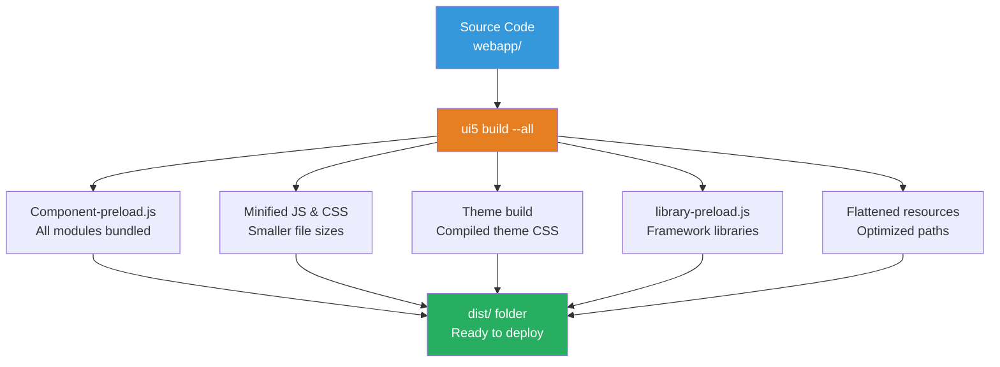

### Build Configuration in ui5.yaml

```yaml
specVersion: "3.0"
metadata:
  name: com.sap.shop
type: application
framework:
  name: OpenUI5
  version: "1.120.0"
  libraries:
    - name: sap.m
    - name: sap.ui.core
builder:
  resources:
    excludes:
      - "/test/**"           # Exclude tests from production build
      - "/localService/**"   # Exclude mock server
  minification:
    excludes: []             # Minify everything
  cachebuster:
    signatureType: time      # Cache busting for CDN
```

### Bundle Analysis

Check what's in your bundles:

```bash
# Generate a bundle analysis report
npx ui5 build --all --verbose

# Check bundle sizes
ls -la dist/*.js | sort -k5 -n
```

---

## Performance Analysis Tools

### 1. UI5 Support Assistant

Built into UI5, checks for performance anti-patterns:

```javascript
// Open Support Assistant
// Keyboard shortcut: Ctrl+Alt+Shift+P
// Or in browser console:
sap.ui.require(["sap/ui/support/RuleAnalyzer"], function (RuleAnalyzer) {
    RuleAnalyzer.analyze({ type: "global" }).then(function (oResult) {
        console.log("Issues found:", oResult.issues.length);
        oResult.issues.forEach(function (oIssue) {
            console.log(oIssue.severity + ": " + oIssue.details);
        });
    });
});
```

### 2. UI5 Diagnostics

```
// Open UI5 Diagnostics window
// Keyboard shortcut: Ctrl+Alt+Shift+S

// Shows:
// - Control tree (like React DevTools)
// - Binding info
// - Performance trace
// - Module loading timeline
```

### 3. Chrome DevTools Performance Tab

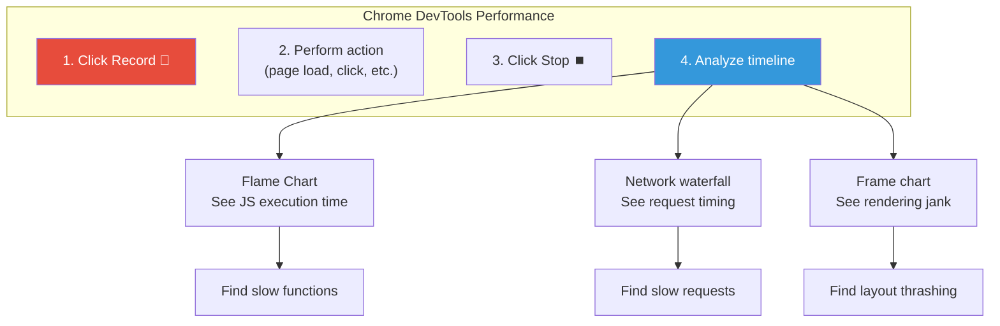

### 4. Chrome DevTools Network Tab

| What to Look For | Problem | Solution |
|-----------------|---------|----------|
| Many small requests | No preload bundle | Run `ui5 build --all` |
| Large responses | Missing `$select` | Add `$select` to OData queries |
| Slow TTFB | Server performance | Optimize backend queries |
| No caching headers | Repeated downloads | Configure cache headers |
| Uncompressed responses | Wasted bandwidth | Enable gzip/brotli on server |

### Performance Monitoring Flow

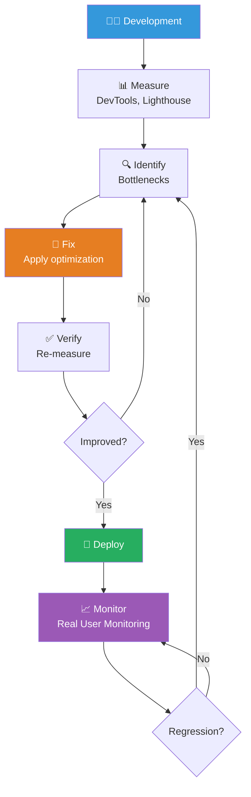

---

## Summary

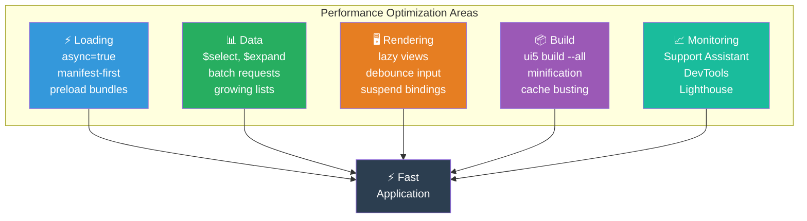

### Quick Wins Checklist

| Priority | Optimization | Impact | Effort |
|----------|-------------|--------|--------|
| 🔴 Critical | `data-sap-ui-async="true"` | Huge | 1 line |
| 🔴 Critical | `manifest: "json"` in Component | Huge | 1 line |
| 🔴 Critical | `ui5 build --all` for production | Huge | 1 command |
| 🟠 High | `$select` on OData bindings | Large | Per binding |
| 🟠 High | `growing="true"` on lists | Large | 1 attribute |
| 🟠 High | `async: true` in routing config | Large | 1 line |
| 🟡 Medium | Lazy library loading | Medium | Config |
| 🟡 Medium | Debounce search input | Medium | ~10 lines |
| 🟡 Medium | Lazy load fragments | Medium | Per fragment |
| 🟢 Low | Image optimization | Small | Per image |
| 🟢 Low | Bundle analysis | Insight | Analysis |

### Key Takeaways

| Concept | Remember |
|---------|----------|
| **Async Loading** | `data-sap-ui-async="true"` — always, no exceptions |
| **Manifest-First** | `manifest: "json"` in Component metadata |
| **Preloading** | `ui5 build --all` creates `Component-preload.js` |
| **Lazy Loading** | `async: true` in routing, `loadFragment()` on demand |
| **Growing Lists** | `growing="true" growingThreshold="20"` for large lists |
| **OData** | `$select`, `$expand`, batch — minimize data transfer |
| **Debouncing** | 300ms delay on search input to reduce requests |
| **Build** | `ui5 build --all` for production — minifies and bundles |
| **Tools** | UI5 Support Assistant, Chrome DevTools, Lighthouse |

---

**Next Module**: [Module 16: Deployment & Best Practices →](./16-deployment.md)
