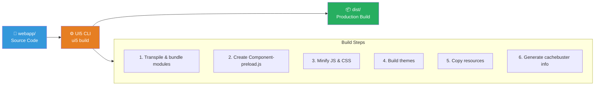
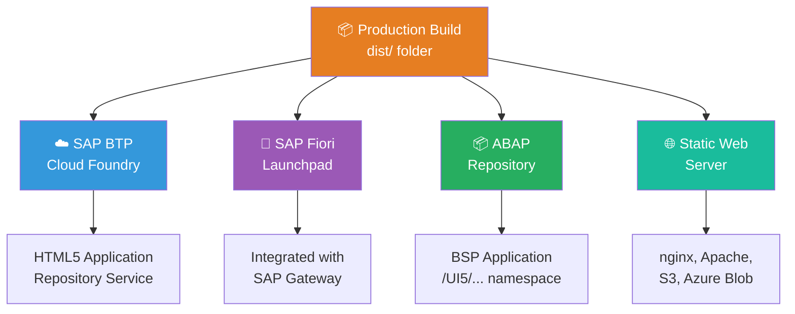
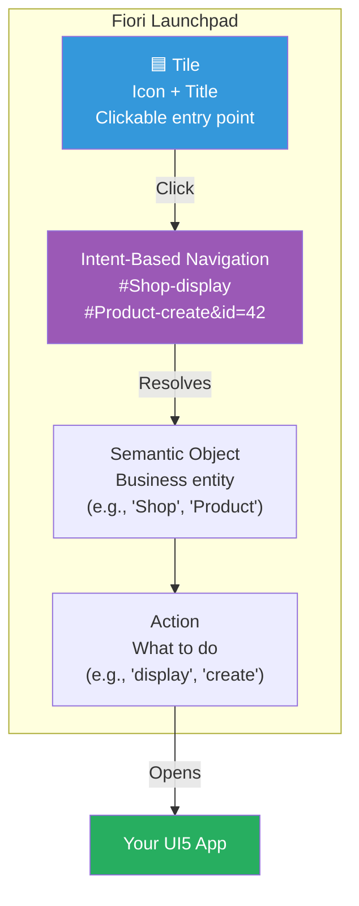
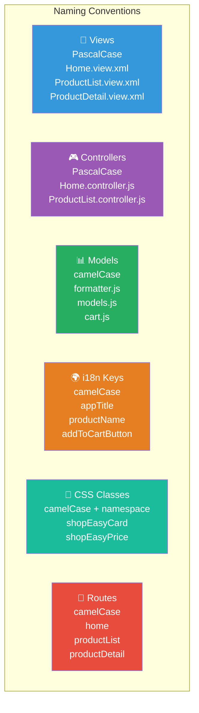
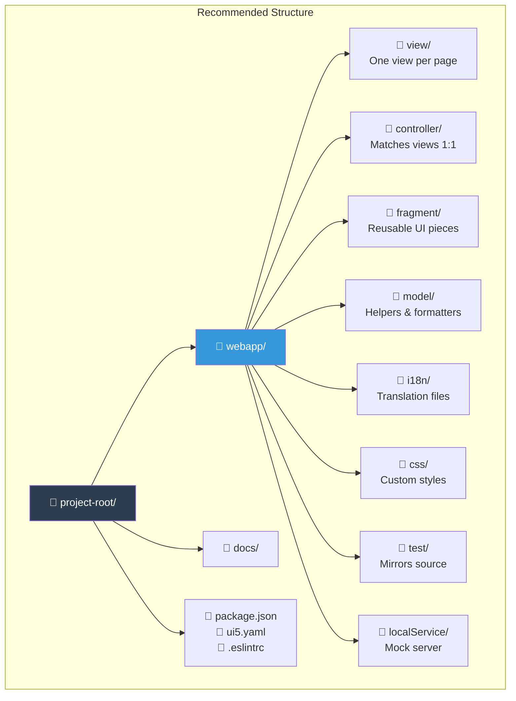
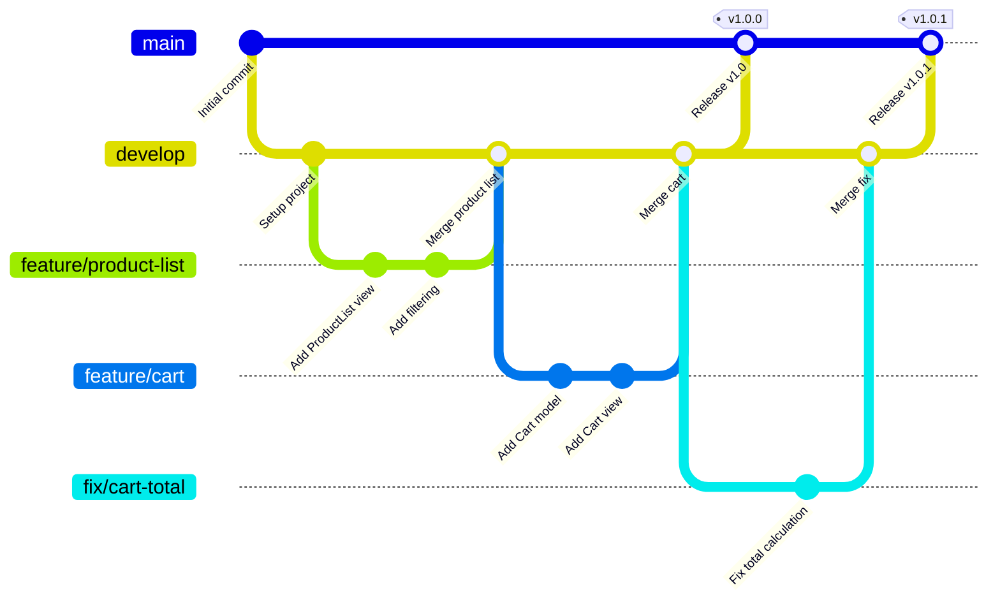
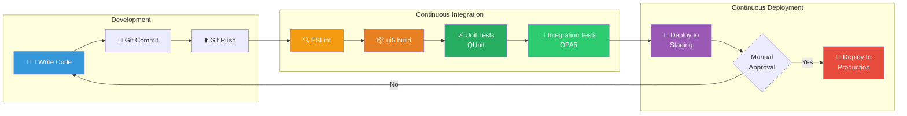
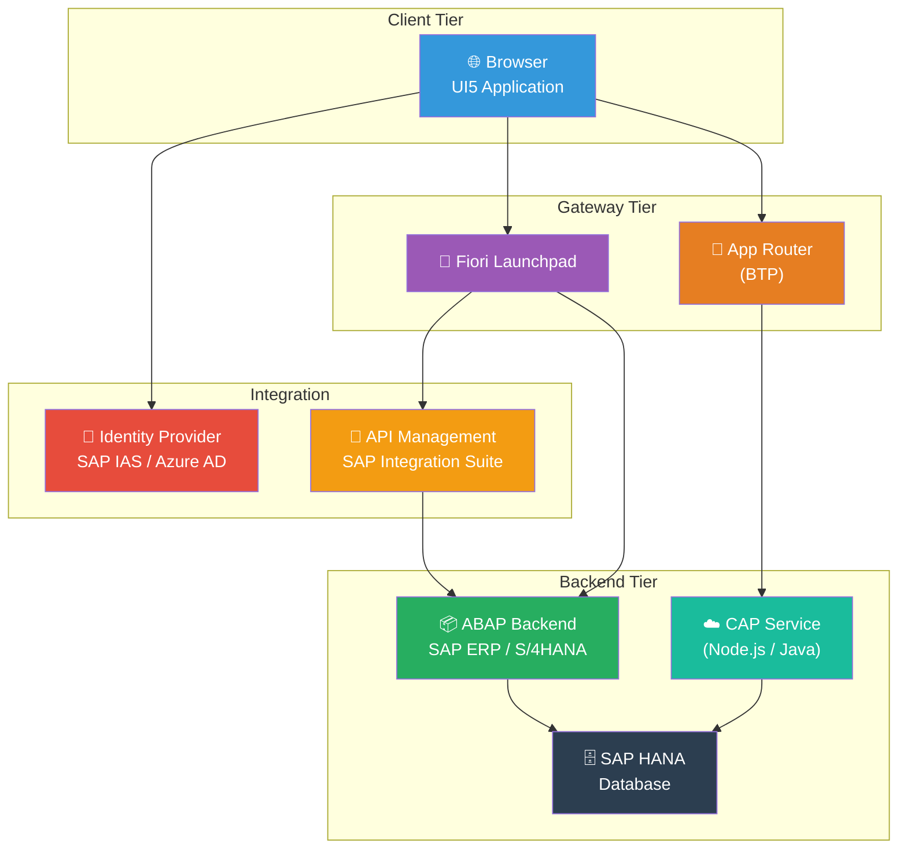
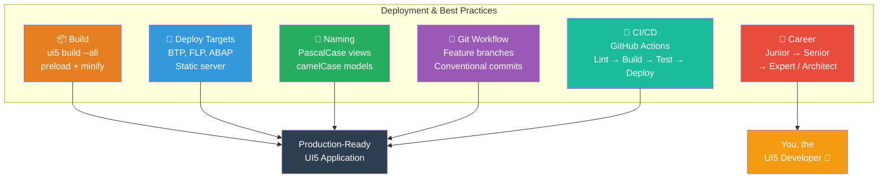

# Module 16: Deployment & Best Practices

> **Objective**: Learn how to build, deploy, and maintain SAP UI5 applications in production. Understand
> deployment targets, naming conventions, CI/CD pipelines, and the career path of a UI5 developer.

---

## Table of Contents

- [Building for Production](#building-for-production)
- [Deployment Targets](#deployment-targets)
- [Fiori Launchpad Integration](#fiori-launchpad-integration)
- [Naming Conventions](#naming-conventions)
- [Code Organization Best Practices](#code-organization-best-practices)
- [Git Workflow for UI5 Projects](#git-workflow-for-ui5-projects)
- [CI/CD for UI5](#cicd-for-ui5)
- [UI5 Version Management](#ui5-version-management)
- [Development Environment: BAS vs VS Code](#development-environment-bas-vs-vs-code)
- [Career Path: UI5 Developer Roadmap](#career-path-ui5-developer-roadmap)
- [Summary](#summary)

---

## Building for Production

### The UI5 Build Process



### Build Commands

```bash
# Basic build — creates dist/ folder
npx ui5 build

# Production build with all optimizations
npx ui5 build --all
# Includes: preload bundles, minification, theme build

# Self-contained build — includes UI5 framework itself
npx ui5 build self-contained --all
# Use when deploying to servers without UI5 CDN access

# Clean build (remove previous dist/ first)
npx ui5 build --clean-dest --all

# Build with specific target directory
npx ui5 build --dest ./build --all
```

### Build Output Structure

```
dist/
├── Component-preload.js          ← All app modules bundled & minified
├── Component.js                  ← Minified component
├── manifest.json                 ← App descriptor
├── index.html                    ← Entry point
├── resources/                    ← UI5 framework (self-contained only)
├── controller/                   ← Minified controllers
├── view/                         ← Views
├── fragment/                     ← Fragments
├── model/                        ← Minified model files
├── i18n/                         ← Translation files
├── css/                          ← Minified CSS
└── sap-ui-cachebuster-info.json  ← Cache busting metadata
```

### package.json Scripts

```json
{
    "scripts": {
        "start": "ui5 serve -o index.html",
        "build": "ui5 build --all --clean-dest",
        "build:self": "ui5 build self-contained --all --clean-dest",
        "test": "ui5 serve -o test/testsuite.qunit.html",
        "lint": "eslint webapp/"
    }
}
```

---

## Deployment Targets



### 1. SAP BTP (Business Technology Platform)

The modern, cloud-native deployment target:

```yaml
# mta.yaml — Multi-Target Application descriptor
_schema-version: "3.1"
ID: com.sap.shop
version: 1.0.0

modules:
  - name: shop-app
    type: html5
    path: dist/
    build-parameters:
      builder: custom
      commands:
        - npm install
        - npx ui5 build --all
      supported-platforms: []

  - name: shop-deployer
    type: com.sap.html5.application-content
    path: .
    requires:
      - name: shop-html5-repo-host
    build-parameters:
      requires:
        - name: shop-app
          artifacts:
            - "./*"
          target-path: resources/

resources:
  - name: shop-html5-repo-host
    type: org.cloudfoundry.managed-service
    parameters:
      service: html5-apps-repo
      service-plan: app-host
```

```bash
# Deploy to SAP BTP Cloud Foundry
# 1. Login
cf login -a https://api.cf.us10.hana.ondemand.com

# 2. Build MTA archive
mbt build

# 3. Deploy
cf deploy mta_archives/com.sap.shop_1.0.0.mtar
```

### 2. SAP Fiori Launchpad

For on-premise SAP systems:

```bash
# Deploy to ABAP repository using UI5 deployer
npx ui5-deployer deploy \
    --server https://sap-server:8443 \
    --client 100 \
    --app /UI5/SHOP_APP \
    --package $TMP
```

### 3. ABAP Repository

Traditional SAP deployment via the ABAP Workbench:

```bash
# Using @sap/ux-ui5-tooling
npx fiori deploy --config ui5-deploy.yaml
```

```yaml
# ui5-deploy.yaml
target:
  url: https://sap-server:8443
  client: "100"
  authenticationType: reentranceTicket
app:
  name: ZSHOP_APP
  package: ZLOCAL
  description: "ShopEasy Application"
  transport: DEVK900042
```

### 4. Static Web Server

Simplest deployment — just serve the `dist/` folder:

```bash
# Using nginx
# Copy dist/ to /var/www/html/shop/

# nginx.conf
server {
    listen 80;
    server_name shop.example.com;

    location / {
        root /var/www/html/shop;
        try_files $uri $uri/ /index.html;
    }

    # Enable gzip compression
    gzip on;
    gzip_types application/javascript text/css application/json;
}
```

```bash
# Or use a simple Node.js server
npx serve dist/ -p 8080

# Or deploy to AWS S3 + CloudFront
aws s3 sync dist/ s3://my-ui5-app-bucket/
```

---

## Fiori Launchpad Integration

The **Fiori Launchpad** (FLP) is SAP's app launcher — like a home screen for SAP applications. Your UI5 app appears as a **tile** that users click to open.

### manifest.json for FLP

```json
{
    "sap.app": {
        "id": "com.sap.shop",
        "type": "application",
        "title": "ShopEasy",
        "subTitle": "Online Shopping",
        "crossNavigation": {
            "inbounds": {
                "shopDisplay": {
                    "semanticObject": "Shop",
                    "action": "display",
                    "signature": {
                        "parameters": {},
                        "additionalParameters": "allowed"
                    },
                    "title": "{{appTitle}}",
                    "subTitle": "{{appSubTitle}}",
                    "icon": "sap-icon://cart"
                }
            }
        }
    }
}
```

### Key FLP Concepts



### Tile Configuration

| Property | Purpose | Example |
|----------|---------|---------|
| `semanticObject` | Business entity | `"Shop"`, `"Product"`, `"SalesOrder"` |
| `action` | Operation | `"display"`, `"create"`, `"manage"` |
| `title` | Tile label | `"ShopEasy"` |
| `subTitle` | Secondary text | `"Online Shopping"` |
| `icon` | Tile icon | `"sap-icon://cart"` |
| `signature.parameters` | Required URL params | `{ "category": { "required": true } }` |

### Cross-App Navigation

```javascript
// Navigate to another Fiori app
var oCrossAppNav = sap.ushell.Container.getService("CrossApplicationNavigation");

// Navigate by semantic object + action
oCrossAppNav.toExternal({
    target: {
        semanticObject: "SalesOrder",
        action: "display"
    },
    params: {
        orderId: "12345"
    }
});

// Check if navigation target exists
oCrossAppNav.isNavigationSupported([{
    target: {
        semanticObject: "SalesOrder",
        action: "display"
    }
}]).then(function (aResults) {
    if (aResults[0].supported) {
        // Navigation target exists
    }
});
```

---

## Naming Conventions

Consistent naming is critical in SAP projects. Follow these conventions:

### Namespace Convention

```
company.department.app

Examples:
  com.sap.shop          ← SAP's shopping app
  com.mycompany.hr      ← Your company's HR app
  org.openui5.demo      ← Open source demo app
```

### File and Module Naming



### Complete Naming Reference

| Element | Convention | Example |
|---------|-----------|---------|
| **App namespace** | `com.company.app` | `com.sap.shop` |
| **Views** | PascalCase + `.view.xml` | `ProductList.view.xml` |
| **Controllers** | PascalCase + `.controller.js` | `ProductList.controller.js` |
| **Fragments** | PascalCase + `.fragment.xml` | `AddToCartDialog.fragment.xml` |
| **Models (files)** | camelCase + `.js` | `formatter.js`, `models.js` |
| **Model names** | camelCase | `"cart"`, `"device"`, `"appView"` |
| **Route names** | camelCase | `"home"`, `"productDetail"` |
| **Route patterns** | lowercase with dashes | `"products/{productId}"` |
| **i18n keys** | camelCase | `addToCartButton`, `productPrice` |
| **CSS custom classes** | camelCase with prefix | `shopEasyProductCard` |
| **Control IDs** | camelCase | `productList`, `searchField` |
| **Event handlers** | `on` + PascalCase | `onAddToCart`, `onNavBack` |
| **Private methods** | `_` + camelCase | `_loadProduct`, `_validateInput` |
| **Constants** | UPPER_SNAKE_CASE | `MAX_CART_ITEMS`, `API_BASE_URL` |
| **Formatter functions** | camelCase | `formatPrice`, `formatStatus` |

### i18n Key Naming Pattern

```properties
# Pattern: elementDescription
appTitle=ShopEasy
appSubTitle=Online Shopping

# Pattern: viewName.elementDescription
home.welcomeTitle=Welcome to ShopEasy
home.browseButton=Browse Products

# Pattern: entity.property
product.name=Product Name
product.price=Price
product.addToCart=Add to Cart

# Pattern: action.context
confirm.deleteItem=Are you sure you want to remove this item?
success.orderPlaced=Your order has been placed successfully!
error.loadFailed=Failed to load data. Please try again.
```

---

## Code Organization Best Practices

### Project Structure Principles



### Do's and Don'ts

| Do | Don't |
|----|-------|
| One view per page/screen | Multiple views in one file |
| One controller per view | Shared controllers for different views |
| Base controller for shared logic | Duplicate code across controllers |
| Formatters in separate files | Inline formatting logic in controllers |
| i18n for ALL user-visible text | Hardcoded strings in views/controllers |
| Fragment for reusable UI pieces | Copy-paste UI code between views |
| Model helpers for business logic | Business logic in controllers |
| Constants for magic values | Magic strings/numbers in code |

### Base Controller Pattern

```javascript
// webapp/controller/BaseController.js
sap.ui.define([
    "sap/ui/core/mvc/Controller",
    "sap/ui/core/routing/History",
    "sap/ui/core/UIComponent"
], function (Controller, History, UIComponent) {
    "use strict";

    return Controller.extend("com.sap.shop.controller.BaseController", {

        getRouter: function () {
            return UIComponent.getRouterFor(this);
        },

        getModel: function (sName) {
            return this.getView().getModel(sName);
        },

        setModel: function (oModel, sName) {
            this.getView().setModel(oModel, sName);
        },

        getResourceBundle: function () {
            return this.getOwnerComponent()
                .getModel("i18n")
                .getResourceBundle();
        },

        onNavBack: function () {
            var sPreviousHash = History.getInstance().getPreviousHash();
            if (sPreviousHash !== undefined) {
                window.history.go(-1);
            } else {
                this.getRouter().navTo("home", {}, true);
            }
        }
    });
});
```

---

## Git Workflow for UI5 Projects

### Recommended Branch Strategy



### Branch Naming Convention

| Type | Pattern | Example |
|------|---------|---------|
| Feature | `feature/description` | `feature/product-search` |
| Bug fix | `fix/description` | `fix/cart-total-calculation` |
| Hotfix | `hotfix/description` | `hotfix/login-redirect` |
| Release | `release/version` | `release/1.2.0` |
| Chore | `chore/description` | `chore/update-ui5-version` |

### .gitignore for UI5 Projects

```gitignore
# Dependencies
node_modules/

# Build output
dist/

# IDE
.idea/
.vscode/
*.code-workspace

# OS
.DS_Store
Thumbs.db

# UI5 generated
*.js.map

# Test coverage
coverage/

# Environment
.env
.env.local
```

### Commit Message Convention

```
feat: add product search functionality
fix: correct cart total calculation for discounted items
docs: update routing documentation
style: format ProductList controller
refactor: extract cart logic to model/cart.js
test: add unit tests for formatter
chore: update UI5 version to 1.120.0
```

---

## CI/CD for UI5

### GitHub Actions Pipeline

```yaml
# .github/workflows/ci.yml
name: UI5 CI/CD Pipeline

on:
  push:
    branches: [main, develop]
  pull_request:
    branches: [main]

jobs:
  build-and-test:
    runs-on: ubuntu-latest

    steps:
      - name: Checkout code
        uses: actions/checkout@v4

      - name: Setup Node.js
        uses: actions/setup-node@v4
        with:
          node-version: '20'
          cache: 'npm'

      - name: Install dependencies
        run: npm ci

      - name: Lint
        run: npm run lint

      - name: Build
        run: npx ui5 build --all

      - name: Run unit tests
        run: |
          npx ui5 serve &
          sleep 5
          npx karma start karma.conf.js --single-run

      - name: Upload build artifact
        uses: actions/upload-artifact@v4
        with:
          name: dist
          path: dist/

  deploy:
    needs: build-and-test
    runs-on: ubuntu-latest
    if: github.ref == 'refs/heads/main'

    steps:
      - name: Download build artifact
        uses: actions/download-artifact@v4
        with:
          name: dist
          path: dist/

      - name: Deploy to SAP BTP
        run: |
          npm install -g mbt
          cf login -a ${{ secrets.CF_API }} -u ${{ secrets.CF_USER }} -p ${{ secrets.CF_PASSWORD }}
          cf deploy dist/
```

### CI/CD Pipeline Flow



---

## UI5 Version Management

### UI5 Versioning Scheme

```
Major.Minor.Patch
  1   .  120  .  0
  │       │     │
  │       │     └── Patch: Bug fixes only
  │       └──────── Minor: New features (bi-annual release cycle)
  └──────────────── Major: Breaking changes (rare)
```

### Managing UI5 Version

```yaml
# ui5.yaml — Pin your UI5 version
specVersion: "3.0"
metadata:
  name: com.sap.shop
type: application
framework:
  name: OpenUI5        # or SAPUI5
  version: "1.120.0"   # Pin to specific version
  libraries:
    - name: sap.m
    - name: sap.ui.core
    - name: sap.ui.layout
```

```html
<!-- index.html — CDN version -->
<!-- Use a specific version for stability -->
<script src="https://openui5.hana.ondemand.com/1.120.0/resources/sap-ui-core.js">
</script>

<!-- Or use latest (for development only!) -->
<script src="https://openui5.hana.ondemand.com/resources/sap-ui-core.js">
</script>
```

### Version Update Strategy

| Environment | Strategy | Why |
|-------------|----------|-----|
| **Development** | Latest or recent stable | Access new features |
| **Testing** | Same as production target | Catch version-specific bugs |
| **Production** | Pinned specific version | Stability and predictability |
| **Update frequency** | Every 6-12 months | Balance features vs stability |

---

## Development Environment: BAS vs VS Code

### SAP Business Application Studio (BAS)

SAP's cloud-based IDE built on Eclipse Theia (VS Code-like):

| Pros | Cons |
|------|------|
| Pre-configured for SAP development | Requires SAP BTP account |
| Built-in UI5 tooling | Internet connection required |
| Integrated deployment to BTP | Can be slower than local |
| SAP Fiori tools included | Limited extension ecosystem |
| No local setup needed | Monthly cost |

### VS Code / Cursor

| Pros | Cons |
|------|------|
| Free and fast | Manual SAP tooling setup |
| Huge extension ecosystem | No built-in deployment |
| Works offline | Need local UI5 CLI |
| AI-assisted coding (Cursor) | Manual Fiori tools installation |
| Familiar to most developers | — |

### Recommended VS Code Extensions for UI5

```json
{
    "recommendations": [
        "nicosommi.ui5-tools",
        "nicosommi.ui5-schemas",
        "nicosommi.ui5-snippets",
        "dbaeumer.vscode-eslint",
        "esbenp.prettier-vscode",
        "redhat.vscode-xml",
        "humao.rest-client"
    ]
}
```

---

## Career Path: UI5 Developer Roadmap

```mermaid
graph TD
    subgraph Junior["🌱 Junior UI5 Developer<br/>(0-1 years)"]
        J1["HTML, CSS, JavaScript basics"]
        J2["UI5 MVC pattern"]
        J3["XML Views & Data Binding"]
        J4["Basic routing & navigation"]
        J5["JSONModel & simple forms"]
    end

    subgraph Mid["🌿 Mid-Level UI5 Developer<br/>(1-3 years)"]
        M1["OData services (v2 & v4)"]
        M2["Complex controls & layouts"]
        M3["Testing (QUnit & OPA5)"]
        M4["i18n & accessibility"]
        M5["Fiori design guidelines"]
        M6["Performance optimization"]
    end

    subgraph Senior["🌳 Senior UI5 Developer<br/>(3-5 years)"]
        S1["Fiori Elements & annotations"]
        S2["Custom controls development"]
        S3["Complex app architecture"]
        S4["SAP BTP deployment"]
        S5["CI/CD pipelines"]
        S6["Code review & mentoring"]
    end

    subgraph Expert["🏔️ Expert / Architect<br/>(5+ years)"]
        E1["SAP CAP (Cloud Application Programming)"]
        E2["Full-stack SAP development"]
        E3["Architecture decisions"]
        E4["Cross-team standards"]
        E5["SAP Fiori roadmap planning"]
        E6["Community contributions"]
    end

    Junior --> Mid
    Mid --> Senior
    Senior --> Expert

    style Junior fill:#4CAF50,color:#fff
    style Mid fill:#2196F3,color:#fff
    style Senior fill:#9C27B0,color:#fff
    style Expert fill:#FF5722,color:#fff
```



### Skills by Level

| Skill | Junior | Mid | Senior | Expert |
|-------|:------:|:---:|:------:|:------:|
| HTML/CSS/JS | ✅ | ✅ | ✅ | ✅ |
| XML Views | ✅ | ✅ | ✅ | ✅ |
| Data Binding | ✅ | ✅ | ✅ | ✅ |
| Routing | ✅ | ✅ | ✅ | ✅ |
| JSONModel | ✅ | ✅ | ✅ | ✅ |
| OData | — | ✅ | ✅ | ✅ |
| Testing | — | ✅ | ✅ | ✅ |
| i18n & a11y | — | ✅ | ✅ | ✅ |
| Performance | — | ✅ | ✅ | ✅ |
| Fiori Elements | — | — | ✅ | ✅ |
| Custom Controls | — | — | ✅ | ✅ |
| SAP BTP | — | — | ✅ | ✅ |
| CI/CD | — | — | ✅ | ✅ |
| CAP / Full-stack | — | — | — | ✅ |
| Architecture | — | — | — | ✅ |

### SAP Landscape Architecture



---

## Summary



### Key Takeaways

| Concept | Remember |
|---------|----------|
| **Build** | `ui5 build --all` for production. Creates preload bundles and minifies. |
| **Deploy targets** | SAP BTP (cloud), Fiori Launchpad (enterprise), ABAP (on-premise), Static server. |
| **FLP Integration** | Configure `crossNavigation.inbounds` in manifest.json. Semantic object + action. |
| **Naming** | PascalCase for views/controllers, camelCase for models/routes/i18n/CSS. |
| **Git** | Feature branches, conventional commits, .gitignore for node_modules/dist. |
| **CI/CD** | Lint → Build → Test → Deploy. Automate everything. |
| **Versions** | Pin UI5 version in production. Update every 6-12 months. |
| **IDE** | BAS for SAP-integrated workflow, VS Code/Cursor for speed and flexibility. |
| **Career** | Master fundamentals → OData & Testing → Fiori Elements & BTP → Architecture. |

---

## Congratulations! 🎉

You've completed the entire SAP UI5 learning path. Here's what you've covered:

| Phase | Modules | Topics |
|-------|---------|--------|
| **Foundations** | 00-03 | Setup, Architecture, Views, Data Binding |
| **Core Skills** | 04-08 | Models, Routing, Controls, Fragments, i18n |
| **Intermediate** | 09-12 | Formatting, Filtering, OData, Testing |
| **Advanced** | 13-16 | Responsive Design, Security, Performance, Deployment |

### What's Next?

1. **Build your own app** — Apply everything you've learned to a real project
2. **Learn Fiori Elements** — The template-based approach for standard apps
3. **Explore SAP CAP** — Build full-stack applications with Node.js/Java
4. **Get SAP certified** — SAP Certified Development Associate
5. **Contribute** — Join the SAP Community, answer questions, share knowledge

> **Remember**: The best way to learn is to **build**. Take this ShopEasy project, modify it,
> break it, fix it, and extend it. Every bug you fix teaches you more than any tutorial.

---

**Back to**: [README →](../README.md)
